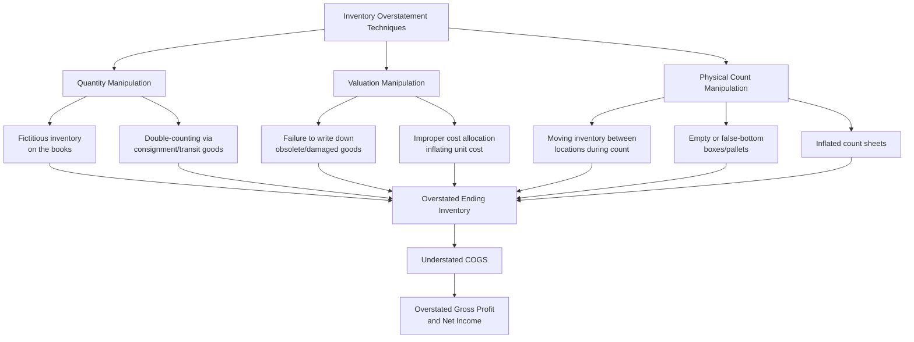

## Asset and Inventory Overstatement Schemes

### Overview

Asset overstatement schemes inflate the balance sheet to present a stronger financial position than genuinely exists, serving incentives distinct from (though sometimes overlapping with) revenue-driven income statement fraud: satisfying loan covenants, supporting stock valuations, disguising insolvency, or — in the case of inventory specifically — simultaneously understating cost of goods sold to inflate reported income. This topic provides comprehensive coverage of inventory and broader asset overstatement mechanics, detection procedures, and the accounting standards implicated.

**Key Points**

- Inventory overstatement is unique among asset schemes because it **simultaneously misstates two statements**: the balance sheet (inflated asset) and the income statement (understated cost of goods sold, since $\text{COGS} = \text{Beginning Inventory} + \text{Purchases} - \text{Ending Inventory}$ — an inflated ending inventory mechanically depresses COGS and inflates gross profit)
- Asset overstatement more broadly encompasses inventory, accounts receivable, fixed assets, intangibles/goodwill, and investments — each with distinct manipulation mechanics and detection procedures
- Physical asset schemes (inventory, fixed assets) are generally considered more resistant to pure documentary fabrication than intangible asset schemes, since physical existence can in principle be independently verified — though perpetrators have developed sophisticated techniques to defeat even physical verification procedures
- Detection relies heavily on **independent verification** (physical observation, third-party confirmation) precisely because internally-generated documentation alone is insufficient to establish existence and valuation

---

### Inventory Overstatement Schemes

#### The COGS Mechanical Relationship

$$\text{COGS} = \text{Beginning Inventory} + \text{Purchases} - \text{Ending Inventory}$$

$$\text{Overstating Ending Inventory} \Rightarrow \text{Understating COGS} \Rightarrow \text{Overstating Gross Profit and Net Income}$$

This mechanical identity is why inventory fraud has historically been among the most consequential financial statement fraud categories on a per-dollar basis: a single inflated ending inventory figure flows directly and proportionately into overstated current-period profit.

<svg xmlns="http://www.w3.org/2000/svg" width="700" height="380" viewBox="0 0 700 380" font-family="Helvetica, Arial, sans-serif">
<text x="350" y="24" text-anchor="middle" font-size="16" font-weight="bold" fill="#1a1a1a">Inventory Overstatement's Dual Statement Effect (svg_diagram)</text>
<rect x="270" y="50" width="160" height="60" rx="6" fill="#742a2a" />
<text x="350" y="76" text-anchor="middle" font-size="12" fill="#fff" font-weight="bold">Overstated Ending</text>
<text x="350" y="94" text-anchor="middle" font-size="12" fill="#fff" font-weight="bold">Inventory</text>
<line x1="270" y1="90" x2="120" y2="170" stroke="#333" stroke-width="2" marker-end="url(#ar)" />
<line x1="430" y1="90" x2="580" y2="170" stroke="#333" stroke-width="2" marker-end="url(#ar)" />
<rect x="40" y="170" width="160" height="70" rx="6" fill="#c05621" />
<text x="120" y="198" text-anchor="middle" font-size="12" fill="#fff" font-weight="bold">Balance Sheet</text>
<text x="120" y="216" text-anchor="middle" font-size="10" fill="#fff">Inflated current assets</text>
<rect x="500" y="170" width="160" height="70" rx="6" fill="#2f855a" />
<text x="580" y="198" text-anchor="middle" font-size="12" fill="#fff" font-weight="bold">Income Statement</text>
<text x="580" y="216" text-anchor="middle" font-size="10" fill="#fff">Understated COGS,</text>
<text x="580" y="230" text-anchor="middle" font-size="10" fill="#fff">inflated gross profit</text>

<text x="350" y="300" text-anchor="middle" font-size="11" fill="#666" font-style="italic">A single inventory manipulation simultaneously distorts two statements — a key detection leverage point</text>

</svg>

#### Quantity Manipulation

- **Fictitious inventory on the books:** Recording inventory quantities that do not physically exist, unsupported by any genuine purchase or production
- **Double-counting via consignment or in-transit goods:** Counting goods held on consignment for another party as owned inventory, or double-counting goods in transit between locations during a physical count
- **Inventory at multiple locations:** Exploiting counts across dispersed locations (warehouses, retail stores, third-party storage) where reconciliation across sites is weak, allowing the same goods to be effectively counted more than once

#### Valuation Manipulation

- **Failure to write down obsolete, damaged, or slow-moving inventory:** Under both GAAP (lower of cost or net realizable value) and IFRS, inventory must be written down when its value has declined; failing to record required write-downs overstates carrying value
- **Improper cost allocation:** Inflating standard costs, misallocating overhead into inventory costs beyond what is appropriate, or manipulating cost layers under FIFO/weighted-average/specific identification methods to inflate the recorded unit cost
- **Improper capitalization of costs into inventory:** Including costs that should be expensed (e.g., certain selling or administrative costs) within inventory valuation

#### Physical Count Manipulation

Techniques specifically designed to defeat physical inventory observation procedures, historically documented in some of the most notorious financial statement fraud cases:

- **Moving inventory between locations during observation:** Transporting the same physical goods between locations being counted on different days or by different observation teams, so the same inventory is counted multiple times
- **Empty boxes, false-bottom pallets, or staged displays:** Arranging warehouse space to visually suggest greater quantity than genuinely present (e.g., stacking empty boxes behind a front row of full ones)
- **Inflated count sheets:** Recording quantities on count documentation that exceed what was physically observed, particularly where the observing auditor does not independently recount a sufficient sample
- **Staging non-inventory items as inventory:** Including items that do not meet inventory recognition criteria (e.g., customer-owned goods, returned/defective goods pending disposal) within the counted population

**Example**

A distributor facing declining sales includes several pallets of inventory in its year-end count that were, in reality, water-damaged and awaiting disposal, having been segregated in a rear warehouse section normally excluded from customer-facing storage. During the physical count, warehouse staff (at management's direction) relocate several pallets from an already-counted section to an area not yet reached by the counting team, allowing the same inventory to be recorded twice. A forensic accountant identifies the discrepancy by reconciling the physical count documentation against perpetual inventory system records and independently tracing serial/lot numbers, revealing quantities inconsistent with the company's own purchase and production records.

---

### Accounts Receivable Overstatement

Though sometimes categorized separately, receivables overstatement is closely related to inventory schemes in mechanics and is frequently the balance sheet trace of a fictitious revenue scheme (covered in depth under revenue recognition fraud).

- **Fictitious receivables:** Recorded without a corresponding genuine sale
- **Failure to write off known uncollectible accounts:** Overstating net realizable receivables by understating the allowance for doubtful accounts / expected credit losses
- **Lapping schemes:** While primarily an asset misappropriation (cash theft concealment) technique rather than a financial statement fraud scheme per se, lapping schemes create a receivables overstatement as a byproduct, since misapplied customer payments leave certain accounts appearing outstanding when they have, in substance, been paid (with the cash diverted)

---

### Fixed Asset (Property, Plant, and Equipment) Overstatement

- **Fictitious asset additions:** Recording the purchase of assets that were never acquired, often supported by fabricated vendor invoices
- **Improper capitalization:** Capitalizing expenditures that should be expensed (routine maintenance and repairs), inflating the asset base while understating current-period expense
- **Understated or omitted depreciation:** Failing to record appropriate depreciation, or extending useful life assumptions beyond what is supportable, inflating net book value
- **Failure to record impairment:** Under both GAAP and IFRS, long-lived assets must be tested for impairment when indicators of impairment exist; failing to record a required impairment charge overstates carrying value
- **Improper capitalization of interest or overhead:** Including costs in the asset's capitalized basis beyond what is permitted under applicable construction-in-progress or self-constructed asset guidance

---

### Intangible Asset and Goodwill Overstatement

- **Overvalued acquired intangibles:** Assigning inflated fair values to intangible assets (customer relationships, technology, trademarks) recognized in a business combination, often to minimize the residual amount recorded as goodwill (which faces more frequent impairment scrutiny) or conversely to inflate the overall purchase price allocation
- **Failure to test goodwill for impairment:** Both GAAP and IFRS require periodic (at minimum annual) goodwill impairment testing; failing to record an indicated impairment charge overstates the balance sheet
- **Improperly capitalized internally-developed intangibles:** Capitalizing research and development or internally-generated intangible costs that do not meet the specific, narrow criteria for capitalization under applicable standards (most R&D costs must be expensed as incurred under U.S. GAAP)

**[Inference]** Intangible asset and goodwill valuation is generally considered more vulnerable to manipulation than physical assets specifically because valuation relies heavily on management's own discounted cash flow projections and assumptions, which are inherently more difficult for an outside party to independently verify than a physical count or third-party confirmation.

---

### Investment Overstatement

- **Improper valuation of investments:** Particularly relevant for Level 3 (unobservable input) fair value measurements, where management judgment plays an outsized role and independent verification is inherently more difficult
- **Failure to recognize other-than-temporary impairment** on available-for-sale or held-to-maturity securities where required
- **Related-party investment schemes:** Investments in or transactions with related entities structured to obscure true valuation or recoverability

---

### Detection Techniques for Asset Overstatement Schemes

| Technique | Application |
| --- | --- |
| **Physical observation and independent test counts** | Direct verification of inventory and fixed asset existence, ideally with unannounced or surprise timing |
| **Third-party confirmation** | Independent confirmation of receivables balances, investment holdings, or assets held by third parties |
| **Perpetual vs. physical reconciliation** | Comparing perpetual inventory system records against physical count results to identify unexplained variances |
| **Cost/gross margin trend analysis** | Unusual or unexplained margin improvement can indicate understated COGS via inventory overstatement |
| **Days Inventory Outstanding (DIO) trend analysis** | Rising DIO alongside stable or declining sales suggests inventory buildup inconsistent with genuine demand |
| **Vendor/invoice verification** | Confirming fixed asset additions against independent vendor records and physical inspection |
| **Impairment assumption testing** | Independently assessing whether management's impairment (or non-impairment) conclusions are supportable given known facts |
| **Fixed asset roll-forward analysis** | Reconciling beginning balance, additions, disposals, and depreciation against the ending balance for internal consistency |

**Example**

A forensic accountant analyzing a distribution company's DIO trend observes inventory days outstanding rising from 60 to 95 days over two years while reported sales grew modestly and gross margin simultaneously improved — an unusual combination, since genuine demand weakness typically depresses margin (via discounting to move slow inventory) rather than improving it. This divergence prompts a targeted physical inventory observation and perpetual-to-physical reconciliation, ultimately revealing the physical count manipulation techniques described above.

---

### Related Topics

- Common manipulations affecting each financial statement
- Revenue recognition fraud schemes and their balance sheet trace effects
- Physical inventory observation procedures and surprise count techniques
- Third-party confirmation procedures in forensic engagements
- Goodwill and intangible asset impairment testing standards
- Lapping schemes and accounts receivable concealment techniques
- Ratio analysis: DIO, DSO, and gross margin trend detection
- Fixed asset roll-forward analysis and capitalization policy review