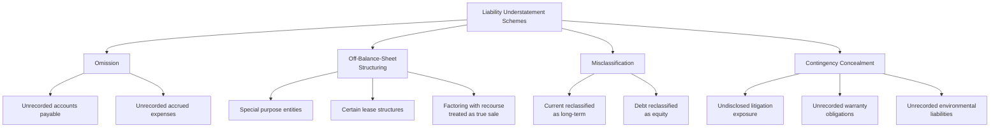

## Understated Liabilities and Expenses

### Overview

Understating liabilities and expenses is the mirror-image counterpart to asset and revenue overstatement schemes, sharing the same ultimate objective — inflating reported net income and equity — but operating through the omission or deferral side of the balance sheet and income statement rather than fabrication of assets or revenue. This category is often harder to detect than overstatement schemes precisely because it involves the **absence** of an entry rather than the presence of a fabricated one, making it fundamentally a completeness problem rather than an existence/valuation problem.

**Key Points**

- Understatement schemes exploit the accounting completeness assertion: the risk that recorded amounts do not include all liabilities and expenses that should be present, as distinct from the existence/occurrence assertion tested for overstatement risk
- Because there is no fabricated document to examine, detecting understatement requires proving a **negative** — establishing that something *should* have been recorded but was not — which typically relies on external corroboration, subsequent-period review, and analytical procedures rather than direct document examination
- Liability and expense understatement frequently serves distinct incentives from revenue/asset overstatement: satisfying debt covenants (which often test leverage and liquidity ratios directly sensitive to liability levels), presenting a stronger going-concern picture, or smoothing earnings by deferring cost recognition
- The completeness assertion is widely regarded among auditors and forensic accountants as one of the most difficult assertions to test, since audit and investigative procedures are naturally oriented toward examining what exists in the records rather than searching for what has been omitted

---

### Categories of Liability Understatement

<svg xmlns="http://www.w3.org/2000/svg" width="700" height="380" viewBox="0 0 700 380" font-family="Helvetica, Arial, sans-serif">
<text x="350" y="24" text-anchor="middle" font-size="16" font-weight="bold" fill="#1a1a1a">Liability Understatement: Four Mechanisms (svg_diagram)</text>
<rect x="20" y="60" width="160" height="90" rx="6" fill="#2b6cb0" />
<text x="100" y="90" text-anchor="middle" font-size="12" fill="#fff" font-weight="bold">Omission</text>
<text x="100" y="112" text-anchor="middle" font-size="9" fill="#fff">Simply not recorded</text>
<text x="100" y="126" text-anchor="middle" font-size="9" fill="#fff">(AP, accruals)</text>
<rect x="200" y="60" width="160" height="90" rx="6" fill="#c05621" />
<text x="280" y="90" text-anchor="middle" font-size="12" fill="#fff" font-weight="bold">Off-Balance-Sheet</text>
<text x="280" y="112" text-anchor="middle" font-size="9" fill="#fff">Structured to avoid</text>
<text x="280" y="126" text-anchor="middle" font-size="9" fill="#fff">recognition entirely</text>
<rect x="380" y="60" width="160" height="90" rx="6" fill="#2f855a" />
<text x="460" y="90" text-anchor="middle" font-size="12" fill="#fff" font-weight="bold">Misclassification</text>
<text x="460" y="112" text-anchor="middle" font-size="9" fill="#fff">Recorded, but wrong</text>
<text x="460" y="126" text-anchor="middle" font-size="9" fill="#fff">category/timing</text>
<rect x="560" y="60" width="120" height="90" rx="6" fill="#805ad5" />
<text x="620" y="90" text-anchor="middle" font-size="11" fill="#fff" font-weight="bold">Contingency</text>
<text x="620" y="108" text-anchor="middle" font-size="9" fill="#fff">Concealment</text>
<text x="620" y="126" text-anchor="middle" font-size="9" fill="#fff">Undisclosed exposure</text>

<text x="350" y="200" text-anchor="middle" font-size="11" fill="#666" font-style="italic">Detection difficulty generally increases left to right — omission leaves the clearest external trail</text>

</svg>

#### Omission of Accounts Payable and Accrued Expenses

The most direct and mechanically simple form: known invoices or accrued obligations simply are not entered into the accounting system prior to period close.

- **Delayed invoice processing:** Deliberately holding received vendor invoices until after period-end to keep them out of the current period's liabilities
- **Unrecorded accruals:** Failing to record accrued but unbilled expenses (e.g., utilities, payroll, professional fees) that a proper period-end close process would estimate and record
- **Unrecorded employee-related liabilities:** Failing to accrue for earned but unpaid compensation, bonuses, or vacation/PTO obligations

#### Off-Balance-Sheet Structuring

More sophisticated schemes using transaction structuring to keep genuine obligations from ever appearing on the balance sheet at all, rather than merely delaying their recording.

- **Special purpose entities (SPEs) / variable interest entities (VIEs):** Structuring financing or asset transfers through legally separate entities designed to avoid consolidation, keeping associated debt off the primary reporting entity's balance sheet — a technique central to some of the most significant historical corporate financial statement fraud cases
- **Certain lease structures:** Though lease accounting standards (ASC 842 / IFRS 16) have substantially narrowed opportunities for off-balance-sheet lease treatment relative to legacy operating lease rules, structuring arrangements to avoid lease classification or to argue a contract does not meet the definition of a lease remains a documented manipulation vector
- **Receivables factoring with recourse, treated as a true sale:** Structuring a receivables sale that retains meaningful recourse/risk with the seller (and therefore should be accounted for as secured borrowing, keeping the liability recorded) as if it were a true sale that removes both the receivable and any associated liability from the balance sheet

#### Misclassification

The liability is recorded, but its classification is manipulated to obscure its true nature or reduce its apparent impact on key financial ratios.

- **Current-to-long-term reclassification:** Classifying obligations due within twelve months as long-term, improving reported current ratio and working capital metrics scrutinized by lenders and analysts
- **Debt-to-equity reclassification:** Structuring or characterizing an instrument with debt-like characteristics (fixed repayment obligation, mandatory redemption) as equity, understating reported leverage
- **Contingent liability reclassification:** Downgrading the probability assessment of a contingency (from "probable," requiring accrual, to "reasonably possible," requiring only disclosure, or to "remote," requiring neither) without adequate support for the reassessment

#### Contingency and Commitment Concealment

- **Undisclosed litigation exposure:** Failing to disclose or accrue for known or threatened legal claims where a loss is probable and reasonably estimable
- **Unrecorded warranty obligations:** Understating warranty reserves relative to historical claims experience or known product issues
- **Environmental and regulatory liabilities:** Failing to record known or probable remediation obligations
- **Guarantee obligations:** Failing to disclose or record guarantees of third-party (including related-party) debt

**Example**

A manufacturing company facing a bank covenant requiring debt-to-EBITDA below a specified threshold arranges for a portion of its equipment financing to be structured through a nominally independent leasing entity, with terms (bargain purchase option, lease term covering substantially all of the asset's useful life) that, in substance, meet the criteria for a finance lease requiring on-balance-sheet liability recognition. Management characterizes the arrangement as an operating lease to keep the associated liability off the balance sheet. A forensic accountant reviewing the actual lease agreement terms against the applicable lease classification criteria identifies the substance-over-form discrepancy, revealing understated liabilities and a covenant compliance position that would not hold under proper classification.

---

### Categories of Expense Understatement

Because $\text{Net Income} = \text{Revenue} - \text{Expenses}$, every expense understatement technique has a direct, dollar-for-dollar inflationary effect on reported net income, making this category functionally equivalent in its income statement impact to a revenue overstatement scheme of the same magnitude.

$$\text{Expense Understatement} \Rightarrow \text{Net Income Overstatement (dollar-for-dollar)}$$

#### Improper Capitalization

Recording an expenditure that should be immediately expensed as a capitalized asset instead — covered in depth under asset overstatement, but functionally an expense understatement technique viewed from the income statement side. Common targets include routine repairs and maintenance, and research and development costs that fail the (generally narrow) capitalization criteria under applicable standards.

#### Deferred or Omitted Expense Recognition

- **Delayed recognition of known expenses:** Similar to accrued liability omission, but viewed from the income statement side — the expense that should reduce current-period income is simply not recorded
- **Improper deferral via prepaid asset treatment:** Recording an expenditure as a prepaid asset (to be expensed in future periods) when the underlying benefit has already been consumed in the current period
- **Understated bad debt / credit loss expense:** Understating the provision for expected credit losses (allowance for doubtful accounts), simultaneously overstating net receivables and understating current-period expense

#### Cookie Jar Reserves (Understatement in the Release Period)

While the initial overstatement of a reserve in a strong period is itself a form of expense overstatement, the subsequent **release** of that reserve in a weaker period constitutes expense understatement relative to what genuine current-period expense recognition would show — smoothing earnings across periods by borrowing from prior-period over-conservatism.

#### Understated Depreciation and Amortization

- Extending useful life assumptions beyond what is supportable by the asset's actual expected utility
- Selecting depreciation methods or salvage value assumptions that minimize current-period expense without adequate supporting analysis
- Failing to record impairment-related accelerated depreciation or write-offs when indicators of impairment exist

---

### Detection Techniques for Understatement Schemes

| Technique | How It Addresses the "Negative Proof" Challenge |
| --- | --- |
| **Subsequent events / subsequent disbursements review** | Examining payments made shortly after period-end to identify obligations that existed at period-end but were not recorded (a core audit and forensic procedure specifically targeting completeness) |
| **Vendor statement reconciliation** | Comparing internally recorded payables against independent vendor account statements, which reflect the vendor's own (external) record of amounts owed |
| **Search for unrecorded liabilities** | A structured procedure examining post-period-end cash disbursements, unmatched receiving reports, and open purchase orders to identify unrecorded obligations |
| **Legal confirmation letters** | Direct written confirmation with the company's outside legal counsel regarding pending or threatened litigation, a standard procedure specifically because litigation exposure is inherently difficult to detect from accounting records alone |
| **Analytical review of expense trends relative to revenue** | Expenses growing disproportionately slower than revenue, without a clear efficiency explanation, can indicate expense deferral or omission |
| **Ratio analysis: current ratio, debt-to-equity, interest coverage** | Unusually strong ratios relative to historical trend or industry peers can indicate liability understatement, particularly around covenant compliance dates |
| **Lease and contract portfolio review** | Independently assessing whether recorded lease/contract classification matches the substance of the underlying agreement terms |
| **Related-party guarantee and commitment inquiry** | Direct inquiry and document review specifically targeting related-party arrangements, a common locus for undisclosed guarantee obligations |

**Key Points**

- The **search for unrecorded liabilities** procedure and **subsequent disbursements review** are considered particularly important because they directly target the completeness assertion by examining transactions occurring *after* the period being tested — a structurally different approach from examining recorded transactions for fabrication
- **Legal confirmation letters** are a long-standing, specifically designed procedure precisely because litigation and contingency exposure is one of the categories least likely to be reflected in ordinary accounting records, requiring direct communication with an independent third party (outside counsel) who has direct knowledge
- [Inference] Because understatement schemes are detected primarily through corroborating what is absent rather than examining what is fabricated, they generally require a higher baseline level of professional skepticism specifically directed at management's completeness representations, since the perpetrator's primary concealment technique is often simply silence rather than active document fabrication

---

### The Detection Asymmetry: Why Understatement Is Harder to Find

**[Inference]** Understatement schemes are generally regarded by practitioners as more difficult to detect than comparable overstatement schemes, for a structural reason: overstatement requires the creation of a fabricated artifact (a fictitious invoice, an inflated count sheet) that can, in principle, be examined and disproven through document analysis, while understatement requires proving the *absence* of a record that should exist — a task that depends heavily on external corroboration (vendor statements, legal confirmations, subsequent events) rather than internal document scrutiny. This asymmetry is a documented reason why standard audit and forensic methodology places specific, dedicated procedures (search for unrecorded liabilities, legal confirmations) on the completeness assertion rather than relying on the same document-examination techniques used for existence/occurrence testing.

---

### Related Topics

- Common manipulations affecting each financial statement
- Asset and inventory overstatement schemes
- Off-balance-sheet financing structures and special purpose entities
- Lease accounting standards (ASC 842 / IFRS 16) and classification manipulation
- The search for unrecorded liabilities: audit and forensic procedure design
- Legal confirmation letters and contingency disclosure standards (ASC 450 / IAS 37)
- Debt covenant compliance analysis and ratio manipulation detection
- Subsequent events review procedures in forensic engagements