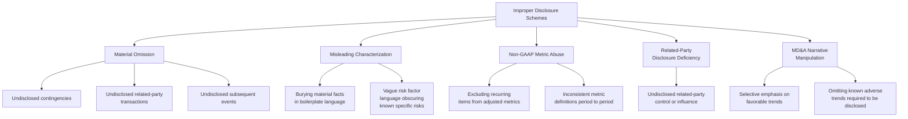

## Improper and Misleading Disclosures

### Overview

Disclosure fraud operates in the narrative and footnote layer of financial reporting rather than in the numerical statements themselves, making it a distinct fraud category that can exist even when the recorded figures are technically accurate. This is a critical distinction: a company can present numerically correct financial statements while still committing fraud through omission, obfuscation, or misleading characterization of the qualitative and contextual information required to make those numbers meaningful to a reasonable investor or creditor.

**Key Points**

- Disclosure fraud can occur **independently of any misstatement in the recorded financial figures**, since the fraud lies in what is *said* (or not said) about those figures rather than the figures themselves
- The governing legal standard in securities contexts is generally whether a disclosure, in light of the circumstances, is **materially misleading** — a standard that captures both affirmative misstatements and material omissions that render an otherwise true statement misleading
- Disclosure schemes span footnote disclosures, MD&A (Management's Discussion and Analysis) narrative, non-GAAP metric presentation, related-party disclosures, and risk factor sections
- Because disclosure fraud often satisfies the technical letter of a reporting requirement while defeating its substantive purpose, detecting it requires close reading and cross-referencing of qualitative language against underlying facts, not merely verification of numerical accuracy

---

### Categories of Improper Disclosure

<svg xmlns="http://www.w3.org/2000/svg" width="700" height="400" viewBox="0 0 700 400" font-family="Helvetica, Arial, sans-serif">
<text x="350" y="24" text-anchor="middle" font-size="16" font-weight="bold" fill="#1a1a1a">Disclosure Fraud: A Distinct Layer from Numerical Fraud (svg_diagram)</text>
<rect x="60" y="70" width="580" height="80" rx="6" fill="#2b6cb0" />
<text x="350" y="100" text-anchor="middle" font-size="13" fill="#fff" font-weight="bold">Financial Statements (numbers)</text>
<text x="350" y="120" text-anchor="middle" font-size="10" fill="#fff">Can be numerically accurate</text>
<text x="350" y="134" text-anchor="middle" font-size="10" fill="#fff">while disclosures are still misleading</text>
<rect x="60" y="200" width="580" height="140" rx="6" fill="#742a2a" />
<text x="350" y="230" text-anchor="middle" font-size="13" fill="#fff" font-weight="bold">Footnotes, MD&amp;A, Risk Factors,</text>
<text x="350" y="248" text-anchor="middle" font-size="13" fill="#fff" font-weight="bold">Non-GAAP Reconciliations</text>
<text x="350" y="272" text-anchor="middle" font-size="10" fill="#fff">This is where disclosure fraud operates —</text>
<text x="350" y="288" text-anchor="middle" font-size="10" fill="#fff">a separate legal and analytical layer from the</text>
<text x="350" y="304" text-anchor="middle" font-size="10" fill="#fff">numerical statements above</text>
<text x="350" y="324" text-anchor="middle" font-size="10" fill="#fff">Standard: materially misleading to a reasonable investor</text>
<line x1="350" y1="150" x2="350" y2="200" stroke="#333" stroke-width="2" stroke-dasharray="5,4" />
</svg>

---

### Material Omission Schemes

#### Undisclosed Contingencies

Failure to disclose known or probable litigation, regulatory investigations, or other loss contingencies, even where the associated liability recognition threshold (probable and estimable) has not been met — disclosure requirements under both GAAP (ASC 450) and the corresponding IFRS standard (IAS 37) generally require disclosure of reasonably possible contingencies even when accrual is not yet warranted.

#### Undisclosed Related-Party Transactions

Failing to disclose transactions, arrangements, or relationships with related parties (executives, directors, controlling shareholders, or entities they control) that would be material to a reasonable investor's understanding of the company's financial position or the objectivity of specific transactions.

#### Undisclosed Subsequent Events

Failing to disclose events occurring after the balance sheet date but before financial statements are issued, where such events are material to understanding the reported financial position (e.g., a major customer bankruptcy, a significant loan default, or a material regulatory action occurring shortly after period-end).

#### Undisclosed Going-Concern Doubt

Management's failure to disclose substantial doubt about the entity's ability to continue as a going concern, when known facts and circumstances (recurring losses, negative cash flows, covenant defaults, inability to obtain financing) would require such disclosure under applicable standards (ASC 205-40 under U.S. GAAP; analogous requirements under ISA 570 for auditors and IAS 1 for management disclosure under IFRS).

**Example**

A mid-size manufacturer is in active, advanced-stage negotiations to settle a significant product liability lawsuit for an amount that would materially reduce reported equity, with settlement essentially agreed in principle before the financial statements are finalized. Management characterizes the litigation in the footnotes using only boilerplate language describing the existence of "various legal proceedings arising in the ordinary course of business," omitting the specific, known settlement range that internal counsel has already estimated. This omission — technically acknowledging litigation exists while concealing its known material scope — constitutes a materially misleading disclosure independent of whether the underlying financial statements are otherwise numerically accurate.

---

### Misleading Characterization Schemes

Rather than omitting information entirely, these schemes present required information in a manner technically compliant with disclosure rules while substantively obscuring its significance.

- **Burying material facts in boilerplate or generic language:** Embedding a specific, known material risk within lengthy generic risk factor language, diluting its prominence and making it less likely a reasonable reader would identify its significance
- **Vague or generic risk factor disclosure:** Describing risks in abstract, hypothetical terms ("the Company may face increased competition") when management has specific, concrete knowledge of an actual, materializing competitive threat that should be disclosed with greater specificity
- **Inconsistent terminology or shifting definitions:** Using imprecise or shifting language across periods to describe the same underlying item, making period-over-period comparison difficult and obscuring trend deterioration
- **Disclosure "checklist compliance" without substantive engagement:** Including all technically required disclosure elements in a manner that satisfies a compliance checklist while failing to convey the substantive risk or condition a reasonable investor would need to understand

**[Inference]** This category is generally considered among the most difficult to definitively characterize as fraudulent (as opposed to merely poor or overly cautious drafting), since the line between conservative legal drafting and deliberately obscuring language is often a matter of degree requiring careful analysis of what management specifically knew at the time of drafting, corroborated through internal communications, board minutes, and other contemporaneous evidence.

---

### Non-GAAP Metric Abuse

The proliferation of company-defined "adjusted" or "non-GAAP" metrics (adjusted EBITDA, non-GAAP earnings per share, and similar company-specific measures) has created a documented category of disclosure risk, since these metrics are defined by management rather than a standard-setting body.

- **Excluding recurring operating items:** Characterizing genuinely recurring operating expenses (e.g., stock-based compensation, restructuring charges that occur in most periods) as "non-recurring" or "one-time" to present an inflated adjusted metric
- **Inconsistent metric definitions across periods:** Changing the components of a non-GAAP metric's calculation between reporting periods without clear disclosure of the change and its effect, making trend comparison misleading
- **Undue prominence relative to the comparable GAAP measure:** Presenting non-GAAP metrics with greater size, prominence, or emphasis than the most directly comparable GAAP measure, a specific concern addressed in SEC guidance on non-GAAP financial measures
- **Individually tailored recognition and measurement principles:** Constructing a non-GAAP metric using a revenue recognition or expense recognition methodology that departs from GAAP in a manner effectively substituting a company-specific accounting principle for GAAP itself, rather than simply adjusting for specific, clearly identified items

**Example**

A technology company reports "adjusted EBITDA" excluding stock-based compensation as a recurring add-back in every quarterly filing for several consecutive years, despite stock-based compensation representing a substantial and recurring component of the company's actual employee compensation structure. While disclosure of the adjustment itself is not inherently improper, if the accompanying narrative characterizes the adjusted metric as reflecting the company's "core operating performance" without adequate context that a significant, ongoing compensation cost is being excluded, the presentation risks misleading investors about the metric's relationship to genuine sustainable profitability — a documented area of regulatory scrutiny.

---

### Related-Party Disclosure Deficiencies

- **Undisclosed control relationships:** Failing to disclose that a nominally independent counterparty is, in substance, controlled by or affiliated with company insiders
- **Understated related-party transaction volume or terms:** Disclosing the existence of related-party transactions while omitting or understating their financial magnitude or the degree to which terms deviate from arm's-length norms
- **Circular or layered related-party structures:** Using multiple intermediate entities to obscure the ultimate related-party nature of a transaction, defeating disclosure requirements that depend on identifying the ultimate related party

---

### MD&A (Management's Discussion and Analysis) Narrative Manipulation

- **Selective emphasis on favorable trends:** Highlighting favorable metrics or business segments while omitting discussion of known, material adverse trends affecting other aspects of the business
- **Omitting known trends or uncertainties required to be disclosed:** Regulatory guidance generally requires disclosure of known trends or uncertainties reasonably expected to have a material effect on financial condition or operating results; failing to disclose a known adverse trend (e.g., a major customer's known intent not to renew a contract) violates this requirement
- **Misleading causal narratives:** Attributing a financial result to a favorable cause when management internally knows the true driver is a less favorable, potentially non-recurring factor

---

### Legal and Regulatory Standards Governing Disclosure

- **Materiality standard:** The governing threshold in most jurisdictions asks whether there is a substantial likelihood that a reasonable investor would consider the omitted or misstated information important in making an investment decision — a standard applied both to quantitative misstatements and qualitative disclosure deficiencies
- **Rule 10b-5 (U.S. securities law) and equivalent anti-fraud provisions:** Prohibit not only affirmative false statements but also **omissions of material fact necessary to make statements made, in light of the circumstances, not misleading** — the specific legal hook for pure omission-based disclosure fraud
- **SEC guidance on non-GAAP measures (Regulation G and related interpretive guidance):** Establishes specific requirements for reconciliation to the most comparable GAAP measure and prohibits misleading presentation
- **ASC 450 / IAS 37 (contingencies):** Governs disclosure thresholds for loss contingencies distinct from the higher threshold required for accrual
- **ASC 850 / IAS 24 (related-party disclosures):** Establish specific disclosure requirements for related-party transactions and relationships

**[Unverified]** Specific regulatory citations, thresholds, and interpretive guidance are subject to periodic amendment by standard-setters and regulators; practitioners should confirm current requirements against the applicable current authoritative source for their jurisdiction rather than relying on a fixed historical citation.

---

### Detection Techniques for Disclosure Fraud

| Technique | Application |
| --- | --- |
| **Cross-referencing disclosures against internal documents** | Comparing footnote/MD&A language against board minutes, internal memos, and management communications to identify gaps between what was known internally and what was disclosed externally |
| **Comparative disclosure analysis across periods** | Identifying material changes in disclosure language, scope, or specificity between periods that may signal an emerging but undisclosed issue |
| **Peer disclosure benchmarking** | Comparing disclosure specificity and content against industry peers facing similar known risks, to identify unusually vague or generic language |
| **Non-GAAP reconciliation scrutiny** | Independently assessing whether excluded items are genuinely non-recurring, and whether the GAAP reconciliation is presented with appropriate prominence |
| **Interview of drafters and reviewers** | Establishing what specific information was known to disclosure controls personnel (legal, investor relations, finance) at the time language was finalized |
| **Textual/linguistic analysis** | Emerging analytical techniques examining language patterns (hedging language frequency, tone, specificity) across filings, sometimes used as a screening tool to flag filings warranting closer qualitative review |

**Key Points**

- Establishing disclosure fraud typically requires demonstrating **what management actually knew** at the time of the disclosure — making internal document review (emails, board materials, internal risk assessments) a central evidentiary source, distinct from the primarily external/financial-data-driven techniques used for numerical statement fraud detection
- [Inference] Disclosure fraud investigations generally require closer coordination with legal counsel than pure numerical fraud investigations, given the direct overlap with securities law materiality and anti-fraud provisions, and the heightened sensitivity of internal communications evidence to attorney-client privilege considerations

---

### Related Topics

- Common manipulations affecting each financial statement
- Related-party transaction identification and analysis
- Going-concern disclosure standards and assessment
- Non-GAAP financial measures: SEC guidance and detection techniques
- Materiality standards in securities fraud and financial reporting
- MD&A narrative analysis and textual detection techniques
- Rule 10b-5 and the legal framework for omission-based securities fraud
- Internal document review and privilege considerations in disclosure investigations