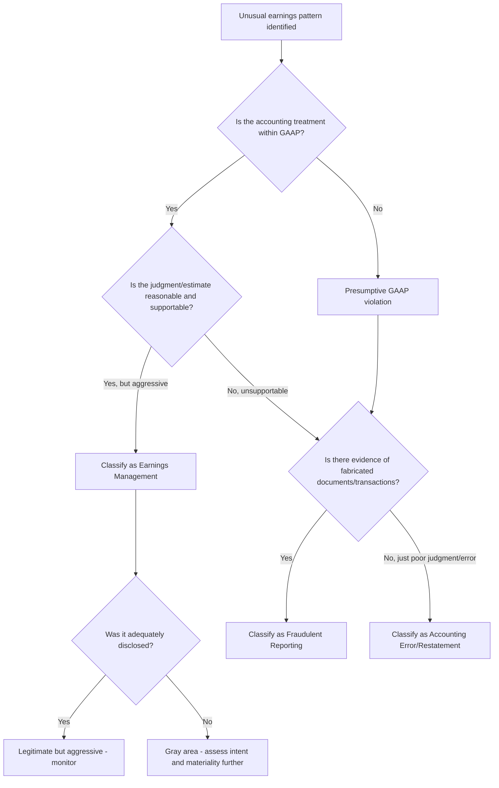

## Earnings Management versus Fraudulent Reporting

### Conceptual Framework

**Definitions**

Earnings management is the purposeful intervention in the external financial reporting process, using discretion allowed within Generally Accepted Accounting Principles (GAAP) or applicable financial reporting framework, to obtain some private gain for managers or to influence contractual outcomes. It operates within the boundaries of accounting standards, even when it exploits their flexibility or ambiguity.

Fraudulent financial reporting is the intentional misstatement or omission of amounts or disclosures in financial statements, designed to deceive financial statement users. It violates GAAP (or IFRS) and typically involves deliberate falsification, misrepresentation, or manipulation of accounting records, supporting documents, or business transactions.

The critical distinction is not always the accounting outcome (both can produce misleading earnings) but rather: (1) whether GAAP was violated, (2) the presence of intent to deceive, and (3) whether the underlying economic transaction was real, distorted, or fabricated.

**The Continuum View**

Most forensic accounting literature (notably the framework popularized by the SEC and academic researchers such as Dechow and Skinner) treats these concepts as points along a continuum rather than a binary:

$$\text{Conservative Accounting} \rightarrow \text{Neutral Accounting} \rightarrow \text{Aggressive (but GAAP-compliant) Accounting} \rightarrow \text{Earnings Management} \rightarrow \text{Fraudulent Reporting}$$

- Conservative accounting: understating earnings/assets (e.g., excessive reserves)
- Neutral accounting: accounting outcomes reflect economic reality without bias
- Aggressive accounting: choices within GAAP that push toward favorable outcomes but remain defensible
- Earnings management: within-GAAP choices deliberately structured to achieve a target
- Fraudulent reporting: outside GAAP, involving deception and often fabrication

### Distinguishing Criteria

| Criterion | Earnings Management | Fraudulent Reporting |
| --- | --- | --- |
| GAAP compliance | Remains within GAAP (uses acceptable methods/judgment) | Violates GAAP |
| Legality | Generally legal | Illegal; can trigger civil and criminal liability |
| Intent | Intent to influence perception, not necessarily to deceive about the existence of transactions | Intent to deceive users about the entity's true financial position |
| Underlying transactions | Real transactions, timing/structuring is manipulated | May involve fictitious, backdated, or non-existent transactions |
| Disclosure | Usually disclosed per required standards, though may lack transparency about motive | Often includes concealment, falsified documents, or omitted disclosures |
| Auditor detection difficulty | Often identifiable through analytical procedures and judgment review | May require forensic techniques, fraud examination, and forensic data analytics |
| Regulatory consequence | Restatement (sometimes), increased scrutiny | SEC enforcement action, Sarbanes-Oxley (SOX) Section 302/906 certifications violations, criminal prosecution |

**Key Points**

- The line between "aggressive earnings management" and "fraud" is often a matter of degree and documentation, not a clean legal bright line — this is a genuinely contested area in practice. [Inference: based on the difficulty of applying a bright-line rule, not a settled legal doctrine]
- Materiality and intent (scienter) are the two elements courts and regulators use most heavily to separate the two
- A transaction can be "real" yet still fraudulently reported if its accounting treatment misrepresents its substance (e.g., a genuine sale-leaseback recorded as an outright sale to inflate gain)

### Common Earnings Management Techniques (Within GAAP)

**1. Accrual-based earnings management**

Adjusting discretionary accruals — items requiring management judgment (e.g., allowance for doubtful accounts, warranty reserves, inventory obsolescence reserves) — to shift income between periods.

$$\text{Total Accruals} = \text{Net Income} - \text{Operating Cash Flow}$$

Discretionary accruals are typically estimated using models such as the Modified Jones Model:

$$\frac{TA_t}{A_{t-1}} = \alpha_1\left(\frac{1}{A_{t-1}}\right) + \alpha_2\left(\frac{\Delta REV_t - \Delta REC_t}{A_{t-1}}\right) + \alpha_3\left(\frac{PPE_t}{A_{t-1}}\right) + \varepsilon_t$$

Where $TA_t$ = total accruals in year $t$, $A_{t-1}$ = lagged total assets, $\Delta REV_t$ = change in revenue, $\Delta REC_t$ = change in receivables, $PPE_t$ = gross property, plant and equipment. The residual $\varepsilon_t$ is interpreted as the discretionary (abnormal) accrual component. [Note: this is an empirical proxy used in academic and forensic research, not a GAAP-mandated calculation]

**2. Real earnings management (real activities manipulation)**

Altering actual business operations/timing to affect reported results, distinct from accounting-choice manipulation:

- Accelerating sales through unusual price discounts or lenient credit terms near period-end
- Overproduction to lower per-unit fixed cost allocation, inflating gross margin
- Cutting discretionary expenses (R&D, advertising, maintenance) to boost short-term earnings
- Timing asset sales/dispositions to realize gains/losses opportunistically

**3. Classification shifting**

Moving expenses between the income statement's core and non-core (special/non-recurring) categories to boost "core" or "pro forma" earnings metrics, without changing bottom-line net income.

**4. Big bath accounting**

Recognizing large one-time write-offs/impairments in a single (often already-bad) period, typically during management transitions, to clear the decks for improved future comparisons.

**5. Cookie jar reserves**

Overstating reserves/accruals in good years to be released and smooth income in weaker future years.

**6. Income smoothing**

Deliberately reducing volatility of reported earnings across periods, often through the timing of discretionary items, to project stability to investors and analysts.

### Common Fraudulent Financial Reporting Schemes (GAAP Violations)

Aligned to the categories commonly used by the Association of Certified Fraud Examiners (ACFE) Fraud Tree for financial statement fraud:

**1. Fictitious/fabricated revenue**

- Recording sales of goods/services never delivered or rendered
- Round-tripping / channel stuffing disguised as legitimate sales with side agreements (right of return, contingent payment) not disclosed
- Bill-and-hold arrangements that fail the criteria for revenue recognition
- Recording revenue on consignment goods as if sold

**2. Timing differences (cutoff manipulation)**

- Recognizing revenue in the wrong period (premature revenue recognition, e.g., before delivery/performance obligation is satisfied under ASC 606)
- Failing to record/matching expenses in the correct period

**3. Concealed liabilities and expenses**

- Omitting liabilities (e.g., failing to record a warranty or loss contingency required under ASC 450)
- Capitalizing costs that should be expensed (the classic WorldCom scheme — capitalizing line costs as capital expenditures instead of operating expenses)
- Failing to disclose related-party transactions or guarantees

**4. Improper/fraudulent asset valuation**

- Overstating inventory through fictitious counts, inflated unit costs, or bogus in-transit inventory (e.g., the Phar-Mor and Miniscribe cases)
- Failing to write down impaired assets or obsolete inventory
- Overstating receivables through fictitious customers or channel-stuffed sales
- Manipulating fair-value/mark-to-market inputs for Level 3 assets

**5. Improper disclosures**

- Omission of material liabilities, contingencies, or subsequent events
- Misrepresenting related-party transactions, executive compensation, or going-concern issues

**6. Fraudulent journal entries at period-end**

Empirically, ACFE and academic fraud studies indicate a disproportionate share of fraudulent adjustments are made through manual, top-side journal entries recorded outside routine transaction cycles, often near quarter/year-end and bypassing normal controls. [Inference: general finding across multiple fraud studies; magnitude varies by study and period]

### The Fraud Triangle and Fraud Diamond (Applied to Financial Statement Fraud)

```mermaid
graph TD
    A[Fraud Triangle - Cressey] --> B[Pressure/Incentive]
    A --> C[Opportunity]
    A --> D[Rationalization]
    B --> B1[Meet analyst earnings expectations]
    B --> B2[Debt covenant compliance]
    B --> B3[Executive bonus/equity targets]
    B --> B4[Concealing declining performance]
    C --> C1[Weak internal controls]
    C --> C2[Management override of controls]
    C --> C3[Complex or unusual transactions]
    C --> C4[Ineffective audit committee oversight]
    D --> D1["Everyone does this"]
    D --> D2["It's temporary, we'll reverse it later"]
    D --> D3["The company deserves better numbers"]
    E[Fraud Diamond adds:] --> F[Capability]
    F --> F1[Position/authority to override controls]
    F --> F2[Confidence to avoid detection]
    F --> F3[Ability to coerce others / silence dissent]
```

The fraud diamond (Wolfe and Hermanson, 2004) extends Cressey's triangle by adding **capability** — the argument that pressure, opportunity, and rationalization alone are insufficient without a person who has the specific traits (position, ego, coercive skill) to execute and conceal the fraud, which is particularly relevant to executive-level financial statement fraud where management override of controls is common.

### SEC and Regulatory Framework

**AAER-based research (SEC Accounting and Auditing Enforcement Releases)**

The SEC's AAERs are the primary public data source used by forensic accountants and academics to study confirmed fraudulent reporting cases (as opposed to earnings management, which rarely triggers enforcement since it is not illegal per se).

**SEC's "materiality-based" tests** — historically referencing SAB 99 (Materiality) — reject purely quantitative thresholds (e.g., the "5% rule of thumb") in favor of qualitative factors:

- Whether the misstatement masks a change in earnings trends
- Whether it hides a failure to meet analyst consensus
- Whether it changes a loss into income or vice versa
- Whether it affects compliance with loan covenants or other contractual requirements
- Whether it increases management compensation

**Sarbanes-Oxley Act (2002) provisions relevant to this distinction:**

- Section 302: CEO/CFO certification of disclosure controls and financial statement accuracy
- Section 404: Management assessment (and, for accelerated filers, auditor attestation) of internal control over financial reporting (ICFR)
- Section 906: Criminal certification; knowing/willful false certification carries fines up to $5,000,000 and imprisonment up to 20 years
- Section 802: Criminal penalties for document destruction/alteration (up to 20 years)

### Auditor Responsibilities: AU-C 240 / AS 2401

Under AICPA AU-C 240 (*Consideration of Fraud in a Financial Statement Audit*) and PCAOB AS 2401, auditors are required to:

- Maintain professional skepticism throughout the engagement
- Presume a fraud risk exists in revenue recognition (rebuttable presumption)
- Specifically assess the risk of management override of controls, since management, by virtue of its position, can often override controls that otherwise appear to be operating effectively
- Perform unpredictable audit procedures and evaluate journal entries for evidence of bias in accounting estimates

**Important distinction for auditors:** an audit is designed to provide reasonable assurance about whether financial statements are free of *material* misstatement, whether caused by error or fraud — auditors are not specifically tasked with detecting earnings management that remains within GAAP and is properly disclosed, since that is a legitimate exercise of management judgment, not a misstatement. [Behavior may vary based on specific engagement circumstances, applicable auditing standards version, and auditor judgment]

### Detection Techniques Distinguishing the Two

**For earnings management (analytical/statistical detection):**

- Beneish M-Score model (probability of earnings manipulation)

$$M\text{-Score} = -4.84 + 0.92(DSRI) + 0.528(GMI) + 0.404(AQI) + 0.892(SGI) + 0.115(DEPI) - 0.172(SGAI) + 4.679(TATA) - 0.327(LVGI)$$

An M-Score greater than approximately −1.78 suggests a heightened likelihood of manipulation. [Note: this threshold and the model itself are an empirically-derived statistical screening tool from Beneish's 1999 research, not a legal or GAAP standard, and produces false positives/negatives]

- Discretionary accruals models (Jones Model, Modified Jones Model, Performance-Matched Discretionary Accruals)
- Benford's Law analysis on reported figures to detect abnormal digit distributions

**For fraud (forensic/investigative detection):**

- Document examination (forensic document analysis for alterations, backdating)
- Data analytics on journal entries (identifying entries posted by senior management, entries with round numbers, weekend/after-hours postings, entries lacking narrative descriptions)
- Interviews and interrogation using cognitive/behavioral analysis techniques
- Third-party confirmations (independent verification of receivables, bank balances, related-party arrangements)
- Lifestyle/net worth analysis of key executives (indirect method) when personal enrichment is suspected
- Whistleblower tips (the ACFE consistently finds tips are the most common initial fraud detection method across all fraud types, including financial statement fraud) [Inference: consistent finding across multiple ACFE Report to the Nations survey cycles; exact percentage varies by year]

### Illustrative Case Comparison

**Example — Earnings Management (GAAP-compliant):**

A company facing a slight earnings shortfall reduces its bad debt allowance estimate at year-end based on a revised (but defensible) analysis of receivables aging, adding $2 million to pre-tax income. The estimate is disclosed in the notes, is within a range that could be supported by reasonable judgment, and does not involve fabricated data. This is aggressive but permissible discretion in an accounting estimate.

**Example — Fraudulent Reporting:**

The same company, facing a larger shortfall, instead instructs the accounting department to record $50 million of fictitious sales to shell companies controlled by an executive, generates fake shipping documents, and backdates invoices to the current period. This violates ASC 606 revenue recognition criteria, involves fabricated documentation, and is designed to deceive investors — a criminal securities fraud violation.

**Landmark Cases for Reference:**

- WorldCom (2002): Capitalization of operating expenses (line costs) as capital assets, understating expenses by approximately $3.8 billion
- Enron (2001): Use of special purpose entities (SPEs) to move debt off-balance-sheet and mark-to-market accounting abuse on long-term contracts
- Waste Management (1998–2002): Manipulation of depreciation estimates (useful lives, salvage values) on a large scale, illustrating the estimate-manipulation-to-fraud continuum
- HealthSouth (2003): Fabricated journal entries to inflate earnings to meet analyst expectations, involving dozens of accounting personnel

### Forensic Accountant's Analytical Framework

**Conclusion**

The distinction between earnings management and fraudulent financial reporting hinges on three interlocking tests: GAAP compliance, the presence of fraudulent intent (scienter), and whether underlying transactions and supporting documentation are genuine. Earnings management operates in the (sometimes uncomfortably wide) space GAAP allows for judgment and estimation, while fraudulent reporting crosses into fabrication, concealment, and deliberate deception. For forensic accountants, the practical task is rarely to apply a bright-line legal test directly — that is ultimately a matter for regulators and courts — but to build a fact pattern (documentary evidence, digital forensics, interviews, statistical anomalies) that demonstrates where on the continuum a given accounting choice falls, and specifically whether intent and GAAP departure can be evidenced.

**Related Topics**

- Revenue recognition fraud schemes under ASC 606
- The Beneish M-Score and other statistical fraud prediction models in depth
- Management override of controls and the role of the audit committee
- SEC Staff Accounting Bulletin (SAB) 99 materiality framework
- Fraud Triangle vs. Fraud Diamond vs. Fraud Pentagon (Crowe's addition of "arrogance")
- Restatements: GAAP error correction (ASC 250) versus fraud-driven restatements
- Off-balance-sheet financing and special purpose entities (SPEs/VIEs)
- Forensic data analytics: journal entry testing and Benford's Law applications
- Whistleblower programs under Dodd-Frank and SEC Office of the Whistleblower