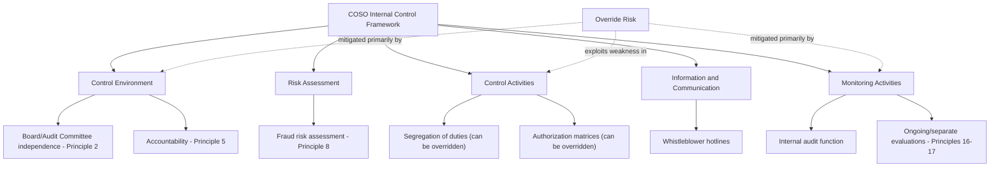

## Management Override of Internal Controls

### Definition and Conceptual Foundation

Management override of internal controls is the deliberate circumvention of established control policies and procedures by executives or senior personnel, typically for illegitimate purposes such as personal gain or presentation of the entity's financial condition in a manner that is inconsistent with its actual economic reality. It is distinct from a **control deficiency** (a control failing to operate as designed due to error) because override is intentional and exploits the very authority granted to management to design and operate the control system.

Auditing standards treat this risk as effectively universal rather than case-specific. Under AICPA AU-C 240 and PCAOB AS 2401, management override of controls is presumed to be a fraud risk on every audit engagement, regardless of the auditor's assessment of the specific entity's control environment, because management is uniquely positioned to override controls that otherwise appear to operate effectively.

### Why Override Is Structurally Unique Among Fraud Risks

**Key Points**

- Controls are generally designed to detect and prevent errors and fraud committed by employees; they are rarely designed to prevent fraud by the very individuals who designed, implemented, or supervise them
- Segregation of duties, authorization matrices, and system access controls assume good-faith exercise of authority by those at the top of the hierarchy; a colluding or unilaterally-acting executive can direct subordinates to bypass these safeguards
- Override does not require a system deficiency or a weak control environment on paper; a well-designed COSO-compliant control framework can still be overridden by someone with sufficient authority and the cooperation (or intimidation) of subordinates
- This is why control override is considered by auditing standards, COSO, and forensic literature to be effectively unpreventable by internal controls alone, and must instead be addressed through governance mechanisms, monitoring, and independent oversight

### Common Mechanisms of Override

**1. Top-side/manual journal entries**

Senior executives directing the posting of adjusting entries outside the normal transaction-processing cycle, often:

- Made directly at the general ledger level, bypassing subsidiary ledgers and automated system controls
- Lacking adequate supporting documentation or business rationale
- Posted near period-end (last days of the quarter/year) to influence reported results
- Involving unusual account combinations (e.g., debits to expense accounts and credits to unrelated balance sheet reserves)

**2. Bypassing segregation of duties**

Directing subordinates to process transactions that a properly segregated system would otherwise require multiple independent parties to authorize, record, and reconcile — for example, an executive personally initiating, approving, and recording a wire transfer that policy requires to be split across three roles.

**3. Suppressing or altering audit evidence**

- Instructing personnel to withhold information from internal or external auditors
- Fabricating or altering supporting documentation (invoices, shipping records, contracts, side letters)
- Concealing side agreements that would otherwise affect revenue recognition (e.g., undisclosed rights of return or contingent payment terms)

**4. Manipulating accounting estimates and judgments**

Directing changes to significant accounting estimates (reserves, valuation allowances, impairment assessments, percentage-of-completion estimates) without a defensible analytical basis, to achieve a predetermined financial result rather than the other way around.

**5. Circumventing IT general controls (ITGCs)**

- Using elevated system access rights to directly alter posted transactions or master data (e.g., changing vendor bank details, adjusting inventory quantities in the ERP system) without going through the standard change-approval workflow
- Directing IT personnel to disable system-enforced controls, audit logs, or approval workflows temporarily

**6. Related-party and off-book transactions**

Structuring transactions with related parties or special purpose entities (SPEs) that are not properly disclosed, often to move assets/liabilities off the balance sheet or manufacture artificial economic substance (as in Enron's use of SPEs such as LJM and Chewco).

**7. Intimidation and coercion of subordinates**

A component the Fraud Diamond specifically labels **capability** — a person in an override position may leverage authority over compensation, promotion, and continued employment to pressure accounting staff into compliance, or may exploit personal charisma/credibility to avoid scrutiny from those who might otherwise object.

### COSO Framework Perspective

The 2013 COSO Internal Control–Integrated Framework addresses override risk primarily through **Principle 8** (Component: Risk Assessment) — "The organization considers the potential for fraud in assessing risks to the achievement of objectives" — which explicitly requires organizations to consider:

- Incentives and pressures that could lead to fraud (including management override)
- Opportunities for unauthorized acquisition, use, or disposal of assets, or for altering the entity's reporting records
- Attitudes and rationalizations that could be used to justify fraudulent action

**Principle 5** (Control Environment) — "The organization holds individuals accountable for their internal control responsibilities" — is the primary mitigating principle, operationalized through:

- A functioning, independent board and audit committee with direct oversight responsibility, distinct from management
- Codes of conduct with active enforcement, not merely a documented policy
- Whistleblower/anonymous reporting mechanisms with protection from retaliation

### Governance Mitigants (Since Controls Alone Are Insufficient)

**1. Independent and engaged audit committee**

- Direct reporting lines from internal audit and external auditors to the audit committee (not to the CFO/CEO)
- Regular executive sessions without management present
- Audit committee financial expert requirement (SOX Section 407 / SEC rules)

**2. Internal audit function**

- Organizationally independent, reporting functionally to the audit committee
- Performs unpredictable, unannounced testing specifically targeting management override risk (e.g., surprise cash counts, unannounced site visits, ad hoc journal entry testing)

**3. Whistleblower mechanisms**

- SOX Section 301 requires audit committees to establish procedures for confidential, anonymous submission of concerns regarding questionable accounting or auditing matters
- Dodd-Frank Section 922 whistleblower bounty program (SEC) provides financial incentives (10–30% of monetary sanctions over $1 million) for original information leading to successful enforcement

**4. External auditor procedures specifically targeting override (AS 2401 / AU-C 240)**

- Examining journal entries and other adjustments for evidence of possible material misstatement due to fraud, with a particular focus on entries made by senior management, entries posted with unusual account combinations, and entries lacking adequate documentation
- Reviewing accounting estimates for biases that could represent a risk of material misstatement due to fraud, and performing a retrospective review of prior-period estimates
- Evaluating the business rationale (or lack thereof) for significant unusual transactions, particularly those outside the normal course of business
- Incorporating an element of unpredictability in the nature, timing, and extent of audit procedures from period to period

**5. Certifications and personal accountability (SOX)**

- Section 302: CEO/CFO must personally certify the accuracy of financial statements and the effectiveness of disclosure controls each period
- Section 404: Management must assess and report on internal control over financial reporting (ICFR); for accelerated filers, this assessment is subject to independent auditor attestation
- Section 906: Criminal certification requirement — knowing/willful false certification carries fines up to $5,000,000 and imprisonment up to 20 years, creating direct personal criminal exposure for the certifying officers, distinct from civil securities fraud liability

### Distinguishing Override from Related Concepts

| Concept | Nature | Intent | Example |
| --- | --- | --- | --- |
| Control deficiency | Control fails to operate as designed | No intent (design/operating flaw) | Reconciliation not performed due to staffing gap |
| Management override | Control deliberately circumvented by authority figure | Intentional, often to misstate results | CFO directs bypass of approval matrix for a fictitious sale |
| Collusion | Two or more individuals cooperate to defeat controls | Intentional, distributed across parties | Controller and sales VP jointly fabricate shipping documents |
| Employee fraud (non-management) | Lower-level personnel circumvent controls for personal gain | Intentional, individual-level | Accounts payable clerk creates a fictitious vendor |

Override and collusion frequently co-occur: a single executive's directive typically requires the cooperation (willing or coerced) of at least one subordinate to execute (e.g., an accountant who posts the entry, a warehouse manager who signs a false shipping document), which is why fraud examiners treat "tone at the top" and the ethical culture of middle management as jointly determinative of override risk. [Inference: consistent theme across ACFE Report to the Nations findings and COSO guidance, not a strict quantitative finding]

### Illustrative Case Patterns

**Example — WorldCom (2002):** CFO Scott Sullivan directed the capitalization of ordinary operating expenses (line costs) as capital expenditures, a decision that was not embedded in a control weakness but was a direct instruction issued down the finance hierarchy; several subordinate controllers complied despite reservations, illustrating both override and the coercive-authority dimension of the fraud diamond's "capability" element.

**Example — Override without collusion detection:** An executive with system "super-user" access personally posts an adjusting entry to reverse a previously recorded impairment near quarter-end, bypassing the standard estimate-review committee. Because the entry is posted using the executive's own elevated credentials rather than requiring another employee's sign-off, no collusion is required — illustrating why IT access control review (not just personnel-level segregation of duties) is a necessary complement to procedural controls.

### Forensic and Audit Response Techniques

**Detection-oriented procedures:**

- Journal entry testing using data analytics: filtering for entries posted by senior management user IDs, entries posted outside business hours or on weekends, round-dollar entries, entries with missing or generic descriptions, and entries reversed shortly after period-end close
- Benford's Law analysis on entry amounts to detect artificially constructed (non-naturally-occurring) figures
- Analytical review comparing actual results against expectations derived from non-financial and operational data (e.g., comparing reported revenue growth against unit shipment volumes, headcount, or square footage)
- Interviewing accounting personnel below the executive level, specifically probing for pressure or unusual instructions received near period-end (a technique explicitly encouraged by AU-C 240/AS 2401 fraud inquiry requirements)

**Governance-oriented responses (post-detection or preventive):**

- Enhanced whistleblower protections and anonymous reporting channel promotion
- Board-level "tone at the top" assessment and CEO/CFO succession and compensation structure review (to reduce pressure-based incentives for override)
- Rotation of key finance personnel and mandatory vacation policies (a classic control designed to surface concealment schemes that require continuous manual intervention to sustain)

**Conclusion**

Management override of internal controls occupies a distinct category within financial statement fraud risk because it is not a failure of control design but an abuse of the authority the control system itself depends upon. Standard-setters, COSO, and forensic practitioners converge on the same core response: since procedural controls (segregation of duties, authorization limits, system access restrictions) cannot reliably prevent override by those who sit above them, mitigation must come from governance-layer mechanisms — an independent and empowered audit committee, a functionally independent internal audit function, protected whistleblower channels, personal certification liability under SOX, and auditor procedures specifically designed around unpredictability and heightened scrutiny of management-level activity. Forensic investigation of suspected override cases accordingly focuses less on whether a control existed on paper and more on who had the authority and opportunity to instruct its circumvention, and why.

**Related Topics**

- COSO 2013 Framework — the 17 Principles in depth
- Segregation of duties design and common failure patterns
- Journal entry testing methodologies and data analytics in fraud examination
- Whistleblower programs: SOX Section 301 vs. Dodd-Frank Section 922
- Audit committee composition, independence, and financial expert requirements (SOX Section 407)
- Tone at the top and organizational fraud culture assessment
- Special purpose entities (SPEs/VIEs) as override/concealment vehicles
- PCAOB AS 2401 and AICPA AU-C 240 — detailed procedural requirements