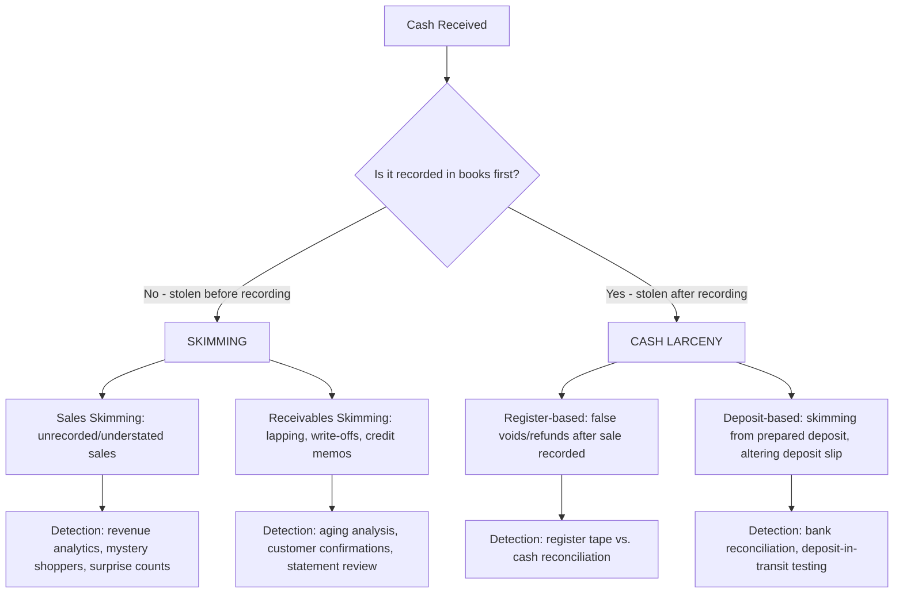

## Cash Larceny and Skimming Schemes

### Conceptual Framework

Cash larceny and skimming are the two primary categories of cash misappropriation under the ACFE Fraud Tree's "Cash Receipts" branch, distinguished by a single critical timing element: **whether the cash was recorded in the accounting system before it was stolen.**

- **Skimming** is the theft of cash *before* it is recorded in the entity's books and records — an "off-book" fraud. Because the cash never appears in any accounting record, no direct audit trail exists at the point of theft.
- **Cash larceny** is the theft of cash *after* it has already been recorded — an "on-book" fraud. Because the cash was recorded, its removal creates a discrepancy (a shortage) that is theoretically detectable through reconciliation.

$$\text{Skimming} = \text{Theft before recording (off-book)} \qquad \text{Cash Larceny} = \text{Theft after recording (on-book)}$$

This distinction drives everything downstream: detection method, audit trail availability, and typical concealment technique.

### Skimming Schemes

**1. Sales skimming**

The most basic form: an employee accepts payment from a customer for a sale but does not record the sale in the point-of-sale (POS) system, register, or accounting records, then pockets the cash.

- **Unrecorded sales:** Simply ringing "no sale" or not ringing the transaction at all, while still delivering the good/service and keeping the cash
- **Understated sales:** Recording a sale for less than the amount actually collected (e.g., ringing up $10 when the customer paid $50), pocketing the $40 difference
- **Short-term skimming (register manipulation):** Voiding or reversing a legitimately recorded sale after the customer has left, then removing the corresponding cash

**2. Receivables skimming**

More sophisticated because it involves customer accounts that expect to see payment applied, requiring active concealment:

- **Lapping schemes:** The classic receivables skimming concealment technique. The perpetrator steals a payment from Customer A, then when Customer B's payment arrives, applies it to Customer A's account (to avoid Customer A receiving a delinquency notice), then applies Customer C's payment to Customer B's account, and so on — a continuously rolling concealment that must be sustained indefinitely or unwound
- **Stolen statements/write-off schemes:** Diverting a customer payment and then writing off the corresponding receivable balance as uncollectible (bad debt), or issuing a fraudulent credit memo to make the account appear settled
- **Debiting the wrong account:** Applying a legitimate payment to an unrelated (often dormant or house) account to conceal the theft of a different customer's payment

**3. Refunds and other schemes**

- Understating discounts/refunds given, pocketing the difference
- Diverting mailroom receipts (checks/cash received by mail) before they reach the cash receipts journal

### Concealment Mathematics of Lapping

For a simple single-perpetrator lapping scheme, the shortage the perpetrator must continuously conceal is cumulative:

$$\text{Cumulative Shortage}_t = \sum_{i=1}^{t} \text{Skimmed Amount}_i$$

Because each new incoming payment is diverted to cover the *previous* misapplication rather than being recorded properly, the scheme requires an ever-growing pool of incoming receivables to sustain, which is why lapping schemes are structurally difficult to maintain indefinitely and tend to either escalate in size or collapse when cash flow timing shifts (e.g., a slow-paying customer disrupts the rotation). [Inference: structural characteristic of lapping mechanics generally recognized in fraud examination literature, not derived from a specific empirical study]

### Cash Larceny Schemes

**1. Larceny of receipts at the point of sale (register-based)**

- Removing cash from the register/drawer after a sale has already been rung up and recorded
- **Register manipulation via false voids/refunds after recording:** Recording a legitimate sale, then processing a fictitious void or refund transaction to remove the recorded liability while keeping the actual cash collected
- **Reversing transactions:** Similar to voids but using a "reversal" function to net the recorded sale back to zero after cash has already been placed in the drawer

**2. Larceny of receipts not at the point of sale**

- Theft from the safe, cash vault, or during transit (armored car pickup, night deposit) after cash has been counted and recorded in a cash log or deposit slip
- Deposit lapping: stealing part of a prepared bank deposit and altering the deposit slip/supporting documentation to match a lower deposited amount, while the accounting records reflect the original (higher) figure — the discrepancy surfaces at bank reconciliation

**3. Register manipulation for larceny concealment**

- Destroying or altering register tapes/journal rolls to eliminate evidence of the recorded (and now missing) transaction
- Ringing false "returns" or "no sales" to justify a shortage during shift reconciliation

### Comparative Analysis

| Attribute | Skimming | Cash Larceny |
| --- | --- | --- |
| Timing of theft relative to recording | Before recording (off-book) | After recording (on-book) |
| Audit trail at point of theft | None — cash never entered records | Exists — creates a shortage/variance |
| Typical perpetrator access point | First point of contact with incoming cash (sales clerk, mailroom, collections) | Custodial access to already-recorded cash (cashier, cash office, deposit preparer) |
| Concealment complexity | Often requires ongoing concealment (especially with receivables — lapping) | Concealment focuses on explaining the resulting shortage or destroying evidence of the original recording |
| Detection method | Analytical review of trends (declining margins, revenue per unit inconsistent with volume), tips, surprise cash counts, mystery shoppers | Bank reconciliation, register tape/journal comparison to cash count, surprise cash counts, segregation-of-duties testing |
| ACFE relative frequency finding | Generally identified as more common and often smaller median loss per scheme in early-stage detection | Generally identified as less common than skimming but can involve larger single-instance amounts |

[Inference: relative frequency and median-loss comparisons are drawn from the general pattern reported across ACFE Report to the Nation survey cycles; exact percentages and rankings vary by survey year and should be verified against the specific edition being referenced]

### Fraud Scheme Flow Comparison

### Internal Controls: Preventive and Detective

**Preventive controls**

1. **Segregation of duties** across the cash receipts cycle — separating the individual who opens mail/receives payments, the one who records receipts in the accounting system, the one who prepares the bank deposit, and the one who performs the bank reconciliation
2. **Point-of-sale system controls** — mandatory transaction logging, supervisor approval required for voids/refunds/no-sales above a threshold, and register access restricted by individually assigned login credentials (not shared passwords)
3. **Lockbox arrangements** — routing customer payments directly to a bank-controlled lockbox rather than through employee hands, eliminating the opportunity for receivables skimming at the point of receipt
4. **Mandatory vacation/job rotation policies** — designed specifically to disrupt ongoing concealment schemes like lapping, which require continuous, uninterrupted management by the same individual
5. **Immediate endorsement of incoming checks** ("For Deposit Only" restrictive endorsement) upon receipt in the mailroom, before they reach any other processing step

**Detective controls**

1. **Bank reconciliations performed by someone independent of cash handling and recording**
2. **Surprise cash counts** performed on an unannounced/unpredictable schedule
3. **Customer statement confirmation programs** — independent, auditor- or management-initiated confirmation of receivable balances directly with customers, which can surface lapping (a customer disputing a balance that internal records show as paid, or vice versa)
4. **Register tape/journal roll analysis** comparing the sequence and total of recorded transactions against physical cash counted at shift close
5. **Trend and ratio analysis** — gross margin analysis by product line/location, revenue per transaction/per employee/per square foot compared across locations or periods to flag statistical outliers consistent with skimming
6. **Aging of accounts receivable** — an increasing pattern of "current" balances shifting to delinquent, combined with unusual write-off or credit memo activity concentrated with a single employee, is a classic lapping indicator

### Forensic Investigation Techniques

**For skimming:**

- Comparison of physical inventory counts/shrinkage against recorded cost of goods sold, since unrecorded sales cause inventory to decline without a corresponding recorded sale
- Net worth/lifestyle analysis of suspected employees when personal enrichment appears inconsistent with known income
- Surveillance and mystery shopper programs targeting specific registers/employees exhibiting anomalous patterns
- Statistical sampling of voided/no-sale transactions correlated to specific employee shifts

**For cash larceny:**

- Reconciling register/POS system transaction logs against actual cash deposited, transaction by transaction, for a targeted period
- Examining deposit slips against bank-validated deposit receipts (bank-stamped duplicate deposit slips) to identify deposits-in-transit discrepancies
- Reviewing sequential numbering of receipts/deposit tickets for gaps or alterations
- Interviewing personnel with custodial access, focusing on unusual explanations offered for recurring "shortages"

**Example — Lapping detection walkthrough:**

An auditor selects a sample of customer accounts and sends independent confirmation requests. Customer X responds that a $5,000 payment made in March was applied against their account, but the company's subsidiary ledger shows the $5,000 was instead applied to Customer Y's account in April — a one-month, one-account lag consistent with the mechanics of lapping. Tracing the accounts receivable clerk's application history across several months reveals a consistent pattern of payments applied to accounts other than the paying customer, always to an account that was previously short by a similar amount — confirming a rolling concealment scheme rather than an isolated clerical error.

**Conclusion**

The skimming versus cash larceny distinction is fundamentally a timing question — whether cash disappears before or after it touches the books — and this single variable determines the entire detection and audit strategy: skimming leaves no direct on-book variance and must be caught through indirect analytical and behavioral methods (margin analysis, mystery shoppers, tips), while cash larceny leaves a traceable shortage detectable through reconciliation-based procedures. Both categories are ultimately opportunity-driven frauds enabled by inadequate segregation of duties over the custody, recording, and reconciliation functions in the cash cycle, which is why the ACFE and COSO both treat segregation of duties and independent reconciliation as the primary preventive and detective control pairing for this fraud category.

**Related Topics**

- Fraudulent disbursement schemes (billing, payroll, expense reimbursement, check tampering)
- ACFE Fraud Tree — full taxonomy of asset misappropriation
- Accounts receivable confirmation procedures (positive vs. negative confirmations)
- Statistical sampling techniques in fraud detection (attribute vs. monetary unit sampling)
- Segregation of duties matrices for the cash receipts cycle
- Net worth method and indirect methods of proving income in fraud investigations
- Register/POS forensic data analytics and exception reporting design
- Bank reconciliation as a fraud detection tool