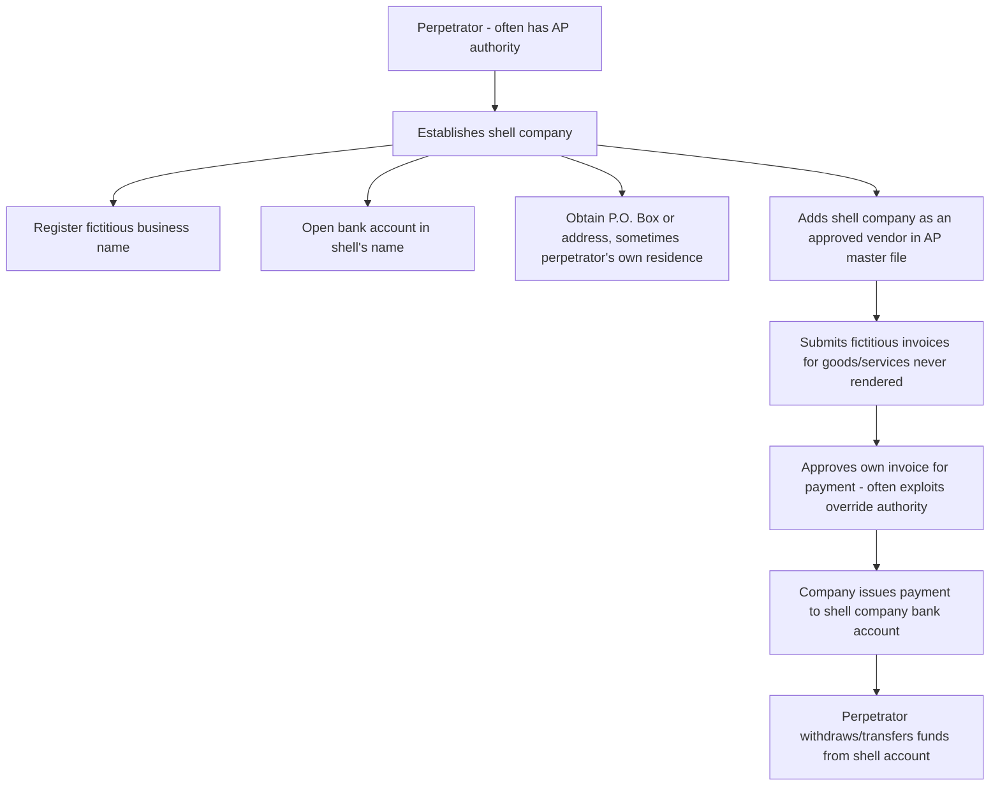

## Billing Schemes and Shell Company Fraud

### Conceptual Framework

Billing schemes are a category of fraudulent disbursement within the ACFE Fraud Tree in which the perpetrator causes the victim entity to issue a payment through the submission of false, altered, or fictitious invoices, purchase orders, or other billing documentation. Unlike cash larceny or skimming, billing schemes exploit the accounts payable (AP) disbursement cycle rather than the cash receipts cycle, and the fraudulent payment is typically made by check or electronic transfer through the entity's normal payment process — meaning the disbursement itself is properly authorized and recorded from the system's perspective, even though the underlying transaction is fictitious or inflated.

$$\text{Billing Fraud Loss} = \sum (\text{Fraudulent Invoice Amount} - \text{Legitimate Value Received})$$

Where legitimate value received is often zero (shell company schemes) or the difference between billed and fair value (overbilling schemes).

### The Three Principal Billing Scheme Categories

**1. Shell company schemes**

The perpetrator creates a fictitious entity (the "shell company") that has no real operations, employees, or legitimate business purpose beyond receiving fraudulent payments, then submits invoices for goods or services that are never actually delivered.

**Typical structure and lifecycle:**

**Key structural elements:**

- **Vendor master file manipulation:** Adding the shell company as an approved vendor, often using an address that matches or is closely associated with the perpetrator (a P.O. box, a residential address, or an address shared with another known vendor)
- **Invoice fabrication:** Creating invoices using commercially available templates or invoicing software, often for vague or hard-to-verify services (consulting, "maintenance," "professional services") rather than physical goods, since physical goods can be more easily verified through receiving reports
- **Self-approval or collusive approval:** The perpetrator either has sufficient authority to approve their own shell company's invoices for payment, or colludes with another employee in the approval chain (a "pass-through" scheme)
- **Rapid fund extraction:** Funds are typically moved out of the shell company's bank account quickly to avoid detection through bank account monitoring

**2. Non-accomplice vendor schemes (pay-and-return / overbilling with a real vendor)**

The perpetrator uses a legitimate, existing vendor (without that vendor's knowledge or complicity) to generate fraudulent payments:

- **Pay-and-return schemes:** Intentionally paying a legitimate vendor invoice twice, then intercepting and depositing the resulting duplicate/overpayment refund check
- **Overbilling via inflated invoice submission:** Altering a legitimate vendor's invoice (increasing the quantity or price) after receipt but before processing, and pocketing the excess

**3. Personal purchases through company accounts**

The perpetrator uses company funds, credit cards, or vendor accounts to purchase personal items, then processes the transaction as a legitimate business expense — a category that shades into expense reimbursement schemes but often flows through the AP/vendor process directly when purchases are made on open company accounts with existing vendors.

**4. Complicit vendor / collusive overbilling schemes**

Distinct from shell companies because a real vendor exists and knowingly participates:

- **Overbilling schemes with kickbacks:** The vendor knowingly inflates invoiced amounts (price, quantity, or both) and shares a portion of the excess payment back to the complicit employee — this scheme category overlaps substantially with corruption/kickback fraud
- **Bid-rigging in conjunction with overbilling:** A colluding vendor is awarded a contract at inflated terms because a company insider manipulated the procurement/bidding process on the vendor's behalf, in exchange for a kickback

### Shell Company Red Flags

**Vendor master file indicators:**

- Vendor address matches an employee's home address, or matches a P.O. box with no other corroborating business presence
- Vendor tax identification number is missing, invalid, or matches another vendor already in the system
- Vendor bank account routing information changes shortly after being added, or matches an account associated with a known employee
- Vendor was added to the master file by, and invoices are consistently approved by, the same individual
- Sequential or unusually clean invoice numbering (real businesses interacting with multiple customers typically show gaps and irregular sequencing; a shell company serving only one "customer" often shows suspiciously sequential invoice numbers)

**Transactional indicators:**

- Invoices for vague, hard-to-verify services (consulting, advisory, "general maintenance") rather than tangible, receivable goods
- No corresponding purchase order, receiving report, or evidence of competitive bidding for the purchase
- Round-dollar invoice amounts, or amounts consistently falling just under an approval-authority threshold (a strong indicator of deliberate structuring to avoid secondary review)
- High invoice volume/dollar concentration with a single vendor relative to that vendor's apparent size or industry norms
- Vendor has no online presence, no other identifiable customers, or cannot be independently verified through business registries

### Detection and Investigative Techniques

**1. Vendor master file analytics**

- Address-matching algorithms comparing the vendor master file against the employee master file (including former employee addresses) to surface undisclosed relationships
- Duplicate detection on tax ID numbers, bank account numbers, and phone numbers across vendor records
- Benford's Law analysis on invoice amounts to detect artificially constructed figures inconsistent with naturally occurring transaction populations

**2. Threshold/structuring analysis**

Statistical review of invoice amounts clustering just below approval authority limits — for example, if a manager's approval authority caps at $10,000, a disproportionate volume of invoices at $9,800–$9,999 from a single vendor is a strong structuring indicator.

**3. Three-way match testing**

Verifying that purchase order, receiving report, and vendor invoice all agree in quantity, price, and description before payment — the fundamental control this scheme category is specifically designed to circumvent, so testing for its consistent application (or documenting where it was bypassed) is central to the investigation.

**4. Independent verification of vendor existence**

- Confirming vendor legitimacy through secretary of state business registration searches, Dun & Bradstreet or equivalent business databases, and site visits where practical
- Contacting the vendor independently (using a phone number obtained from an independent source, not the number listed on the invoice itself, since a shell company's listed contact information routes directly back to the perpetrator)

**5. Segregation of duties testing**

Confirming whether the same individual can add a vendor, approve invoices for that vendor, and approve/release payment — the presence of all three capabilities in one role is the single most significant control weakness enabling shell company schemes.

### Internal Controls to Prevent and Detect Billing Fraud

**Preventive controls**

1. **Segregation of duties across the procure-to-pay cycle:** separating vendor master file maintenance, purchase requisition/approval, receiving, invoice approval, and payment disbursement/release into distinct roles
2. **Formal, competitive vendor onboarding process:** requiring documented business registration verification, tax ID (W-9/equivalent) validation, and a secondary independent approval before a new vendor is activated in the AP system
3. **Mandatory three-way matching** (purchase order, receiving report, invoice) enforced systematically before payment release, with exceptions requiring documented, elevated approval
4. **Approval authority matrices** with escalating dollar thresholds and periodic review of transactions clustering near threshold boundaries
5. **Positive pay and payment file controls** at the bank level to prevent unauthorized alterations to submitted payment batches

**Detective controls**

1. **Periodic vendor master file audits**, including address/bank account cross-matching against the employee database
2. **Data analytics on invoice populations:** trend analysis by vendor, Benford's Law screening, and duplicate payment detection software
3. **Surprise or rotating internal audit review of high-volume/high-dollar vendor relationships**, particularly service vendors where physical verification of delivery is inherently harder
4. **Whistleblower/anonymous tip mechanisms**, which the ACFE consistently identifies as the leading detection method across billing and other occupational fraud schemes generally [Inference: consistent pattern across multiple ACFE Report to the Nations cycles; specific percentage varies by survey year]

### Illustrative Example

A mid-level procurement manager at a manufacturing company has authority to approve vendor invoices up to $15,000 without secondary review. Over 18 months, the manager registers a shell company ("Apex Industrial Consulting LLC") using a P.O. box, opens a business bank account, and adds it to the vendor master file listing themselves as the internal contact. The manager then submits monthly invoices of $14,500 for "equipment maintenance consulting," consistently just under the approval threshold, with no corresponding purchase order or receiving documentation since the "service" is intangible. Total payments over the scheme period exceed $260,000.

**Detection occurred when:** an internal audit data analytics review flagged (a) a vendor whose invoice amounts clustered suspiciously close to, but never at or above, the $15,000 approval threshold, and (b) the same vendor's registered address matched a P.O. box the audit team cross-referenced against employee expense reimbursement records for the same manager. A subsequent independent business registry search found no legitimate operating history for the shell entity, and the manager could not produce any receiving evidence or work product for the "consulting services."

### Legal and Forensic Considerations

- Shell company schemes typically constitute both fraud (against the employer) and, depending on jurisdiction, may implicate money laundering statutes if proceeds are layered through multiple accounts
- Forensic accountants tracing shell company proceeds commonly apply the **indirect (net worth) method** where direct evidence of diversion is incomplete, comparing the perpetrator's known income sources against actual asset accumulation and expenditures over the scheme period
- Civil recovery actions often name both the perpetrator and, where evidence supports it, any complicit third-party vendor under theories of unjust enrichment, fraud, and civil conspiracy, in addition to any criminal referral

**Conclusion**

Billing schemes and shell company fraud exploit the accounts payable disbursement cycle by generating what appears, on its face, to be a properly authorized payment for a legitimate business expense — the fraud is embedded in the underlying document (a fictitious invoice) rather than in an improperly recorded or unauthorized transaction. This makes prevention dependent almost entirely on rigorous vendor onboarding controls, enforced segregation of duties across the procure-to-pay cycle (particularly separating who can add a vendor from who can approve payment to that vendor), and systematic three-way matching, while detection relies heavily on vendor master file analytics, threshold/structuring analysis, and independent third-party verification of vendor legitimacy — since the accounting records themselves, viewed in isolation, will typically appear internally consistent and properly authorized.

**Related Topics**

- Corruption schemes: kickbacks, bid-rigging, and conflicts of interest
- Check tampering and payroll disbursement fraud
- Vendor master file data analytics and continuous auditing techniques
- The indirect (net worth) method of proving illicit income
- Segregation of duties design across the procure-to-pay cycle
- Money laundering typologies: placement, layering, and integration
- Expense reimbursement fraud schemes
- ACFE Fraud Tree — full taxonomy of fraudulent disbursements