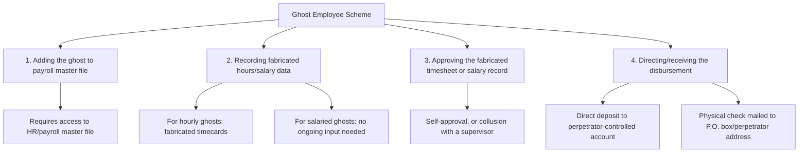

## Payroll and Expense Reimbursement Schemes

### Conceptual Framework

Payroll schemes and expense reimbursement schemes are two related but distinct categories of fraudulent disbursement under the ACFE Fraud Tree. Both exploit disbursement cycles that are designed to compensate legitimate employee activity (work performed, or business expenses incurred), and both typically flow through routine, systematized payment processes rather than one-off manual approvals — which is precisely what makes them harder to detect through simple transaction-level review and more dependent on aggregate/analytical detection methods.

$$\text{Fraud Loss} = \sum (\text{Amount Paid} - \text{Amount Legitimately Earned or Incurred})$$

### Payroll Schemes

**1. Ghost employee schemes**

The perpetrator adds a fictitious individual, or a real individual who does not actually work for the organization, to the payroll system, and payroll disbursements continue to be generated and diverted to the perpetrator.

**Four elements required for a ghost employee scheme to function:**

- **Fictitious person:** An entirely invented identity is added to the payroll system
- **Former employee retained on payroll:** A terminated or resigned employee is not removed from the active payroll master file, and their subsequent pay continues to be diverted (often the easiest ghost scheme to execute, since the "ghost" already has valid-looking historical payroll data and possibly a valid Social Security/Tax Identification Number on file)
- **Relative or associate of the perpetrator:** A real person who does no actual work is added and shares proceeds with (or unwittingly enables) the perpetrator
- **Direct deposit routing manipulation:** Redirecting a legitimate but dormant/inactive employee's direct deposit information to an account the perpetrator controls

**2. Falsified hours and salary schemes**

For hourly employees: falsifying timesheets or time-clock records to reflect hours not actually worked, or manipulating overtime calculations. For salaried employees: unauthorized salary increases entered directly into the payroll master file, often exploiting the same master-file access weakness as ghost employee schemes.

**3. Commission schemes**

Manipulating commission calculation inputs (sales figures, commission rates, or the commission basis itself) to generate inflated commission payments — for example, recording fictitious sales that are later reversed after the commission has been paid and disbursed, or altering the rate table applied to legitimate sales.

**4. Falsified wage schemes involving workers' compensation or benefits fraud**

Though sometimes classified separately, schemes involving fabricated workers' compensation claims or continued benefit payments to ineligible former employees share the same payroll-master-file access exploitation mechanism.

### Expense Reimbursement Schemes

**1. Mischaracterized expense reimbursements**

Submitting a legitimate receipt for a personal expense but characterizing it as business-related on the expense report — for example, submitting a family dinner receipt described as a "client dinner," or a personal trip described as business travel.

**2. Overstated expense reimbursements**

- **Altered receipts:** Physically or digitally altering a legitimate receipt to increase the dollar amount, tip amount, or quantity before submission
- **Overstated mileage claims:** Claiming more miles driven than actually traveled, or claiming mileage reimbursement using an inflated per-mile rate
- **Overstated per diem claims:** Claiming a full per diem allowance for days when actual expenses were lower, or when the trip did not occur as claimed

**3. Fictitious expense reimbursement schemes**

Submitting entirely fabricated expenses with no underlying transaction at all — using fraudulent, fake, or another person's receipts (sometimes obtained from discarded receipts of others) to support entirely invented business expenses.

**4. Multiple reimbursement schemes**

Submitting the same legitimate expense for reimbursement more than once — through duplicate submission to the same expense system, or by submitting the same expense to two different reimbursement channels (e.g., both a corporate card statement reconciliation and a separate manual expense report).

### Comparative Analysis

| Attribute | Ghost Employee (Payroll) | Expense Reimbursement Fraud |
| --- | --- | --- |
| Master data manipulated | HR/payroll master file (employee record) | Individual expense report submissions |
| Recurrence pattern | Often recurring, systematic (each pay period) | Can be one-off or recurring, depending on scheme sophistication |
| Documentation forged | Timecards, approval signatures, HR onboarding records | Receipts, mileage logs, per diem justifications |
| Typical perpetrator access needed | HR/payroll system access, or collusion with someone who has it | Expense approval authority, or a complicit/inattentive approver |
| Detection method | Payroll master file analytics, direct deposit account cross-matching | Expense report analytics, receipt verification, duplicate detection |

### Red Flags and Analytical Indicators

**Ghost employee indicators:**

- Employee master file records with missing standard onboarding documentation (no I-9/equivalent employment eligibility verification, no benefits enrollment, no performance reviews)
- Multiple employees sharing the same direct deposit bank account number, mailing address, or phone number
- Employee records with no deductions taken (no tax withholding elections, no benefit deductions) — often indicative of a hastily created fictitious record
- Employees who never take vacation, are never referenced in operational records/emails, or whose physical badge/system access logs show no activity
- Terminated employee records without a corresponding payroll termination date update

**Expense reimbursement indicators:**

- Expense reports consistently submitted just under a receipt-required threshold
- Receipts that are unusually legible/pristine relative to the claimed circumstances, or that show signs of digital alteration (font inconsistencies, misaligned totals)
- Round-dollar or suspiciously consistent daily expense amounts inconsistent with normal variability
- High concentration of expenses at the same vendor/location inconsistent with the claimed business purpose
- Mileage claims exceeding the actual distance between the stated origin and destination when independently verified (e.g., via mapping tools)
- Employees whose expense reimbursement totals significantly exceed peers in comparable roles/travel patterns

### Detection Techniques and Data Analytics

**1. Payroll master file analytics**

- Duplicate detection across direct deposit bank account numbers, Social Security/Tax ID numbers, and addresses across the entire employee population
- Comparing the payroll master file against independent HR records (organizational charts, badge access logs, benefits enrollment systems) to identify employees present in one system but not the other
- Reviewing payroll disbursements for employees with no corresponding time and attendance system activity

**2. Expense report analytics**

- Benford's Law analysis on expense amounts to detect artificially constructed figures
- Duplicate payment detection algorithms comparing expense reports for identical receipt images, dates, and amounts across submissions and time periods
- Statistical outlier analysis comparing individual employee expense totals and per-category spending against peer group norms
- Geographic/travel plausibility analysis: cross-referencing claimed business travel dates and locations against calendar systems, corporate travel booking records, and badge access logs (an employee claiming travel expenses while badge records show continuous on-site presence is a strong red flag)

**3. Vendor/receipt verification**

- Direct confirmation with vendors named on submitted receipts where fraud is suspected
- Digital forensic examination of submitted receipt images/PDFs for metadata inconsistencies or evidence of editing software use

### Internal Controls

**Preventive controls**

1. **Segregation of duties in payroll administration:** separating the function of adding/modifying employee master file records from the function of approving payroll runs and from the function of distributing pay (checks/direct deposit initiation)
2. **Mandatory independent verification for new hires:** requiring HR onboarding documentation (employment eligibility verification, tax withholding forms, benefits enrollment) before payroll activation, cross-checked by a party independent of the requesting manager
3. **Automated exception flagging in expense management systems:** requiring receipts above defined thresholds, flagging expenses submitted outside normal patterns, and enforcing policy limits systematically rather than relying solely on manual approver judgment
4. **Direct deposit change controls:** requiring independent verification (e.g., a confirmation call to the employee using contact information on file, not information provided with the change request) before processing any change to an employee's direct deposit routing/account information — a control specifically designed to prevent both ghost employee redirection and business email compromise-style payroll diversion

**Detective controls**

1. **Periodic, unannounced physical or virtual "headcount" verification** — comparing the payroll master file against a physical roll call, badge access system, or department head sign-off confirming every listed employee is a real, active worker
2. **Termination checklist enforcement** with independent follow-up confirmation that terminated employees are removed from active payroll within a defined period
3. **Manager-level expense report review training** focused specifically on recognizing altered receipts and implausible claims, combined with periodic audit sampling of approved expense reports regardless of approver sign-off
4. **Rotation of payroll administration duties** and mandatory vacation policies, consistent with the general principle that concealment-dependent schemes (ghost employees, ongoing expense padding) require continuous management by the same individual to remain hidden

### Illustrative Examples

**Ghost employee example:** A payroll administrator with sole authority over the HR/payroll master file adds a fictitious "part-time warehouse associate" to the system, using a relative's Social Security number obtained under the guise of a legitimate part-time hiring request. The administrator submits biweekly timesheets showing standard part-time hours and approves them without secondary review, since the administrator's role includes timesheet approval for hourly staff. Direct deposit is routed to a bank account the administrator controls. The scheme is detected when an internal audit headcount verification exercise cross-references the payroll master file against badge access records and finds no badge ever issued to, or access logged for, the "warehouse associate."

**Expense reimbursement example:** A regional sales manager submits monthly expense reports claiming client entertainment expenses at a specific restaurant, consistently just under the $75 receipt-required threshold, over an 18-month period. Data analytics review identifies that the manager's expense claims at that vendor occur with unusual regularity (nearly every reporting period, always between $65–$74) compared to peer managers, whose entertainment expense patterns show more natural variability. Direct confirmation with the restaurant finds no record of the claimed transactions on the relevant dates, revealing the receipts were fabricated using a common template.

### Legal and Forensic Considerations

- Ghost employee schemes involving fabricated identities may implicate identity theft statutes in addition to fraud and embezzlement charges, particularly where a real person's identity (a relative, or a stolen identity) was used without full knowledge of the scheme's fraudulent nature
- Expense reimbursement fraud recovery is often complicated by the relatively small individual transaction size, which historically led some organizations to under-invest in detection controls for this category — a gap that has driven the increasing use of automated, continuous expense analytics platforms rather than manual periodic review [Inference: general industry trend commonly cited in forensic accounting and internal audit practice literature, not a specific empirical finding]
- Both scheme categories are frequently identified through tips (from coworkers noticing an unfamiliar "employee" name, or a suspicious pattern in a colleague's expense submissions) more often than through routine transaction-level audit procedures, consistent with the general ACFE finding that tips are the leading detection method across occupational fraud categories

**Conclusion**

Payroll and expense reimbursement schemes share a common structural vulnerability: both exploit disbursement processes designed for routine, recurring, and individually small-dollar payments, which historically received less scrutiny per transaction than large one-off disbursements — making aggregate pattern detection (master file analytics, duplicate/outlier detection, and independent verification of underlying facts such as headcount or receipt authenticity) more effective than transaction-by-transaction manual review. Prevention depends on segregating master file maintenance from approval and disbursement authority, requiring independent verification at points of change (new hires, direct deposit modifications, expense submissions above threshold), and maintaining detective analytics capable of surfacing patterns — duplicate bank accounts, missing onboarding documentation, statistically anomalous expense claims — that individual approvers reviewing one transaction at a time are structurally unlikely to notice.

**Related Topics**

- Billing schemes and shell company fraud (comparative disbursement fraud category)
- Check tampering schemes (forged maker, forged endorsement, altered payee)
- ACFE Fraud Tree — full taxonomy of fraudulent disbursements
- Data analytics techniques in continuous auditing of payroll systems
- Identity theft and its intersection with occupational fraud
- Segregation of duties design across the HR-to-payroll cycle
- Whistleblower tip mechanisms and their role in fraud detection statistics
- Digital forensic examination of altered documents and receipts