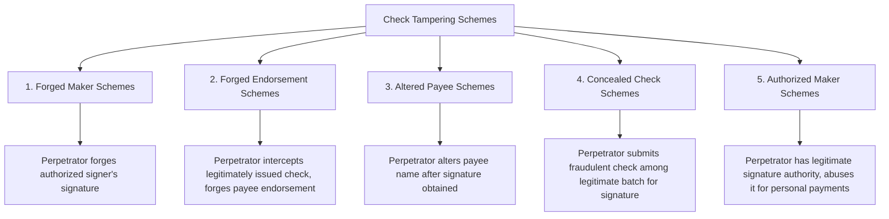

## Check Tampering Schemes

### Conceptual Framework

Check tampering is a category of fraudulent disbursement in which the perpetrator physically or electronically prepares, alters, or converts a company check to their own benefit, then causes that check to be recorded and processed through the organization's normal disbursement and bank reconciliation systems. It is distinguished from billing and payroll schemes by its mechanism: rather than deceiving the entity into approving a fraudulent liability, the perpetrator directly manipulates the *physical or electronic negotiable instrument itself* — the check — at some point in its preparation, signing, or negotiation.

Check tampering is generally considered the most damaging category of asset misappropriation on a per-scheme basis, because it typically requires either direct access to check stock and signature authority (often held by higher-level employees such as bookkeepers, controllers, or business owners with unsupervised access) or a sophisticated forgery capability, and detection frequently depends on comparing the physical check as cashed against the underlying accounting records — a resource-intensive reconciliation exercise. [Inference: relative severity ranking consistent with patterns reported in ACFE Report to the Nations survey cycles; specific median loss figures vary by survey year and should be verified against the current edition]

### The Five Principal Check Tampering Schemes

**1. Forged maker schemes**

The perpetrator, lacking legitimate signature authority, produces a check and fraudulently affixes or forges the signature of an authorized signer.

- **Manual forgery:** Physically signing an authorized signer's name, often practiced/copied from other documents bearing the genuine signature
- **Mechanical/digital forgery:** Using a signature stamp, digitized signature file, or check-printing software to reproduce an authorized signature without authorization
- **Blank check theft:** Stealing blank check stock and completing it fraudulently, sometimes bypassing the need to forge a signature if a rubber stamp or digital signature system is left unsecured

**2. Forged endorsement schemes**

The perpetrator intercepts a check that was legitimately prepared and signed by an authorized party (often payable to a legitimate vendor or payee), then forges that payee's endorsement to negotiate the check for their own benefit.

- Commonly involves intercepting outgoing mail before a legitimate vendor check is mailed
- May involve depositing the check into an account with a name deceptively similar to the legitimate payee (e.g., opening a bank account under a name nearly identical to a real vendor)

**3. Altered payee schemes**

The perpetrator obtains a properly authorized and signed check made out to a legitimate payee, then alters the payee designation after signature — either by physically or digitally changing the named payee to themselves or an accomplice, or by adding to an incomplete payee name (e.g., a check made out to "ABC" is altered to "ABC Enterprises, LLC," a shell entity the perpetrator controls).

- **Insertion:** Adding additional characters to a legitimately completed payee field
- **Erasure/chemical alteration:** Physically erasing or chemically removing ink from the original payee designation and replacing it
- **Electronic alteration:** In electronic check processing/positive pay environments, altering payee data in the file before transmission to the bank

**4. Concealed check schemes**

The perpetrator, who has legitimate check-signing responsibilities are held by someone *other* than the perpetrator, submits a fraudulent check for signature concealed among a batch of otherwise legitimate checks, relying on the authorized signer's lack of careful review of supporting documentation for each check in the batch — a scheme fundamentally dependent on weak or absent secondary review of supporting documentation (invoices, purchase orders) at the point of signature.

**5. Authorized maker schemes**

The perpetrator *has* legitimate check-signing authority (e.g., an owner, controller, or authorized officer) and directly writes company checks to themselves or to pay personal expenses, relying on their own authority rather than forgery or concealment. This is often the most difficult scheme to detect because no document forgery or interception is required — the fraudulent nature lies entirely in the business purpose (or lack thereof) of an otherwise properly authorized and processed transaction, making it functionally similar to management override of controls when perpetrated by senior individuals.

### Concealment Techniques

Because check tampering typically produces a discrepancy that would surface at bank reconciliation, concealment is central to scheme sustainability:

- **Re-alteration on return:** In pre-imaging banking environments, physically altering a returned canceled check back to reflect the original (legitimate) payee/amount before filing, so a subsequent review of physical checks would not reveal the fraud (largely obsolete with Check 21 imaging, but historically significant)
- **Miscoding the disbursement in the accounting system:** Recording the check in the general ledger under an account and description consistent with the original, legitimate purpose, so the recorded transaction appears unremarkable even though the actual negotiated check went elsewhere
- **Intercepting and reconciling the bank statement personally:** A perpetrator with access to both check-writing and bank reconciliation functions can identify and conceal discrepancies before anyone else reviews the statement — this is why segregation of duties between these two functions is considered a primary control
- **Rubber stamp/re-deposit schemes:** Depositing the fraudulently obtained check into an account and using intervening transactions to obscure the ultimate destination of funds

### Red Flags and Analytical Indicators

**Signature and physical document indicators:**

- Signatures on canceled checks that show inconsistencies in stroke pattern, pressure, or style compared to known authentic signatures
- Checks with evidence of alteration visible under magnification or specialized lighting (erasure marks, ink inconsistencies, font mismatches in the payee field)
- Missing or out-of-sequence check numbers in the check register

**Behavioral and process indicators:**

- The same individual has access to blank check stock, signature authority (or a signature stamp), and bank reconciliation responsibilities
- An employee resists taking vacation or insists on personally handling bank reconciliation despite the availability of other qualified staff
- Checks payable to employees, or to entities whose names are deceptively similar to legitimate vendors
- Voided checks that cannot be physically located/produced for inspection
- Bank statements or images that are diverted directly to a single individual rather than routed through independent mail handling

**Data analytics indicators:**

- Checks payable to "Cash" or bearer instruments, which lack a clear payee to independently verify
- Gaps in sequential check numbering in the disbursement register without a documented voided-check explanation
- Statistical comparison of check amounts against invoice/purchase order amounts on file, flagging discrepancies

### Detection Techniques

**1. Bank reconciliation performed independently**

The single most important detective control: bank reconciliation performed by someone with no involvement in check preparation, signature authority, or accounts payable processing, comparing every cleared check image against the disbursement register for payee name, amount, and endorsement consistency.

**2. Forensic document examination**

- Comparing questioned signatures against multiple known authentic exemplars using forensic document examiner techniques (stroke analysis, pressure patterns, letter formation)
- Examining check images for evidence of alteration (font inconsistencies in the payee line, misaligned printing, chemical alteration residue on physical originals where available)
- Reviewing endorsement stamps/signatures on the back of cleared checks against the named payee's actual signature or endorsement practices

**3. Positive pay and reverse positive pay programs**

Bank-level controls in which the company transmits a file of issued checks (number, payee, amount) to the bank, and the bank flags any presented check that does not match — specifically designed to detect forged maker and altered payee schemes at the point of presentment rather than after the fact.

**4. Data analytics on the disbursement population**

- Sequential check number gap analysis
- Payee name matching against the employee master file and known related-party lists
- Statistical review of check amounts, particularly round-dollar amounts or amounts inconsistent with the stated business purpose

**5. Vendor/payee confirmation**

Independently confirming with vendors that checks recorded as issued to them were actually received and deposited into their own legitimate accounts, which can surface forged endorsement schemes where a check was intercepted before reaching the real vendor.

### Comparative Summary Table

| Scheme | Perpetrator's Legitimate Authority | Point of Manipulation | Primary Detection Method |
| --- | --- | --- | --- |
| Forged maker | None (no signature authority) | Signature itself | Signature comparison, positive pay |
| Forged endorsement | None over the specific check | Endorsement (back of check) | Vendor confirmation, endorsement review |
| Altered payee | None over payee designation | Payee field, after legitimate signature | Payee name matching, physical examination |
| Concealed check | None (signature held by another) | Submission process (hidden in batch) | Independent review of supporting documents at signature |
| Authorized maker | Full, legitimate signature authority | Business purpose/justification | Segregation of duties, independent reconciliation, expense purpose review |

### Internal Controls

**Preventive controls**

1. **Segregation of duties:** separating check preparation, signature authority, bank reconciliation, and mail handling into distinct roles held by different individuals, with no single person controlling more than one function
2. **Physical security over check stock:** blank checks stored in a locked, access-controlled location with a log of stock usage, and pre-numbered check stock reconciled to usage records
3. **Dual signature requirements** for checks above a defined dollar threshold, requiring two independent authorized signers who each review supporting documentation
4. **Positive pay enrollment** with the company's bank, with exceptions requiring active investigation before payment release
5. **Restriction against checks payable to "Cash" or bearer**, and policies prohibiting checks payable to employees outside of standard payroll processing

**Detective controls**

1. **Bank statements and check images delivered directly to, and reconciled by, someone independent of the disbursement process** (ideally with statements delivered unopened to that independent party, or accessed directly via online banking by that party rather than routed through the AP function)
2. **Periodic surprise audit of the check register against physical/imaged canceled checks**, verifying payee, amount, authorized signature, and supporting documentation for a sample of disbursements
3. **Mandatory vacation and job rotation policies** for individuals with check-signing or reconciliation responsibilities
4. **Vendor confirmation programs** periodically verifying that recorded disbursements match what vendors report as received

### Illustrative Examples

**Forged maker example:** A bookkeeper at a small nonprofit, who has access to check stock but lacks signature authority, uses a signature stamp normally reserved for the executive director (left unsecured in an unlocked desk drawer) to sign checks payable to a personal credit card company. Because the bookkeeper also performs the monthly bank reconciliation, the fraudulent checks are coded in the accounting system as legitimate operating expenses, concealing the scheme for over a year until a new board treasurer requested a segregation of duties review and found the reconciling bookkeeper had sole check-stock and stamp access.

**Altered payee example:** An accounts payable clerk with access to signed, outgoing vendor checks intercepts a check made out to "Metro Supply Co" before mailing, and using check-alteration techniques adds "/ J. Martinez" to the payee line (the clerk's own name), then deposits the check into a personal account at a bank that does not carefully scrutinize the altered payee designation. The scheme is detected when Metro Supply Co. contacts the company regarding a past-due invoice that the company's records show as already paid, prompting a review of the canceled check image, which reveals the visible alteration.

### Legal and Forensic Considerations

- Check tampering typically constitutes forgery and/or uttering a forged instrument under state criminal statutes, in addition to embezzlement/larceny charges, and may separately implicate federal bank fraud statutes (18 U.S.C. § 1344) when the scheme involves a federally insured financial institution
- Forensic document examiners (often engaged as expert witnesses) apply specialized techniques including handwriting/signature comparison, examination of check paper and ink under alternate light sources, and analysis of digital check images for evidence of manipulation
- Recovery is often complicated where funds have been negotiated and dispersed quickly (cashed rather than deposited, or rapidly transferred out of a receiving account), making the timing of detection and asset freezing critical to recovery prospects
- Under the Uniform Commercial Code (UCC), banks may bear liability for paying over a forged endorsement or a check with a forged drawer's signature in certain circumstances, which is a relevant civil recovery avenue in addition to pursuing the perpetrator directly [Behavior may vary based on specific UCC adoption/jurisdiction, bank policies, and the specific facts establishing negligence or comparative fault]

**Conclusion**

Check tampering is distinguished from other fraudulent disbursement categories by its direct manipulation of the negotiable instrument itself, and its five principal forms — forged maker, forged endorsement, altered payee, concealed check, and authorized maker schemes — map to five distinct points in the check lifecycle where legitimate authority or process integrity can be subverted. Because these schemes are typically committed by individuals with meaningful access to check stock, signature mechanisms, or (in authorized maker schemes) genuine signature authority, the primary defense is structural rather than document-level: segregation of duties separating check preparation, signing, and reconciliation, combined with independent bank reconciliation and positive pay controls, addresses the root vulnerability more reliably than after-the-fact document examination, which — while forensically valuable for investigation and prosecution — is inherently a detective rather than preventive response.

**Related Topics**

- Management override of internal controls (overlaps with authorized maker schemes)
- Billing schemes and shell company fraud
- Payroll and expense reimbursement schemes
- Positive pay and reverse positive pay banking controls
- Forensic document examination techniques (handwriting, ink, and alteration analysis)
- Segregation of duties design in the cash disbursement cycle
- Uniform Commercial Code provisions on forged instruments and bank liability
- ACFE Fraud Tree — full taxonomy of fraudulent disbursements