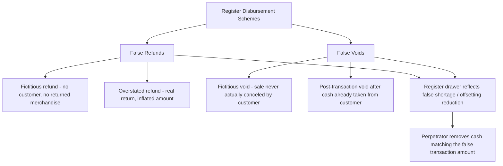

## Register Disbursement Schemes

### Conceptual Framework

Register disbursement schemes are a category of fraudulent disbursement in which the perpetrator uses a cash register (or point-of-sale terminal) to process a fraudulent transaction that causes cash to be removed from the register, distinguishing this scheme from cash larceny and skimming because the removal is accomplished *through* a register-recorded transaction rather than by simply pocketing unrecorded cash (skimming) or removing already-recorded cash without any offsetting entry (larceny). The register transaction itself — a false refund or false void — is the mechanism of theft, and it produces its own (fraudulent) supporting documentation in the form of a register tape or system-generated transaction record.

This is the key conceptual distinction from the other cash-related schemes covered in this chapter:

$$\text{Skimming: cash never recorded} \qquad \text{Larceny: cash recorded, then removed with no offsetting entry} \qquad \text{Register Disbursement: cash removed via a false offsetting transaction}$$

Because a register disbursement scheme generates a transaction record (a refund receipt, a void slip), it superficially appears to be a legitimate, documented, and authorized removal of cash — the fraud lies in the falsity of the underlying business event the transaction purports to represent, not in the absence of documentation.

### The Two Principal Register Disbursement Schemes

**1. False refund schemes**

The perpetrator processes a refund transaction in the register system without an actual corresponding customer return, then removes cash from the drawer equal to the fraudulent refund amount.

- **Fictitious refund schemes:** No customer transaction underlies the refund at all — the perpetrator simply keys in a refund for a fictitious sale (sometimes using a genuine prior transaction receipt found in the trash or reused from an earlier legitimate sale) to justify the register entry, then pockets cash equal to the refunded amount
- **Overstated refund schemes:** An actual customer return occurs, but the perpetrator records a refund amount greater than what was actually owed to the customer, paying the customer the correct (lower) amount and keeping the difference
- **Credit card refund schemes:** Processing a fraudulent refund to a credit card the perpetrator controls (their own card, or an accomplice's card) rather than removing physical cash, converting the register disbursement into a personal credit — often harder to detect immediately since no physical cash shortage is created at the drawer level, but detectable through credit card statement/merchant processor reconciliation

**2. False void schemes**

The perpetrator records a legitimate sale, collects payment from the customer in the normal course, and then processes a void transaction to cancel the sale in the system after the customer has left, removing cash equal to the voided amount from the drawer while the merchandise has already been sold and the cash already collected.

- Requires (or exploits the absence of) the merchandise/receipt normally required to substantiate a legitimate void
- Frequently exploits register systems where void authority is not restricted to supervisors, or where supervisor override codes are shared/known by non-supervisory staff
- Can be executed in real time (voiding the transaction between customer payment and the customer leaving, if register workflow allows privacy) or after the fact using system access to reverse a previously closed transaction

### Structural Requirements and Exploited Weaknesses

**Key Points**

- Both schemes depend on inadequate segregation between the ability to process the register transaction and the ability to authorize/approve it — specifically, whether refund/void authority is restricted to management or requires independent review
- Both schemes depend on the absence (or non-enforcement) of a requirement for supporting physical evidence — a returned item for refunds, a canceled receipt/reason code for voids — before the register accepts the transaction
- Register disbursement schemes are generally executed by employees with direct, unsupervised access to the register drawer, most commonly cashiers, sales associates, or shift supervisors
- Unlike shell company or check tampering schemes, register disbursement schemes typically involve comparatively small individual-transaction amounts but can accumulate significant losses through repetition across many shifts, which is why aggregate/pattern-based detection is generally more effective than single-transaction review [Inference: general pattern consistent with the small-dollar, high-frequency nature of register-level schemes broadly discussed in fraud examination literature]

### Detection Techniques and Data Analytics

**1. Refund and void rate analysis**

Comparing each employee's or register's refund/void rate (as a percentage of total transactions or total sales dollars) against a benchmark derived from peer employees, other registers, or historical norms for that location — a statistically elevated rate for a single individual, particularly one whose refund/void activity clusters around their own shifts, is the primary quantitative red flag.

**2. Time-of-transaction analysis**

Reviewing the time-stamp pattern of voids and refunds relative to the original sale transaction and relative to shift timing — for example, voids concentrated near shift-end (when cash-out and drawer reconciliation are about to occur) or refunds processed during unusually quiet periods with no observed customer traffic (cross-referenced against video surveillance timestamps where available).

**3. Supervisor override code analysis**

Where refund/void authority requires a supervisor override code, reviewing which employee's transactions are most frequently associated with a given supervisor's override code, and whether that supervisor was actually present/working during the transaction's timestamp — shared or compromised override codes are a common enabling weakness.

**4. Missing documentation review**

Sampling refund and void transactions and verifying the existence of required supporting documentation — the actual returned merchandise (matched by SKU/description to the original sale), a customer signature, or a documented reason code — with an emphasis on transactions lacking any of these.

**5. Register tape / transaction log reconciliation**

Comparing the register's electronic transaction log (which typically cannot be altered after the fact in modern POS systems, unlike older mechanical registers) against the physical cash count at shift close, and specifically examining any discrepancy between the "net sales" figure (after refunds/voids) and the cash actually present.

**6. Video surveillance correlation**

Where available, correlating register transaction timestamps for flagged refund/void activity against video footage to verify whether a customer was actually present and a physical return of merchandise occurred.

### Red Flags Checklist

| Category | Indicator |
| --- | --- |
| Volume/frequency | Employee's refund or void count/dollar volume significantly exceeds peer average |
| Timing | Refunds/voids concentrated near shift-end or during low-traffic periods |
| Documentation | Refunds/voids processed without returned merchandise, customer signature, or reason code |
| Authorization | Void/refund transactions using a supervisor override code when that supervisor was not present |
| Transaction pattern | Repeated refunds to the same dollar amount, or refunds just under a supervisor-approval threshold |
| Physical evidence | Register tape shows a sale followed almost immediately by a void for the identical amount |
| Customer contact | No customer contact information captured for "returns," where policy would normally require it |

### Internal Controls

**Preventive controls**

1. **Restricting refund and void authority to supervisors/managers**, with a supervisor physically required to enter an override code or use a separate authorization key/credential for every refund or void transaction
2. **Mandatory supporting documentation policy**, requiring the returned item (matched to the original sale record), a customer signature, and a stated reason code before any refund is processed in the system
3. **System-enforced controls** preventing voids on transactions after a defined time window has elapsed since the original sale, or requiring dual authentication (cashier plus supervisor credential) for any post-close reversal
4. **Individual register/cashier login credentials** (not shared passwords or generic terminal logins), ensuring every transaction is attributable to a specific individual for analytical purposes

**Detective controls**

1. **Daily or per-shift exception reports** automatically generated by the POS system, flagging refund/void transactions above a threshold, transactions using override codes, and transactions with no linked original sale
2. **Surprise cash counts and drawer reconciliations** performed by someone independent of the cashier being tested, at unpredictable intervals
3. **Periodic mystery shopper programs** designed to test whether return/refund policies (documentation, supervisor involvement) are actually being followed in practice
4. **Trend analysis reporting to loss prevention/internal audit** on a recurring basis, specifically tracking refund/void rates by employee and by location over time to identify emerging outliers

### Illustrative Example

A retail cashier at a clothing store processes an average of 40 sales transactions per shift with a typical refund rate of under 1%. Over a three-month period, data analytics review flags that this cashier's refund rate has risen to 6%, nearly all processed during the final 30 minutes of their shift, using a supervisor override code belonging to a manager who, cross-referenced against the shift schedule, was not present in the store during several of the flagged transactions. Physical inventory reconciliation for the affected SKUs shows no corresponding increase in returned merchandise on the shelves. Investigation reveals the cashier had obtained the override code by observing a manager enter it during a busy period months earlier, and had been processing fictitious refunds and pocketing the equivalent cash, totaling approximately $3,200 over the period before detection.

**Conclusion**

Register disbursement schemes occupy a distinct niche among cash-related frauds because the theft is accomplished through a transaction that the system itself records and treats as a legitimate business event — a refund or a void — rather than through an unrecorded removal (skimming) or an unexplained shortage (larceny). This makes the falsity of the underlying business justification, not the absence of documentation, the核心 fraud element, and correspondingly shifts the primary control emphasis toward restricting refund/void authorization to supervisory personnel, enforcing documented substantiation requirements, and using statistical rate-based analytics (refund/void frequency benchmarking, timing analysis, override code correlation) to surface individual outliers within what is otherwise a high-volume, low-individual-dollar transaction population that would be impractical to review transaction-by-transaction.

**Related Topics**

- Cash larceny and skimming schemes (comparative cash misappropriation categories)
- Billing schemes and shell company fraud
- Segregation of duties design in retail/point-of-sale environments
- Data analytics and continuous monitoring in loss prevention programs
- Surprise cash count and cash drawer reconciliation procedures
- Video surveillance correlation techniques in fraud investigation
- ACFE Fraud Tree — full taxonomy of fraudulent disbursements
- Mystery shopper and compliance testing program design