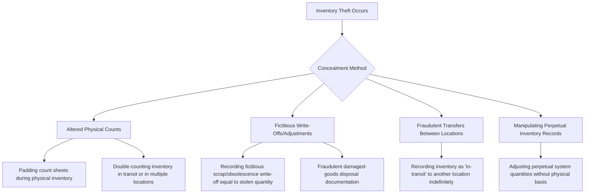

## Inventory Theft and Concealment Methods

### Conceptual Framework

Inventory (and other non-cash asset) misappropriation is the second major branch of the ACFE Fraud Tree's asset misappropriation category, distinguished from cash schemes by the nature of the asset stolen and, critically, by the mechanics of concealment: because inventory is a physical, countable asset, its theft creates a quantity discrepancy that will eventually surface through a physical count unless actively concealed through the accounting records, the count process itself, or fraudulent documentation of an offsetting (fictitious) reduction.

$$\text{Book Inventory} - \text{Physical Inventory} = \text{Shrinkage}$$

Shrinkage has multiple causes (breakage, spoilage, administrative error, and legitimate write-offs, in addition to theft), which is precisely what gives inventory theft schemes their concealment opportunity — theft can be disguised as, or blended into, a category of loss the organization already expects and tolerates to some degree.

### Methods of Inventory Theft (Larceny)

**1. Asset requisitions and transfers**

Using seemingly legitimate internal paperwork — a materials requisition, an inter-branch transfer form, or a job cost allocation — to move inventory out of the normal custody chain and into the perpetrator's control, exploiting the fact that internal transfers are often subject to less scrutiny than external sales.

**2. False sales and shipping schemes**

- **Fictitious sales with fraudulent shipping documents:** Creating a fake sales order and shipping document for a customer (real or fictitious, often an accomplice), causing legitimate warehouse/shipping personnel to release real inventory believing it to be a genuine sale, while payment is never received or is diverted
- **Short shipments with full billing:** Shipping less inventory than the invoice/packing slip states, while the customer is billed (and the internal system credited) for the full quantity, with the perpetrator diverting the shortfall
- **Fraudulent shipments to a colluding "customer":** Full quantities are correctly shipped and billed to a real customer, but the customer never pays and is controlled by, or complicit with, the perpetrator, with the arrangement disguised as a normal (if ultimately uncollectible) sale

**3. Purchasing and receiving schemes**

- **False receiving reports:** Recording a full quantity as received into inventory when the perpetrator (in collusion with, or acting as, the receiving employee) has actually diverted part of the shipment before it is logged
- **Purchasing schemes for personal use:** Ordering inventory or supplies through the company's normal purchasing channel, then diverting the delivered goods for personal use or resale, while the company incurs the cost

**4. Direct theft (larceny) from inventory**

Simple physical removal of inventory from a warehouse, storeroom, retail floor, or in transit, without any accompanying paperwork at all — the most basic form, often committed by employees with unsupervised physical access and no immediate documentation trail, relying entirely on the gap between the theft and the next physical count for a window of non-detection.

### Concealment Methods

Concealment is the more analytically interesting half of inventory fraud because the theft mechanism (however it occurred) will surface as shrinkage unless a specific concealment technique is used to explain, disguise, or prevent discovery of the resulting quantity discrepancy.

**1. Altered physical inventory counts**

- **Count sheet padding:** During the physical count, deliberately recording a higher quantity on the count sheet than what is physically present, so the recorded ending inventory matches the (overstated) book figure and no discrepancy is flagged
- **Double-counting:** Counting the same physical inventory twice — for example, at two different storage locations when the goods have actually already been moved, or including inventory in transit at both the shipping and receiving location simultaneously
- **Empty box/container schemes:** Arranging empty boxes, containers, or displays to appear as if they contain inventory during a count, common in warehouse or retail environments where a full visual count of every unit is impractical
- **Excluding counted areas from the audit scope:** Directing auditors or count teams away from a specific storage area (claiming it is a different classification, off-limits for safety reasons, or already counted) to avoid the discrepancy from surfacing during that area's count

**2. Fictitious or inflated write-offs**

Recording a write-off for scrap, spoilage, obsolescence, or damaged goods in an amount that corresponds to (and explains away) the quantity actually stolen, rather than an amount reflecting genuine loss — this is a particularly effective concealment method because organizations expect and budget for a certain level of legitimate write-offs, making a modestly inflated write-off difficult to distinguish from normal business loss without granular investigation.

**3. Fraudulent transfers between locations**

Recording inventory as having been transferred to another branch, warehouse, or in-transit status, when in fact it was stolen — the "transfer" creates an accounting entry that removes the item from the originating location's book without immediately triggering a shortage investigation, since the receiving location may not reconcile in-transit items promptly, or the "transfer" may simply never be followed up if inter-location reconciliation is weak.

**4. Manipulating perpetual inventory system records**

Where a perpetual inventory system is in use, directly adjusting recorded quantities (through an inventory adjustment transaction type) without a corresponding physical basis, exploiting weak controls over who can post manual inventory adjustments outside the normal sale/receipt transaction flow.

**5. Manipulating the cost/valuation side (adjacent to, but distinct from, quantity theft)**

While not theft of the physical unit itself, understating the standard cost or unit valuation applied to inventory can mask the dollar impact of a quantity shortage even when the unit count discrepancy is eventually noticed, by making the dollar variance appear immaterial.

### Detection Techniques

**1. Statistical and analytical shrinkage review**

- Comparing shrinkage rates by location, product line, and time period against company-wide and industry benchmarks, since shrinkage should generally exhibit a stable, explainable pattern — an unexplained spike or a persistent outlier location is the primary quantitative signal
- Gross margin analysis: an unexplained decline in gross margin for a specific product line or location, without a corresponding change in pricing or cost structure, can indicate inventory being sold off-book (skimming) or physically removed without a corresponding sale being recorded at all

**2. Physical inventory observation procedures (auditor/forensic perspective)**

- Performing independent test counts during the physical inventory, selected both from the count sheets back to the floor and from the floor back to the count sheets (a bidirectional test designed to catch both overstatement and understatement)
- Observing the count process itself for indicators of manipulation — count teams that are not independent of warehouse custodial staff, areas excluded from the count without adequate justification, or unusual timing/access restrictions imposed on the count team
- Reviewing cutoff procedures at period-end to ensure goods in transit are recorded in only one location, not both (or neither)

**3. Perpetual inventory and transaction analytics**

- Reviewing manual inventory adjustment transactions for frequency, dollar magnitude, and the identity of the individual posting them, particularly adjustments made outside normal sale/receipt processing
- Reconciling perpetual system quantities against periodic cycle counts on a rotating basis (rather than relying solely on an annual physical count) to narrow the detection window
- Reviewing "in-transit" inventory aging — items that have remained in transit status for an extended period without resolution are a red flag for either a fraudulent transfer concealment scheme or, at minimum, a control weakness being exploited

**4. Receiving and shipping documentation testing**

- Matching receiving reports against purchase orders and vendor invoices (three-way match) for quantity discrepancies
- Independent confirmation with customers regarding quantities actually received, compared against internal shipping records, to detect short-shipment-with-full-billing schemes
- Reviewing the segregation of duties between the individual who physically receives/ships goods and the individual who records the corresponding transaction in the accounting system

**5. Surveillance and access control review**

- Reviewing physical access logs (badge access, warehouse entry/exit logs) for patterns inconsistent with an employee's normal role or shift
- Video surveillance review correlated against inventory movement timestamps in high-value or high-shrinkage areas

### Red Flags Checklist

| Category | Indicator |
| --- | --- |
| Shrinkage pattern | Unexplained spike or persistent outlier shrinkage rate at a specific location or product line |
| Write-offs | Increasing trend in scrap/obsolescence write-offs without a corresponding operational explanation |
| Transfers | Inventory items remaining in "in-transit" status for an extended, unresolved period |
| Access/segregation | Same individual responsible for physical custody, receiving, and recording of inventory |
| Count process | Count areas excluded from physical inventory scope without adequate justification |
| Margin | Declining gross margin for a specific product line/location with no pricing or cost explanation |
| Adjustments | High-frequency or high-dollar manual perpetual inventory adjustments by a single individual |

### Illustrative Example

A distribution company's internal audit team notices that one regional warehouse consistently reports shrinkage rates roughly triple the company average, attributed each year to "obsolescence write-offs" for a specific product category. Investigation reveals the warehouse manager has been directing the shipment of legitimate inventory to a colluding "customer" (a business entity registered under a relative's name) without collecting payment, then recording the resulting inventory reduction as an obsolescence write-off rather than a bad-debt sale, since a write-off does not generate the same accounts-receivable aging scrutiny that an unpaid sale eventually would. Analytical review comparing the write-off documentation (which lacked photographic evidence or third-party disposal records required by policy) against the unusually consistent product category and dollar range of the write-offs over multiple years led to the scheme's discovery.

### Internal Controls

**Preventive controls**

1. **Segregation of duties** separating physical custody of inventory, the recording of inventory transactions, and authorization of adjustments/write-offs/transfers into distinct roles
2. **Physical security controls** — restricted warehouse access with badge/key logging, perimeter security, and camera coverage over high-value storage areas
3. **Formal write-off and adjustment authorization policy** requiring documented evidence (photographs, third-party disposal certificates, supervisory sign-off) before any inventory write-off is recorded, with dollar-threshold escalation for larger write-offs
4. **Cycle counting programs** performed on an unpredictable, rotating basis by personnel independent of the location's regular custodial staff, rather than relying solely on an annual physical count

**Detective controls**

1. **Independent physical inventory observation** by internal audit or external auditors, including bidirectional test counts and unannounced/surprise count timing where feasible
2. **Ongoing shrinkage and margin analytics** reviewed by a function independent of location management, benchmarked across comparable locations/product lines
3. **In-transit inventory aging reports** reviewed regularly to identify unresolved transfers
4. **Perpetual inventory adjustment audit trail review**, specifically flagging adjustments made by individuals who also have physical custody responsibilities

**Conclusion**

Inventory theft schemes are inseparable from their concealment mechanism in practical investigative terms, because the physical, countable nature of inventory means that theft alone is self-revealing at the next count — the fraud only becomes sustainable when paired with a technique (count manipulation, fictitious write-offs, fraudulent transfers, or perpetual record manipulation) that either prevents the discrepancy from surfacing or disguises it as an expected, tolerated category of loss such as shrinkage or obsolescence. Effective detection accordingly focuses less on catching the physical removal itself, which is rarely observed directly, and more on statistical and analytical review of the patterns concealment techniques leave behind: anomalous shrinkage rates, unexplained write-off trends, aging in-transit balances, and manual adjustment activity concentrated among individuals who also hold physical custody — reinforcing why segregation of duties between custody, recording, and authorization remains the foundational preventive control across this entire fraud category.

**Related Topics**

- Misuse and theft of non-inventory fixed assets and equipment
- ACFE Fraud Tree — full taxonomy of asset misappropriation (inventory and other assets branch)
- Physical inventory observation procedures under auditing standards (AU-C 501 / AS 2510)
- Cycle counting methodologies and perpetual inventory system controls
- Data analytics for shrinkage and margin trend analysis
- Segregation of duties design in the receiving, custody, and shipping cycle
- Corruption schemes involving colluding customers and vendors
- Cost accounting valuation manipulation as a concealment adjunct