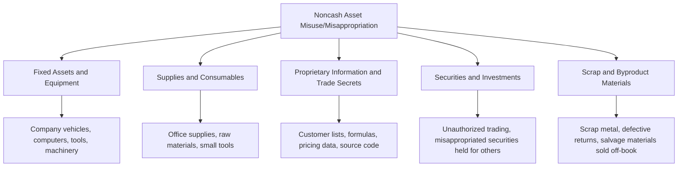

## Misuse and Misappropriation of Noncash Assets

### Conceptual Framework

Misuse and misappropriation of noncash assets is the ACFE Fraud Tree branch covering the unauthorized use or theft of company property other than cash and inventory — a broad category encompassing equipment, supplies, fixed assets, proprietary information, and intangible assets. It shares conceptual DNA with inventory theft (both involve physical or intangible non-cash property and require concealment against a discrepancy that would otherwise surface through accounting records or periodic verification) but differs in scope, since it captures a wider and often less systematically tracked class of assets than merchandise inventory.

The ACFE distinguishes two severity tiers within this branch:

$$\text{Misuse} = \text{Unauthorized temporary use without permanent deprivation} \qquad \text{Misappropriation} = \text{Outright theft/permanent deprivation of the asset}$$

This distinction matters because misuse (e.g., using a company vehicle for a personal weekend trip) is often treated as a policy violation or minor infraction rather than fraud in the strict sense, while misappropriation (permanently taking company equipment) constitutes theft/embezzlement — though the line between the two frequently blurs in practice, and misuse can be a precursor or gateway behavior to eventual misappropriation. [Inference: gateway/precursor relationship is a commonly discussed behavioral pattern in fraud examination and criminology literature, not a deterministic finding]

### Categories of Noncash Assets Subject to Misuse/Misappropriation

**1. Misuse of fixed assets and equipment**

Unauthorized personal use of company-owned property — vehicles, computers, tools, machinery, or facilities — without necessarily removing the asset permanently. Common examples include using a company vehicle for personal errands, using company equipment to run a side business, or using company computing resources for unauthorized personal or commercial purposes.

**2. Misappropriation (outright theft) of fixed assets and equipment**

Permanent removal of company property for personal use or resale — laptops, tools, machinery components, or furniture physically taken off company premises and not returned, often disguised through the same concealment techniques applicable to inventory (fictitious disposal/scrap documentation, altered fixed asset registers).

**3. Theft of supplies and consumables**

Lower-value, high-frequency theft of items such as office supplies, raw materials, or small tools — individually immaterial but capable of accumulating into a significant aggregate loss over time, and often under-monitored precisely because of their low unit value.

**4. Theft of proprietary information and trade secrets**

Misappropriation of intangible assets — customer lists, pricing strategies, product formulas, source code, or strategic plans — typically for the perpetrator's personal benefit (starting a competing business) or for sale/transfer to a competitor. This category increasingly overlaps with cybersecurity and data loss prevention concerns given the digital storage and transmissibility of most modern proprietary information.

**5. Misappropriation involving securities**

Applicable primarily in financial services, investment management, or fiduciary contexts: unauthorized trading in client accounts, diverting securities or investment proceeds held in a custodial or fiduciary capacity, or misusing margin/leverage against assets not belonging to the perpetrator.

**6. Scrap and byproduct sales schemes**

Diverting the proceeds from the legitimate sale of scrap materials, salvage, or byproducts (e.g., scrap metal from a manufacturing process) that the organization does not track with the same rigor as finished goods inventory, since scrap value is often treated as immaterial or is not separately accounted for at all.

### Concealment Methods

Concealment techniques for noncash assets largely mirror those used for inventory, adapted to the specific asset class:

**1. Fixed asset register manipulation**

- Failing to remove disposed or stolen assets from the fixed asset register, so depreciation continues to be recorded on an asset no longer in the company's possession, delaying detection until a physical asset verification exercise occurs
- Recording a fictitious disposal (sale, scrapping, or trade-in) for an asset that was actually stolen, often supported by fabricated disposal documentation

**2. Approval and documentation manipulation**

- Obtaining approval for personal use of an asset under false pretenses (e.g., claiming a business purpose for a company vehicle trip that was actually personal)
- Fabricating maintenance, repair, or usage logs to obscure a pattern of unauthorized personal use

**3. Data exfiltration concealment (proprietary information)**

- Using personal email accounts, removable storage media, or cloud storage services to transfer proprietary data outside company systems, often timed shortly before resignation/termination
- Deleting or attempting to delete activity logs and access records after exfiltration

**4. Scrap/byproduct concealment**

- Underreporting the quantity or grade of scrap material generated, then selling the "unreported" excess for personal benefit
- Directing scrap buyers to pay the perpetrator directly (in cash or to a personal account) rather than remitting payment to the company

### Detection Techniques

**1. Fixed asset verification and tagging programs**

Periodic physical inventory of fixed assets, matching asset tags against the fixed asset register, specifically testing for assets recorded as active but not physically located, and for physically present assets not recorded in the register at all (indicating either an unrecorded acquisition or a previously stolen-and-replaced item).

**2. Usage and access log analysis**

- Reviewing vehicle telematics/GPS data, fuel card usage patterns, and mileage logs against claimed business purposes and work schedules to identify inconsistent personal-use patterns
- Reviewing IT access logs, data transfer volumes, and endpoint activity (USB device connections, cloud upload activity, personal email usage) for anomalous patterns, particularly around employee resignation/termination dates

**3. Fixed asset disposal documentation review**

Auditing disposal transactions for adequate supporting documentation (sale agreement, scrap certificate, trade-in record) and verifying that disposal proceeds recorded in the accounting system match actual amounts received, tracing to bank deposits.

**4. Scrap and byproduct revenue analytics**

Comparing recorded scrap/byproduct revenue against expected yield based on production volume and standard scrap rates for the manufacturing process, flagging locations or periods where actual recorded scrap revenue falls below the expected yield without an operational explanation.

**5. Digital forensics for proprietary information theft**

Forensic examination of departing employees' company-issued devices and access logs, focused on identifying mass data downloads, transfers to external/removable storage, or email attachments sent to personal accounts in the period preceding departure — a common and well-documented pattern in trade secret misappropriation investigations. [Inference: pattern frequently documented in trade secret litigation and forensic investigation case studies, not a universal or deterministic indicator]

### Red Flags Checklist

| Category | Indicator |
| --- | --- |
| Fixed assets | Assets recorded in the register but not physically locatable during verification |
| Usage patterns | Vehicle/equipment usage or fuel card activity inconsistent with claimed business purpose or work schedule |
| Disposal | Disposal transactions lacking adequate supporting documentation, or disposal proceeds not traceable to a bank deposit |
| Data activity | Unusual data download volume, USB device use, or personal email transfers, particularly near resignation |
| Scrap/byproduct | Recorded scrap revenue below expected yield for production volume, with no operational explanation |
| Approval | Personal-use approvals for company assets granted without documented business justification |

### Legal Considerations for Trade Secret and Proprietary Information Theft

Misappropriation of proprietary information carries distinct legal dimensions beyond standard employee theft:

- The federal **Defend Trade Secrets Act (DTSA)** of 2016 provides a federal civil cause of action for trade secret misappropriation, in addition to state-level trade secret statutes generally modeled on the **Uniform Trade Secrets Act (UTSA)**
- The **Economic Espionage Act** provides for criminal prosecution of trade secret theft, with enhanced penalties where theft is intended to benefit a foreign government or entity
- Civil remedies typically include injunctive relief (preventing use/further disclosure), damages (actual loss and unjust enrichment), and in cases of willful/malicious misappropriation, exemplary damages and attorney's fees under most state UTSA adoptions
- Forensic accountants engaged in trade secret matters are frequently asked to quantify damages under theories including lost profits, reasonable royalty, or unjust enrichment to the misappropriating party — a specialized damages quantification exercise distinct from typical asset misappropriation loss calculations

### Internal Controls

**Preventive controls**

1. **Formal, documented asset use policy** clearly defining permitted and prohibited personal use of company equipment, vehicles, and computing resources, with employee acknowledgment
2. **Fixed asset tagging and register maintenance** with a formal, dual-authorization process required for any disposal, write-off, or transfer
3. **Access controls and data loss prevention (DLP) technology** restricting and monitoring the transfer of proprietary data to removable media, personal cloud storage, or personal email accounts
4. **Exit/termination protocols** including immediate access revocation, forensic preservation of departing employees' devices in sensitive roles, and exit interviews specifically addressing return of company property and confidentiality obligations
5. **Segregation of duties** in the scrap/byproduct sales process, separating the individual who determines scrap quantity/grade from the individual who negotiates the sale and the individual who receives payment

**Detective controls**

1. **Periodic, independent physical fixed asset verification** reconciled against the fixed asset register, performed by personnel independent of asset custodians
2. **Vehicle telematics and fuel card analytics** reviewed on a recurring basis for usage pattern anomalies
3. **IT activity monitoring and alerting** for large data transfers, particularly flagged around resignation notice periods
4. **Scrap/byproduct yield variance analysis** performed as a routine part of production cost accounting review

### Illustrative Examples

**Fixed asset misappropriation example:** A field service technician at a utility company is issued specialized diagnostic equipment for use in the field. Over several years, the technician reports multiple units as "lost" or "damaged beyond repair" in the field, each time receiving a replacement, while the "lost" units are in fact sold through online marketplaces. Detection occurs when a physical asset verification program cross-references serial numbers against the fixed asset register and identifies a pattern of loss reports concentrated with a single technician at a rate significantly above peer technicians, combined with the discovery of matching serial numbers listed for sale online.

**Proprietary information example:** A sales director resigns to join a direct competitor. Forensic review of the director's company laptop, conducted as part of standard exit protocol for departing employees with client-facing roles, reveals a large volume of customer contact lists, pricing schedules, and a strategic account plan document transferred to a personal USB device three days before the resignation was announced. The company pursues a Defend Trade Secrets Act claim, engaging a forensic accountant to quantify potential damages under a reasonable royalty and lost customer relationship value theory.

**Conclusion**

Misuse and misappropriation of noncash assets spans a deliberately broad category — from minor unauthorized personal use of a company vehicle to the theft of proprietary trade secrets with significant competitive and legal consequences — unified by the common thread that the assets involved (unlike cash) require asset-specific tracking mechanisms (fixed asset registers, usage logs, access controls) to make theft or misuse detectable at all. Because many of these asset classes historically received less rigorous tracking than cash or core inventory, detection depends heavily on establishing and maintaining asset-appropriate monitoring systems — physical tagging and verification for equipment, telematics and usage-pattern analytics for vehicles, and data loss prevention technology for proprietary information — paired with clear policies distinguishing permitted use from misuse, since the legal and organizational consequences (and, for trade secrets, the available legal remedies) differ meaningfully across the spectrum this category covers.

**Related Topics**

- Inventory theft and concealment methods (comparative physical asset category)
- Defend Trade Secrets Act and Uniform Trade Secrets Act civil remedies
- Data loss prevention (DLP) technology and digital forensics for departing employees
- Fixed asset register controls and physical verification programs
- Damages quantification methodologies: lost profits, reasonable royalty, unjust enrichment
- Corruption schemes intersecting with proprietary information theft (competitor collusion)
- Vehicle telematics and fuel card fraud analytics
- ACFE Fraud Tree — full taxonomy of asset misappropriation