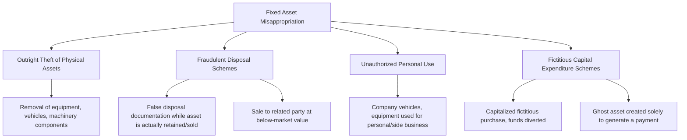

## Fixed Asset Misappropriation Schemes

### Conceptual Framework

Fixed asset misappropriation schemes involve the theft, diversion, or fraudulent disposal of an organization's long-lived tangible assets — property, plant, equipment, machinery, vehicles, and similar capitalized items — and the concealment techniques used to prevent that loss from surfacing through the fixed asset register or depreciation schedule. While this category overlaps substantially with the broader "misuse and misappropriation of noncash assets" branch and shares concealment logic with inventory theft, fixed assets present distinct challenges: they are individually higher-value, capitalized rather than expensed, tracked through depreciation schedules rather than simple quantity counts, and often subject to less frequent physical verification than inventory that turns over regularly.

$$\text{Net Book Value} = \text{Historical Cost} - \text{Accumulated Depreciation}$$

The persistence of an asset's net book value on the balance sheet, continuing to accrue depreciation expense, long after the physical asset has been stolen or improperly disposed of, is the central concealment vulnerability this scheme category exploits — a fixed asset register is only as accurate as the last physical verification, and many organizations verify fixed assets far less frequently than they count inventory.

### Categories of Fixed Asset Misappropriation

**1. Outright theft of fixed assets**

Direct physical removal of company equipment, machinery components, computers, or vehicles by an employee with access, functioning identically in mechanism to the "larceny of company property" pattern but specifically involving capitalized assets — meaning the theft creates both a physical shortage *and* a continuing (now fictitious) depreciation expense and net book value on the financial statements until write-off.

**2. Fraudulent disposal schemes**

- **False disposal with actual retention:** Recording an asset as scrapped, donated, or destroyed (removing it from the fixed asset register and often recognizing a small loss on disposal) while the perpetrator actually retains or sells the asset for personal benefit
- **Sale to a related party at below fair value:** Selling a fixed asset to a friend, relative, or an entity the perpetrator controls at a price substantially below fair market value, with the difference representing the perpetrator's effective personal gain (often paired with an undisclosed kickback from the buyer)
- **Diverted disposal proceeds:** The asset is legitimately and properly authorized for disposal/sale, but the perpetrator intercepts and personally retains the sale proceeds rather than remitting them to the company, while the accounting records may show the disposal transaction without any proceeds received, or with proceeds understated

**3. Unauthorized personal use (misuse rather than outright theft)**

Using company-owned fixed assets — vehicles, machinery, tools, or facilities — for personal purposes or an undisclosed side business without permanently removing the asset, discussed in greater depth under the broader noncash asset misuse category but specifically relevant to fixed assets given their higher individual value and the corresponding opportunity cost/wear to the organization.

**4. Fictitious capital expenditure schemes**

- Creating a wholly fictitious fixed asset purchase in the accounting records — an asset that was never actually acquired — solely to generate and justify a fraudulent disbursement, functioning as a specialized variant of billing/shell company fraud where the "vendor invoice" is specifically for a capitalized asset rather than a routine expense
- Capitalizing a purchase at an inflated cost relative to the actual amount paid, with the perpetrator (often in collusion with the selling vendor) retaining the difference as a kickback

### Concealment Methods Specific to Fixed Assets

**1. Fixed asset register non-maintenance**

Simply failing to update the fixed asset register when an asset is stolen or improperly disposed of — the asset continues to appear as an active, depreciating asset on the books indefinitely, since (unlike inventory, which is typically reconciled through periodic counts tied to cost of goods sold) fixed assets in many organizations are verified only sporadically, sometimes only during an annual audit sample or not at all outside of that sample.

**2. Fraudulent disposal documentation**

Fabricating supporting evidence for a disposal — a scrap certificate, a donation receipt, an insurance claim for destruction/loss, or a trade-in agreement — that does not correspond to the asset's actual fate.

**3. Depreciation manipulation to mask the gap**

Continuing to record depreciation expense on a stolen or disposed asset avoids an unusual gain/loss entry that might otherwise draw attention; the ongoing (fictitious) depreciation is a smaller, less conspicuous accounting artifact than a sudden write-off would be.

**4. Serial number and asset tag manipulation**

In schemes involving multiple similar assets (e.g., a fleet of identical machines or vehicles), swapping asset tags/serial numbers between a stolen unit and a different unit can allow a physical count to appear reconciled even though the specific tagged asset is actually missing — a technique requiring some sophistication and typically only observed in more organized or higher-value schemes. [Inference: technique documented in fraud examination literature as a possible but less common concealment method, not established as a frequently observed pattern in general practice]

### Detection Techniques

**1. Physical fixed asset verification programs**

The foundational detection control: periodically (and ideally on a rotating or risk-based schedule rather than only during the annual audit) physically locating every asset on the fixed asset register, matching serial numbers/asset tags to register records, and independently verifying assets found on the floor but not in the register (which may indicate an unrecorded acquisition or, less commonly, an asset tag substitution).

**2. Depreciation and net book value trend analysis**

Reviewing assets with unusually long remaining useful lives relative to their type and age, and reviewing fully or near-fully depreciated assets still carried as active — since a stolen asset that continues to depreciate provides no immediate financial statement anomaly, but a pattern of assets never being physically re-verified over many years increases the exposure window and warrants scrutiny of the verification program's actual frequency and rigor.

**3. Disposal transaction testing**

- Verifying that disposal proceeds recorded in the accounting system are traceable to an actual bank deposit, in the correct amount and from a plausible, arm's-length buyer
- Reviewing gain/loss on disposal calculations for consistency between the recorded net book value, the disposal proceeds, and supporting sale/scrap documentation
- Testing for related-party relationships between the disposal recipient/buyer and any employee involved in authorizing or executing the disposal

**4. Capital expenditure and vendor analytics**

Applying the same vendor master file and invoice analytics used for billing/shell company schemes specifically to capital expenditure transactions — verifying the existence and delivery of the asset (physical inspection, receiving documentation, installation records) rather than relying solely on invoice and payment documentation, since a fictitious capital asset purchase is functionally a shell company scheme applied to a capitalized rather than expensed transaction.

**5. Insurance claim cross-referencing**

Where an asset's disposal is attributed to loss, theft, or destruction supported by an insurance claim, independently verifying the claim was actually filed, processed, and paid as represented, and that the claimed circumstances are consistent with other available evidence (police reports, incident logs, security footage).

### Red Flags Checklist

| Category | Indicator |
| --- | --- |
| Register maintenance | Assets on the register not physically located during verification exercises |
| Disposal documentation | Disposal transactions lacking third-party certificates, buyer identification, or traceable proceeds |
| Related parties | Disposal recipient sharing an address, surname, or known relationship with an employee involved in the transaction |
| Depreciation patterns | Long-lived assets never subject to physical re-verification across multiple audit/reporting cycles |
| Capital expenditure | New capitalized assets lacking receiving/installation documentation independent of the invoice itself |
| Proceeds | Disposal proceeds recorded but not traceable to an actual bank deposit in the corresponding amount |

### Illustrative Example

A manufacturing company's fixed asset register lists a specialized CNC machine, acquired three years earlier, still being depreciated at its original useful-life schedule. A periodic (risk-based, not annual-cycle) physical verification program flags that the machine cannot be located on the production floor. The plant manager explains that the machine was "scrapped for parts" following an unrepairable mechanical failure, but no scrap certificate, insurance claim, or supporting maintenance/repair record exists documenting the claimed failure. Further investigation traces the machine's serial number to a used-equipment marketplace listing, sold approximately two years earlier by a business entity that internal records show shares a registered agent with the plant manager's spouse — revealing a fraudulent disposal scheme in which the asset was sold for personal benefit while the fixed asset register was never updated, allowing three years of fictitious depreciation expense to be recorded.

### Internal Controls

**Preventive controls**

1. **Formal, dual-authorization disposal policy** requiring documented business justification, an independent valuation or competitive sale process for disposals above a threshold, and secondary approval before any fixed asset is removed from the register
2. **Segregation of duties** separating the individual who has physical custody/operational responsibility for an asset from the individual who authorizes its disposal and the individual who records the disposal transaction and receives proceeds
3. **Asset tagging with serial number cross-referencing** at acquisition, integrated into the fixed asset register from the point of purchase
4. **Related-party disclosure requirements** for any disposal transaction, with mandatory escalation for review where a related-party relationship is identified or suspected

**Detective controls**

1. **Risk-based, rotating physical fixed asset verification**, prioritizing higher-value and higher-mobility asset categories (vehicles, portable equipment, machinery with removable high-value components) for more frequent verification than lower-risk categories
2. **Disposal proceeds tracing** to bank deposits as a routine part of the disposal transaction audit trail
3. **Aging analysis of assets not subject to recent physical verification**, escalating assets that have gone multiple reporting cycles without confirmation
4. **Capital expenditure vendor and delivery verification** applying the same rigor as accounts payable vendor analytics to capitalized purchases specifically

**Conclusion**

Fixed asset misappropriation schemes exploit a structural gap common to many organizations' control environments: fixed assets are capitalized and depreciated rather than expensed and counted, and are typically subject to far less frequent physical verification than inventory, allowing a theft or fraudulent disposal to remain concealed — sometimes for years — behind a continuing, entirely fictitious depreciation schedule that produces no obvious financial statement anomaly on its own. Effective control therefore depends on treating fixed asset verification with a rigor and frequency proportionate to asset value and mobility (rather than relegating it to an infrequent audit-sample exercise), enforcing dual authorization and related-party scrutiny over disposal transactions specifically, and tracing disposal proceeds to actual cash receipts — recognizing that, as with inventory, the underlying vulnerability is not the initial theft itself but the absence of a verification cadence tight enough to make concealment unsustainable.

**Related Topics**

- Larceny of company property (comparative theft mechanism)
- Inventory theft and concealment methods
- Misuse and misappropriation of noncash assets
- Billing schemes and shell company fraud (fictitious capital expenditure overlap)
- Related-party transaction disclosure and review procedures
- Physical asset verification and tagging program design
- Depreciation and net book value analytics as a fraud detection tool
- ACFE Fraud Tree — full taxonomy of asset misappropriation