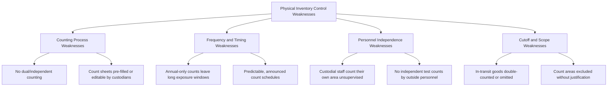

## Physical and Perpetual Inventory Control Weaknesses

### Conceptual Framework

Physical and perpetual inventory control weaknesses are the systemic gaps and design flaws in an organization's inventory tracking infrastructure that create the opportunity for theft and concealment schemes discussed elsewhere in this chapter to succeed and persist undetected. Where prior topics in this chapter addressed *how* inventory is stolen and concealed, this topic addresses the underlying control-design failures that make those schemes viable in the first place — the distinction between a fraud *scheme* and the *control weakness* that enables it.

Two inventory record-keeping systems exist in practice, and each carries distinct, largely non-overlapping vulnerabilities:

$$\text{Periodic System: Inventory} = \text{Beginning Inventory} + \text{Purchases} - \text{COGS (derived from physical count)}$$

$$\text{Perpetual System: Inventory} = \text{Continuously updated with every transaction, verified periodically by physical count}$$

A periodic system has no real-time record of quantities on hand at all — inventory is a plug figure derived from a physical count at period-end, meaning theft is invisible between counts by design, not merely by control failure. A perpetual system maintains a running quantity balance that theoretically flags discrepancies whenever a physical count disagrees with the recorded balance, but only if the system's own inputs and adjustment mechanisms are themselves adequately controlled.

### Weaknesses in Physical Inventory Systems (Periodic Counting)

**1. Counting process weaknesses**

- **No independent second count or reconciliation:** Relying solely on a single count performed by the same personnel who have custodial responsibility for the inventory, with no independent recount or statistical sampling to verify accuracy
- **Editable or pre-populated count sheets:** Count sheets that are pre-printed with expected quantities (rather than blank, requiring an independent blind count) invite counters to simply confirm the expected figure rather than genuinely verify it
- **Manual, paper-based counting without a systematic tracking mechanism:** Increases the risk of areas being missed entirely, counted twice, or counts being altered after the fact without a clear audit trail

**2. Frequency and timing weaknesses**

- **Reliance on a single annual physical count:** Creates a detection window of up to twelve months during which theft, once committed, generates no discrepancy signal at all — this is arguably the single most consequential physical inventory control weakness, since virtually every concealment technique discussed elsewhere in this chapter depends on the gap between counts to remain viable
- **Predictable, pre-announced count schedules:** Allow a perpetrator to plan concealment activity (fictitious write-offs, count sheet padding, empty-box arrangements) specifically timed around the known count date, defeating much of the count's detective value
- **Lack of interim cycle counts:** Absence of a rotating, smaller-scale counting program between annual counts means no early-warning mechanism exists to catch discrepancies before they accumulate to a large, harder-to-investigate magnitude

**3. Personnel independence weaknesses**

- **Custodial staff counting their own area without oversight:** The individual with day-to-day physical responsibility for inventory in a given location is also the one performing (or unsupervised in performing) the official count of that same location, eliminating the independence the count is theoretically supposed to provide
- **No test counts performed by internal audit or an independent function:** Without a bidirectional independent test — verifying count-sheet-to-floor and floor-to-count-sheet — a compromised count process has no external check

**4. Cutoff and scope weaknesses**

- **In-transit inventory handled inconsistently:** Goods in transit between locations at the time of a count can be omitted entirely (understating both locations' totals, which may mask a genuine shortage) or double-counted (overstating combined inventory, which can mask an unrelated theft by inflating the apparent total)
- **Count areas excluded from scope without independent justification:** Storage areas, off-site locations, or consigned inventory excluded from the count based solely on custodial staff's own representation, without independent verification that the exclusion is legitimate

### Weaknesses in Perpetual Inventory Systems

**1. Unrestricted or poorly controlled manual adjustment capability**

The core vulnerability of perpetual systems: because the system relies on manual adjustment transactions to correct for damage, spoilage, or count variances, weak controls over *who* can post an adjustment, and what documentation/approval is required to do so, effectively recreate the same concealment opportunity a periodic system's write-off process offers — an adjustment can be used to paper over a theft-driven shortage rather than a genuine one.

**2. Inadequate segregation between transaction recording and physical custody**

If the same individual (or a small, non-independent group) can both physically move inventory and post the corresponding system transaction, the perpetual system's real-time tracking advantage is defeated, since that individual can simply ensure the recorded transaction always matches whatever physical quantity remains after a theft.

**3. Infrequent or absent perpetual-to-physical reconciliation**

A perpetual system's running balance is only as reliable as its last independent verification against a physical count — organizations that treat the perpetual balance as authoritative without periodic (ideally cycle-count-based) physical confirmation are vulnerable to accumulated, unnoticed drift between the book and physical quantities, whether from theft, error, or a combination of both.

**4. Weak system access controls**

- Generic or shared system logins for warehouse/inventory personnel, preventing individual accountability for who posted a given adjustment or transaction
- Excessive user access rights allowing routine operational staff to post adjustment transaction types that should be restricted to supervisory or accounting personnel
- Absence of a system-generated exception report flagging unusual adjustment activity (large dollar amounts, high frequency by a single user, adjustments outside normal business hours)

**5. Integration gaps between subsystems**

Where the perpetual inventory system does not fully integrate with the sales, purchasing, and shipping systems, manual re-entry or reconciliation points between systems create opportunities for discrepancies to be introduced (deliberately or otherwise) and for the resulting mismatches to go unreconciled.

### Comparative Weakness Summary

| System Type | Core Structural Weakness | Primary Compounding Factor |
| --- | --- | --- |
| Periodic (physical only) | No real-time visibility between counts | Infrequent, predictable, non-independent counting |
| Perpetual | Manual adjustment mechanism can mask discrepancies | Weak segregation of duties and system access controls |
| Both | Reliance on the same personnel for custody and verification | Absence of independent, unpredictable testing |

### Detection and Assessment Techniques

**1. Control design walkthrough and testing**

Forensic accountants and auditors assess inventory control weakness directly by walking through the counting process end-to-end — observing who performs counts, whether count sheets are blank or pre-populated, whether independent test counts occur, and whether cutoff procedures for in-transit goods are actually followed as documented — rather than relying solely on the organization's own description of its controls.

**2. Adjustment transaction analytics**

Reviewing the population of perpetual system adjustment transactions for: concentration by user ID, dollar magnitude trends over time, frequency relative to other transaction types, timing relative to physical count dates, and the presence (or absence) of required supporting documentation for each adjustment.

**3. Count frequency and coverage gap analysis**

Mapping which inventory locations and categories are subject to which counting method and frequency, specifically identifying high-value or high-mobility inventory categories that receive only infrequent (e.g., annual) verification, which represent the highest-exposure control gaps warranting either enhanced cycle counting or compensating detective controls.

**4. Segregation of duties matrix review**

Documenting which individuals or roles have access to (a) physical custody, (b) transaction recording/adjustment authority, and (c) independent verification/reconciliation responsibility for each inventory location, flagging any individual or role combining more than one of these three functions.

**5. System access rights audit**

Reviewing user access rights within the perpetual inventory/ERP system to confirm that adjustment transaction types are appropriately restricted, that individual (not shared) logins are enforced, and that access is periodically reviewed and revoked promptly upon role change or termination.

### Red Flags Checklist

| Category | Indicator |
| --- | --- |
| Counting process | Count sheets pre-populated with expected quantities rather than blank |
| Frequency | Reliance on a single annual count with no interim cycle counting |
| Independence | Custodial staff counting their own area with no independent test counts |
| Cutoff | No documented, tested procedure for handling in-transit inventory at count date |
| Perpetual adjustments | High-volume or high-dollar manual adjustments concentrated with one user or lacking documentation |
| System access | Shared login credentials for inventory personnel; excessive adjustment-transaction access rights |
| Reconciliation | Perpetual balances not periodically reconciled to independent physical counts |

### Illustrative Example

A retail chain relies exclusively on an annual physical inventory count performed by each store's own staff, using count sheets pre-printed with the perpetual system's expected quantities, which counters simply initial to confirm rather than independently tally. Internal audit, engaged after a corporate-level shrinkage trend review flagged one region as a persistent outlier, finds that store managers in the flagged region also hold sole authority to post inventory adjustment transactions in the perpetual system, with no dollar threshold requiring secondary approval and no system-generated exception report reviewing adjustment activity. Because the annual count sheets are pre-populated and confirmed by the same managers who control the adjustment function, any manager engaging in theft has both the opportunity to conceal it through a matching adjustment and no independent counting mechanism likely to contradict the adjusted (and now internally consistent) perpetual balance. The control weakness — not any single fraud scheme — is identified as the root cause enabling multiple, previously undetected small-scale larceny patterns across the region.

### Internal Controls (Remediation Framework)

**Structural/design controls**

1. **Implement or strengthen cycle counting programs** to supplement (not replace) annual counts, using a risk-based rotation that prioritizes high-value and high-mobility inventory categories for more frequent verification
2. **Require blank, independently-prepared count sheets** rather than pre-populated expected quantities, with counts performed or verified by personnel independent of day-to-day custodial responsibility
3. **Enforce segregation of duties** across physical custody, transaction recording/adjustment authority, and independent reconciliation, ensuring no single individual or tightly-knit group controls more than one leg of this triangle
4. **Restrict perpetual system adjustment transaction access** to a limited set of authorized personnel, with dollar-threshold escalation requiring secondary approval for larger adjustments

**Monitoring and verification controls**

1. **Introduce unpredictable, unannounced count timing** for at least a portion of the counting program, defeating the ability to time concealment activity around a known schedule
2. **Implement bidirectional independent test counts** (count-sheet-to-floor and floor-to-count-sheet) performed by internal audit or personnel independent of the location being tested
3. **Generate and routinely review system exception reports** flagging high-dollar, high-frequency, or undocumented adjustment transactions
4. **Reconcile perpetual balances to physical counts on a defined, enforced cadence**, with variances above a threshold triggering mandatory investigation rather than automatic write-off

**Conclusion**

Physical and perpetual inventory control weaknesses represent the enabling infrastructure behind virtually every inventory theft and concealment scheme discussed elsewhere in this chapter — the schemes describe *what* a perpetrator does, while the weaknesses discussed here describe *why* the organization's own systems fail to catch it. Periodic (physical-only) systems are structurally blind between counts, making count frequency, independence, and unpredictability the dominant control variables, while perpetual systems trade that blindness for a different vulnerability — a manual adjustment mechanism that, absent strict segregation of duties and access controls, can be used to mask exactly the same discrepancies a periodic system's write-off process would otherwise conceal. In both cases, the common remediation thread is the same: independence between the individual with physical custody and the individual who verifies or adjusts the recorded quantity, combined with a verification cadence and unpredictability sufficient to close the exposure window that every concealment technique in this chapter ultimately depends upon.

**Related Topics**

- Inventory theft and concealment methods
- Fixed asset misappropriation schemes
- Cycle counting methodologies and risk-based inventory verification design
- Segregation of duties matrices across custody, recording, and reconciliation functions
- Data analytics for perpetual inventory adjustment transaction review
- Physical inventory observation procedures under auditing standards (AU-C 501 / AS 2510)
- ERP system access control design and review
- ACFE Fraud Tree — full taxonomy of asset misappropriation