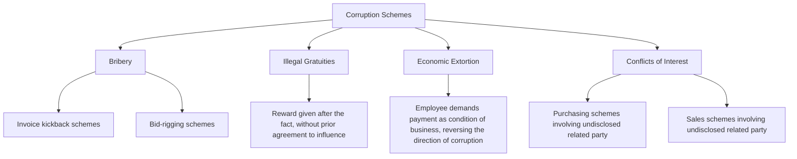

## Bribery and Kickback Schemes

### Conceptual Framework

Bribery and kickback schemes belong to the Corruption branch of the ACFE Fraud Tree, which is conceptually distinct from asset misappropriation: rather than directly stealing the victim organization's cash or property, corruption schemes involve an employee (or officer/director) wrongfully using their influence in a business transaction in a way that produces a benefit for themselves or a third party, at the expense of the organization's interests — often without any money being directly diverted from company accounts at all, since the loss frequently manifests as inflated prices, inferior quality, or foregone competitive value rather than a missing asset.

$$\text{Corruption Loss} = \text{Fair/Competitive Transaction Value} - \text{Actual Transaction Value Obtained Under Compromised Influence}$$

The core corruption mechanism, per ACFE and Cressey's foundational fraud triangle framework as applied to this category, is the abuse of a position of trust for personal gain in a manner that creates a **conflict of interest** — whether or not that conflict is formally disclosed — with bribery and kickbacks representing the specific financial exchange mechanisms through which that abused influence is monetized.

### Distinguishing Bribery from Kickbacks

While often used interchangeably in casual usage, forensic accounting and legal literature draws a meaningful distinction:

| Attribute | Bribery | Kickback |
| --- | --- | --- |
| Timing relative to the transaction | Payment made to influence a decision *before* or *during* the decision process | Payment made *after* the transaction is awarded/completed, as a share of the resulting business |
| Typical context | Obtaining a contract, permit, favorable regulatory treatment, or business decision not yet made | Rewarding an employee for having already directed business to a vendor |
| Payer's business relationship | May be a prospective vendor/counterparty with no existing relationship | Typically an existing, awarded vendor sharing a portion of the resulting profit |
| Common label | "Pay to play" | "Kickback" or "commission" disguised as legitimate |

In practice, many real-world schemes blend both elements — an initial bribe secures the contract, and ongoing kickbacks sustain the relationship — which is why the ACFE Fraud Tree groups them together under the broader corruption category rather than treating them as fully separate scheme types.

### The Four ACFE Corruption Scheme Categories

**1. Bribery**

Offering, giving, receiving, or soliciting something of value to influence an official act or business decision. Within bribery, two dominant sub-schemes appear in occupational fraud:

- **Invoice kickback schemes:** A vendor pays a portion of its profit on each invoice back to the employee who approved the purchase or the vendor's selection, typically funded by inflating the invoiced price above what would otherwise be charged — the classic mechanism combining bribery's influence-purchasing function with the ongoing, per-transaction kickback structure
- **Bid-rigging schemes:** An employee with influence over the competitive bidding/procurement process manipulates that process to ensure a colluding vendor wins, in exchange for a bribe or ongoing kickback arrangement. Common bid-rigging sub-techniques include:
  - **Need recognition schemes:** The employee convinces the organization that a specific, often unnecessary, purchase is required, structured to specifically favor the colluding vendor
  - **Specifications schemes:** Drafting bid specifications so narrowly or unusually that only the colluding vendor can realistically qualify
  - **Bid pooling/complementary bidding:** Colluding bidders coordinate to submit deliberately uncompetitive "losing" bids, ensuring the pre-selected vendor wins while creating the appearance of genuine competition
  - **Bid manipulation after submission:** The employee alters submitted bid information (opening competitor bids to allow the colluding vendor to adjust its bid, or leaking competitor pricing information) after the formal bid submission deadline

**2. Illegal gratuities**

Similar to bribery in form (something of value given in connection with a business decision) but distinguished by the absence of a prior agreement or intent to influence a *specific, not-yet-made* decision — the gratuity is instead given *after* a decision has already been made, as an unsolicited reward or token of appreciation. The legal and ethical distinction turns on timing and intent: an illegal gratuity does not require proof that the outcome was actually altered by the payment, only that it was connected to an official act.

**3. Economic extortion**

The conceptual inverse of bribery: rather than a vendor initiating a payment to influence an employee, the employee (or official) demands payment from a vendor or counterparty as an explicit or implicit condition of doing business — "pay me, or you don't get this contract/this business relationship continues." The vendor here is typically a victim of coercion rather than a willing co-conspirator, which is a materially different fact pattern from a mutually beneficial bribery arrangement and often affects how investigators and prosecutors characterize the vendor's own culpability.

**4. Conflicts of interest**

An employee has an undisclosed personal or financial interest in a transaction that the organization is entering into, and that undisclosed interest influences the employee's actions to the organization's detriment — distinguished from pure bribery/kickback schemes because a conflict of interest scheme does not necessarily involve any explicit payment changing hands (the "benefit" the employee receives is often the profit or advantage flowing to the undisclosed related entity itself). Purchasing-side and sales-side conflict of interest schemes are covered in this chapter's dedicated topic on undisclosed related-party influence.

### Mechanisms and Structural Patterns

**1. Direct cash or wire payment**

The most straightforward mechanism — cash handed directly to the corrupted employee, or wire transfers to a personal or shell account, sometimes disguised through the shell company invoicing techniques covered under billing schemes.

**2. Disguised consulting or "referral fee" arrangements**

Structuring kickback payments as legitimate-appearing consulting fees, referral fees, or commission payments to a shell entity or a family member's business, providing a documentary cover story if the payment flow is ever questioned.

**3. Non-cash benefits**

- Lavish travel, entertainment, gifts, or hospitality provided to the corrupted employee, calibrated to stay below internal gift-policy disclosure thresholds where such thresholds exist
- Employment offers or business opportunities extended to the employee's family members
- Below-market personal loans or investment opportunities offered to the corrupted employee by the vendor

**4. Layered/indirect payment structures**

Routing kickback payments through multiple intermediary entities or jurisdictions to obscure the ultimate connection between the paying vendor and the receiving employee, a technique overlapping substantially with money laundering methodology (placement, layering, integration) when the amounts and sophistication warrant it.

### Detection and Investigative Techniques

**1. Vendor and pricing analytics**

- Comparing prices paid to a specific vendor against market benchmarks, competitor pricing, or historical pricing trends for the same goods/services, flagging vendors whose pricing is persistently above market without an apparent quality or service justification
- Reviewing vendor selection win-rates by employee/purchasing agent — an employee whose procurement decisions disproportionately favor one vendor relative to peers performing comparable purchasing functions warrants scrutiny

**2. Relationship and lifestyle analysis**

- Cross-referencing vendor ownership, officer, and address information against the employee master file (including relatives, to the extent identifiable) to detect undisclosed relationships
- Net worth/lifestyle analysis of employees in procurement, sales, or contracting roles, comparing observable spending and asset accumulation against known legitimate income, particularly where other red flags are already present

**3. Bid and procurement process review**

- Statistical review of bid patterns for evidence of complementary bidding (unusually close losing bids, consistent "also-ran" bidders who never win, or bid amounts that appear mathematically related to each other rather than independently derived)
- Reviewing whether bid specifications were unusually narrow or customized in ways that map closely to a single vendor's specific capabilities
- Auditing for post-bid-deadline changes to submitted bid documentation or evidence that competitor bid information was accessed before the winning bid was finalized

**4. Communication and travel/entertainment expense review**

- Reviewing expense reports and corporate credit card statements for entertainment/travel expenses involving vendor personnel that are disproportionate to legitimate business development norms
- Where legally permissible and properly authorized, reviewing employee communications (email, messaging) for evidence of undisclosed relationships, unusual solicitation of gifts, or coordination with vendor personnel outside normal business channels

**5. Whistleblower and tip mechanisms**

Consistent with the broader occupational fraud pattern, corruption schemes are frequently identified through tips — often from a competing vendor who suspects (or has direct knowledge of) a rigged bidding process, or from an employee aware of a colleague's undisclosed vendor relationship. [Inference: consistent with the general ACFE finding that tips are the leading detection method across occupational fraud categories broadly, including corruption specifically in most survey cycles; exact ranking and proportion vary by survey year]

### Red Flags Checklist

| Category | Indicator |
| --- | --- |
| Pricing | Persistent above-market pricing from a specific vendor with no quality/service justification |
| Vendor concentration | Disproportionate business awarded to one vendor by a specific employee relative to peers |
| Relationships | Vendor ownership/address overlapping with employee or employee-relative information |
| Bidding patterns | Unusually narrow bid specifications; consistent "also-ran" losing bidders; mathematically related bid amounts |
| Lifestyle | Employee spending/assets inconsistent with known legitimate income, especially in procurement roles |
| Gifts/entertainment | Vendor-funded travel, entertainment, or gifts calibrated just under disclosure thresholds |
| Documentation | Consulting/referral fee arrangements with vague deliverables paid to entities connected to an employee |

### Legal Framework Considerations

- The **Foreign Corrupt Practices Act (FCPA)** governs bribery of foreign government officials by U.S. persons/entities (or those otherwise subject to U.S. jurisdiction), with both anti-bribery provisions and separate accounting/internal controls provisions requiring accurate books and records and adequate internal controls — making FCPA compliance directly relevant to forensic accounting practice even though the anti-bribery provision itself is a legal rather than accounting standard
- Domestic commercial bribery is generally addressed through state commercial bribery statutes, mail/wire fraud statutes (where interstate communications or mailings are involved), and, for public officials, specific federal and state bribery statutes distinct from the commercial/private-sector context
- The UK Bribery Act 2010 is notably broader than the FCPA in some respects, criminalizing private commercial bribery in addition to public official bribery, and creating a strict corporate liability offense for failing to prevent bribery by associated persons, subject to an "adequate procedures" defense
- Forensic accountants engaged in FCPA or bribery-related investigations are frequently tasked with tracing payment flows through intermediaries, quantifying the financial benefit obtained through the corrupt arrangement, and assessing whether the organization's internal controls were adequate to prevent or detect the conduct — directly relevant to both civil/regulatory penalty calculations and any internal controls remediation required as part of a settlement

### Illustrative Example

A regional facilities manager at a manufacturing company has authority to select vendors for equipment maintenance contracts without requiring competitive bidding below a certain dollar threshold. Over several years, the manager consistently awards contracts to a single maintenance vendor at prices approximately 15–20% above rates independently confirmed from comparable vendors serving similar facilities. Investigation, prompted by a competing vendor's tip alleging the contracts were "always wired" for the incumbent, reveals the maintenance vendor's owner had been depositing quarterly payments into an account later traced, through banking records, to a joint account held with the facilities manager's spouse — an invoice kickback scheme in which the vendor's inflated pricing funded a portion of profit returned to the manager, disguised as a "marketing consulting" arrangement between the vendor and a business entity registered to the spouse.

**Conclusion**

Bribery and kickback schemes are distinguished from asset misappropriation by their indirect loss mechanism — the victim organization is harmed not through a missing asset but through compromised business decisions that produce inflated costs, foregone competitive value, or inferior outcomes, often with no direct evidence of a missing dollar anywhere in the organization's own books. This makes detection fundamentally different in character from cash or inventory fraud detection: rather than reconciling a physical count or bank balance, investigators must establish (1) that a business decision deviated from what a genuinely independent, arm's-length decision would have produced, and (2) that an undisclosed financial relationship or payment flow explains that deviation — requiring pricing and vendor-concentration analytics, relationship mapping between employees and vendors, and often financial tracing techniques more commonly associated with money laundering investigations than routine internal audit procedures.

**Related Topics**

- Bid-rigging schemes and procurement fraud in depth
- Undisclosed conflicts of interest in purchasing and sales schemes
- Foreign Corrupt Practices Act (FCPA) anti-bribery and accounting provisions
- Money laundering typologies: placement, layering, and integration
- Vendor master file analytics and relationship-mapping techniques
- Net worth method and indirect methods of proving illicit income
- Billing schemes and shell company fraud (disguised kickback payment mechanisms)
- Whistleblower programs and their role in corruption scheme detection