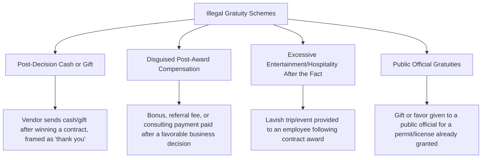

## Illegal Gratuities

### Conceptual Framework

Illegal gratuities are the second of the ACFE's four corruption scheme categories, and are frequently the most conceptually misunderstood of the four because they closely resemble bribery in form — something of value changing hands in connection with a business or official decision — while differing on the single element that matters most for legal and forensic classification: **timing and the absence of a prior corrupt agreement to influence a specific, not-yet-made decision.**

$$\text{Bribery: Payment} \rightarrow \text{Intent to Influence a Pending Decision} \rightarrow \text{Decision Made}$$

$$\text{Illegal Gratuity: Decision Made} \rightarrow \text{Payment Given as Reward/Appreciation (no prior agreement to influence that specific decision)}$$

A gratuity is offered, given, received, or solicited *because of* an official act that has already occurred, rather than *in order to* cause a specific future act — the corrupt element lies in accepting or providing a benefit connected to the exercise of business or public authority, even without an explicit prior quid pro quo agreement.

### The Legal and Analytical Distinction from Bribery

**Key Points**

- Bribery requires proof of intent to influence a specific official act or decision — the classic legal concept of a *quid pro quo* — meaning the payer intended, and the recipient understood, that the payment was given to affect an outcome not yet determined
- An illegal gratuity requires only that the benefit was given or received *because of* an official act, without necessarily proving a specific intent to influence that particular act before it happened — the legal threshold for establishing an illegal gratuity is, in this sense, generally lower than for bribery, since it does not require proving the corrupt bargain element
- Despite this lower threshold, gratuities are still considered corrupt/illegal in most legal and regulatory frameworks (and violate virtually all corporate codes of conduct) because they create the same underlying risk: an employee or official who knows that favorable treatment of a particular party tends to be rewarded afterward has an ongoing incentive to favor that party in future decisions, even without an explicit advance agreement
- In practice, the line between a bribery scheme and a pattern of illegal gratuities is often blurred and context-dependent — a series of "unconnected" gratuities from the same vendor, recurring after each favorable decision, can functionally create the same behavioral incentive as an explicit bribe, and investigators frequently examine the pattern and timing of a relationship over time rather than any single payment in isolation to determine which characterization better fits the facts [Inference: interpretive framing consistent with how forensic accounting and fraud examination literature generally distinguishes the practical (as opposed to purely legal) difference between the two categories]

### Common Forms and Contexts

**1. Post-decision cash or gift schemes**

A vendor, having been awarded a contract or received favorable treatment through a normal (or at least facially normal) decision process, subsequently provides cash, a gift, or another benefit to the employee(s) involved in that decision, explicitly or implicitly framed as an expression of appreciation rather than as part of any prior arrangement.

**2. Disguised post-award compensation**

Structuring the gratuity as a seemingly legitimate payment — a "referral bonus," a one-time consulting fee, or a commission — paid to the employee or a related party after the favorable decision has already been finalized, providing documentary cover that can make the payment appear to be an ordinary business transaction rather than a reward connected to the employee's official action.

**3. Excessive post-award entertainment and hospitality**

A vendor provides a disproportionately lavish trip, event, or hospitality package to the employee(s) responsible for a decision, timed to follow shortly after a contract award, renewal, or other favorable outcome — distinguished from ordinary, proportionate relationship-building entertainment by its timing (closely following a specific favorable decision) and its magnitude relative to normal business development practice.

**4. Public official gratuities**

In the public sector context, a gift, favor, or benefit given to a government employee or official after a permit, license, contract, or other official action has already been granted — a category with particular significance because many federal, state, and local ethics laws explicitly criminalize the acceptance of *any* gratuity connected to an official act by a public employee, regardless of whether influence over a future decision can be shown, given the heightened public-trust concerns in the government contracting and regulatory context.

### Why Gratuities Persist as a Distinct Risk Category

Because illegal gratuities do not require an explicit advance corrupt agreement, they are frequently rationalized by both parties as ordinary business courtesy or a legitimate expression of gratitude rather than corruption — this rationalization dynamic maps directly onto the "rationalization" leg of Cressey's fraud triangle, since neither party may perceive their own conduct as fraudulent in the way an explicit bribery arrangement would clearly register. This is precisely why organizational gift and hospitality policies typically impose dollar-value thresholds and disclosure requirements regardless of whether any specific decision can be shown to have been influenced — the policy concern is the *pattern of incentive* a gratuity creates for future conduct, not solely whether a specific past decision was provably corrupted.

### Detection and Investigative Techniques

**1. Timing correlation analysis**

The central analytical technique specific to gratuities: mapping the timing of gifts, payments, entertainment, or other benefits received by an employee against the timeline of business decisions (contract awards, renewals, favorable regulatory determinations, permit approvals) involving the same counterparty, looking for a pattern of benefits clustering shortly after favorable outcomes.

**2. Gift and hospitality disclosure log review**

Reviewing whether gifts and entertainment received from vendors/counterparties were disclosed as required under company policy, and specifically testing for gifts that fall just under disclosure thresholds — a pattern of receipts consistently just below a reporting threshold is itself a red flag, whether or not any individual gift would independently warrant scrutiny.

**3. Expense report and corporate credit card review**

Examining vendor-paid or vendor-reimbursed travel and entertainment expenses for magnitude and timing relative to the vendor relationship's contract/decision history, since a legitimate, ongoing business relationship typically shows more evenly distributed entertainment activity than a pattern concentrated immediately after specific favorable decisions.

**4. Communication review**

Where legally permissible, reviewing employee communications for language suggesting an understanding that a gift or benefit was connected to a prior decision ("thanks for the contract, dinner's on us this time") — language of this kind, even absent any explicit advance agreement, is often the clearest evidence distinguishing an illegal gratuity from genuinely unconnected personal generosity.

**5. Comparative vendor treatment analysis**

Comparing the pattern of gifts/entertainment received from a specific vendor against gifts/entertainment received from other vendors serving comparable functions, to assess whether the vendor associated with a favorable decision shows a disproportionate post-decision generosity pattern relative to peer vendors.

### Red Flags Checklist

| Category | Indicator |
| --- | --- |
| Timing | Gift, payment, or entertainment received shortly after a contract award, renewal, or favorable decision |
| Magnitude | Benefit disproportionate to the ordinary scale of the business relationship or industry norms |
| Disclosure | Gifts/entertainment received but not disclosed, or consistently just under a disclosure threshold |
| Documentation | Payment characterized as a "bonus," "referral fee," or "consulting payment" with vague or no deliverable |
| Pattern | Recurring benefits from the same counterparty consistently following favorable decisions over time |
| Communication | Language connecting a received benefit to a specific past decision or outcome |

### Illustrative Example

A government procurement officer awards a facilities contract to a vendor through a documented, seemingly compliant competitive bidding process. Two weeks after the contract is signed, the vendor provides the procurement officer with an all-expenses-paid weekend trip, described in internal vendor correspondence as a "thank you for a smooth process." No evidence emerges during investigation that the bidding process itself was manipulated, and no advance agreement to provide the trip in exchange for the contract award can be established — the procurement records show no communication or arrangement discussing the trip prior to the contract signing. However, because the trip was accepted by a public employee in direct connection with an official act (the contract award), and government ethics rules in the relevant jurisdiction prohibit acceptance of any gratuity connected to an official act regardless of provable prior intent to influence, the procurement officer's acceptance of the trip constitutes an illegal gratuity violation, distinct from (and easier to establish than) a bribery charge would have been, since no corrupt bargain needed to be proven.

**Conclusion**

Illegal gratuities occupy an important middle ground in corruption scheme analysis precisely because they do not require proof of the explicit advance corrupt agreement that bribery demands, making them both easier to establish legally in some contexts and easier for participants to rationalize as ordinary business courtesy rather than fraud. The defining forensic technique for this category is therefore timing and pattern correlation — mapping the receipt of gifts, payments, or entertainment against the timeline of business decisions involving the same counterparty — rather than the payment-flow tracing and bid-manipulation analysis more central to bribery investigations, since the corrupt element in a gratuity scheme lies in the *connection* between a benefit and an already-completed official act, not in demonstrating that the act itself was altered by a prior bargain.

**Related Topics**

- Bribery and kickback schemes (comparative corruption category)
- Economic extortion
- Conflicts of interest in purchasing and sales schemes
- Corporate gift and hospitality policy design and disclosure thresholds
- Public sector ethics laws and government contracting integrity requirements
- Foreign Corrupt Practices Act (FCPA) — gratuity and hospitality provisions
- Timing correlation analysis techniques in corruption investigations
- ACFE Fraud Tree — full taxonomy of corruption schemes