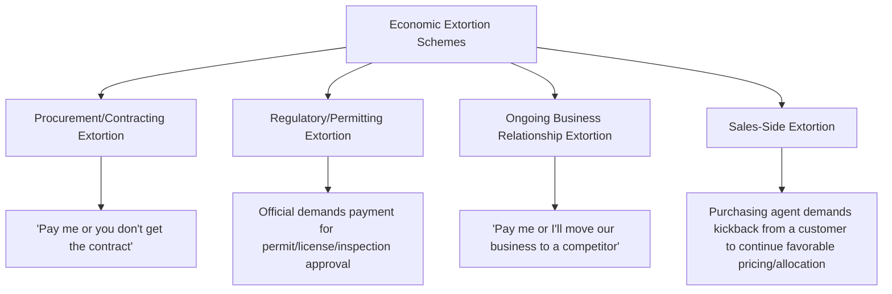

## Economic Extortion

### Conceptual Framework

Economic extortion is the third of the ACFE's four corruption scheme categories, and is structurally the mirror image of bribery: rather than a vendor or outside party initiating a payment to influence an employee's decision, an employee (or official) with decision-making authority demands payment from a vendor, contractor, or counterparty as an explicit or implicit condition of obtaining or continuing a business relationship. Where bribery is typically framed as a mutually beneficial (if corrupt) arrangement between a willing payer and a willing recipient, economic extortion inverts the initiating party and, critically, the presumed culpability of the outside counterparty.

$$\text{Bribery: Vendor initiates payment} \rightarrow \text{seeks favorable treatment}$$

$$\text{Economic Extortion: Employee demands payment} \rightarrow \text{as condition of business} \rightarrow \text{vendor complies under duress}$$

The ACFE Fraud Tree treats economic extortion as the reciprocal counterpart to bribery specifically because the underlying financial exchange can look identical from a purely transactional or accounting perspective — a vendor paying an employee in connection with a business relationship — while the direction of coercion and the resulting characterization of each party's culpability differ substantially.

### Distinguishing Economic Extortion from Bribery

| Attribute | Bribery | Economic Extortion |
| --- | --- | --- |
| Party who initiates the corrupt proposal | Vendor/outside party | Employee/official with decision authority |
| Vendor's posture | Willing participant seeking advantage | Victim of coercion, complying to preserve or obtain business |
| Vendor's legal exposure | Typically also culpable as a co-conspirator | Often treated as a victim, though this can be fact-dependent and is not automatic |
| Underlying dynamic | "I'll pay you to get favorable treatment" | "Pay me, or you don't get/keep this business" |
| Investigative starting point | Vendor pricing/relationship analytics | Vendor complaints, tips, or evidence of demanded payments |

**Key Points**

- The distinction matters significantly for how investigators and prosecutors approach the counterparty: a vendor that can credibly demonstrate it paid only because it was threatened with loss of business, rather than proactively offering payment to gain an advantage, may be treated as a victim rather than a co-conspirator — though this determination is fact-specific and vendors that comply with extortion demands over an extended period without ever reporting the conduct may still face scrutiny regarding their own culpability [Behavior may vary based on specific jurisdiction, prosecutorial discretion, and the particular fact pattern established]
- In practice, economic extortion is often *harder* to detect through the vendor-side analytics used for bribery detection (pricing analysis, vendor concentration review) because a coerced vendor has no incentive to disguise the payment as a mutually beneficial arrangement — the vendor's motivation is to avoid losing the business relationship, not to obtain an advantage, so the resulting transaction may show no obvious pricing anomaly at all
- Economic extortion frequently comes to light specifically because the victimized vendor eventually reports the conduct (to law enforcement, to the extorting employee's employer, or through a whistleblower channel), rather than through the analytical detection methods that work well for bribery, since the vendor has an active incentive to disclose the extortion once it decides the cost of continued compliance outweighs the risk of reporting

### Common Contexts and Mechanisms

**1. Procurement and contracting extortion**

An employee with purchasing or contracting authority explicitly or implicitly conditions the award of a contract on receiving a personal payment, gift, or other benefit from the prospective vendor — functionally the extortion-side counterpart to a bid-rigging bribery scheme, distinguished by who initiated the demand.

**2. Regulatory and permitting extortion**

A public or quasi-public official responsible for issuing permits, licenses, inspections, or approvals demands payment as a condition of granting (or not unreasonably delaying/denying) the approval — a pattern with particular relevance in jurisdictions or sectors where regulatory approval carries significant discretionary authority and limited independent oversight.

**3. Ongoing business relationship extortion**

An employee responsible for maintaining an existing vendor or customer relationship threatens to terminate or reduce that relationship (moving business to a competitor, reducing purchase volumes, delaying payments) unless the counterparty provides an ongoing personal benefit — distinguished from a one-time contract-award extortion by its recurring, relationship-maintenance character.

**4. Sales-side extortion**

Less commonly discussed than purchasing-side schemes but structurally symmetric: an employee responsible for allocating scarce product, favorable pricing, or priority service to customers demands a personal payment from a customer as a condition of continued favorable treatment — particularly relevant in supply-constrained industries or allocation-based distribution models.

### Detection and Investigative Techniques

**1. Vendor complaint and tip channels**

Given that economic extortion is frequently disclosed by the victimized counterparty rather than uncovered through internal analytics, maintaining accessible, credible reporting channels specifically for external parties (vendors, contractors, applicants) — not solely internal employee whistleblower hotlines — is a materially important detection mechanism for this scheme category specifically.

**2. Vendor relationship pattern review**

While pricing anomalies are less reliable for extortion detection than for bribery, reviewing patterns of vendor turnover, complaints logged (even informally) during vendor onboarding or offboarding, and vendor reluctance to bid on or renew contracts with a specific internal contact can surface underlying coercion dynamics.

**3. Employee behavioral and financial indicators**

Since the extorting employee is the party receiving illicit payment, the same lifestyle and net worth analysis techniques applicable to bribery investigations apply equally here — unexplained spending or asset accumulation inconsistent with known legitimate income, particularly among employees with unilateral authority over vendor selection, contract renewal, permitting, or allocation decisions.

**4. Exit interview and vendor offboarding review**

Departing or terminated vendors are sometimes more willing to disclose historical extortion demands once the ongoing business relationship (and the associated risk of retaliation) has ended — making structured vendor offboarding interviews a potentially underutilized detection opportunity.

**5. Communication review**

Where legally permissible, reviewing employee communications for language suggesting a demand or condition placed on a vendor/counterparty ("this needs to happen or we'll have to look elsewhere," combined with a personal payment request) — the presence of an explicit or strongly implied condition, rather than a request framed as voluntary, is the key linguistic marker distinguishing extortion from a gratuity or bribery solicitation initiated more subtly.

### Red Flags Checklist

| Category | Indicator |
| --- | --- |
| Vendor behavior | Vendor reluctance to bid, renew, or engage with a specific internal contact without clear business explanation |
| Vendor turnover | Unusual pattern of vendor relationship terminations or non-renewals concentrated with one internal decision-maker |
| Reporting | Informal vendor complaints during onboarding/offboarding not escalated or investigated |
| Employee lifestyle | Spending/assets inconsistent with known income among employees holding unilateral vendor, permit, or allocation authority |
| Communication | Language conditioning a business outcome on receipt of a personal payment or benefit |
| Authority concentration | Single individual holding unchecked, undocumented authority over vendor selection, renewal, or permitting decisions |

### Illustrative Example

A regional purchasing manager at a distribution company has effectively unilateral authority to select which vendors receive purchase orders for a specialized component, with no formal competitive bidding requirement below a moderate dollar threshold. A prospective vendor, seeking to establish a new supply relationship, is informed by the manager that securing the contract "would go more smoothly" with a personal consulting arrangement paid to the manager's spouse's business. The vendor initially declines and does not receive the contract; a competing vendor's principal later confides to a company compliance officer, during an unrelated vendor satisfaction survey, that they had agreed to a similar arrangement out of concern that refusing would result in losing the business entirely. Investigation substantiates that the manager had solicited similar payments from multiple prospective and existing vendors over several years, with vendors who declined generally receiving reduced order volumes or exclusion from renewal opportunities shortly afterward — establishing a pattern of demand-driven, rather than vendor-initiated, corrupt payments consistent with economic extortion rather than bribery.

**Conclusion**

Economic extortion completes the bribery/extortion pairing within the ACFE's corruption taxonomy by reversing the direction of initiation: the employee, not the vendor, is the party demanding payment, and the vendor's compliance is coerced rather than voluntary. This reversal has significant practical consequences for both legal characterization (the vendor may be treated as a victim rather than a co-conspirator) and detection strategy, since the standard bribery-detection toolkit — pricing anomaly analysis, vendor concentration review — is often less effective here, and detection instead depends more heavily on maintaining credible external reporting channels, monitoring vendor relationship patterns (turnover, reluctance to engage, complaints during onboarding/offboarding), and the same employee-side lifestyle and communication analysis used across corruption schemes generally, since the ultimate illicit financial benefit still flows to the extorting employee regardless of which party initiated the arrangement.

**Related Topics**

- Bribery and kickback schemes (comparative and reciprocal corruption category)
- Illegal gratuities
- Conflicts of interest in purchasing and sales schemes
- Vendor relationship and complaint channel design
- Net worth method and indirect methods of proving illicit income
- Whistleblower programs and external (non-employee) reporting mechanisms
- Regulatory and permitting integrity controls in the public sector
- ACFE Fraud Tree — full taxonomy of corruption schemes