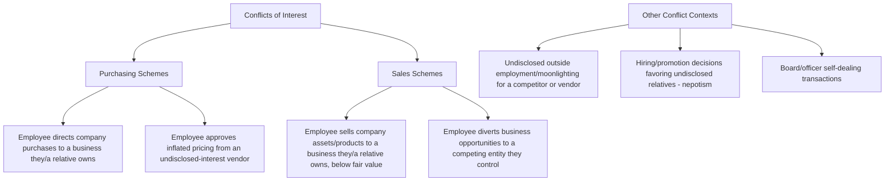

## Conflicts of Interest

### Conceptual Framework

Conflicts of interest are the fourth and final ACFE corruption scheme category, and are conceptually distinct from the other three (bribery, illegal gratuities, economic extortion) in one critical respect: a conflict of interest scheme does not necessarily require any explicit payment, gift, or benefit to change hands at all. Instead, the corrupt element arises when an employee has an **undisclosed personal, financial, or family interest** in a transaction that the organization is entering into, and that undisclosed interest — rather than the organization's best interest — influences the employee's judgment or actions.

$$\text{Conflict of Interest} = \text{Undisclosed Competing Interest} + \text{Influence Over a Business Decision} + \text{Detriment to the Organization}$$

The "benefit" the employee receives in a pure conflict-of-interest scheme is often not a direct payment to the employee personally, but rather profit or advantage flowing to an entity the employee (or a close family member) owns, controls, or otherwise has an undisclosed stake in — meaning the employee benefits indirectly through that entity's gain, rather than through cash or gifts received directly in the way bribery or gratuity schemes typically involve.

### Why Disclosure Is the Central Analytical Element

**Key Points**

- The presence of a personal or financial interest is not, by itself, inherently fraudulent — virtually every organization has legitimate mechanisms (recusal, disclosure, independent approval) for managing conflicts that arise naturally in business relationships and hiring
- What converts a conflict into a fraud scheme is **concealment**: the employee fails to disclose the interest, allowing the transaction to proceed as if it were an arm's-length, independent business decision when it is not
- This is why conflict-of-interest investigations focus heavily on what the employee knew and failed to disclose, rather than solely on whether the resulting transaction was priced unfairly — a transaction can be conducted at a fair market price and still constitute fraud if the relationship was concealed and the organization's decision-making process was thereby compromised (for example, a genuinely competitive bid process that happened to result in the undisclosed-relationship vendor winning fairly could still represent a policy violation requiring disclosure, though the fraud/harm analysis typically focuses on cases where the undisclosed relationship demonstrably affected the outcome or where disclosure requirements were knowingly violated) [Inference: interpretive point on how forensic accounting and fraud examination literature generally frames the disclosure-versus-fairness distinction, not a bright-line legal rule applicable in every jurisdiction or organizational policy]
- The overlap with bribery/kickback and asset misappropriation schemes is substantial: many purchasing-side conflict of interest schemes function almost identically to invoice kickback bribery schemes, except that the "kickback" the employee receives is embedded in the profits of a business they themselves (or a relative) own, rather than a separate cash payment from an unrelated vendor

### The Two Principal Categories: Purchasing-Side and Sales-Side

**1. Purchasing schemes**

The most commonly discussed conflict-of-interest fraud pattern: an employee with purchasing or vendor-selection authority directs company business to a vendor in which they (or a close family member) hold an undisclosed ownership or financial interest.

- **Direct ownership schemes:** The employee personally owns, in whole or part, the vendor entity receiving company business, concealed through the use of a different registered business name, a relative serving as the nominal owner of record, or simply the absence of any disclosure process that would surface the connection
- **Overbilling in conjunction with ownership:** Beyond simply directing business to the owned entity, the employee may also cause that entity to overbill the company, compounding the conflict-of-interest violation with an overbilling/inflated-pricing element that increases the financial harm
- **Approval of substandard goods/services:** Because the employee has a personal stake in the vendor succeeding regardless of performance, quality and service standards that would normally be enforced against an independent vendor may go unenforced, creating an operational (not just financial) risk

**2. Sales schemes**

The mirror image on the revenue side: an employee with authority over sales, asset disposal, or business opportunity allocation directs those opportunities to an entity they control, typically to the organization's detriment through below-market pricing or diverted opportunities.

- **Below-market asset sales:** Selling company products, services, or assets to an entity the employee controls at prices below what an independent, arm's-length customer would pay
- **Diverted business opportunities:** An employee aware of a favorable business opportunity that rightfully belongs to the organization instead directs or reserves that opportunity for a personal or family business, a pattern closely related to the corporate law concept of "usurping a corporate opportunity," which carries fiduciary duty implications independent of any specific fraud statute

**3. Related conflict-of-interest contexts**

- **Undisclosed outside employment ("moonlighting"):** An employee secretly works for, consults for, or holds an ownership interest in a competitor, customer, or vendor, creating a conflict even without a specific fraudulent transaction, since the employee's access to proprietary information or influence over decisions affecting that outside party creates an ongoing risk
- **Nepotism in hiring and promotion:** Favoring the hiring, promotion, or preferential treatment of an undisclosed relative, which — while sometimes treated as a lesser HR policy matter rather than fraud — can rise to the level of a conflict-of-interest fraud scheme when it involves concealment specifically to circumvent hiring policy or when it is paired with other financial benefit
- **Board and officer self-dealing:** Directors or officers approving transactions between the organization and an entity in which they hold an undisclosed interest, often subject to specific corporate governance and fiduciary duty legal standards (and, for public companies, SEC related-party disclosure requirements) beyond the general fraud examination framework

### Detection and Investigative Techniques

**1. Vendor/customer-to-employee relationship mapping**

The primary detection technique for this scheme category: systematically cross-referencing vendor and customer ownership, officer, and registered-agent information (obtainable through business registry searches) against the employee master file, including known relatives where identifiable, to surface connections the employee has not disclosed.

**2. Conflict-of-interest disclosure statement review and testing**

Reviewing whether required annual (or transaction-specific) conflict-of-interest disclosure statements were actually completed by relevant employees, and — critically — independently testing the accuracy of those disclosures against external business registry and public records searches, since a disclosure *process* provides no protective value if employees can simply decline to disclose a relationship without consequence or verification.

**3. Vendor/customer concentration and pricing analytics**

Applying the same pricing-benchmark and vendor-concentration analytics used in bribery detection: comparing prices paid to (or received from) a specific counterparty against market benchmarks, and reviewing whether one employee's purchasing or sales decisions disproportionately favor a specific counterparty relative to peer employees performing comparable functions.

**4. Corporate opportunity and outside business activity review**

For senior employees, officers, and directors, reviewing outside business activities, board memberships, and investment holdings (often required through periodic disclosure as part of governance policy) against the organization's own business activities and pipeline, to identify potential diverted-opportunity risk.

**5. Public records and business registry searches**

Independently searching secretary of state business registration databases, professional licensing records, and property records for evidence connecting an employee (or relative) to a vendor or customer entity, since these searches can surface connections that internal disclosure processes alone would miss entirely if the employee never discloses.

### Red Flags Checklist

| Category | Indicator |
| --- | --- |
| Ownership overlap | Vendor/customer registered agent, officer, or ownership record matching an employee or known relative |
| Disclosure gaps | Required conflict-of-interest disclosure statements not completed, or completed but contradicted by public records |
| Vendor concentration | Disproportionate business awarded to one vendor by a specific employee relative to comparable peers |
| Pricing | Vendor pricing above market (purchasing side) or customer pricing below market (sales side) with no clear justification |
| Quality/performance | Substandard vendor performance tolerated without the usual enforcement/remediation applied to independent vendors |
| Outside activity | Undisclosed outside employment, consulting, or ownership interest connected to a competitor, vendor, or customer |

### Illustrative Example

A hospital system's facilities director has authority to select vendors for equipment maintenance services below a defined competitive-bid threshold. Over several years, the director consistently selects a maintenance vendor whose registered business address, cross-referenced during a routine internal audit vendor analytics review, matches the director's own home address, and whose registered owner of record is the director's adult child — a relationship never disclosed on the director's annual conflict-of-interest attestation, which the director had signed each year affirming no such relationships existed. Pricing comparison shows the vendor's rates were within a reasonable range of market benchmarks (no clear overbilling), meaning the financial harm from pricing alone was limited; however, the concealment of the relationship itself, combined with the circumvention of a policy requiring disclosure and independent approval for any vendor relationship involving a family connection, constituted the fraud violation — illustrating the earlier point that a conflict-of-interest scheme's harm can lie primarily in the concealment and compromised decision-making process rather than in demonstrable financial overcharging.

**Conclusion**

Conflicts of interest are the corruption category most defined by what is concealed rather than what is exchanged — unlike bribery, gratuities, or extortion, which all involve a discrete payment or benefit flowing between parties, a conflict-of-interest scheme's fraud element can exist entirely in an employee's failure to disclose a relationship that would have triggered independent review or recusal had it been known. This makes relationship-mapping and independent verification of disclosure statements against external public records the central detection technique for this category, distinct from the payment-flow tracing and pricing-anomaly analysis that dominate bribery investigations, and underscores why a well-designed conflict-of-interest program depends less on trusting employee self-disclosure and more on independently verifiable cross-checks between the organization's vendor/customer relationships and its own employee population.

**Related Topics**

- Bribery and kickback schemes (overlapping mechanism with purchasing-side conflicts)
- Illegal gratuities and economic extortion (comparative corruption categories)
- Corporate governance and fiduciary duty standards for officers and directors
- SEC related-party transaction disclosure requirements
- Vendor master file analytics and relationship-mapping techniques
- Corporate opportunity doctrine in fiduciary duty law
- Business registry and public records search methodology in fraud investigation
- ACFE Fraud Tree — full taxonomy of corruption schemes