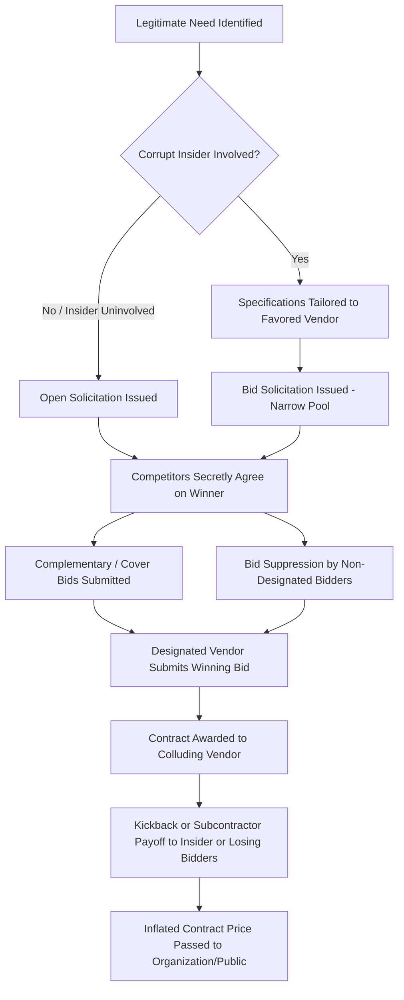

## Bid-Rigging and Vendor Collusion

### Definition and Conceptual Foundation

Bid-rigging is a corruption scheme in which competitors in a bidding process secretly coordinate to determine who will win a contract, effectively defeating the competitive bidding process while creating the appearance of legitimate competition. It falls under the broader category of **corruption schemes** in the fraud tree (ACFE Fraud Tree classification), specifically within the "Purchases Schemes" branch of Corruption, alongside bribery and illegal gratuities.

Vendor collusion is the umbrella term for coordinated anti-competitive conduct among vendors (suppliers/contractors), of which bid-rigging is the most common manifestation. Collusion can occur purely among vendors (horizontal collusion) or can involve a corrupt employee of the purchasing organization who facilitates the scheme (vertical collusion, often overlapping with bribery).

**Key Points**

- Bid-rigging defeats the purpose of competitive bidding: obtaining the best price/quality through independent, competing offers.
- It is both a fraud examination concern (financial statement and asset misappropriation impact) and, in most jurisdictions, a criminal antitrust violation.
- It typically requires either collusion among bidders alone, or collusion between bidders and an insider (procurement/purchasing employee) who manipulates the process.

### Prerequisite Concepts

Before analyzing bid-rigging schemes, the following foundational concepts should be secured:

1. **The competitive bidding process** — Understanding how legitimate procurement works (RFP/RFQ issuance, sealed bids, bid opening, evaluation criteria, contract award) is necessary to recognize where collusion inserts itself.
2. **The Fraud Triangle** (Pressure, Opportunity, Rationalization) — Bid-rigging opportunity typically arises from weak segregation of duties in procurement.
3. **Corruption vs. Asset Misappropriation vs. Financial Statement Fraud** — Bid-rigging is a corruption scheme; it does not directly falsify financial statements but corrupts a business process, though it commonly co-occurs with kickbacks (an asset misappropriation overlap).
4. **Kickback schemes** — Many bid-rigging schemes are enabled by kickbacks paid to a purchasing employee; understanding kickback mechanics clarifies the motive of the insider.

If any of these are unfamiliar, they should be studied first, as bid-rigging schemes are best understood as a corruption of the bidding process by actors who benefit financially.

### The Competitive Bidding Process (Legitimate Baseline)

To recognize corruption of the bidding process, first understand its legitimate stages:

1. **Presolicitation phase** — Needs assessment, specification drafting, budget approval.
2. **Solicitation phase** — Public or targeted invitation for bids (IFB), request for proposals (RFP), or request for quotations (RFQ).
3. **Bid submission phase** — Vendors submit sealed or otherwise controlled bids by a deadline.
4. **Bid opening and evaluation phase** — Bids are opened (often publicly, for sealed bids) and evaluated against defined criteria.
5. **Contract award phase** — The winning bid is selected and the contract is executed.

Bid-rigging schemes insert manipulation at one or more of these five stages.

### Categories of Bid-Rigging Schemes

**1. Presolicitation Schemes**

These occur before bids are even solicited, when a corrupt employee tailors the process to favor a specific vendor.

- **Need Recognition Schemes**: An employee convinces the organization that a nonexistent or exaggerated need exists, in collusion with a vendor who will "fulfill" it.
- **Specifications Schemes**: Bid specifications are written narrowly enough that only the colluding vendor can meet them (e.g., requiring a specific proprietary feature, an unusually short delivery window, or a rare certification held only by the favored vendor). This is one of the most common and hardest-to-detect schemes because the specifications appear "reasonable" on their face.

**2. Solicitation Schemes**

These occur during the bid solicitation phase.

- **Bid Pooling / Vendor List Manipulation**: A corrupt employee limits the pool of bidders invited to compete, restricting it to include only colluding vendors, or excluding legitimate competitors.
- **Restrictive Bid Specifications** carried into this phase to legally exclude qualified competitors.
- **Improper Bid Splitting**: Purchases are divided into amounts that fall just below the dollar threshold requiring competitive bidding (this is technically a "circumventing controls" scheme but frequently used to funnel work to a preferred vendor).

**3. Bid Submission Schemes (Collusion Among Bidders)**

These are the classic "bid-rigging" schemes among competitors themselves, generally requiring no corrupt insider (though one may still be involved):

- **Complementary Bidding (Cover Bidding / Courtesy Bidding)**: Some conspirators submit intentionally high or deliberately noncompetitive bids to create the appearance of genuine competition, while allowing a predetermined vendor to win.
- **Bid Rotation**: Conspirators take turns being the designated low bidder across a series of contracts, ensuring each colluding vendor wins a "fair share" over time.
- **Bid Suppression**: One or more competitors agree to refrain from bidding, or to withdraw a previously submitted bid, so the designated vendor wins.
- **Market/Customer Allocation**: Competitors divide markets geographically, by customer, or by product line, agreeing not to compete for each other's designated customers or territories.
- **Subcontractor Compensation Schemes**: Losing bidders are compensated by the winning bidder through inflated subcontracts, consulting fees, or joint-venture arrangements — effectively a payoff for losing.

**4. Bid Submission Schemes (Insider Manipulation)**

- **Bid Tailoring** (as above, if not caught earlier).
- **Bid Manipulation After Opening**: A corrupt employee with access to sealed bids leaks the lowest competitor bid to a favored vendor before final submission or evaluation, allowing that vendor to adjust its bid downward just enough to win.
- **Late Bid Acceptance**: A corrupt employee accepts a colluding vendor's bid after the official deadline, once that vendor has learned competitors' bid amounts.

**5. Bid Evaluation and Award Schemes**

- Manipulating scoring criteria post hoc to favor a particular vendor.
- Disqualifying lower bids on pretextual technicalities.
- Awarding based on undisclosed "best value" discretion that masks favoritism.

### Illustrative Flow of a Bid-Rigging Scheme

### Example

**Example (Illustrative Scenario)**

A municipal government issues an RFP for road resurfacing. Three construction companies — A, B, and C — have secretly agreed in advance that Company A will win this contract, and B and C will "take turns" winning future resurfacing contracts (bid rotation). To maintain appearances:

- Company B submits a bid 8% higher than Company A's.
- Company C submits a bid 12% higher than Company A's, and its bid is deliberately structured with terms the agency is known to reject (e.g., shorter payment terms), ensuring it looks non-competitive without being an obvious placeholder.

Company A wins the contract at a price higher than what genuine competition would have produced. In exchange for their cooperation, Company A subcontracts a portion of drainage work to Company B at an inflated rate — this is the subcontractor compensation payoff. No cash directly changes hands between A, B, and C, which is part of what makes such schemes hard to detect through direct financial tracing.

[Inference] In practice, the *sequencing pattern* across multiple contracts (rotation) is typically the strongest quantitative red flag, since a single rigged bid can look like ordinary market variance, but a repeating win pattern is statistically distinguishable from random competitive outcomes.

### Red Flags and Detection Indicators

**Key Points — Behavioral/Documentary Red Flags**

- Same vendors consistently bid on the same contracts, with a rotating winner pattern.
- Losing bidders' prices are suspiciously close to, but consistently just above, the winning bid.
- Identical or near-identical bid documents (formatting, typographical errors, pricing structure) across "competing" vendors.
- Winning bid prices trend upward over time despite no corresponding cost increases in materials/labor.
- A vendor that wins frequently has an unusually close personal relationship with a procurement employee (travel, gifts, employment history overlap).
- Bid specifications that match one vendor's product/service catalog almost exactly.
- Sudden bidder withdrawal shortly before the deadline, with no plausible business explanation.
- Qualified vendors declining to bid or reporting they were not invited, despite being on an approved vendor list.
- Subcontracts awarded by the winning bidder to the losing bidders shortly after contract award.
- Unusual uniformity in "cost buildup" line items across supposedly independent bids (suggesting shared bid preparation).

**Quantitative/Analytical Detection Techniques**

- **Benford's Law analysis** on bid amounts across a large dataset, to detect artificial digit patterns in fabricated or coordinated pricing.
- **Bid variance analysis**: statistically unusual clustering of bid amounts (e.g., all bids within 1–2% of each other) can indicate information sharing.
- **Win-rate analysis**: mapping which vendors win, and in what pattern, over time (rotation detection).
- **Relationship/network analysis**: mapping common addresses, phone numbers, bank accounts, IP addresses for bid submissions, or shared ownership structures among "competing" vendors.
- **Market share concentration tests**: analyzing whether the same small group of vendors consistently wins nearly all contracts in a given category despite a larger pool of qualified vendors.

### Legal and Regulatory Framework

[Unverified — jurisdiction-dependent; consult current statutory text and legal counsel for application to specific facts]

- **United States**: Bid-rigging is criminally prosecuted under the **Sherman Antitrust Act** (15 U.S.C. § 1), typically as a *per se* violation (meaning no proof of actual anticompetitive effect is required — the conduct itself is illegal). It is often prosecuted alongside mail/wire fraud statutes and, where public contracts are involved, under federal or state procurement fraud statutes. The **False Claims Act** may also apply in government contracting contexts.
- Many jurisdictions have equivalent competition/antitrust statutes (e.g., the UK's Competition Act 1998, the EU's Treaty on the Functioning of the European Union Article 101).
- Because bid-rigging is a *per se* antitrust violation in many regimes, prosecutors need not prove the rigged price was actually higher than a competitive price would have been — the act of collusion itself is the violation.

### Forensic Accounting Investigative Approach

1. **Data collection**: Obtain historical bid records, vendor master files, contract award history, and procurement policy documentation.
2. **Vendor relationship mapping**: Cross-reference vendor addresses, phone numbers, tax IDs, banking details, and ownership/officer information to detect shell or affiliated entities posing as independent competitors.
3. **Statistical bid analysis**: Apply variance, clustering, and Benford's Law tests to bid pricing data.
4. **Rotation/pattern analysis**: Build a matrix of contract awards by vendor and time period to detect rotation patterns.
5. **Interview strategy**: Interview losing bidders (who may have been pressured into cover bids), procurement staff, and end users of the contracted goods/services.
6. **Document examination**: Compare bid documents for identical formatting, typographical fingerprints, or metadata (e.g., document authorship metadata suggesting shared drafting).
7. **Financial tracing**: Investigate subcontracts, consulting agreements, or "referral fees" paid by the winning bidder to losing bidders as potential collusion payoffs.
8. **Benchmarking**: Compare contract prices to market rates or historical prices for similar work to quantify potential damages/overcharges.

### Prevention and Internal Controls

**Key Points — Control Design**

- **Segregation of duties**: Separate the individuals who draft specifications, solicit bids, evaluate bids, and approve contract awards.
- **Sealed bidding with independent bid opening**, ideally with witnesses or committee-based openings.
- **Vendor rotation and periodic re-competition** of incumbent contracts to avoid entrenched relationships.
- **Mandatory disclosure of conflicts of interest** by procurement staff, cross-checked against vendor ownership data.
- **Broadening the bidder pool** through public advertisement rather than closed invitation lists.
- **Post-award audits**, especially of subcontracting arrangements by winning bidders.
- **Whistleblower hotlines** for both employees and losing bidders to report suspected collusion.
- **Data analytics monitoring** of bidding patterns on an ongoing basis (rotation detection, price clustering) rather than only during periodic audits.

### Distinguishing Bid-Rigging from Related Schemes

| Scheme | Primary Mechanism | Typical Actor(s) |
| --- | --- | --- |
| Bid-Rigging | Manipulating the competitive process itself | Colluding vendors, with or without insider |
| Kickback Scheme | Vendor pays insider for favorable treatment (may co-occur with bid-rigging) | Vendor + corrupt employee |
| Bid Splitting | Breaking purchases below competitive-bid thresholds | Corrupt employee, often solo |
| Price-Fixing | Agreement on prices generally (not tied to a specific bid event) | Competing vendors, broader market conduct |
| Illegal Gratuities | Reward given after the fact, without prior intent to influence a specific decision | Vendor + employee |

Note the overlap: bid-rigging schemes frequently *combine* with kickback schemes, since an insider facilitating bid manipulation is commonly compensated through a kickback — the two are analytically distinct but operationally intertwined in many real cases.

### Related Topics / Next Steps

- Kickback schemes and their relationship to bid-rigging
- Shell company schemes used to disguise vendor collusion or fictitious competing bidders
- Benford's Law and digit-analysis techniques in forensic data analytics
- Conflict of interest schemes in procurement
- The ACFE Fraud Tree — full classification of Corruption schemes
- Antitrust *per se* vs. "rule of reason" analysis
- Procurement fraud in government contracting (False Claims Act implications)
- Data analytics and network analysis tools for vendor relationship mapping
- Whistleblower protections and qui tam actions in procurement fraud cases