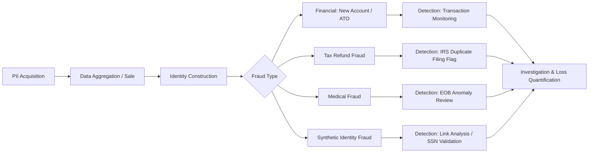

## Identity Theft Methods and Detection

### Overview

Identity theft is the unauthorized acquisition and use of another person's personally identifiable information (PII) — Social Security numbers, dates of birth, financial account credentials, or biometric data — to commit fraud, typically for financial gain. Within forensic accounting, identity theft is examined both as a standalone crime and as an enabling mechanism for broader fraud schemes (loan fraud, tax refund fraud, account takeover, synthetic identity fraud). Forensic accountants are frequently engaged to quantify losses, trace fraudulent transactions, reconstruct the fraud timeline, and support litigation or law enforcement referrals.

### Categories of Identity Theft

**Key Points**

- **Financial identity theft**: Opening credit accounts, loans, or bank accounts in the victim's name.
- **Tax identity theft**: Filing fraudulent tax returns to claim refunds using a stolen SSN.
- **Medical identity theft**: Using stolen identity to obtain medical services, prescriptions, or insurance reimbursements.
- **Criminal identity theft**: Presenting another person's identity when apprehended for a crime.
- **Synthetic identity theft**: Combining real PII (often a real SSN, frequently a minor's or deceased person's) with fabricated details (name, DOB) to construct a new, non-existent identity.
- **Child identity theft**: Exploiting a minor's SSN, which has no credit history and may go undetected for years.
- **Account takeover (ATO)**: Gaining unauthorized control over an existing financial or online account rather than opening a new one.

### Common Methods of Committing Identity Theft

#### Data Acquisition Techniques

**Phishing and Social Engineering**

- Phishing (email), smishing (SMS), and vishing (voice) trick victims into voluntarily disclosing credentials or PII.
- Pretexting involves fabricating a scenario (e.g., posing as a bank representative) to extract information.
- Business Email Compromise (BEC) targets employees with access to payroll or vendor payment systems, often overlapping with identity theft when W-2 or PII data is exfiltrated.

**Technical Compromise**

- Data breaches at third-party custodians (retailers, healthcare providers, payroll processors) expose bulk PII, later sold on dark web marketplaces.
- Skimming devices on ATMs or point-of-sale terminals capture card data magnetically or via inserted card readers.
- Malware, including keyloggers and remote access trojans (RATs), captures credentials directly from a victim's device.
- SIM swapping involves fraudulently porting a victim's phone number to an attacker-controlled SIM card, defeating SMS-based two-factor authentication (2FA).

**Physical and Low-Tech Methods**

- Dumpster diving for discarded financial statements, pre-approved credit offers, or medical records.
- Mail theft, including redirecting mail via fraudulent change-of-address filings.
- Shoulder surfing to observe PINs or passwords in person.
- Insider theft, where employees with legitimate access to PII (HR, healthcare, financial institutions) exfiltrate records for personal use or sale.

#### Exploitation Techniques

**Application Fraud**

- Using stolen or synthetic identities to open new credit lines, then "busting out" — maxing out credit shortly before the account is flagged and abandoned.
- Applying for government benefits, unemployment insurance, or Paycheck Protection Program (PPP)-style loans using stolen identities, a pattern that surged during COVID-19 relief disbursements.

**Credential Stuffing and Account Takeover**

- Automated tools test breached username/password pairs across multiple platforms, exploiting password reuse.
- Once inside an account, perpetrators may change contact details, request wire transfers, or extract stored payment information.

**Tax Refund Fraud**

- Filing a fraudulent tax return early in the filing season using a stolen SSN, directing the refund to a prepaid debit card or an account the perpetrator controls, before the legitimate taxpayer files.

### Detection Methods

#### Individual-Level Red Flags

**Key Points**

- Unexplained hard inquiries or new accounts on a credit report.
- IRS notices referencing a tax return the taxpayer did not file, or rejection of an e-filed return as a duplicate.
- Collection calls for debts not incurred by the individual.
- Missing mail or unexpected changes in billing cycles (a possible sign of a fraudulent change-of-address).
- Explanation of Benefits (EOB) statements from health insurers for services never received.

#### Institutional and Analytical Detection

**Transaction Monitoring and Anomaly Detection**

- Rule-based systems flag transactions inconsistent with a customer's established behavioral baseline (unusual geographic location, transaction velocity, or amount).
- Device fingerprinting identifies whether a login originates from a device or IP address not previously associated with the account.
- Velocity checks flag multiple applications or transactions using the same PII elements (address, phone number, IP) within a short window — a strong indicator of synthetic identity fraud rings.

**Data Matching and Verification**

- Cross-referencing applicant data against the Social Security Administration's Death Master File (DMF) to detect use of a deceased person's SSN.
- Knowledge-Based Authentication (KBA) checks, though increasingly circumvented as personal data becomes widely available through breaches.
- SSN issuance-date validation: comparing the applicant's claimed date of birth against the historical SSN issuance pattern (pre-2011 sequential issuance) to detect implausible combinations, a common synthetic-identity indicator.

**Forensic Accounting Techniques**

- Benford's Law analysis applied to transaction amounts can reveal anomalous digit distributions consistent with fabricated records.
- Link analysis maps shared identifiers (addresses, phone numbers, IP addresses, employer names) across seemingly unrelated accounts to uncover fraud rings.
- Timeline reconstruction correlates account opening dates, application timestamps, and transaction logs to establish the sequence of compromise and exploitation.
- Reconciliation of credit bureau data (Experian, Equifax, TransUnion) against internal account records to identify discrepancies indicating unauthorized account creation.

**Machine Learning-Based Detection**

- Supervised models (logistic regression, gradient boosting) trained on labeled historical fraud cases to score new applications.
- Unsupervised clustering and graph-based network analysis to detect synthetic identity rings that individually appear legitimate but share underlying connective attributes.
- [Inference] Model efficacy depends heavily on the quality and recency of training data; performance claims for any specific vendor product should be independently validated in a given institutional context.

### Illustrative Diagram: Identity Theft Lifecycle (svg_diagram)

### Example

A forensic accountant reviewing a suspected synthetic identity fraud ring identifies twelve credit card applications filed within a 30-day window, all listing different names and dates of birth but sharing the same residential address and an employer that does not appear in any public business registry. Link analysis software maps the shared address and employer field across all twelve accounts, and SSN issuance-date validation reveals that the claimed birth years for several applicants are inconsistent with SSA-published issuance ranges for the SSNs used. Total exposure is quantified by aggregating the credit limits extended across all twelve accounts, net of any principal recovered before charge-off.

### Legal and Regulatory Framework

- The **Fair and Accurate Credit Transactions Act (FACTA)** established the Red Flags Rule, requiring financial institutions to implement identity theft prevention programs.
- The **Identity Theft and Assumption Deterrence Act** (18 U.S.C. § 1028) criminalizes the knowing transfer or use of another's identification without lawful authority.
- The **Fair Credit Reporting Act (FCRA)** governs consumer rights to dispute fraudulent entries on credit reports.
- The **Gramm-Leach-Bliley Act (GLBA)** imposes safeguarding requirements on financial institutions handling consumer PII.
- [Unverified] Specific penalty ranges and sentencing enhancements vary by jurisdiction and should be confirmed against current statutory text at the time of any engagement.

### Conclusion

Identity theft methods span low-tech physical exploitation to sophisticated technical compromise and increasingly favor synthetic identity construction, which is harder to detect through traditional credit-monitoring channels because no single real individual serves as a clear "victim" flagging the fraud. Effective detection therefore requires layering individual vigilance, institutional transaction monitoring, cross-database verification, and forensic analytical techniques such as link analysis and digit-distribution testing. Forensic accountants add value primarily in loss quantification, fraud ring identification through relational data analysis, and reconstructing evidentiary timelines for litigation or prosecution.

**Related Topics**

- Synthetic identity fraud detection and the SSA Death Master File
- Account takeover fraud and behavioral biometrics
- Tax refund fraud schemes and IRS anti-fraud filters (e.g., the IRS's Return Review Program)
- Data breach forensics and PII exfiltration tracing
- Benford's Law and digital analysis techniques in fraud examination
- Link analysis and network/graph-based fraud ring detection
- Red Flags Rule compliance program design