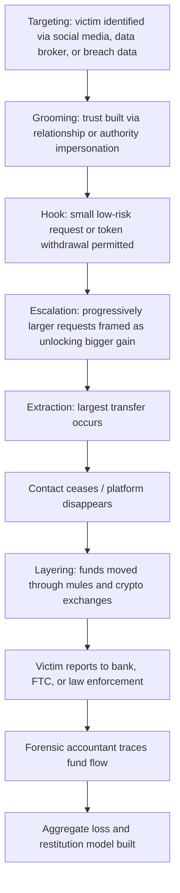

## Consumer Scams and Confidence Schemes

### Overview and Definitional Framework

Consumer scams and confidence schemes are fraud typologies in which a perpetrator induces a victim to voluntarily part with money, assets, or sensitive information through deception, manipulation, or false pretenses, rather than through unauthorized technical intrusion. The defining element is the victim's own action — a payment, transfer, or disclosure — obtained through the perpetrator's exploitation of trust, urgency, fear, or greed.

**Key Points**

- Legally, most confidence schemes fall under fraud statutes requiring proof of: (1) a material misrepresentation, (2) knowledge of falsity (scienter), (3) intent to induce reliance, (4) actual reliance by the victim, and (5) resulting damages.
- The forensic accountant's role typically centers on tracing the flow of funds post-victimization, quantifying aggregate losses (often for class actions or regulatory restitution), and reconstructing the scheme's economic structure for prosecution or civil recovery.
- These schemes disproportionately target elderly and financially vulnerable populations, a pattern relevant both to sentencing enhancements in many jurisdictions and to restitution modeling.

### Taxonomy of Consumer Scams and Confidence Schemes

#### Romance and Relationship-Based Scams

- **Romance scams**: Perpetrator cultivates a fabricated romantic relationship (often via dating platforms or social media) over weeks or months, then requests money for fabricated emergencies, travel, customs fees, or investment "opportunities."
- **Pig butchering scams** (a hybrid romance/investment scheme, discussed further below): Victim is gradually persuaded to invest increasing sums into a fraudulent trading platform, guided by the "romantic" contact.

#### Investment and Financial Scams

- **Ponzi and pyramid schemes**: Covered more fully as standalone topics, but frequently intersect with consumer-scam typologies when marketed directly to retail/individual victims.
- **Pig butchering ("Sha Zhu Pan")**: A multi-stage scheme combining social engineering with a fake investment platform showing fabricated returns; victims are encouraged to invest progressively larger amounts before the platform vanishes with all funds. [Inference] The name derives from the practice of "fattening" a victim before the extraction, an analogy used in law enforcement and industry reporting.
- **Cryptocurrency investment fraud**: False promises of guaranteed returns through fake exchanges, fraudulent mining operations, or fabricated trading bots.
- **Advance-fee fraud**: Victim pays an upfront fee to receive a larger promised sum (inheritance scams, lottery/sweepstakes scams, loan scams) that never materializes.

#### Impersonation Scams

- **Government impersonation**: Perpetrator poses as IRS, Social Security Administration, immigration authorities, or law enforcement, demanding immediate payment (often via gift cards or wire transfer) to avoid arrest or deportation.
- **Tech support scams**: Fraudulent pop-ups or cold calls claiming the victim's computer is infected, followed by a request for remote access and payment for fake "repairs."
- **Business Email Compromise (BEC) targeting consumers**: Impersonation of a familiar contact (family member, real estate agent, contractor) via spoofed or compromised email to redirect a payment (e.g., real estate closing funds) to a fraudulent account.
- **Grandparent scams**: Perpetrator poses as a grandchild in urgent legal or medical trouble, pressuring an elderly victim for immediate funds.

#### Transactional and Marketplace Scams

- **Online marketplace/auction fraud**: Non-delivery of purchased goods, counterfeit goods, or overpayment scams (victim receives a fraudulent check for more than the sale price and is asked to refund the difference).
- **Rental and real estate scams**: Fraudulent listings for properties the "landlord" does not own or control, collecting deposits from multiple victims.
- **Charity fraud**: Solicitation of donations for fabricated or misrepresented charitable causes, often surging after disasters or during crises.

#### Structural/Mechanism-Based Categories

- **Pyramid and Ponzi structures** (see dedicated topic coverage): Distinguished from legitimate MLM by reliance on recruitment/new investor funds rather than genuine product sales or investment returns to pay existing participants.
- **Affinity fraud**: Exploitation of shared community bonds (religious, ethnic, professional) to build trust and lower victims' skepticism — a common enabling mechanism across several scam types above rather than a standalone scheme.

### The Confidence Scheme Lifecycle

| Stage | Description |
| --- | --- |
| Targeting | Identification of victim pool via data broker lists, social media scraping, or public records (often intersecting with stolen data from breaches) |
| Grooming/Trust-Building | Establishing rapport, credibility, or urgency (romantic relationship, authority impersonation, fabricated crisis) |
| Hook | Initial request for a small, low-risk payment or disclosure to test compliance and commitment |
| Escalation | Progressively larger requests, often framed as necessary to "unlock" a larger promised benefit |
| Extraction | Final, often largest, transfer — after which contact typically ceases |
| Layering/Laundering | Funds moved rapidly through money mules, cryptocurrency, or shell accounts to frustrate recovery |

### Forensic Accounting Role in Consumer Scam Investigations

#### Fund Tracing and Recovery

- **Money mule network mapping**: Identifying the layers of intermediary accounts (often unwitting individuals recruited via "work from home" job scams) used to move stolen funds before final consolidation.
- **Cryptocurrency tracing**: Following funds through blockchain analysis where victims were induced to purchase and transfer crypto — a near-universal feature of modern pig butchering and investment scams due to the difficulty of reversing crypto transactions.
- **Bank record reconstruction**: Subpoenaing and analyzing receiving-account records to identify the ultimate beneficiaries and any recoverable assets before full dissipation.

#### Aggregate Loss Quantification

- In regulatory or class-action contexts (e.g., FTC enforcement actions), forensic accountants often build **victim loss models** aggregating thousands of individual transactions into a total restitution figure.
- This typically requires reconciling: (1) total funds received by the scheme, (2) funds returned to any victims, (3) legitimate operating expenses (if any) versus fraudulent distributions, and (4) funds dissipated to lifestyle spending or now-unrecoverable transfers.

#### Scheme Structural Analysis

- Distinguishing between a **pure confidence scheme** (all funds simply misappropriated) and a **hybrid Ponzi-like structure** (some early "victims" receive fabricated returns funded by later victims, delaying detection) — the presence of the latter significantly affects loss calculation, since some recipients may have received a net gain from other victims' losses (relevant to **clawback/net winner analysis**).

### Legal and Regulatory Framework

- **FTC Act Section 5**: Prohibits unfair or deceptive acts or practices; the primary basis for FTC enforcement actions against consumer scam operators in the U.S.
- **Mail and wire fraud statutes**: Federal charging statutes frequently used because most modern scams involve interstate wire transfers or electronic communications.
- **State consumer protection statutes**: Often provide for treble damages or statutory damages in private civil actions, in addition to criminal prosecution.
- **Bank Secrecy Act / Anti-Money Laundering (AML) obligations**: Financial institutions' suspicious activity report (SAR) filings are frequently a key evidentiary source in reconstructing scam fund flows.
- [Unverified] Specific restitution and forfeiture procedures vary considerably by jurisdiction and whether the matter proceeds criminally, civilly, or through an administrative regulatory action; practitioners should confirm the applicable procedural framework for a given engagement.

### Red Flags for Investigators and Financial Institutions

- Elderly customer making unusually large or frequent wire transfers, particularly to newly established payees or cryptocurrency exchanges.
- Customer expressing urgency, secrecy, or reluctance to explain the purpose of a transaction to bank staff (a frequently trained indicator in bank teller AML/fraud-prevention programs).
- Rapid escalation in transaction size over a short period, consistent with the "grooming to extraction" pattern.
- Multiple unrelated individuals wiring funds to the same receiving account (indicative of a money mule or centralized scheme account).
- Victim references a romantic partner "met online" who has never been met in person and is associated with investment advice.

### Illustrative Example

An elderly victim is contacted on a social media platform by an individual claiming to be a successful overseas trader. Over four months, a relationship develops, and the victim is introduced to a fraudulent cryptocurrency trading platform showing a fabricated but visually convincing dashboard of investment gains. The victim initially deposits $2,000, sees an apparent 40% "return," and is permitted a small $500 withdrawal to build confidence. Over subsequent months, the victim wires a cumulative $180,000 (liquidating retirement savings) based on further fabricated gains, before being told a large "tax" must be paid to unlock a final withdrawal — at which point contact ceases.

A forensic accountant engaged by law enforcement or in a civil recovery action would:

1. Reconstruct the full transaction timeline from bank and cryptocurrency exchange records.
2. Trace the initial $2,000 through to the point of conversion into cryptocurrency and its subsequent movement through wallet addresses.
3. Identify the exchange(s) or off-ramp used for final conversion to fiat currency and issue subpoenas for account-holder information.
4. Quantify the net loss ($180,000 minus the $500 returned) for use in restitution proceedings.
5. Assess whether the receiving wallet clusters intersect with other known victims, supporting an aggregate scheme-wide loss calculation for prosecutors.

### Confidence Scheme Fund Flow (svg_diagram)

<svg xmlns="http://www.w3.org/2000/svg" viewBox="0 0 900 400" font-family="Arial, sans-serif">
<text x="450" y="25" font-size="16" font-weight="bold" text-anchor="middle">Confidence Scheme Fund Flow (svg_diagram)</text>
<rect x="30" y="60" width="160" height="60" rx="8" fill="#dce6f7" stroke="#333" />
<text x="110" y="85" font-size="12" text-anchor="middle" font-weight="bold">Victim</text>
<text x="110" y="102" font-size="10" text-anchor="middle">Wire transfer / crypto</text>
<rect x="240" y="60" width="160" height="60" rx="8" fill="#fce8d5" stroke="#333" />
<text x="320" y="85" font-size="12" text-anchor="middle" font-weight="bold">Money Mule Account</text>
<text x="320" y="102" font-size="10" text-anchor="middle">Often unwitting recruit</text>
<rect x="450" y="60" width="160" height="60" rx="8" fill="#fce8d5" stroke="#333" />
<text x="530" y="85" font-size="12" text-anchor="middle" font-weight="bold">Crypto Exchange</text>
<text x="530" y="102" font-size="10" text-anchor="middle">Conversion / layering</text>
<rect x="660" y="60" width="180" height="60" rx="8" fill="#f4cccc" stroke="#333" />
<text x="750" y="85" font-size="12" text-anchor="middle" font-weight="bold">Scheme Operator</text>
<text x="750" y="102" font-size="10" text-anchor="middle">Final beneficiary</text>
<line x1="190" y1="90" x2="235" y2="90" stroke="#333" stroke-width="2" marker-end="url(#arrow2)" />
<line x1="400" y1="90" x2="445" y2="90" stroke="#333" stroke-width="2" marker-end="url(#arrow2)" />
<line x1="610" y1="90" x2="655" y2="90" stroke="#333" stroke-width="2" marker-end="url(#arrow2)" />
<rect x="240" y="180" width="560" height="70" rx="8" fill="#e2f0d9" stroke="#333" />
<text x="520" y="205" font-size="12" text-anchor="middle" font-weight="bold">Forensic Tracing Points</text>
<text x="520" y="223" font-size="10" text-anchor="middle">Bank SARs · wallet clustering · subpoenaed KYC data · pattern matching to other victims</text>
<text x="520" y="239" font-size="10" text-anchor="middle">across the same mule accounts or wallet addresses</text>
<line x1="320" y1="120" x2="320" y2="175" stroke="#333" stroke-width="2" stroke-dasharray="4,3" />
<line x1="530" y1="120" x2="530" y2="175" stroke="#333" stroke-width="2" stroke-dasharray="4,3" />
<rect x="240" y="290" width="560" height="60" rx="8" fill="#fff2cc" stroke="#333" />
<text x="520" y="315" font-size="12" text-anchor="middle" font-weight="bold">Aggregate Loss &amp; Restitution Model</text>
<text x="520" y="332" font-size="10" text-anchor="middle">Sum of all traced victim losses net of any recovered/returned funds</text>
<line x1="520" y1="250" x2="520" y2="285" stroke="#333" stroke-width="2" marker-end="url(#arrow2)" />
</svg>

### Confidence Scheme Lifecycle (Mermaid)

### Common Pitfalls in Investigation and Recovery

- **Underestimating recovery windows**: cryptocurrency and wire transfers can move internationally within minutes, making rapid response (bank recall requests, exchange freezes) critical; delayed reporting sharply reduces recoverable amounts.
- **Treating each victim complaint in isolation**: individual reports often understate the true scale of an operation; cross-referencing receiving accounts or wallet addresses across multiple victim complaints is essential to establishing the full scheme.
- **Conflating gross deposits with net loss** in hybrid Ponzi-like structures: victims who received earlier fabricated "returns" may have a lower net loss (or even a net gain), which materially affects both damages calculations and potential clawback exposure.
- **Overlooking the money mule's culpability question**: mules are sometimes complicit but frequently victims themselves (recruited via fraudulent job offers), which affects both the criminal case strategy and civil recovery targets.

**Related Topics**

- Ponzi and pyramid scheme structures and forensic detection
- Elder financial abuse and exploitation
- Business email compromise (BEC) and payment redirection fraud
- Cryptocurrency tracing and blockchain forensics
- Money laundering typologies and layering techniques
- Data breach and data theft schemes (victim targeting data sources)
- Regulatory enforcement mechanisms (FTC, CFPB) and restitution modeling
- Anti-money laundering (AML) compliance and suspicious activity reporting