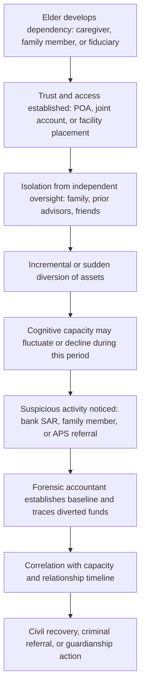

## Elder Financial Exploitation

### Overview and Definitional Framework

Elder financial exploitation (EFE) is the illegal or improper use of an older adult's funds, property, or assets, typically defined in statute as involving a victim aged 60 or 65 and older (the threshold varies by jurisdiction). Unlike many consumer scam typologies, EFE is distinguished by the frequent presence of a **relationship of trust** between perpetrator and victim — family member, caregiver, fiduciary, or close acquaintance — which materially changes both the investigative approach and the applicable legal framework compared to stranger-perpetrated fraud.

**Key Points**

- EFE spans a spectrum from outright theft to subtle, incremental diversion of assets facilitated by diminished capacity, isolation, or dependency.
- [Unverified] Prevalence estimates vary substantially across studies due to significant underreporting — victims often fail to report due to shame, fear of losing independence, or dependency on the perpetrator (frequently a family member) — so any specific statistic should be verified against the source and year cited.
- Forensic accountants engage with EFE cases in probate/estate disputes, guardianship/conservatorship proceedings, criminal prosecutions, and civil recovery actions, often requiring integration with capacity assessments from medical or psychological experts.

### Taxonomy of Elder Financial Exploitation

#### Perpetrator Relationship Categories

- **Family member exploitation**: The most commonly identified category in adult protective services data — adult children, spouses, or other relatives misusing joint accounts, powers of attorney, or inherited-asset expectations to divert funds.
- **Caregiver exploitation**: Paid or unpaid caregivers (in-home aides, facility staff) leveraging physical access and dependency to extract funds, gifts, or property transfers.
- **Fiduciary abuse**: Misuse of a legally granted role — power of attorney (POA), trustee, court-appointed guardian/conservator, or representative payee — to divert assets beyond authorized scope.
- **Professional/advisor exploitation**: Financial advisors, attorneys, or insurance agents recommending unsuitable products (e.g., high-commission annuities) or directly misappropriating client funds.
- **Stranger/scam-based exploitation**: Overlaps significantly with consumer scam typologies (romance scams, government impersonation, tech support scams) covered under separate scheme categories, but classified as EFE specifically due to the victim's age and often heightened vulnerability.

#### Mechanism-Based Categories

- **Undue influence**: Systematic psychological manipulation to override the victim's free will in financial decision-making — a legal concept distinct from fraud, often requiring expert testimony on the relationship dynamics, victim isolation, and the perpetrator's control over information/access.
- **Financial abuse via power of attorney**: Using a validly executed POA beyond its authorized scope (e.g., using a POA intended for bill-paying to transfer real property to oneself).
- **Forced or coerced changes to estate documents**: Pressuring an elder to alter a will, trust, or beneficiary designation shortly before death, particularly where the change deviates sharply from a long-standing prior estate plan.
- **Joint account misuse**: Adding oneself to an elder's bank account for "convenience" and then withdrawing funds for personal use beyond what was authorized or intended.
- **Predatory lending and reverse mortgage abuse**: Steering elderly homeowners into loan products with excessive fees or unsuitable terms, sometimes in coordination with home repair scams.
- **Guardianship/conservatorship abuse**: A court-appointed fiduciary billing excessive fees, commingling funds, or liquidating assets without court authorization.

### The Vulnerability and Exploitation Framework

| Risk Factor Category | Examples |
| --- | --- |
| Cognitive | Mild cognitive impairment, dementia, or diminished capacity affecting financial judgment |
| Social | Isolation, recent widowhood, limited family contact, reliance on a single caregiver |
| Physical | Mobility limitations increasing dependency on others for banking/errands |
| Financial | Significant liquid assets or home equity, unfamiliarity with digital banking |
| Situational | Recent bereavement, hospitalization, or major life transition creating decision-making vulnerability |

**Key Points**

- These factors are risk indicators, not diagnostic proof of exploitation — a forensic accountant should avoid conflating vulnerability with an assumption that exploitation necessarily occurred, and should rely on documented transactional and behavioral evidence.
- The presence of **capacity fluctuation** (common in early-stage dementia) is a recurring complicating factor: an elder may have been fully capable of understanding a transaction on one day and significantly impaired on another, making timeline reconstruction critical to establishing when questionable transactions began.

### Forensic Accounting Role in Elder Financial Exploitation Cases

#### Transaction Pattern Analysis

- **Baseline behavioral modeling**: Establishing the victim's historical spending, gifting, and account activity patterns (often over 3–5 years) to identify deviations coinciding with the alleged perpetrator's increased involvement.
- **Timeline correlation**: Mapping the onset of atypical transactions against key relationship events — introduction of a new caregiver, granting of a POA, a cognitive decline diagnosis, or isolation from other family members.
- **ATM and cash withdrawal pattern analysis**: Sudden increases in cash withdrawals inconsistent with the victim's documented needs, particularly when the victim has limited mobility and would not personally be making frequent ATM visits.

#### Asset and Fund Tracing

- **Tracing diverted funds**: Following transfers from the elder's accounts into the perpetrator's accounts, real property purchases, or lifestyle spending — often using standard forensic tracing methods (direct tracing, lowest intermediate balance rule when funds are commingled).
- **Real property transaction analysis**: Reviewing deed transfers, reverse mortgage proceeds, and home equity line draws for consistency with the elder's stated intent and market-value fairness.
- **Gift and transfer legitimacy assessment**: Distinguishing between genuine gifts (consistent with prior gifting patterns and the elder's expressed wishes) and coerced or undue-influence transfers, often requiring correlation with capacity and relationship evidence.

#### Damages and Restitution Calculation

- Quantifying the **total diverted amount**, often reduced to a net figure after accounting for any legitimate caregiving compensation or authorized reimbursements.
- Calculating **prejudgment interest** or investment-growth-adjusted damages (i.e., what the diverted funds would have grown to had they remained invested) in civil recovery actions.
- In guardianship/conservatorship abuse cases, auditing fiduciary accountings against court-approved budgets and identifying unauthorized disbursements or excessive fee-taking.

### Legal and Regulatory Framework

- **State Adult Protective Services (APS) statutes**: Mandate investigation of reported elder abuse, including financial exploitation, and often authorize emergency protective orders freezing suspect accounts.
- **Mandatory reporting laws**: Many jurisdictions require certain professionals (bank employees, healthcare providers, financial advisors) to report suspected elder financial exploitation.
- **Elder abuse-specific criminal statutes**: Many jurisdictions impose enhanced penalties when fraud or theft victims meet the statutory age threshold, compared to general fraud statutes.
- **FinCEN guidance on elder financial exploitation**: U.S. financial institutions are encouraged (and in some cases required under state law) to file Suspicious Activity Reports (SARs) specifically flagging suspected EFE, creating a valuable evidentiary trail for investigators.
- **Uniform Power of Attorney Act (or state equivalents)**: Governs fiduciary duties of an agent acting under a POA, providing the civil liability framework for POA abuse claims.
- [Unverified] The precise reporting thresholds, immunity protections for reporters, and available civil remedies vary significantly by state/jurisdiction; practitioners should confirm current statutory language for the relevant jurisdiction.

### Red Flags for Investigators and Financial Institutions

- Sudden change in account activity: new joint owner added, large or frequent cash withdrawals, or a new beneficiary designation shortly after a cognitive decline diagnosis.
- A caregiver or family member who insists on being present during all banking interactions and answers questions on the elder's behalf.
- Isolation of the elder from previously involved family members or long-standing financial advisors.
- Unexplained inability to pay for necessities (medications, utilities, facility fees) despite apparently sufficient documented assets.
- New "friends" or romantic interests appearing rapidly with access to or influence over financial decisions.
- Legal documents (wills, POAs, deeds) executed with unfamiliar witnesses/notaries or during a period of documented hospitalization or cognitive impairment.
- A financial advisor recommending products with unusually high commissions or surrender charges unsuitable for a client's age and liquidity needs.

### Illustrative Example

An 82-year-old widow with early-stage dementia grants her newly hired live-in caregiver a limited power of attorney intended solely for bill payment while her son is overseas. Over 18 months, the caregiver uses the POA to: (1) add herself as a joint owner on the victim's primary checking account, (2) transfer $95,000 from a certificate of deposit into the joint account, and (3) spend approximately $60,000 on personal expenses including a vehicle and travel, while isolating the victim from her son's phone calls.

A forensic accountant retained by the son (as newly appointed conservator) would:

1. Reconstruct the victim's pre-caregiver baseline spending and account activity for the prior three years.
2. Trace the CD liquidation and subsequent joint-account disbursements, applying tracing rules to distinguish the victim's legitimate expenses from the caregiver's personal spending.
3. Correlate the timeline of the dementia diagnosis, POA execution, and onset of atypical transactions to support an undue-influence and lack-of-capacity argument.
4. Quantify total diverted funds ($60,000 documented personal spending, with the remaining $35,000 subject to further tracing) and calculate any applicable investment-growth adjustment for the civil recovery claim.
5. Prepare a summary exhibit correlating financial transactions with relationship and capacity milestones for use in both the civil suit and a parallel APS/criminal referral.

### Elder Financial Exploitation Investigation Framework (svg_diagram)

<svg xmlns="http://www.w3.org/2000/svg" viewBox="0 0 900 430" font-family="Arial, sans-serif">
<text x="450" y="25" font-size="16" font-weight="bold" text-anchor="middle">Elder Financial Exploitation Investigation Framework (svg_diagram)</text>
<rect x="30" y="55" width="220" height="65" rx="8" fill="#dce6f7" stroke="#333" />
<text x="140" y="80" font-size="12" text-anchor="middle" font-weight="bold">Establish Baseline</text>
<text x="140" y="98" font-size="10" text-anchor="middle">3-5 yr historical spending,</text>
<text x="140" y="112" font-size="10" text-anchor="middle">gifting, and account pattern</text>
<rect x="340" y="55" width="220" height="65" rx="8" fill="#dce6f7" stroke="#333" />
<text x="450" y="80" font-size="12" text-anchor="middle" font-weight="bold">Identify Deviation Point</text>
<text x="450" y="98" font-size="10" text-anchor="middle">Onset of atypical transactions,</text>
<text x="450" y="112" font-size="10" text-anchor="middle">new POA, or caregiver arrival</text>
<rect x="650" y="55" width="220" height="65" rx="8" fill="#dce6f7" stroke="#333" />
<text x="760" y="80" font-size="12" text-anchor="middle" font-weight="bold">Correlate with Capacity</text>
<text x="760" y="98" font-size="10" text-anchor="middle">Medical records, diagnosis</text>
<text x="760" y="112" font-size="10" text-anchor="middle">timeline, isolation evidence</text>
<line x1="250" y1="88" x2="335" y2="88" stroke="#333" stroke-width="2" marker-end="url(#arrow3)" />
<line x1="560" y1="88" x2="645" y2="88" stroke="#333" stroke-width="2" marker-end="url(#arrow3)" />
<line x1="450" y1="120" x2="450" y2="155" stroke="#333" stroke-width="2" marker-end="url(#arrow3)" />
<rect x="150" y="165" width="600" height="70" rx="8" fill="#fce8d5" stroke="#333" />
<text x="450" y="190" font-size="12" text-anchor="middle" font-weight="bold">Fund Tracing</text>
<text x="450" y="208" font-size="10" text-anchor="middle">Direct tracing / lowest intermediate balance rule through joint accounts,</text>
<text x="450" y="223" font-size="10" text-anchor="middle">real property transfers, and personal spending</text>
<line x1="450" y1="235" x2="450" y2="270" stroke="#333" stroke-width="2" marker-end="url(#arrow3)" />
<rect x="150" y="280" width="280" height="65" rx="8" fill="#e2f0d9" stroke="#333" />
<text x="290" y="305" font-size="12" text-anchor="middle" font-weight="bold">Damages Quantification</text>
<text x="290" y="322" font-size="10" text-anchor="middle">Diverted funds net of legitimate</text>
<text x="290" y="337" font-size="10" text-anchor="middle">caregiving costs + growth adjustment</text>
<rect x="470" y="280" width="280" height="65" rx="8" fill="#e2f0d9" stroke="#333" />
<text x="610" y="305" font-size="12" text-anchor="middle" font-weight="bold">Legal Referral Package</text>
<text x="610" y="322" font-size="10" text-anchor="middle">APS report, criminal referral,</text>
<text x="610" y="337" font-size="10" text-anchor="middle">and/or civil recovery exhibit</text>
<line x1="290" y1="345" x2="290" y2="375" stroke="#333" stroke-width="2" />
<line x1="610" y1="345" x2="610" y2="375" stroke="#333" stroke-width="2" />
<line x1="290" y1="375" x2="610" y2="375" stroke="#333" stroke-width="2" />
<rect x="330" y="385" width="240" height="40" rx="8" fill="#f4cccc" stroke="#333" />
<text x="450" y="410" font-size="11" text-anchor="middle" font-weight="bold">Restitution / Guardianship Order</text>
</svg>

### Elder Financial Exploitation Case Progression (Mermaid)

### Common Pitfalls in Elder Financial Exploitation Investigations

- **Assuming all atypical transactions are exploitative**: elders may legitimately choose to gift assets, change estate plans, or compensate a caregiver generously; the forensic focus should be on capacity, undue influence indicators, and deviation from documented prior intent — not merely the transaction's size.
- **Delayed reporting eroding evidence**: cognitive decline in the victim can make it increasingly difficult to obtain reliable victim testimony as a case progresses, making early documentation and interviews critical.
- **Failing to integrate medical/capacity evidence**: financial transaction analysis alone rarely proves undue influence or lack of capacity; the strongest cases combine forensic accounting with medical records and, where available, expert testimony on cognitive status.
- **Overlooking fiduciary fee abuse in guardianship cases**: excessive or undocumented fees by a court-appointed guardian/conservator can be a subtler but still material form of exploitation, requiring line-item audit against court-approved budgets.
- **Ignoring the "double victim" dynamic**: an elder may resist cooperating with an investigation into a family member due to love, shame, or fear of retaliation/abandonment, requiring careful, non-adversarial interview approaches.

**Related Topics**

- Undue influence and testamentary capacity disputes
- Power of attorney abuse and fiduciary duty breaches
- Guardianship and conservatorship accounting audits
- Consumer scams and confidence schemes (romance and impersonation overlap)
- Suspicious Activity Report (SAR) analysis for financial institutions
- Estate and probate litigation support
- Tracing methodologies: direct tracing and lowest intermediate balance rule
- Adult Protective Services (APS) referral and reporting frameworks