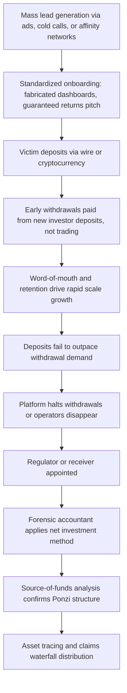

## Mass-Marketing and Investment Fraud

### Overview and Definitional Framework

Mass-marketing fraud (MMF) refers to schemes that use mass communication techniques — direct mail, telemarketing, mass email, social media advertising, or online platforms — to solicit a large number of victims simultaneously, in contrast to the individualized, relationship-based targeting typical of confidence schemes. Investment fraud targeting consumers is frequently delivered through mass-marketing channels, making the two categories substantially overlapping in practice, though not identical: mass-marketing fraud also encompasses non-investment schemes (fake sweepstakes, counterfeit goods, subscription traps) that share the "one-to-many" solicitation structure.

**Key Points**

- The defining structural feature of MMF is **scale and standardization**: a single script, landing page, or advertisement is deployed against thousands of potential victims, with conversion rates often in the low single digits still yielding substantial aggregate proceeds.
- Investment fraud specifically requires proof that the perpetrator offered a **security or investment contract** (implicating securities law) as opposed to a generic product or service, which affects the applicable regulatory and prosecutorial framework (SEC/state securities regulators vs. FTC/consumer protection agencies).
- Forensic accountants are central to these cases because the schemes typically leave a large, structured universe of victim-transaction data suitable for statistical loss modeling and pattern-based fund tracing.

### Taxonomy of Mass-Marketing and Investment Fraud Schemes

#### Investment-Specific Schemes

- **Ponzi schemes**: New investor funds used to pay purported "returns" to earlier investors, with no underlying legitimate income-generating activity (covered in greater depth as a dedicated topic, but frequently marketed via mass channels — seminars, radio ads, affinity group newsletters).
- **Pyramid schemes**: Returns dependent on recruitment of new participants rather than any genuine product sale or investment performance; often disguised as multi-level marketing (MLM).
- **High-yield investment programs (HYIPs)**: Online platforms promising unrealistic fixed daily/weekly returns, typically collapsing once new deposits fail to outpace withdrawal demands.
- **Cryptocurrency and forex trading fraud**: Fake exchanges, fraudulent "trading bots" or algorithmic trading platforms, and manipulated dashboards showing fabricated gains — often intersecting with "pig butchering" schemes discussed under consumer scams.
- **Pump-and-dump schemes**: Coordinated promotion (via mass email blasts, social media, or paid stock newsletters) of a low-float security to inflate its price, followed by insider selling before the price collapses on unsuspecting mass-marketed buyers.
- **Promissory note and "risk-free" fixed-income fraud**: Sale of purported low-risk notes (often targeting retirees) paying above-market fixed returns, frequently a Ponzi structure in substance.
- **Binary options fraud**: Offshore platforms offering all-or-nothing options contracts with statistically rigged payout structures and, in many documented cases, outright refusal to process withdrawals.

#### Non-Investment Mass-Marketing Schemes

- **Sweepstakes and lottery fraud**: Victim notified of a large prize contingent on payment of upfront "taxes" or "processing fees."
- **Fake debt collection and phantom debt schemes**: Mass calling campaigns demanding payment on debts that are fabricated, already discharged, or belong to someone else.
- **Timeshare resale and exit scams**: Upfront fees collected for a promised timeshare sale or exit that never occurs.
- **Health and wellness/"miracle cure" marketing fraud**: Mass-marketed products with fraudulent health claims, frequently targeting elderly or chronically ill populations.
- **Subscription traps and negative-option billing**: Free-trial offers converting to recurring charges that are deliberately difficult to cancel, often layered on top of an otherwise legitimate product.

### Structural Anatomy of a Mass-Marketing Investment Scheme

| Layer | Function |
| --- | --- |
| Lead generation | Purchased victim/marketing lists, social media ads, cold-call scripts, SEO-optimized fake review sites |
| Funnel/onboarding | Standardized sales scripts, fabricated performance dashboards, "account manager" assigned per victim cluster |
| Payment collection | Wire transfer, cryptocurrency, or payment processor accounts — frequently structured to evade card-network fraud monitoring |
| Retention | Fabricated statements, small permitted withdrawals, upsell to "VIP" tiers requiring larger deposits |
| Exit/collapse | Platform ceases operating, communication stops, or a final large "fee" is demanded before disappearance |

### Forensic Accounting Role in Mass-Marketing and Investment Fraud

#### Ponzi/Pyramid Scheme Forensic Analysis

- **Net Investment Method (Rosenberg/Ponzi accounting)**: A standard forensic technique in Ponzi litigation and bankruptcy proceedings that calculates each investor's "net loss" or "net winnings" as: total deposited minus total withdrawn, distinguishing genuine victims (net losers) from investors who received more than they invested (net winners), the latter often subject to **clawback** actions by a receiver or bankruptcy trustee.
- **Source-of-funds analysis**: Demonstrating that purported investment "returns" paid to earlier investors were sourced from later investors' principal rather than any legitimate trading or business activity — the core evidentiary element distinguishing a Ponzi scheme from a legitimate (if failed) investment.
- **Reconstruction of the "black box"**: Where a scheme claims proprietary trading algorithms or strategies, forensic accountants and often forensic technologists reconstruct actual bank and brokerage account activity to demonstrate the absence of any real trading consistent with claimed returns.

#### Aggregate Victim Loss Modeling

- **Statistical sampling and extrapolation**: In schemes with thousands of victims, forensic accountants often use representative sampling methodologies (validated against the full population where records permit) to estimate aggregate losses for restitution or class-action purposes.
- **Database reconciliation**: Matching victim complaint databases (FTC, SEC, state regulators) against subpoenaed bank and payment processor records to build a comprehensive victim ledger.
- **Waterfall/distribution modeling**: In receivership or bankruptcy contexts, calculating pro-rata distribution of recovered assets among net-loser victims according to the applicable claims methodology (net investment method being the most common court-approved approach in U.S. Ponzi receiverships, though not universal).

#### Fund Tracing Across Payment Rails

- **Payment processor and merchant account analysis**: Identifying the "money mule" merchant accounts or payment processors used to receive victim funds, particularly relevant where credit card payments were mischaracterized to evade card-network fraud/chargeback monitoring (a technique often termed **transaction laundering**).
- **Cryptocurrency wallet clustering**: Grouping wallet addresses used across a scheme to identify centralized control points and estimate the total scale of the fraud independent of individual victim reports.
- **Cross-border fund tracing**: Many mass-marketing fraud operations are based offshore or route funds through international shell entities, requiring coordination with foreign regulators and often mutual legal assistance treaty (MLAT) processes.

### Legal and Regulatory Framework

- **Securities Act of 1933 and Securities Exchange Act of 1934** (U.S.): Govern the offer and sale of securities; anti-fraud provisions (notably Section 10(b) and Rule 10b-5) are the primary basis for SEC enforcement against investment fraud.
- **State securities ("Blue Sky") laws**: Provide parallel and sometimes more accessible enforcement mechanisms, particularly for smaller-scale schemes below federal jurisdictional thresholds.
- **FTC Act Section 5 and the Telemarketing Sales Rule**: Govern non-securities mass-marketing schemes and telemarketing-specific practices (do-not-call violations, required disclosures).
- **Mail and wire fraud statutes**: Frequently used federal charging statutes given the interstate nature of mass-marketing schemes.
- **Receivership and bankruptcy trustee frameworks**: Once a scheme collapses, a court-appointed receiver or bankruptcy trustee typically engages forensic accountants to marshal remaining assets and administer victim claims.
- [Unverified] The specific claims methodology approved by a court (net investment vs. rising tide vs. other equitable approaches) varies by jurisdiction and case-specific facts; practitioners should confirm the methodology actually adopted in the relevant proceeding rather than assuming net investment method universally applies.

### Red Flags for Investigators and Financial Institutions

- Promised returns that are consistently high, suspiciously steady, and uncorrelated with broader market volatility (a hallmark **Madoff-style indicator**).
- Reluctance or inability to provide audited financial statements or verifiable third-party custodianship of assets.
- Complex or unnecessarily secretive investment strategy explanations ("proprietary algorithm," "arbitrage strategy") without verifiable underlying trading activity.
- Consistent difficulty or delay in processing withdrawal requests, particularly as deposit volume increases.
- Compensation structure heavily weighted toward recruiting new investors rather than the underlying product/investment performance.
- Payment requested via wire transfer or cryptocurrency only, avoiding traceable and reversible payment methods.
- Aggressive, high-pressure sales tactics emphasizing urgency ("limited spots," "rates dropping soon").

### Illustrative Example

An online platform marketed via social media advertisements offers a "proprietary AI trading algorithm" promising a guaranteed 5% weekly return. Over 14 months, the platform collects approximately $40 million from roughly 3,000 investors across multiple countries, paying early investors' "returns" from new deposits while the actual bank and cryptocurrency exchange accounts show no evidence of any trading activity. The platform collapses when withdrawal requests exceed new deposits, and the operators disappear.

A forensic accountant appointed as a receiver's financial advisor would:

1. Subpoena and reconcile all bank, payment processor, and cryptocurrency exchange records controlled by the scheme operators.
2. Apply the **net investment method** to the full victim database, calculating each investor's net deposits less withdrawals to classify net losers (entitled to a pro-rata claim) versus net winners (subject to potential clawback).
3. Perform source-of-funds analysis demonstrating that all "return" payments to early investors were funded exclusively by later investor deposits, with no independent trading revenue, supporting the Ponzi scheme classification for both criminal prosecution and civil receivership purposes.
4. Trace the approximately $8 million diverted to operators' personal use (real estate, luxury vehicles) for asset recovery and forfeiture.
5. Prepare a claims administration report proposing a pro-rata distribution waterfall for the roughly $12 million in recovered assets against approximately $32 million in aggregate net investor losses.

### Mass-Marketing Investment Fraud Structure (svg_diagram)

<svg xmlns="http://www.w3.org/2000/svg" viewBox="0 0 900 420" font-family="Arial, sans-serif">
<text x="450" y="25" font-size="16" font-weight="bold" text-anchor="middle">Mass-Marketing Investment Fraud Structure (svg_diagram)</text>
<rect x="30" y="55" width="180" height="55" rx="8" fill="#dce6f7" stroke="#333" />
<text x="120" y="78" font-size="11" text-anchor="middle" font-weight="bold">Lead Generation</text>
<text x="120" y="95" font-size="9" text-anchor="middle">Social media ads, cold calls</text>
<rect x="250" y="55" width="180" height="55" rx="8" fill="#dce6f7" stroke="#333" />
<text x="340" y="78" font-size="11" text-anchor="middle" font-weight="bold">Onboarding Funnel</text>
<text x="340" y="95" font-size="9" text-anchor="middle">Fabricated dashboard, scripts</text>
<rect x="470" y="55" width="180" height="55" rx="8" fill="#dce6f7" stroke="#333" />
<text x="560" y="78" font-size="11" text-anchor="middle" font-weight="bold">Deposit Collection</text>
<text x="560" y="95" font-size="9" text-anchor="middle">Wire, crypto, payment processor</text>
<rect x="690" y="55" width="180" height="55" rx="8" fill="#fce8d5" stroke="#333" />
<text x="780" y="78" font-size="11" text-anchor="middle" font-weight="bold">Retention</text>
<text x="780" y="95" font-size="9" text-anchor="middle">Fake returns, VIP upsell</text>
<line x1="210" y1="82" x2="245" y2="82" stroke="#333" stroke-width="2" marker-end="url(#arrow4)" />
<line x1="430" y1="82" x2="465" y2="82" stroke="#333" stroke-width="2" marker-end="url(#arrow4)" />
<line x1="650" y1="82" x2="685" y2="82" stroke="#333" stroke-width="2" marker-end="url(#arrow4)" />
<line x1="780" y1="110" x2="780" y2="140" stroke="#333" stroke-width="2" marker-end="url(#arrow4)" />
<rect x="580" y="150" width="290" height="55" rx="8" fill="#f4cccc" stroke="#333" />
<text x="725" y="172" font-size="11" text-anchor="middle" font-weight="bold">Collapse / Exit</text>
<text x="725" y="189" font-size="9" text-anchor="middle">Withdrawals halt, operators vanish</text>
<line x1="120" y1="110" x2="120" y2="230" stroke="#333" stroke-width="2" />
<line x1="120" y1="230" x2="725" y2="230" stroke="#333" stroke-width="2" />
<line x1="725" y1="205" x2="725" y2="230" stroke="#333" stroke-width="2" />
<rect x="30" y="240" width="230" height="70" rx="8" fill="#e2f0d9" stroke="#333" />
<text x="145" y="263" font-size="11" text-anchor="middle" font-weight="bold">Net Investment Method</text>
<text x="145" y="280" font-size="9" text-anchor="middle">Deposits minus withdrawals</text>
<text x="145" y="294" font-size="9" text-anchor="middle">per victim = net loss/gain</text>
<rect x="290" y="240" width="230" height="70" rx="8" fill="#e2f0d9" stroke="#333" />
<text x="405" y="263" font-size="11" text-anchor="middle" font-weight="bold">Source-of-Funds Analysis</text>
<text x="405" y="280" font-size="9" text-anchor="middle">Confirms returns paid from</text>
<text x="405" y="294" font-size="9" text-anchor="middle">new deposits, not trading</text>
<rect x="550" y="240" width="230" height="70" rx="8" fill="#e2f0d9" stroke="#333" />
<text x="665" y="263" font-size="11" text-anchor="middle" font-weight="bold">Asset Tracing</text>
<text x="665" y="280" font-size="9" text-anchor="middle">Real estate, luxury goods,</text>
<text x="665" y="294" font-size="9" text-anchor="middle">crypto wallet clustering</text>
<line x1="145" y1="230" x2="145" y2="235" stroke="#333" stroke-width="2" marker-end="url(#arrow4)" />
<line x1="405" y1="230" x2="405" y2="235" stroke="#333" stroke-width="2" marker-end="url(#arrow4)" />
<line x1="665" y1="230" x2="665" y2="235" stroke="#333" stroke-width="2" marker-end="url(#arrow4)" />
<line x1="145" y1="310" x2="145" y2="345" stroke="#333" stroke-width="2" />
<line x1="665" y1="310" x2="665" y2="345" stroke="#333" stroke-width="2" />
<line x1="145" y1="345" x2="665" y2="345" stroke="#333" stroke-width="2" marker-end="url(#arrow4)" />
<rect x="290" y="345" width="230" height="45" rx="8" fill="#fff2cc" stroke="#333" />
<text x="405" y="373" font-size="11" text-anchor="middle" font-weight="bold">Claims Waterfall Distribution</text>
</svg>

### Ponzi/Mass-Marketing Fraud Lifecycle (Mermaid)

### Common Pitfalls in Mass-Marketing and Investment Fraud Analysis

- **Misapplying loss methodology**: using a simple "amount invested" figure without netting withdrawals overstates victim losses and can misallocate limited recovered assets; courts in most U.S. Ponzi receiverships have favored the net investment method, though this is not automatic and should be confirmed for the specific proceeding.
- **Underestimating scheme scale from complaint data alone**: regulatory complaint databases typically capture only a fraction of actual victims; wallet clustering and payment processor data often reveal a materially larger victim population.
- **Failing to distinguish net winners from net losers early**: net winners may dissipate their gains before a clawback action is filed, making early identification and asset freezing critical to actual recovery.
- **Overlooking transaction laundering**: schemes often disguise the true nature of payments to evade card-network monitoring, requiring careful review of merchant category codes and processor relationships rather than face-value transaction descriptions.
- **Assuming securities jurisdiction automatically applies**: whether an "investment contract" meets the legal test for a security (e.g., the *Howey* test in the U.S.) is a threshold legal question that determines whether SEC/state securities regulators or FTC/consumer protection frameworks govern the case.

**Related Topics**

- Ponzi and pyramid scheme forensic accounting (net investment method, clawback litigation)
- Securities fraud and the Howey test for investment contracts
- Receivership and bankruptcy trustee asset marshaling
- Cryptocurrency tracing and wallet clustering methodologies
- Transaction laundering and payment processor fraud
- Consumer scams and confidence schemes (pig butchering overlap)
- Elder financial exploitation (overlapping victim population)
- Regulatory enforcement frameworks: SEC, state securities regulators, and FTC