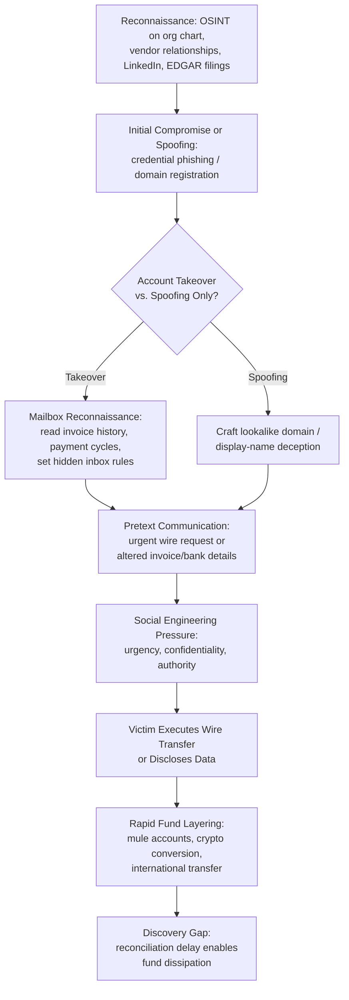

## Business Email Compromise and Phishing Schemes

### Overview and Definitional Framework

Business Email Compromise (BEC) is a category of cyber-enabled financial fraud in which a perpetrator compromises, spoofs, or impersonates a legitimate business email account to deceive an employee, customer, or vendor into transferring funds or disclosing sensitive information. Phishing is the broader technique — the delivery mechanism — through which credential theft, malware installation, or social engineering is initiated, typically via deceptive email, though it extends to SMS ("smishing"), voice ("vishing"), and collaboration platforms.

For forensic accounting purposes, BEC sits at the intersection of cybercrime and financial statement fraud: the mechanism is technical, but the loss manifests as a misappropriated cash disbursement, a fraudulent wire transfer, or a diverted accounts payable/receivable stream. The FBI's Internet Crime Complaint Center (IC3) classifies BEC as one of the most financially damaging categories of internet crime, consistently outranking ransomware in aggregate reported losses.

**Key Points**

- BEC is fraud executed *through* compromised or spoofed communications, not necessarily requiring malware.
- Phishing is the delivery vector; BEC is often (but not always) the *outcome*.
- The forensic accountant's role centers on loss quantification, transaction reconstruction, internal control failure analysis, and litigation support — not on technical incident response (which is IT/cybersecurity's domain).

### Taxonomy of BEC Schemes

**1. CEO Fraud / Executive Impersonation**

An attacker spoofs or compromises the email of a senior executive (CEO, CFO) and instructs an employee in finance/accounts payable to execute an urgent, confidential wire transfer. Social engineering leverages authority bias and urgency to bypass normal scrutiny.

**2. Vendor Email Compromise (VEC) / Invoice Fraud**

The attacker compromises a *supplier's* email account (or spoofs their domain) and sends a modified invoice with altered bank routing/account details to the legitimate customer, redirecting a genuine payment obligation to a fraudulent account. This is particularly dangerous because the underlying commercial transaction is real — only the payment instructions are falsified.

**3. Attorney/Escrow Impersonation**

Common in real estate and M&A closings; the fraudster impersonates legal counsel or an escrow/title agent at the critical moment of a large closing disbursement.

**4. Payroll Diversion**

The attacker impersonates an employee, requesting HR/payroll to redirect direct-deposit destination account details to an account the fraudster controls.

**5. Data Theft / W-2 Phishing**

Rather than requesting funds directly, the attacker impersonates an executive requesting employee PII (Forms W-2, Social Security numbers) — often a precursor to identity theft or subsequent, more targeted fraud.

**6. Account Compromise (Genuine takeover)**

Distinguished from spoofing: here the attacker gains actual credentials to a real mailbox (via prior phishing, credential stuffing, or malware) and operates from within the legitimate account, often creating inbox rules to hide or redirect replies — making this variant far harder to detect via header analysis alone.

### Technical Mechanics of Phishing Delivery

**Domain Spoofing and Lookalike Domains**

- **Homoglyph attacks**: substituting visually similar Unicode characters (e.g., Cyrillic "а" for Latin "a") in a domain name.
- **Typosquatting**: registering domains with common misspellings (`arnazon.com` for `amazon.com`) or added characters (`company-inc.com` vs. `companyinc.com`).
- **Subdomain deception**: `paypal.com.secure-verify.net` — the actual registered domain is `secure-verify.net`; `paypal.com` is merely a subdomain label designed to mislead at a glance.

**Email Authentication Protocol Failures**

BEC frequently exploits gaps in three interlocking email authentication standards:

- **SPF (Sender Policy Framework)**: A DNS TXT record listing IP addresses authorized to send mail for a domain. Fails to prevent *display name spoofing* since it only validates the envelope sender's domain, not the "From" header shown to the user.
- **DKIM (DomainKeys Identified Mail)**: Cryptographically signs outgoing messages; verifies message integrity and sender domain authenticity but doesn't inherently stop lookalike domains from having their own valid DKIM signatures.
- **DMARC (Domain-based Message Authentication, Reporting & Conformance)**: Instructs receiving servers what to do (`none`, `quarantine`, `reject`) when SPF/DKIM checks fail, and aligns the visible "From" domain with the authenticated domain. A domain with no DMARC policy, or a policy of `p=none`, offers effectively no enforcement — a critical control gap forensic accountants should flag when reviewing an organization's IT general controls (ITGCs).

$$\text{DMARC Alignment} = \begin{cases} \text{Pass} & \text{if RFC5322.From domain} = \text{SPF/DKIM authenticated domain} \\ \text{Fail} & \text{otherwise} \end{cases}$$

**Display Name Deception**

Because most mail clients (especially mobile) prominently show the display name rather than the full email address, an attacker can set the display name to "John Smith, CFO" while the underlying address is `[email protected]` — a technique requiring no domain compromise at all.

### The BEC Attack Lifecycle (Diagram)

### Forensic Accounting Response and Investigation

**Initial Loss Quantification**

The forensic accountant's engagement typically begins post-discovery. Core procedures include:

1. **Transaction tracing**: Reconstructing the payment instruction chain — original invoice, email correspondence, any amendment to banking details, approval workflow, and the actual wire transfer confirmation (SWIFT MT103 or ACH trace number).
2. **Timeline reconstruction**: Correlating email server logs (timestamps, IP addresses, message headers) with the organization's ERP/accounting system audit trail (who approved, who released payment, at what system time).
3. **Header analysis**: Examining full email headers (`Received:`, `Return-Path:`, `Authentication-Results:`) to establish [Verified] whether SPF/DKIM/DMARC checks passed or failed, and to identify originating IP addresses/mail servers — often via header fields not visible in the standard client view.
4. **Internal control gap analysis**: Documenting whether segregation of duties, callback verification procedures, or dual-authorization thresholds were bypassed or simply nonexistent.

**Recoverability Analysis**

[Inference] Recovery rates depend heavily on speed of reporting; funds reported to the bank/FBI's IC3 Recovery Asset Team within the "golden hours" (typically cited as within 24–72 hours) have a meaningfully higher probability of interdiction before layering is complete, though outcomes vary by jurisdiction, receiving bank cooperation, and fund velocity.

**Financial Statement and Disclosure Implications**

- Under U.S. GAAP, a material BEC loss is typically recorded as an operating expense (fraud loss) in the period discovered, unless insurance recovery is virtually certain, in which case a receivable may be recognized (ASC 450 contingency framework governs the recognition threshold for the offsetting recovery).
- SEC registrants must evaluate whether a BEC incident constitutes a reportable cybersecurity incident under Item 1.05 of Form 8-K (materiality-based disclosure, per the SEC's 2023 cybersecurity disclosure rules).
- Auditors (per AU-C 240 / PCAOB AS 2401) must assess whether the BEC exposes a **material weakness** in internal control over financial reporting (ICFR), particularly around wire transfer authorization controls.

### Illustrative Example: Vendor Email Compromise Walkthrough

A mid-size manufacturer, "Company A," has an established $85,000/month payable to "Vendor B." Vendor B's email account is compromised (credentials phished via a fake Office 365 login page). The attacker:

1. Monitors Vendor B's sent mail for 3 weeks, learning invoicing cadence and language style.
2. Sets a hidden inbox rule auto-forwarding/deleting any email containing "invoice" or "payment" from Vendor B's real domain to conceal the scheme from the real vendor.
3. Sends Company A's accounts payable clerk an email — from the *genuine* Vendor B address — stating: "Please note our bank has changed. Kindly update our ACH details for all future payments" with a forged bank letter attached.
4. Company A's AP clerk updates the vendor master file *without independent verbal verification via a previously known phone number* — a critical control failure.
5. The next $85,000 payment is routed to a mule account and withdrawn within 6 hours.

**Forensic finding**: Because the email genuinely originated from Vendor B's real, uncompromised-looking domain (it *was* their real account, just taken over), SPF/DKIM/DMARC checks would all legitimately *pass* — illustrating why authentication protocols alone cannot detect account-takeover-based BEC. The control failure was procedural (no callback verification for banking-detail changes), not technical.

### Detection and Preventive Controls

**Technical Controls**

- Enforced DMARC policy at `p=reject` (not merely monitoring at `p=none`)
- Banner warnings flagging external-domain emails, especially those spoofing internal display names
- Anomaly detection on inbox rule creation (a common indicator of account takeover)
- Multi-factor authentication (MFA) on all email accounts, particularly finance and executive roles

**Procedural / Governance Controls**

- **Out-of-band verification**: Any change to banking details or wire instructions must be confirmed via a phone number independently sourced (never one provided in the suspicious email itself).
- **Dual authorization** thresholds for wire transfers above a defined materiality level.
- **Positive pay** and bank-side transaction confirmation protocols.
- **Segregation of duties** between the party requesting a vendor master file change and the party approving payment release.

### Legal and Regulatory Landscape

- **Wire fraud statute (18 U.S.C. § 1343)**: The primary U.S. federal charge applied to BEC perpetrators.
- **Computer Fraud and Abuse Act (18 U.S.C. § 1030)**: Applies where unauthorized account access occurred (true account takeover vs. spoofing).
- **UCC Article 4A**: Governs commercial wire transfer liability allocation between banks and customers in the U.S., relevant to determining which party bears the loss when "commercially reasonable security procedures" were or were not followed.
- Insurance: Commercial crime policies increasingly carve out or sub-limit "social engineering fraud" separately from traditional "computer fraud" coverage, a distinction forensic accountants must understand when supporting insurance claims — [Unverified, policy-specific] the exact sub-limit language and definition of "fraudulent instruction" varies materially by carrier and policy form.

### Red Flags Checklist (Forensic Indicator Summary)

| Category | Indicator |
| --- | --- |
| Communication | Urgency, secrecy requests, avoidance of phone confirmation |
| Domain | Recently registered lookalike domain, subtle character substitution |
| Header | SPF/DKIM/DMARC failure, mismatched `Reply-To` vs. `From` |
| Behavioral | Request occurs outside normal approval cycle or cadence |
| Financial | Bank account change coincides with invoice timing |
| Mailbox | Presence of unexplained auto-forward/delete inbox rules |

**Related Topics**

- Ransomware extortion accounting and cryptocurrency ransom tracing
- Digital forensic evidence collection and chain of custody standards
- Fraud triangle and cyber-enabled occupational fraud
- Cryptocurrency tracing and blockchain forensic analysis
- Segregation of duties frameworks in treasury/cash disbursement cycles
- SEC cybersecurity incident disclosure rules (Item 1.05, Form 8-K)
- Insurance claim quantification for cyber and crime policies
- Identity theft and synthetic identity fraud schemes