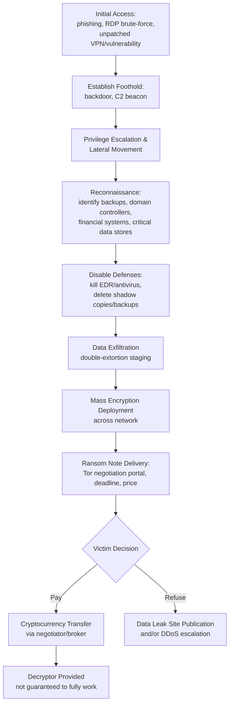

## Ransomware and Extortion-Based Cybercrime

### Overview and Definitional Framework

Ransomware is malicious software that encrypts an organization's data, systems, or backups, rendering them inaccessible until a ransom is paid — typically in cryptocurrency — for a decryption key. Extortion-based cybercrime has evolved substantially beyond simple encryption into a multi-layered coercion model. For forensic accountants, ransomware incidents generate complex questions of loss quantification, ransom payment legality, insurance recovery, and financial statement/disclosure treatment, distinct from the incident-response and remediation work performed by cybersecurity teams.

**Key Points**

- Modern ransomware is rarely a single-stage attack; it is typically the final payload of a broader network intrusion.
- The forensic accountant's role: loss quantification, business interruption calculation, ransom payment legal/compliance review, insurance claim support, and financial reporting/disclosure analysis.
- Ransomware-as-a-Service (RaaS) has industrialized the crime, separating malware developers from the affiliates who execute attacks.

### Evolution of Extortion Models

**1. Single Extortion (Encryption-Only)**

The original model: data is encrypted in place; the victim is denied access to their own systems. Payment is demanded solely for a decryption key. Recovery is theoretically possible via clean backups without paying.

**2. Double Extortion**

Attackers exfiltrate sensitive data *before* encrypting it, then threaten public release or sale of the stolen data if the ransom is not paid — a countermeasure against victims who can restore from backup without engaging the attacker. This shifts the loss profile from *availability* (business interruption) to *confidentiality* (data breach liability, regulatory notification obligations).

**3. Triple Extortion**

Adds a third pressure vector: direct threats to the victim's customers, patients, or business partners whose data was stolen, and/or distributed denial-of-service (DDoS) attacks against the victim's public-facing infrastructure to increase pressure during negotiation.

**4. Quadruple Extortion**

[Inference] Some threat intelligence reporting describes a further layer involving direct harassment of executives, board members, or the victim's clients via phone/email, alongside regulatory-complaint threats (e.g., threatening to report the victim to data protection authorities themselves) — though terminology in this space is not fully standardized across vendors.

### Technical Architecture of a Ransomware Attack

**Ransomware-as-a-Service (RaaS) Economics**

RaaS operators license malware and infrastructure to "affiliates" who conduct the actual intrusions, under a revenue-share arrangement.

$$\text{Affiliate Payout} = \text{Ransom Collected} \times (1 - r)$$

where $r$ represents the developer's commission rate, [Unverified — figures vary by group and are self-reported by threat actors or inferred from leaked chat logs] commonly cited in threat intelligence reporting as falling in a range of roughly 10–30%, though exact splits are not independently auditable.

### Cryptocurrency Payment Mechanics and Tracing

Ransom demands are almost universally denominated in cryptocurrency (historically Bitcoin; increasingly Monero for its enhanced privacy features, which resist blockchain analysis techniques effective against Bitcoin).

**Bitcoin Traceability**

Bitcoin's blockchain is a public, immutable ledger; every transaction is permanently visible, though pseudonymous (tied to wallet addresses, not directly to identities). Forensic tracing techniques include:

- **Clustering heuristics**: Grouping addresses likely controlled by the same entity based on co-spending patterns (the "common input ownership" heuristic).
- **Taint analysis**: Tracing the flow of specific "tainted" coins through subsequent transactions to identify cash-out points (typically exchanges).
- **Exchange chokepoints**: Since converting crypto to fiat currency generally requires an exchange, and major exchanges enforce Know-Your-Customer (KYC) requirements, this is frequently where law enforcement or forensic investigators can pierce pseudonymity — subject to the exchange's jurisdiction and cooperation.

**Monero and Privacy Coins**

Monero uses ring signatures, stealth addresses, and confidential transactions to obscure sender, receiver, and amount. [Inference] This substantially degrades — though does not necessarily eliminate entirely — the effectiveness of standard blockchain forensic techniques, which is a primary driver behind the increasing preference for Monero-denominated demands observed in recent threat intelligence reporting.

### Loss Quantification Framework (Forensic Accounting Focus)

A comprehensive ransomware loss model typically decomposes into the following categories:

**1. Direct Ransom Costs**

- Ransom payment (if made)
- Negotiator/incident-response retainer fees
- Legal counsel (breach coach) fees

**2. Business Interruption Losses**

Calculated similarly to traditional BI claims under property/cyber insurance policies:

$$\text{BI Loss} = (\text{Projected Revenue} - \text{Actual Revenue}) - \text{Saved Expenses} + \text{Extra Expense}$$

Where "Extra Expense" captures costs incurred specifically to mitigate the interruption (e.g., emergency manual processing, temporary system rental, expedited hardware replacement).

**3. Remediation and Restoration Costs**

- Forensic investigation fees
- System rebuild/re-imaging costs (often full rebuild is preferred over "cleaning" compromised systems given uncertainty about persistence mechanisms)
- Data restoration labor

**4. Notification and Credit Monitoring Costs**

Where personal data was exfiltrated (double extortion), costs of legally mandated breach notification and offered credit monitoring services to affected individuals.

**5. Regulatory Fines and Legal Liability**

Potential penalties under data protection frameworks (GDPR, state breach notification laws, HIPAA where applicable) and civil litigation exposure from affected third parties.

**6. Reputational/Intangible Costs**

[Inference] Lost customer trust and future revenue impact are widely discussed in post-incident analyses but are inherently difficult to isolate and quantify with precision, and are frequently excluded from formal insurance loss calculations absent a specific policy provision.

### Regulatory and Legal Considerations on Ransom Payment

**U.S. OFAC Sanctions Exposure**

The U.S. Treasury's Office of Foreign Assets Control (OFAC) has issued advisories warning that facilitating a ransom payment to a sanctioned entity or jurisdiction (certain ransomware groups have been directly sanctioned, e.g., Evil Corp) may itself constitute a violation of U.S. sanctions law, exposing the victim, its insurer, and any payment facilitator to strict-liability civil penalties **regardless of whether the payer knew** the recipient was sanctioned. This makes pre-payment sanctions screening (via blockchain analytics firms) a standard step in the ransom negotiation process.

**State-Level Payment Restrictions**

[Verified as of general knowledge; jurisdiction-specific details evolve] Several U.S. states have enacted or considered restrictions on ransom payments by public-sector entities specifically (e.g., prohibiting state agencies or municipalities from paying ransoms), reflecting a policy view that payment perpetuates the criminal business model.

**Disclosure Obligations**

- SEC registrants must assess materiality for Form 8-K Item 1.05 disclosure within four business days of determining materiality (not of the incident itself).
- Sector-specific reporting: critical infrastructure entities may face mandatory reporting obligations under frameworks such as CIRCIA (Cyber Incident Reporting for Critical Infrastructure Act) in the U.S.

### Insurance Claim Considerations

Cyber insurance policies typically bifurcate ransomware coverage into:

- **First-party coverage**: ransom payment reimbursement, business interruption, forensic/remediation costs, data restoration.
- **Third-party coverage**: liability arising from the breach (regulatory defense, litigation from affected customers).

Common claim friction points the forensic accountant should anticipate:

- **Sub-limits**: Ransomware/cyber-extortion coverage is frequently sub-limited well below the policy's overall limit.
- **War exclusion clauses**: Insurers have invoked "act of war" exclusions where a ransomware attack is attributed to a nation-state-affiliated group, a contentious and litigated area [Unverified/case-specific — the applicability of war exclusions has been the subject of notable insurance litigation, with outcomes turning on specific policy wording and attribution evidence].
- **Failure-to-maintain-security exclusions**: Insurers may deny claims where the policyholder failed to maintain represented security controls (e.g., MFA) as warranted in the application.

### Illustrative Example: BI Loss Calculation

A logistics company suffers a ransomware attack causing a 12-day full operational shutdown.

| Component | Amount |
| --- | --- |
| Average daily revenue (trailing 90-day baseline) | $240,000/day |
| Revenue during 12-day outage | $0 |
| Variable costs saved (fuel, hourly labor not incurred) | $18,000/day |
| Extra expense: manual dispatch overtime + temporary courier subcontracting | $310,000 total |
| Ransom paid (post-sanctions screening, no OFAC hit identified) | $650,000 |
| Forensic IR and legal fees | $275,000 |

$$\text{BI Loss} = (12 \times \$240{,}000) - (12 \times \$18{,}000) + \$310{,}000 = \$2{,}880{,}000 - \$216{,}000 + \$310{,}000 = \$2{,}974{,}000$$

$$\text{Total Claimed Loss} = \$2{,}974{,}000 + \$650{,}000 + \$275{,}000 = \$3{,}899{,}000$$

This total is then evaluated against applicable policy sub-limits, retentions/deductibles, and coinsurance provisions.

### Financial Reporting Treatment

- Ransom payments and remediation costs are generally expensed as incurred (operating expense), classified as unusual/nonrecurring items when material, subject to ASC 220's guidance on disclosure of unusual or infrequent items (note: GAAP no longer permits a separate "extraordinary item" classification following ASU 2015-01).
- An insurance recovery receivable is recognized only when recovery is *probable* (not merely possible), consistent with the ASC 450 gain-contingency threshold — recognition is typically deferred until the insurer has substantively confirmed coverage.
- Under ICFR evaluation (AS 2201/2401), auditors assess whether the ransomware incident indicates a **material weakness** in IT general controls (patch management, backup integrity, access controls, network segmentation) rather than treating it purely as a one-off operational event.

### Detection and Preventive Controls

**Technical**

- Immutable, offline (air-gapped) backups tested via regular restoration drills
- Network segmentation to limit lateral movement post-compromise
- Endpoint Detection and Response (EDR) with behavioral (not purely signature-based) detection
- Timely patch management, particularly for internet-facing VPN and RDP services

**Governance**

- A pre-negotiated incident response retainer (forensic firm, breach coach, ransom negotiator) established *before* an incident occurs
- A documented, board-approved ransom payment decision framework, including OFAC screening protocol
- Cyber insurance policy review to confirm sub-limits and exclusions align with realistic loss exposure scenarios

### Red Flags Checklist (Forensic Indicator Summary)

| Category | Indicator |
| --- | --- |
| Network | Unusual outbound data transfer volume preceding encryption event |
| Access | Disabled or uninstalled EDR/antivirus shortly before encryption |
| Backup | Deleted volume shadow copies, missing/corrupted backup sets |
| Financial | Large, unusual cryptocurrency purchase authorized under urgency |
| Communication | Ransom note referencing specific internal file names (proof of exfiltration) |
| Regulatory | Failure to complete sanctions screening prior to payment |

**Related Topics**

- Cryptocurrency tracing and blockchain forensic analysis methodologies
- Business email compromise and phishing schemes
- Cyber insurance policy structuring and claims dispute litigation
- OFAC sanctions compliance in digital asset transactions
- Business interruption loss quantification methodologies (non-cyber contexts)
- Data breach notification law compliance (state, federal, international)
- IT general controls (ITGC) testing in financial statement audits
- Digital forensic evidence collection and chain of custody standards