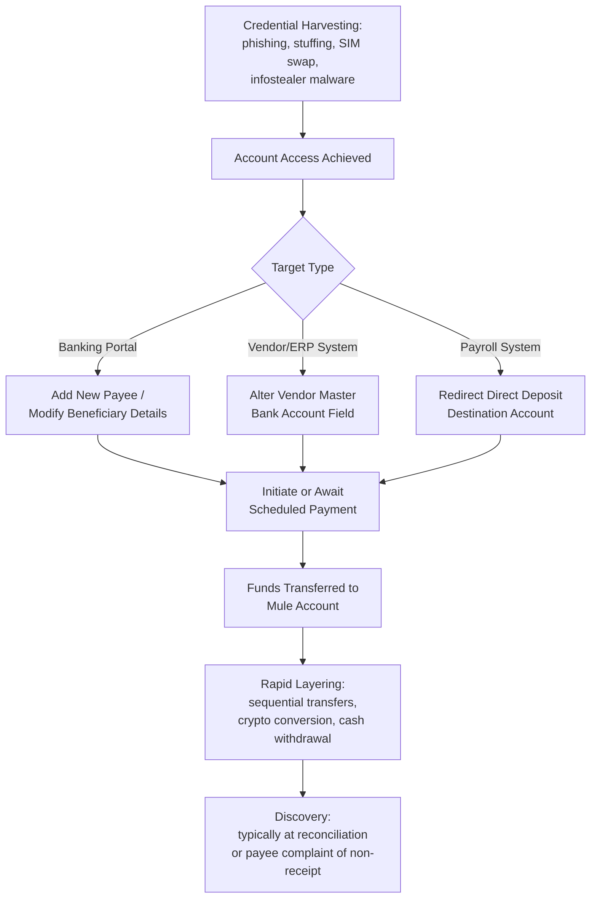

## Account Takeover and Payment Redirection Fraud

### Overview and Definitional Framework

Account Takeover (ATO) fraud occurs when a malicious actor gains unauthorized control of a legitimate account — banking, email, vendor portal, payroll system, or customer-facing platform — and exploits that access to conduct fraudulent transactions. Payment Redirection Fraud (PRF) is the financial-outcome subset of ATO (and of related social engineering schemes) in which legitimate, expected payments are diverted to accounts controlled by the fraudster, typically via falsified banking instructions.

While overlapping substantially with Business Email Compromise, ATO/PRF is treated as a distinct analytical category in forensic practice because the root compromise vector need not be email at all — it may involve banking portal credentials, ERP/vendor master file access, payroll self-service systems, or telecommunications-based SIM swapping. The unifying forensic characteristic is that a **trusted, pre-existing payment relationship** is exploited, distinguishing it from novel-relationship scams (e.g., advance-fee fraud) where no prior legitimate transaction history exists.

**Key Points**

- ATO is the *access* compromise; payment redirection is one of several possible *monetization* outcomes (others include data theft, further phishing pivots, or account draining).
- The forensic distinction from BEC: ATO/PRF may originate from banking credential theft, SIM swap, or ERP compromise rather than email compromise specifically.
- Central forensic question: at what point did payment instructions change, who approved the change, and what verification control (if any) was bypassed.

### Taxonomy of Account Takeover Vectors

**1. Credential-Based Takeover**

Obtained via phishing, credential stuffing (using breached password lists against multiple sites, exploiting password reuse), or malware-based keylogging/infostealers.

**2. SIM Swapping**

The attacker fraudulently convinces a mobile carrier to port the victim's phone number to a SIM card the attacker controls — typically via social engineering of carrier support staff or insider bribery — thereby intercepting SMS-based two-factor authentication (2FA) codes and enabling takeover of banking, email, and financial accounts that rely on SMS OTP as a second factor.

**3. Session Hijacking / Token Theft**

Rather than stealing a password, the attacker steals an active session cookie or authentication token (via malware, man-in-the-middle interception, or malicious browser extensions), bypassing the need to defeat MFA entirely since the session is already authenticated.

**4. Vendor/ERP Master File Compromise**

Direct unauthorized access to an organization's accounting system (e.g., ERP vendor master records) to alter banking details on file for a legitimate supplier, independent of any email interaction — detected only at the point of payment reconciliation rather than through email analysis.

**5. Insider-Facilitated Redirection**

[Inference] A meaningful subset of payment redirection incidents involve a compromised or complicit insider with legitimate system access modifying payment instructions directly, blurring the line between external cybercrime and internal occupational fraud — this scenario requires the forensic accountant to apply fraud triangle analysis (pressure, opportunity, rationalization) alongside technical forensic methods.

### Payment Redirection Attack Lifecycle

### Technical Mechanics: Defeating Authentication Controls

**SMS OTP Vulnerabilities**

SMS-based one-time passcodes are vulnerable not only to SIM swapping but also to SS7 protocol exploitation (interception of SMS at the telecom signaling layer) and to real-time phishing proxies that relay OTP codes entered by the victim on a fake site directly to the real site within the code's validity window.

$$\text{OTP Validity Window} \approx 30\text{–}300 \text{ seconds (typical)}$$

An adversary-in-the-middle (AiTM) phishing kit intercepts credentials *and* the OTP in real time, then immediately replays both to the legitimate service, capturing the resulting authenticated session token — a technique that defeats standard SMS and even app-based TOTP MFA, though it does **not** defeat properly implemented FIDO2/WebAuthn hardware security keys, since those bind the authentication cryptographically to the legitimate origin domain.

**Push Notification / "MFA Fatigue" Attacks**

Where MFA relies on push-notification approval (e.g., "Approve this login?"), attackers repeatedly trigger login attempts, hoping the victim eventually approves a notification out of habituation or annoyance ("MFA bombing" / "MFA fatigue").

### Forensic Investigation Methodology

**1. Establishing the Compromise Timeline**

- Correlate authentication logs (successful/failed login attempts, IP addresses, geolocation anomalies, device fingerprints) against the known window of fraudulent activity.
- For SIM swap cases: obtain carrier port-out records and timestamps to establish precisely when number control transferred.
- For ERP/vendor master compromise: use database audit trail / change-log tables (most modern ERPs log `modified_by`, `modified_date`, and often the prior value) to identify exactly who or what account altered banking details, and when.

**2. Payment Instruction Change Analysis**

The central forensic artifact in PRF cases is the **change history of banking details**. Key questions:

- Was the change request received via a channel independently verified (phone callback to a known number) or only via the same channel that could itself be compromised (email/portal)?
- Did the change bypass a maker-checker/dual-authorization control that should have applied?
- Is there a discrepancy between the *timing* of the banking change and the *timing* of the next scheduled payment (fraudsters typically time changes shortly before a known payment date)?

**3. Fund Flow Tracing**

- Identify the destination "mule" account — often a legitimate individual's compromised or knowingly complicit personal bank account used as a first-hop layering point.
- Request SAR (Suspicious Activity Report) coordination with receiving banks where possible; under the U.S. Bank Secrecy Act, financial institutions are required to file SARs for suspected fraud, which can assist recovery efforts though the SARs themselves are confidential and not directly obtainable by the victim.
- Map the layering chain: mule account → secondary accounts → cryptocurrency exchange or international wire out — the "golden hours" principle applies here as in ransomware/BEC: recovery probability [Inference] declines sharply as funds move through additional hops, particularly once converted to cryptocurrency or transferred cross-border to a jurisdiction with limited mutual legal assistance treaty (MLAT) cooperation.

### Illustrative Example: ERP-Based Payment Redirection

A mid-market construction firm's accounts payable clerk's ERP credentials are harvested via an infostealer malware infection (delivered through a malicious ad, unrelated to any phishing email). The attacker:

1. Logs into the ERP system directly using the stolen credentials — no suspicious email is ever sent, so email-header-based detection methods are entirely ineffective in this variant.
2. Navigates to the vendor master file for the firm's largest subcontractor and changes the ACH routing/account number field.
3. Waits 9 days until the subcontractor's next scheduled progress payment ($430,000) processes automatically through the firm's batch payment run.
4. Funds are transferred to a newly opened business bank account (a shell LLC formed days earlier) and withdrawn via multiple same-day cashier's checks before the subcontractor calls to inquire about the missing payment.

**Forensic finding**: The ERP audit log shows the vendor master change was made under the legitimate clerk's user credentials, at 2:47 AM local time — a timestamp inconsistent with the clerk's normal working hours pattern established from 90 days of prior login history, which is the key [Verified from log data] anomaly indicator supporting the credential-theft hypothesis over an insider-fraud hypothesis. No dual-authorization control existed for vendor banking-detail changes — the key control gap driving the loss.

### Loss Quantification and Recovery Considerations

Loss quantification for ATO/PRF follows a similar framework to BEC:

$$\text{Recoverable Loss} = \text{Gross Fraudulent Transfer} - \text{Interdicted/Recovered Amount} - \text{Unrecoverable Layered Funds}$$

Recovery mechanisms include:

- **Regulation E** (U.S., for consumer accounts): Provides consumer protections and liability limits for unauthorized electronic fund transfers, though its applicability is generally limited to *consumer* accounts, not business accounts.
- **UCC Article 4A**: Governs business wire transfer disputes; liability allocation hinges on whether the receiving bank followed a "commercially reasonable security procedure" agreed with the customer.
- **Bank indemnification claims**: Where the compromise occurred at the *bank's* platform level (e.g., a vulnerability in the bank's own portal) rather than the customer's environment, liability may shift toward the financial institution — a frequently litigated determination.

### Preventive and Detective Controls

**Technical**

- Phishing-resistant MFA (FIDO2/WebAuthn hardware keys) for banking portals, ERP systems, and payroll platforms — particularly for users with payment-initiation or vendor-master-edit privileges
- Carrier-level "port freeze" / PIN protection to mitigate SIM swap risk
- ERP-level dual-authorization workflow specifically for banking/beneficiary detail changes, separate from general vendor master edits
- Anomaly detection on ERP access (unusual login times, IP geolocation mismatches)

**Procedural**

- Mandatory out-of-band, independently sourced phone verification for *any* change to payment/banking instructions, regardless of the requesting channel's apparent legitimacy
- Positive pay and payee-name matching services offered by banks
- Segregation of duties: the individual who can modify vendor banking details should not be the same individual who can approve/release payment

### Red Flags Checklist (Forensic Indicator Summary)

| Category | Indicator |
| --- | --- |
| Access | Login from anomalous geolocation, device, or time-of-day |
| Change Log | Banking detail modification shortly before scheduled payment |
| Authentication | Sudden loss of mobile service (potential SIM swap indicator) |
| Behavioral | Repeated MFA push notifications shortly before unauthorized login |
| Payment | New payee added and immediately used for a large transfer |
| Control | Absence of dual-authorization on payment instruction changes |

**Related Topics**

- Business email compromise and phishing schemes
- SIM swap fraud and telecommunications carrier liability
- Vendor master file fraud in occupational/internal fraud contexts
- UCC Article 4A wire transfer liability allocation
- Fund flow tracing and mule account network analysis
- Multi-factor authentication architectures and phishing-resistant standards (FIDO2/WebAuthn)
- Bank Secrecy Act SAR filing and law enforcement recovery coordination
- Segregation of duties frameworks in treasury/cash disbursement cycles