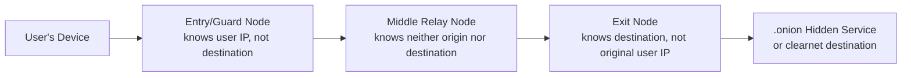

## Dark Web Marketplaces and Cyber-Enabled Fraud

### Overview and Definitional Framework

The "dark web" refers to a segment of the internet accessible only through specialized anonymizing software — most commonly The Onion Router (Tor) — that routes traffic through multiple encrypted relays to obscure the origin and destination of network requests, and hosts sites (typically `.onion` domains) not indexed by conventional search engines. This is distinct from the "deep web" (any content not indexed by standard search engines, including password-protected pages, private databases, and academic paywalled content — the vast majority of which is entirely legitimate) and the "surface web" (publicly indexed, conventionally accessible content).

Dark web marketplaces function as illicit e-commerce platforms facilitating the trade of stolen data, compromised credentials, malware tools, and fraud-enabling services. For forensic accountants, these marketplaces are the upstream infrastructure layer underpinning many of the fraud schemes examined elsewhere in this chapter (BEC, ransomware, ATO) — understanding their mechanics is essential to tracing the origin of compromised credentials, valuing stolen data exposure, and supporting law enforcement/insurance investigations.

**Key Points**

- Dark web ≠ deep web; the dark web is a small, deliberately anonymized subset requiring specific access software.
- Marketplaces operate with surprisingly conventional e-commerce features: vendor ratings, escrow, dispute resolution, and customer reviews.
- The forensic accountant's role centers on data breach exposure assessment, stolen-asset valuation, and fund-flow tracing through cryptocurrency payment rails used on these platforms — not on directly accessing or navigating the dark web itself, which is generally outside standard professional engagement scope.

### Technical Architecture of Tor and Onion Routing

Tor achieves anonymity through **onion routing**: a user's traffic is encrypted in multiple layers and routed through a minimum of three volunteer-operated relay nodes before reaching its destination.

Each relay in the circuit only knows the identity of the node immediately before and after it — no single node possesses both the origin and destination simultaneously, which is the structural basis of Tor's anonymity guarantee. Hidden services (`.onion` addresses) take this further by using rendezvous points so that even the *server's* location remains concealed from the client, not merely the client's location from the server.

[Inference] Tor's anonymity is probabilistic and infrastructure-dependent rather than absolute; documented deanonymization has historically resulted from correlation attacks (observing traffic timing at both entry and exit points, typically requiring resources associated with nation-state-level surveillance capability), server misconfiguration by operators, or operational security failures by users themselves rather than a cryptographic break of the Tor protocol.

### Marketplace Structure and Economic Model

**Product/Service Categories**

- **Stolen financial data**: Credit card "dumps" (raw magnetic stripe data) and "fullz" (complete identity packages — name, SSN, DOB, address, financial account details)
- **Compromised credentials**: Bulk username/password combinations from prior data breaches, sold for credential-stuffing attacks
- **Initial Access Broker (IAB) listings**: Access to already-compromised corporate networks, sold to ransomware affiliates who then conduct the actual encryption/extortion — a specialized division of labor within the broader cybercrime ecosystem
- **Malware-as-a-Service**: Ransomware builder kits, infostealer malware, phishing kits with pre-built lookalike login pages
- **Money laundering services**: Cryptocurrency "mixing"/"tumbling" services and mule account networks offered for hire

**Trust and Reputation Infrastructure**

Despite operating outside any legal framework, dark web marketplaces have converged on remarkably conventional trust mechanisms:

- **Vendor reputation scores** based on buyer feedback, analogous to conventional e-commerce ratings
- **Escrow services**: The marketplace holds cryptocurrency payment until the buyer confirms receipt of goods/services, mitigating (though not eliminating) exit-scam risk
- **Multi-signature escrow**: More sophisticated marketplaces use multi-sig cryptocurrency wallets requiring 2-of-3 signatures (buyer, vendor, marketplace arbitrator) to release funds, reducing the risk that any single party (including the marketplace operator) can unilaterally abscond with escrowed funds

### Pricing Structures for Stolen Data (Illustrative Market Patterns)

[Unverified — pricing fluctuates significantly based on data freshness, geographic origin, credit limit, and market supply/demand; figures below reflect general patterns reported across multiple threat intelligence sources rather than a single verified price list]

| Data Type | Approximate Price Range (illustrative) | Value Driver |
| --- | --- | --- |
| Stolen credit card number only | $5–$30 | Card brand, remaining validity |
| Full "fullz" identity package | $30–$100+ | Completeness, victim credit profile |
| Compromised email/password combo | $1–$10 (bulk) | Recency, associated service value |
| Corporate network initial access | $500–$10,000+ | Company size/revenue, sector, access privilege level |
| Compromised bank login (with balance) | Percentage of account balance (commonly cited 5–20%) | Account balance, institution |

### Cryptocurrency as the Transactional Backbone

Nearly all dark web marketplace transactions are denominated in cryptocurrency, historically Bitcoin, with a pronounced and accelerating shift toward Monero for reasons paralleling the ransomware payment discussion (privacy-by-design features resisting standard blockchain analysis).

**Marketplace-Level Laundering Techniques**

- **Chain-hopping**: Converting between multiple cryptocurrencies across several exchanges to break analytical continuity
- **Mixing services ("tumblers")**: Pooling many users' funds together and redistributing them, obscuring the direct transactional link between deposit and withdrawal
- **Peel chains**: A laundering pattern where a large amount is repeatedly split, with small "peeled" amounts sent to new addresses at each step while the remainder continues moving — a recognizable pattern to blockchain forensic analysts precisely because of its structural regularity

### Forensic Accounting Applications

**1. Data Breach Exposure and Notification Scope**

When client organizations discover their data for sale on a dark web marketplace (often via dark web monitoring services or law enforcement notification), the forensic accountant may be engaged to:

- Quantify the number of affected records and cross-reference against the organization's own customer/employee database to determine notification scope under applicable breach notification statutes
- Assess whether the exposed data matches data known to have been exfiltrated in a prior confirmed incident, or represents a *new*, previously undetected compromise

**2. Valuation of Stolen Data for Litigation/Insurance Purposes**

Quantifying the "loss" associated with data appearing on dark web marketplaces is analytically distinct from quantifying direct fraud losses:

$$\text{Notification Cost Estimate} = N_{\text{affected}} \times (\text{Cost}_{\text{notification}} + \text{Cost}_{\text{credit monitoring}})$$

where $N_{\text{affected}}$ is the confirmed or reasonably estimated number of exposed individuals. [Inference] Courts and insurers vary considerably in whether they recognize a standalone damages claim for the mere *exposure* of data (as opposed to demonstrated subsequent misuse), which remains an actively litigated question across U.S. jurisdictions, with outcomes turning heavily on specific state law and the degree of imminent-harm the plaintiff can demonstrate.

**3. Supporting Law Enforcement Investigations**

Forensic accountants frequently support (rather than independently conduct) law enforcement dark web investigations by:

- Providing internal financial and transaction records to correlate against blockchain analysis performed by specialized firms or law enforcement units
- Reconstructing the "before and after" financial picture once a marketplace or vendor account tied to a specific fraud loss has been identified through law enforcement seizure

**4. Marketplace Takedown Aftermath Analysis**

When law enforcement seizes a marketplace (historical examples include Silk Road, AlphaBay, Hydra Market), seized server data can sometimes be used to identify specific transaction histories relevant to a client's fraud investigation — though access to seized evidence is generally mediated through law enforcement/prosecutorial channels rather than direct forensic accountant access.

### Illustrative Example: Correlating a Dark Web Listing to a Client Incident

A regional credit union engages a forensic accounting team after a dark web monitoring vendor flags a listing offering "50,000 fullz — [Region] Credit Union members" for sale on a known marketplace.

1. **Sample verification**: Working through counsel and the monitoring vendor (never directly purchasing stolen data, which raises its own legal/ethical concerns), a limited redacted sample is obtained to compare record structure (field formatting, data elements included) against the credit union's actual database schema.
2. **Breach correlation**: The team cross-references the sample against known prior security incidents; the data structure matches a vendor's system that had a confirmed but previously unquantified breach 7 months earlier — establishing [Verified via internal system logs] that this marketplace listing corresponds to that specific known incident rather than a new, undetected compromise.
3. **Scope quantification**: Internal record counts confirm approximately 48,200 affected members meet the profile described, informing the notification-cost and credit-monitoring-cost estimate for the incident.
4. **Financial statement impact**: The credit union's forensic team works with the audit team to assess whether the now-confirmed scope of 48,200 affected records (versus an earlier, smaller preliminary estimate) requires a revision to a previously recorded loss contingency accrual under ASC 450.

### Legal and Ethical Boundaries for Investigators

- **Never directly purchase stolen data**: Doing so may itself constitute a criminal offense (trafficking in stolen financial information) in most jurisdictions, regardless of investigative intent; engagement with dark web marketplace content should be conducted by qualified specialists (often law enforcement or licensed threat intelligence firms) under appropriate legal authority.
- **Chain of custody**: Any evidence derived from dark web sources intended for litigation or law enforcement use must be collected and documented following forensically sound chain-of-custody procedures to preserve admissibility.
- **Jurisdictional complexity**: Dark web marketplace operators and servers are frequently distributed across multiple countries specifically to complicate law enforcement jurisdiction and extradition, a structural feature forensic investigators must account for when assessing realistic recovery or prosecution prospects.

### Detection and Monitoring Controls (Organizational Perspective)

- **Dark web monitoring services**: Continuous automated scanning of known marketplaces and forums for an organization's domain names, executive names, or known data patterns
- **Credential exposure monitoring**: Cross-referencing employee credentials against known breach compilation databases (e.g., "Have I Been Pwned"-style services) to trigger proactive password resets before exposed credentials are exploited
- **Threat intelligence integration**: Subscribing to Information Sharing and Analysis Center (ISAC) feeds relevant to the organization's sector for early warning of sector-targeted marketplace activity

### Red Flags Checklist (Forensic Indicator Summary)

| Category | Indicator |
| --- | --- |
| Data Structure | Exposed data field formatting matches a known internal system schema |
| Timing | Listing post-date correlates with a previously suspected but unconfirmed incident |
| Volume | Record count in listing exceeds previously scoped breach estimate |
| Payment | Unusual cryptocurrency purchase activity preceding a known compromise |
| Credential | Employee credentials found in bulk combo-list listings |
| Access Broker | Organization's domain referenced in "initial access" sale listings (precursor to ransomware) |

**Related Topics**

- Cryptocurrency tracing and blockchain forensic analysis methodologies
- Ransomware and extortion-based cybercrime
- Business email compromise and phishing schemes
- Data breach notification law compliance (state, federal, international)
- Money laundering typologies and Bank Secrecy Act compliance
- Digital forensic evidence collection and chain of custody standards
- Loss contingency accrual under ASC 450 in cyber incident contexts
- Identity theft and synthetic identity fraud schemes