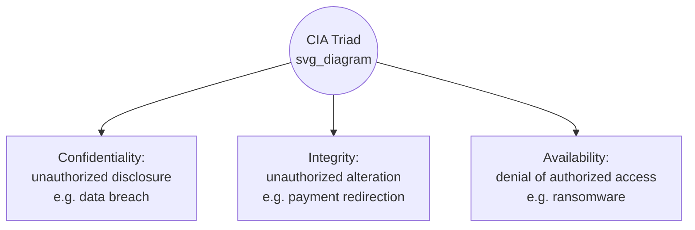

## Cybersecurity Fundamentals for Forensic Accountants

### Overview and Scope

Forensic accountants engaging in cyberfraud investigations are not expected to function as penetration testers or malware reverse-engineers — that expertise belongs to dedicated digital forensics and incident response (DFIR) specialists. Rather, the forensic accountant requires sufficient technical fluency to: (1) interpret DFIR findings and translate them into financial loss narratives, (2) evaluate whether an organization's cybersecurity controls were reasonably designed and operating (relevant to negligence, insurance, and ICFR determinations), (3) communicate credibly with technical experts, opposing counsel, and courts, and (4) recognize when specialized technical assistance is required versus when a finding can be assessed independently.

**Key Points**

- The forensic accountant's cybersecurity competency is *interpretive and evaluative*, not operational — understanding controls, terminology, and evidence types rather than performing technical remediation.
- Foundational frameworks (NIST CSF, CIA triad, defense-in-depth) provide the vocabulary for assessing control adequacy in litigation and audit contexts.
- A recurring professional risk is opining beyond one's technical competency; engagement letters and expert reports should clearly scope technical conclusions to those independently verifiable versus those relied upon from named technical specialists.

### The CIA Triad: Foundational Security Objectives

Information security is conventionally organized around three core objectives, against which any control or incident can be assessed:

- **Confidentiality**: Ensuring information is accessible only to authorized parties. A breach of confidentiality is a *data breach* (e.g., stolen customer PII).
- **Integrity**: Ensuring information remains accurate and unaltered except by authorized action. A breach of integrity might involve altered financial records or a modified vendor banking detail (directly relevant to payment redirection fraud).
- **Availability**: Ensuring authorized users can access information/systems when needed. Ransomware primarily attacks availability (encryption denies access) though modern double-extortion variants attack confidentiality simultaneously.

Mapping an incident to the CIA triad is a useful first analytical step because it clarifies *what kind* of loss occurred and therefore what quantification framework applies — an availability breach points toward business interruption calculations, while a confidentiality breach points toward notification cost and liability exposure analysis.

### Defense-in-Depth and Control Layering

Defense-in-depth is the principle that security should rely on multiple independent, overlapping control layers rather than any single control, such that the failure of one layer does not result in total compromise.

$$P(\text{breach}) = \prod_{i=1}^{n} P(\text{layer}_i \text{ fails})$$

[Inference] This multiplicative framing is a simplification useful for conceptual understanding of why layered controls reduce aggregate risk; in practice, control failures are often correlated rather than independent (e.g., a single phishing email can defeat both the "user awareness" layer and, if it harvests credentials that bypass MFA via AiTM proxy, the "authentication" layer simultaneously), so real-world risk reduction is generally less than the naive independent-probability multiplication would suggest.

**Typical Layer Structure (Outer to Inner)**

1. **Perimeter security**: Firewalls, email gateways, DNS filtering
2. **Network security**: Segmentation, intrusion detection/prevention systems (IDS/IPS)
3. **Endpoint security**: Antivirus/EDR (Endpoint Detection and Response)
4. **Application security**: Secure coding practices, web application firewalls
5. **Data security**: Encryption at rest and in transit, data loss prevention (DLP)
6. **Identity and access management**: MFA, least-privilege access, privileged access management
7. **Human layer**: Security awareness training, phishing simulation programs

For forensic purposes, an incident post-mortem essentially asks: *which layers existed, and at which layer did the failure chain actually break through* — this maps directly to assessing whether the organization's control environment was reasonably designed (relevant to negligence standards and ICFR material weakness determinations).

### Core Terminology and Concepts

**Threat, Vulnerability, and Risk**

- **Vulnerability**: A weakness in a system (unpatched software, misconfigured access control, untrained employee)
- **Threat**: A potential actor or event that could exploit a vulnerability (a specific ransomware group, a phishing campaign)
- **Risk**: The function of threat likelihood and vulnerability severity, generally expressed as $\text{Risk} = \text{Threat} \times \text{Vulnerability} \times \text{Impact}$

**Zero-Day Vulnerabilities**

A vulnerability unknown to the software vendor (and therefore unpatched) at the time it is actively exploited. Zero-day exploitation is forensically significant because it establishes that even a fully patched, well-maintained system could have been compromised — relevant to rebutting a negligence claim based on "failure to patch," since no patch existed at the time of compromise.

**Indicators of Compromise (IOCs)**

Forensic artifacts suggesting a system has been compromised: unusual outbound network traffic, unrecognized scheduled tasks, anomalous login times/locations, presence of known malicious file hashes, unexpected registry modifications, or newly created administrative accounts. Threat intelligence feeds catalog IOCs associated with known threat actor groups, enabling attribution correlation.

**Encryption Fundamentals**

- **Symmetric encryption**: Same key used to encrypt and decrypt (fast; used for bulk data encryption, including by ransomware itself)
- **Asymmetric encryption (public-key cryptography)**: A public key encrypts, a mathematically related private key decrypts; underpins digital signatures, DKIM email authentication, and TLS/HTTPS
- **Hashing**: A one-way function producing a fixed-length "fingerprint" of data; used for password storage (storing a hash rather than the plaintext password) and for forensic file integrity verification (a changed file produces a different hash, revealing tampering)

### Authentication and Access Control Concepts

**Authentication Factors**

- **Something you know**: Password, PIN
- **Something you have**: Hardware token, mobile device (SMS OTP, authenticator app)
- **Something you are**: Biometric (fingerprint, facial recognition)

Multi-factor authentication (MFA) combines two or more factor categories; note that a password plus a security question is *not* true MFA since both fall under "something you know."

**Principle of Least Privilege**

Users and systems should hold only the minimum access rights necessary to perform their function. In forensic reviews, a common control deficiency finding is *privilege creep* — accumulated excess access rights from role changes over time without corresponding access revocation — which materially expands the potential blast radius of any single compromised credential.

**Segregation of Duties (Cybersecurity Application)**

The accounting concept of segregation of duties has a direct cybersecurity analog: the person able to *modify* a system configuration (e.g., vendor banking details) should generally not be the same person able to *approve* the resulting transaction (payment release), and ideally a third party independently *reviews* the change log.

### Digital Evidence and Forensic Readiness Concepts

**Chain of Custody**

A documented, unbroken record of who collected, handled, and analyzed digital evidence, and when — essential to evidentiary admissibility. Forensic accountants relying on DFIR-collected evidence should confirm the DFIR provider maintained proper chain-of-custody documentation before incorporating findings into an expert report.

**Log Retention and Its Investigative Importance**

Authentication logs, firewall logs, and system audit trails are frequently the primary evidentiary basis for reconstructing an incident timeline. [Inference] A recurring practical challenge in these engagements is that many organizations retain such logs for shorter periods (sometimes 30–90 days) than the time elapsed before a breach is discovered, which can mean critical initial-access evidence is unavailable by the time an investigation begins — a gap the forensic accountant should note explicitly as a limitation on the certainty of investigative conclusions, rather than treating an absence-of-evidence finding as evidence of absence.

**Data Preservation ("Litigation Hold") in Cyber Incidents**

Upon reasonable anticipation of litigation or regulatory inquiry, organizations have a legal duty to suspend routine data destruction/log rotation policies for potentially relevant evidence — a determination the forensic accountant should flag early, since standard IT log-rotation schedules can otherwise inadvertently destroy key evidence before an investigation formally begins.

### Relevant Frameworks and Standards

**NIST Cybersecurity Framework (CSF)**

Organizes cybersecurity activities into five (now six, per CSF 2.0) core functions: **Govern**, **Identify**, **Protect**, **Detect**, **Respond**, **Recover**. [Verified — CSF 2.0, published 2024, added "Govern" as an explicit function alongside the original five]. This framework is frequently referenced in forensic reports as a structured basis for assessing whether an organization's overall security posture was reasonably designed, independent of any single control failure.

**ISO/IEC 27001**

An international standard for information security management systems (ISMS); certification (or lack thereof) is sometimes referenced in litigation as evidence of an organization's general security governance maturity, though certification alone does not establish that any *specific* relevant control was operating effectively at the time of an incident.

**SOC 2 Reports**

Service Organization Control reports (Type I: control design at a point in time; Type II: control operating effectiveness over a period) are commonly relevant where a *third-party vendor's* security posture is at issue — e.g., assessing whether a cloud service provider's SOC 2 report should have given the client comfort regarding vendor security, relevant to vendor-related breach liability allocation.

### Illustrative Example: Mapping an Incident to Control Layers for a Litigation Report

A forensic accountant is retained to assess whether a company's cybersecurity controls were "reasonably designed" following a BEC loss, for purposes of a dispute with its cyber insurer over a claimed policy exclusion (the insurer alleges the company failed to maintain "commercially reasonable" security as warranted in its policy application).

The analysis is structured layer-by-layer:

| Layer | Control Represented in Insurance Application | Actual State at Time of Incident | Gap? |
| --- | --- | --- | --- |
| Perimeter | Email gateway with anti-phishing filtering | Present and active | No |
| Identity/Access | MFA required for all email accounts | MFA enabled but **not enforced** for legacy accounts | **Yes** |
| Human | Annual phishing simulation training | Conducted, but 14 months prior (overdue) | **Yes** |
| Data | DMARC policy at enforcement level | DMARC present but set to `p=none` (monitor-only) | **Yes** |

**Forensic conclusion**: [Verified from configuration export and training records reviewed] Three of four represented controls were not operating as warranted at the time of the incident, materially supporting the insurer's position that the represented security posture was not accurately maintained — a finding the forensic accountant can support independently from configuration exports and training logs, without needing to opine on more technical questions (such as the specific phishing kit's code) that remain properly within the DFIR specialist's domain.

### Practical Boundaries of Forensic Accountant Competency

| Task | Appropriate for Forensic Accountant | Requires DFIR/Technical Specialist |
| --- | --- | --- |
| Interpreting log timestamps to build a financial timeline | Yes | — |
| Reading email headers for SPF/DKIM/DMARC pass/fail status | Yes | — |
| Reverse-engineering malware to identify its capabilities | — | Yes |
| Quantifying business interruption loss | Yes | — |
| Determining root-cause initial access vector with certainty | Collaborative | Yes |
| Assessing control design against a framework (NIST CSF) | Yes | — |
| Live network penetration testing / vulnerability scanning | — | Yes |
| Cryptocurrency wallet clustering and blockchain tracing | Collaborative (often via specialized blockchain forensic firms) | Yes |

**Related Topics**

- Business email compromise and phishing schemes
- Ransomware and extortion-based cybercrime
- Account takeover and payment redirection fraud
- Digital forensic evidence collection and chain of custody standards
- IT general controls (ITGC) testing in financial statement audits
- Expert witness standards and report scoping in forensic engagements (Daubert/Frye considerations)
- Cyber insurance policy structuring and claims dispute litigation
- NIST Cybersecurity Framework application in control adequacy assessments