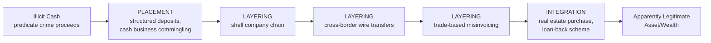

## Stages of Money Laundering: Placement, Layering, Integration

### Overview and Definitional Framework

Money laundering is the process by which the proceeds of criminal activity are disguised to appear as though they originated from a legitimate source, thereby allowing the criminal actor to use the funds without attracting law enforcement scrutiny to the underlying predicate offense. The three-stage model — **placement, layering, integration** — has been the dominant conceptual framework since its formalization by the Financial Action Task Force (FATF) and remains the standard analytical structure used by forensic accountants, compliance officers, and law enforcement to classify laundering activity and to design corresponding anti-money laundering (AML) detection controls.

**Key Points**

- The three stages are analytically distinct but frequently overlap or compress in practice, particularly in cyber-enabled and cryptocurrency-based laundering schemes.
- Each stage corresponds to a distinct detection opportunity and a distinct set of typical red flags that AML/BSA compliance programs are designed to identify.
- Not every laundering scheme employs all three stages formally or in strict sequence — smaller-scale or opportunistic laundering may compress layering and integration into a single step.

### Stage 1: Placement

Placement is the initial introduction of illicit cash or assets into the legitimate financial system. This is generally considered the stage at which the launderer is **most vulnerable to detection**, because it is the point of first contact between "dirty" funds (which, particularly in the case of physical cash from drug trafficking or other cash-intensive predicate crimes, exist entirely outside any financial institution's records) and the regulated financial system with its associated reporting and monitoring infrastructure.

**Common Placement Techniques**

- **Structuring ("smurfing")**: Breaking a large cash sum into multiple smaller deposits, each below the regulatory reporting threshold (in the U.S., the $10,000 Currency Transaction Report (CTR) threshold under the Bank Secrecy Act), often spread across multiple accounts, branches, or even multiple individuals ("smurfs") recruited to make deposits on the launderer's behalf. Structuring is itself a distinct federal criminal offense (31 U.S.C. § 5324) independent of the underlying predicate crime, precisely because law enforcement recognized structuring as a placement-stage red flag warranting standalone criminalization.
- **Cash-intensive business commingling**: Introducing illicit cash into a legitimate cash-heavy business (restaurants, car washes, vending machine operations, casinos) by recording it as ordinary sales revenue, blending it with genuine receipts so it appears as legitimate business income on deposit.
- **Bulk cash smuggling**: Physically transporting cash across borders to jurisdictions with less stringent reporting requirements before introducing it into the financial system.
- **Trade-based placement**: Purchasing high-value goods or assets (real estate, vehicles, art, precious metals) with cash, later converting the asset back to traceable funds via resale.
- **Cryptocurrency on-ramps**: Converting illicit cash to cryptocurrency through peer-to-peer exchanges, Bitcoin ATMs, or exchanges with weak Know-Your-Customer (KYC) enforcement — an increasingly significant placement vector given the direct interface between physical cash and a pseudonymous digital asset.

### Stage 2: Layering

Layering involves conducting a series of complex financial transactions designed to obscure the audit trail and separate the funds from their illicit origin, making it progressively more difficult for investigators to trace the money back to the underlying predicate crime. This is generally the most **technically sophisticated** stage and the one most heavily exploited by cyber-enabled laundering techniques.

**Common Layering Techniques**

- **Shell and shelf company networks**: Moving funds through a chain of corporate entities — often shell companies with no genuine business operations, sometimes layered across multiple jurisdictions with weak beneficial ownership disclosure requirements — to sever the transactional link back to the placement stage.
- **Wire transfer chains**: Rapidly transferring funds through multiple bank accounts, frequently across different countries and financial institutions, exploiting jurisdictional and time-zone gaps in AML monitoring coordination between institutions.
- **Trade-based money laundering (TBML)**: Manipulating trade documentation — over-invoicing, under-invoicing, phantom shipments, or misrepresenting goods quality/quantity — to move value across borders disguised as legitimate international trade, without necessarily any funds crossing borders in a form that triggers currency transaction reporting.
- **Cryptocurrency layering**: Using mixing/tumbling services, chain-hopping across multiple cryptocurrencies, and privacy coins (Monero) to obscure the transactional link between the placement-stage on-ramp and the eventual integration-stage off-ramp — directly analogous to the layering techniques discussed in dark web marketplace and ransomware payment contexts.
- **Nominee and straw-owner structures**: Using individuals who are not the true beneficial owner to hold accounts, property titles, or corporate directorships, inserting a layer of nominal ownership between the true beneficiary and the traceable asset.
- **Structured investment products**: Purchasing and quickly redeeming insurance products, securities, or other financial instruments to generate a "clean" transaction history disconnected from the original illicit deposit.

### Stage 3: Integration

Integration is the final stage, in which laundered funds are reintroduced into the legitimate economy in a form that appears entirely lawful — as investment returns, business profits, loan proceeds, or asset value — such that the funds can be used, spent, or invested without further concealment being necessary.

**Common Integration Techniques**

- **Real estate acquisition**: Purchasing property with laundered funds, which then appreciates and can be resold or leveraged as an apparently legitimate asset, generating "clean" rental income or resale proceeds.
- **Loan-back schemes**: The launderer's own layered funds (often routed through an offshore shell entity) are "lent back" to the launderer or an associated legitimate business, creating a plausible-looking loan liability and an apparently legitimate source of incoming capital, often with fabricated or minimal genuine interest/repayment terms.
- **Securities and investment vehicles**: Investing layered funds into stocks, bonds, or investment funds, generating investment returns that constitute a legitimate-appearing income stream.
- **Business acquisition or capital injection**: Using laundered funds to acquire or capitalize a legitimate operating business, after which the business's genuine revenue commingles with and legitimizes the original capital injection.
- **False invoicing for services rendered**: Generating fabricated invoices for consulting, licensing, or management fees between related entities, providing a documented (if fictitious) business rationale for the fund transfer that completes the integration.

### Overlap and Compression of Stages in Practice

[Inference] While the three-stage framework remains the standard pedagogical and regulatory model, real-world laundering schemes — particularly cyber-enabled ones — frequently compress or blend stages. For example, in a business email compromise scheme where stolen funds are immediately converted to cryptocurrency and moved through a mixing service before cashing out to a shell company's bank account, placement (the initial fraudulent wire transfer itself, treated by some analytical frameworks as effectively simultaneous with or a substitute for a traditional cash-placement step) and layering can occur within hours, compressing a process that traditional cash-based laundering might have spread across weeks or months. This compression is a significant driver behind the increased urgency of the "golden hours" principle applied throughout modern fraud recovery efforts.

### Detection Red Flags by Stage

| Stage | Red Flag Indicators |
| --- | --- |
| Placement | Multiple cash deposits just below CTR threshold; sudden deposit pattern inconsistent with known business type; deposits at multiple branches same day |
| Layering | Rapid, unexplained fund movement through multiple accounts with no apparent business purpose; wire transfers to/from high-risk jurisdictions; shell company transactions lacking economic substance |
| Integration | Asset purchases inconsistent with disclosed income; loan arrangements with unusual terms or from unrelated offshore lenders; sudden capital injection into a business with no clear funding source |

### Regulatory Framework Supporting Detection

**Bank Secrecy Act (BSA) and Related U.S. Requirements**

- **Currency Transaction Reports (CTRs)**: Required for cash transactions exceeding $10,000, the primary placement-stage detection trigger.
- **Suspicious Activity Reports (SARs)**: Filed by financial institutions upon detecting activity inconsistent with a customer's known, legitimate business or personal activity, applicable across all three stages but particularly central to layering-stage detection given the emphasis on unusual transactional patterns.
- **Customer Due Diligence (CDD) Rule**: Requires financial institutions to identify and verify beneficial ownership of legal entity customers, directly targeting the shell company and nominee structures central to the layering stage.

**FATF Recommendations**

The Financial Action Task Force's 40 Recommendations establish the international standard framework that most national AML regimes implement, including requirements around beneficial ownership transparency, correspondent banking due diligence, and cross-border wire transfer information ("travel rule") requirements — the latter specifically designed to preserve traceability information through the layering stage's characteristic multi-hop wire chains.

### Illustrative Example: End-to-End Laundering of BEC Proceeds

Following a $1.2 million business email compromise fraud (as discussed earlier in this chapter), the perpetrator's laundering network operates as follows:

1. **Placement (compressed/substituted)**: The fraudulent wire transfer itself lands directly in a "mule" business bank account opened under a shell LLC with a fabricated business purpose (the account itself having been effectively pre-placed into the banking system before the fraud occurred) — [Inference] in wire-fraud-sourced schemes, this initial receipt functionally substitutes for traditional cash placement, since the funds enter the banking system already in electronic form.
2. **Layering**: Within 4 hours, funds are split across six secondary mule accounts (structuring the outbound transfers to avoid triggering large-transaction alerts), then two-thirds of the total is converted to Bitcoin via a exchange with minimal KYC verification, run through a mixing service, and converted to Monero.
3. **Layering (continued)**: The remaining third is wired to a shell company's account in a jurisdiction with limited beneficial ownership disclosure requirements, then immediately re-wired to a second shell entity as a purported "consulting fee" payment.
4. **Integration**: Six weeks later, the Monero holdings are gradually converted back to fiat currency through a series of small, spaced-out over-the-counter (OTC) cryptocurrency trades (avoiding large-transaction detection thresholds), and the proceeds are used as a down payment on real estate held through a trust structure, while the shell company's "consulting fee" receipts are used to justify a capital contribution into a legitimate small business the perpetrator's associate operates.

**Forensic finding**: The multi-jurisdictional, multi-asset-class layering chain (banking → cryptocurrency → mixing → privacy coin → OTC conversion → real estate) illustrates why cyber-enabled laundering investigations increasingly require coordinated expertise spanning traditional forensic accounting, blockchain analysis, and international correspondent banking record requests — a single-discipline investigation is [Inference] generally insufficient to reconstruct the full chain in schemes of this complexity.

**Related Topics**

- Dark web marketplaces and cyber-enabled fraud
- Ransomware and extortion-based cybercrime
- Cryptocurrency tracing and blockchain forensic analysis methodologies
- Trade-based money laundering typologies and red flags
- Beneficial ownership transparency and shell company detection
- Bank Secrecy Act / FinCEN reporting requirements (CTR, SAR, CDD Rule)
- FATF Recommendations and international AML regulatory coordination
- Structuring offenses and currency transaction reporting thresholds