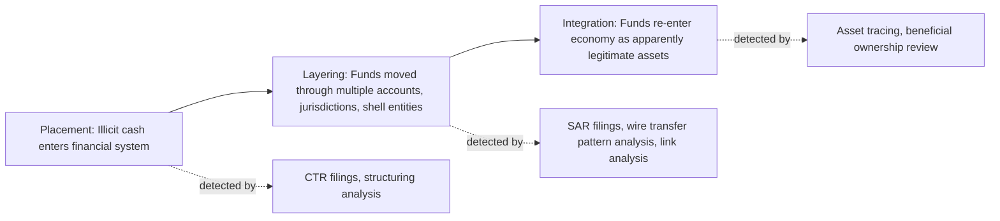

## Bank Secrecy Act and Anti-Money Laundering Regulations

### Overview

The Bank Secrecy Act (BSA) of 1970, formally the Currency and Foreign Transactions Reporting Act, is the foundational U.S. statute requiring financial institutions to assist government agencies in detecting and preventing money laundering. It has been substantially amended and expanded over five decades — most significantly by the USA PATRIOT Act (2001) and the Anti-Money Laundering Act of 2020 (AMLA) — to form the backbone of the U.S. anti-money laundering (AML) and counter-terrorist financing (CTF) regulatory regime. Forensic accountants operate within this framework both as compliance reviewers for regulated institutions and as investigators reconstructing laundering schemes for litigation, regulatory enforcement, or criminal prosecution.

### Statutory and Regulatory Architecture

**Key Points**

- **Bank Secrecy Act (1970)**: Established recordkeeping and reporting requirements for financial institutions; codified primarily at 31 U.S.C. §§ 5311–5332.
- **Money Laundering Control Act (1986)**: Made money laundering itself a federal crime (18 U.S.C. §§ 1956–1957), independent of the underlying predicate offense.
- **USA PATRIOT Act (2001)**: Expanded BSA obligations post-9/11, notably Title III, adding Customer Identification Program (CIP) requirements, expanded due diligence for correspondent and private banking accounts, and information-sharing provisions (Sections 314(a) and 314(b)).
- **Anti-Money Laundering Act of 2020 (AMLA)**: The most significant BSA overhaul since the PATRIOT Act; introduced beneficial ownership reporting requirements (via the Corporate Transparency Act), whistleblower incentives, and expanded FinCEN's rulemaking authority.
- **FinCEN (Financial Crimes Enforcement Network)**: A bureau of the U.S. Treasury Department that administers the BSA, issues implementing regulations, and maintains the reporting database used by law enforcement.

### Core Regulatory Requirements

#### Customer-Facing Obligations

**Customer Identification Program (CIP)**

- Requires verification of a customer's identity at account opening using government-issued identification, and retention of identifying records.
- Applies to banks, broker-dealers, mutual funds, and futures commission merchants.

**Customer Due Diligence (CDD) Rule**

- Requires identification and verification of beneficial owners (natural persons owning 25%+ or exercising significant control) of legal entity customers.
- Mandates ongoing monitoring to maintain and update customer risk profiles.

**Enhanced Due Diligence (EDD)**

- Applied to higher-risk customers: politically exposed persons (PEPs), correspondent accounts for foreign financial institutions, and private banking accounts for non-U.S. persons.

#### Reporting Requirements

**Key Points**

- **Currency Transaction Report (CTR)**: Filed for currency transactions exceeding $10,000 in a single business day, whether in one transaction or aggregated related transactions.
- **Suspicious Activity Report (SAR)**: Filed when a transaction, or pattern of transactions, appears designed to evade BSA requirements, has no apparent lawful business purpose, or involves funds derived from illegal activity — generally a $5,000 threshold for most institutions.
- **Report of Foreign Bank and Financial Accounts (FBAR)**: Filed by U.S. persons with financial interest in or signature authority over foreign accounts exceeding $10,000 in aggregate at any point in the year.
- **Form 8300**: Filed by trades or businesses (not just financial institutions) receiving more than $10,000 in cash in a single transaction or related transactions.
- **Currency or Monetary Instrument Report (CMIR)**: Required for physical transport of currency or monetary instruments exceeding $10,000 into or out of the United States.

SAR filings carry a strict confidentiality requirement — institutions and their employees are prohibited from disclosing to the subject of a SAR that a report has been filed ("tipping off"), a protection often referred to as SAR safe harbor when institutions file in good faith.

### AML Program Requirements ("Four Pillars")

Financial institutions must maintain a risk-based AML compliance program built on four (now effectively five, post-AMLA) pillars:

1. **Development of internal policies, procedures, and controls** tailored to the institution's risk profile.
2. **Designation of a BSA Compliance Officer** responsible for day-to-day program administration.
3. **Ongoing employee training** on BSA/AML obligations and red flags.
4. **Independent testing/audit** of the AML program, typically performed by an internal audit function or external firm.
5. **Risk-based procedures for conducting ongoing customer due diligence** (added as a fifth pillar under the 2016 CDD Rule).

### Enforcement Framework

**Regulatory and Examination Bodies**

- Federal banking regulators (OCC, Federal Reserve, FDIC) examine BSA/AML compliance under the FFIEC BSA/AML Examination Manual.
- FinCEN has direct enforcement authority and can impose civil monetary penalties.
- The Department of Justice pursues criminal prosecution for willful violations under 31 U.S.C. § 5322.
- OFAC (Office of Foreign Assets Control) enforces sanctions compliance, which operates alongside but distinctly from BSA/AML — sanctions screening (e.g., against the OFAC SDN list) is a related but separate compliance obligation.

**Penalty Structure**

- Civil penalties can reach the greater of the transaction amount or a statutory cap per violation, with penalties escalating for willful or systemic violations.
- Criminal violations can result in institutional and individual liability, including imprisonment for willful violations, particularly where the institution failed to maintain an effective AML program.
- [Unverified] Specific dollar penalty caps are periodically adjusted for inflation under the Federal Civil Penalties Inflation Adjustment Act; current figures should be verified against the latest FinCEN or federal register publication at the time of any engagement.

### Detection and Investigative Techniques (Forensic Accounting Application)

**Transaction Structuring Detection**

- "Smurfing" or structuring involves breaking large currency transactions into amounts below the $10,000 CTR threshold to evade reporting — itself a federal crime under 31 U.S.C. § 5324, independent of whether the underlying funds are illicit.
- Forensic analysis aggregates transactions across related accounts and time windows to identify structuring patterns invisible at the single-transaction level.

**Red Flag Indicators**

- Transactions inconsistent with a customer's stated business or income profile.
- Rapid movement of funds through multiple accounts with no apparent business rationale ("layering").
- Use of shell companies or nominee structures obscuring beneficial ownership.
- Frequent international wire transfers to jurisdictions flagged as high-risk by FATF (Financial Action Task Force).

**Placement-Layering-Integration Model**

### Example

A regional bank's transaction monitoring system flags a small retail business making eight cash deposits of $9,200–$9,800 across a two-week period, each just under the $10,000 CTR threshold. A forensic accountant engaged to review the account aggregates the deposits, calculates that they total $76,000 against a business with historically modest cash deposit volume, and cross-references the deposit dates against the business's point-of-sale records, finding no corresponding sales activity to support the cash volume. This pattern — deposits deliberately structured below the reporting threshold with no underlying business justification — supports both a SAR filing by the bank and a structuring referral under 31 U.S.C. § 5324.

### International Context

- The **Financial Action Task Force (FATF)** sets international AML/CTF standards; the U.S. framework is periodically evaluated against FATF's 40 Recommendations.
- The **Egmont Group** facilitates information sharing among Financial Intelligence Units (FIUs) globally, of which FinCEN is the U.S. member.
- [Inference] Cross-border investigations increasingly require coordination between FinCEN, foreign FIUs, and mutual legal assistance treaty (MLAT) processes, though the specific mechanics vary significantly by jurisdiction and treaty terms.

### Conclusion

The BSA and its amending statutes create a layered reporting and due-diligence framework designed to make the financial system a source of investigative evidence rather than a laundering conduit. For forensic accountants, mastery of CTR/SAR thresholds, the placement-layering-integration model, and structuring detection techniques is foundational to both regulatory compliance engagements and money laundering investigations. The AMLA's beneficial ownership reporting regime, implemented through FinCEN's beneficial ownership database, represents the most significant recent expansion of the framework's reach into previously opaque legal entity structures.

**Related Topics**

- Suspicious Activity Report (SAR) drafting standards and narrative construction
- Beneficial ownership reporting under the Corporate Transparency Act
- Structuring vs. legitimate business cash management: distinguishing indicators
- OFAC sanctions screening and its intersection with BSA/AML compliance
- Trade-based money laundering detection techniques
- Cryptocurrency and virtual asset service provider (VASP) AML obligations
- FATF Recommendations and mutual evaluation methodology