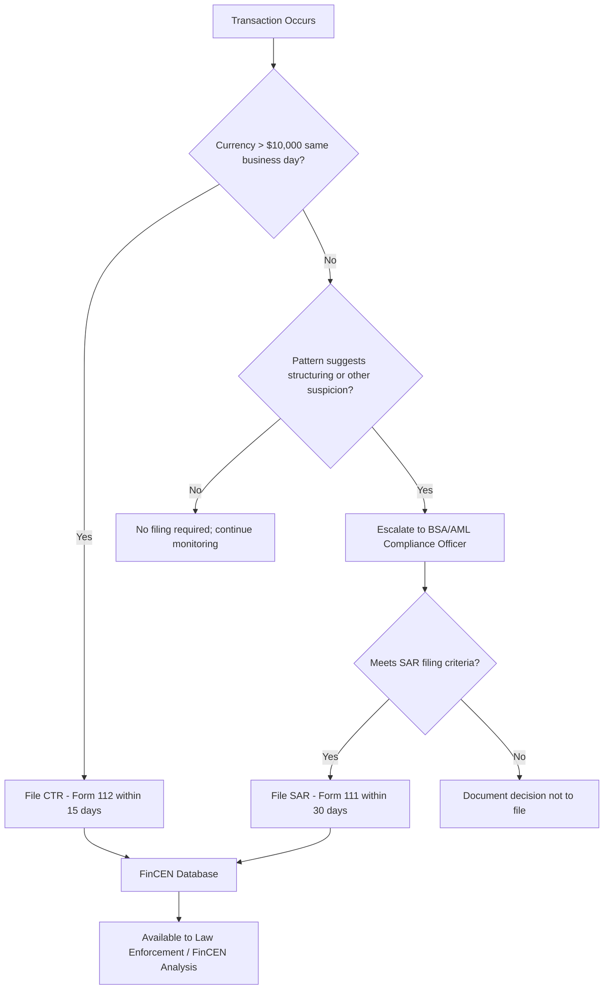

## Suspicious Activity Reports and Currency Transaction Reports

### Overview

Suspicious Activity Reports (SARs) and Currency Transaction Reports (CTRs) are the two primary reporting instruments through which financial institutions comply with Bank Secrecy Act (BSA) obligations to alert FinCEN and law enforcement to potentially illicit financial activity. While both feed into the same reporting infrastructure, they differ fundamentally in trigger conditions, thresholds, purpose, and confidentiality treatment. Forensic accountants engage with these reports both as preparers or reviewers within institutional compliance functions and as investigators using filed reports (or the underlying transaction data) to reconstruct financial crime patterns.

### Currency Transaction Reports (CTRs)

#### Regulatory Basis and Threshold

**Key Points**

- Required under 31 U.S.C. § 5313 and 31 CFR § 1010.311 for currency transactions exceeding $10,000 conducted by, through, or to a financial institution in a single business day.
- "Currency" refers specifically to coin and paper money (and, for these purposes, certain monetary instruments) — not checks, wire transfers, or electronic transactions, which are not currency transactions for CTR purposes.
- Multiple currency transactions by or on behalf of the same person during a single business day must be aggregated if the institution has knowledge that they are conducted by or on behalf of the same person, and if aggregated they exceed $10,000, a single CTR is filed.
- Filed via FinCEN Form 112, electronically through the BSA E-Filing System, generally within 15 days of the transaction.

#### Exemptions

- Certain "Phase I" and "Phase II" exempt persons — including other banks, government agencies, and qualifying business customers with a history of frequent large currency transactions — may be exempted from routine CTR filing under 31 CFR § 1020.315, subject to institutional risk-based review and annual reverification.
- Exemption does not eliminate the institution's obligation to monitor exempt customers for activity inconsistent with their expected profile.

#### Structuring: The CTR Evasion Offense

- Structuring — deliberately breaking transactions into amounts below $10,000 to avoid triggering a CTR — is itself a federal crime under 31 U.S.C. § 5324, regardless of whether the underlying funds are illicit.
- Courts have held (following *Ratzlaf v. United States*, 1994) that willfulness requires knowledge that structuring itself is unlawful, prompting subsequent statutory clarification tightening the willfulness standard for prosecution purposes.
- Forensic detection involves aggregating same-day or near-threshold transactions across related accounts, tellers, or branches to reveal patterns invisible at the individual-transaction level.

### Suspicious Activity Reports (SARs)

#### Regulatory Basis and Trigger Conditions

**Key Points**

- Required under 31 U.S.C. § 5318(g) and institution-specific implementing regulations (e.g., 31 CFR § 1020.320 for banks).
- Filed via FinCEN Form 111 (formerly SAR-DI/SAR-SF, now unified as the FinCEN SAR).
- General filing triggers (bank context): transactions involving $5,000 or more where the institution knows, suspects, or has reason to suspect that the transaction:
  - Involves funds derived from illegal activity or is intended to disguise such funds.
  - Is designed to evade BSA reporting requirements (e.g., structuring).
  - Has no apparent lawful business or economic purpose and the institution knows of no reasonable explanation after examining available facts.
  - Involves use of the institution to facilitate criminal activity.
- Filing deadline is generally 30 calendar days from initial detection of facts constituting a basis for filing, extendable to 60 days if no suspect is identified.
- Unlike CTRs, SARs have no minimum dollar threshold trigger tied to a bright-line currency amount in all cases — the $5,000 figure is a floor below which filing is generally not required, but suspicion, not amount, is the operative trigger.

#### Confidentiality and Safe Harbor

- 31 U.S.C. § 5318(g)(2) prohibits disclosure to the subject of a SAR that a report has been filed ("tipping off"), including in response to a subpoena or discovery request in civil litigation absent specific court authorization.
- Institutions and their employees who file SARs in good faith receive safe harbor protection from civil liability under § 5318(g)(3), even if the suspicion later proves unfounded.
- Internal SAR committees and documentation of the decision-making process are standard practice to demonstrate good-faith compliance and support the safe harbor defense.

#### SAR Narrative Construction

**Example**

A well-constructed SAR narrative follows the "who, what, when, where, why, and how" framework recommended by FinCEN:

- **Who**: Identifies the subject(s), including all known identifying information.
- **What**: Describes the specific instruments or mechanisms used (wire transfers, cash deposits, shell company accounts).
- **When**: Provides the date range of the suspicious activity.
- **Where**: Identifies the branch, account, or geographic locations involved.
- **Why**: Explains why the activity is considered suspicious relative to the customer's expected profile.
- **How**: Describes the method by which the suspicious activity was carried out, supporting law enforcement's ability to act on the report.

### CTR vs. SAR Comparison

| Attribute | CTR | SAR |
| --- | --- | --- |
| Statutory basis | 31 U.S.C. § 5313 | 31 U.S.C. § 5318(g) |
| Trigger | Currency transaction > $10,000 | Suspicion of illicit activity, no fixed currency threshold in all cases |
| Form | FinCEN Form 112 | FinCEN Form 111 |
| Filing deadline | 15 days | 30 days (60 if no suspect identified) |
| Confidentiality | Not confidential from customer | Strictly confidential; tipping-off prohibited |
| Purpose | Routine large-currency transparency | Flag activity suspected of illicit purpose |
| Aggregation required | Yes, same-day related transactions | N/A (based on pattern/suspicion, not aggregation threshold) |

### Reporting and Investigative Workflow

### Forensic Accounting Applications

**Investigative Use of Filed Reports**

- Law enforcement and forensic investigators can request FinCEN query access to aggregate SAR/CTR data to identify patterns across institutions that would be invisible to any single bank.
- Forensic accountants reconstructing a fraud or laundering scheme often work backward from known SARs (obtained via subpoena or law enforcement cooperation) to identify the full transaction network.

**Compliance Program Review**

- Independent testing of an institution's SAR/CTR program (the fourth AML pillar) involves sample testing of alert dispositions, timeliness of filings, and adequacy of narrative documentation.
- Forensic accountants may be engaged following a regulatory consent order to perform a "lookback" review — reexamining historical transactions over a defined period to identify previously unfiled SARs, often required as part of an enforcement remediation plan.

**Common Deficiencies Identified in Reviews**

- Alerts closed without adequate documentation of the investigative rationale.
- Failure to aggregate related transactions across multiple accounts or branches held by the same beneficial owner.
- Untimely filing beyond the 30/60-day window.
- Generic or conclusory SAR narratives lacking sufficient detail for law enforcement action.

### Conclusion

CTRs and SARs serve complementary but distinct functions within the BSA reporting regime: CTRs provide systematic transparency into large currency movements regardless of suspicion, while SARs capture judgment-based reporting of activity inconsistent with expected customer behavior, regardless of transaction size. Effective forensic accounting practice in this area requires fluency in both the mechanical filing requirements (thresholds, deadlines, aggregation rules) and the qualitative judgment involved in SAR narrative construction and alert disposition — skills equally relevant to compliance program design, regulatory lookback reviews, and reconstructing financial crime for litigation or prosecution.

**Related Topics**

- Structuring detection and 31 U.S.C. § 5324 prosecution standards
- BSA lookback reviews and regulatory consent order remediation
- Transaction monitoring system design and alert scoring methodology
- FinCEN 314(a)/314(b) information sharing mechanisms
- Beneficial ownership identification in SAR investigations
- Cryptocurrency exchange SAR/CTR equivalents (Convertible Virtual Currency reporting)