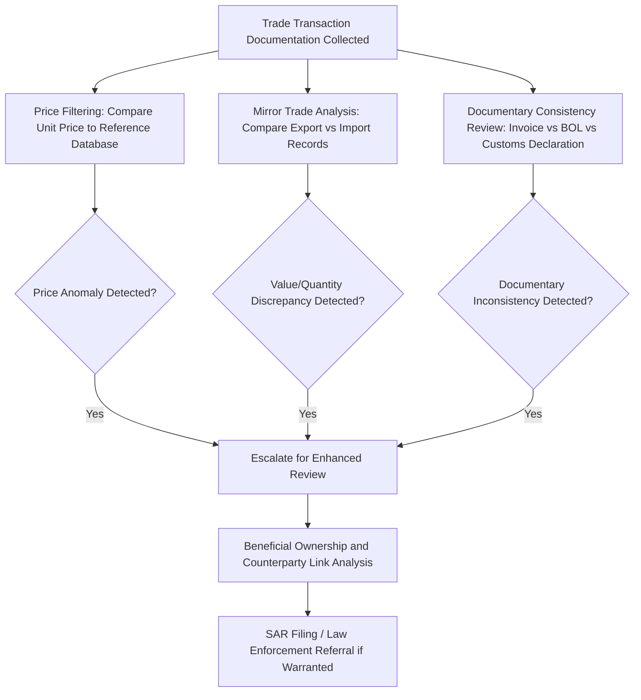

## Trade-Based Money Laundering

### Overview

Trade-based money laundering (TBML) is the process of disguising the proceeds of crime and moving value across borders through the manipulation of trade transactions — invoices, shipping documents, and payment instructions — rather than through traditional financial system channels. FATF (Financial Action Task Force) has identified TBML as one of the three primary methods of laundering illicit proceeds, alongside laundering through financial institutions and physical movement of cash. TBML is particularly significant to forensic accountants because it exploits the inherent complexity and documentary opacity of international trade, making it substantially harder to detect through conventional transaction monitoring designed for financial account activity.

### Why Trade Systems Are Vulnerable

**Key Points**

- The sheer volume of global trade (trillions of dollars annually) makes comprehensive customs scrutiny of every transaction impractical.
- Determining a "fair" price for goods is inherently subjective, especially for unique, customized, or illiquid goods, providing cover for price manipulation.
- Trade transactions typically involve multiple parties (importer, exporter, freight forwarders, customs brokers, banks) across multiple jurisdictions, fragmenting the audit trail.
- Documentary discrepancies between commercial invoices, bills of lading, and customs declarations are common even in legitimate trade, reducing the signal-to-noise ratio for detection.
- Trade finance instruments (letters of credit, documentary collections) add additional layers of paper that can be manipulated independently of the physical movement of goods.

### Core TBML Techniques

#### Price Manipulation

**Over-Invoicing and Under-Invoicing**

- **Over-invoicing**: Goods are invoiced above their fair market value, allowing the importer to transfer excess value to the exporter — effectively moving money out of the importing country disguised as a legitimate trade payment.
- **Under-invoicing**: Goods are invoiced below fair market value, allowing the importer to receive excess value (the goods are worth more than paid for), effectively moving money into the importing country while also potentially evading customs duties and taxes.
- [Inference] The direction of value transfer intended by the launderer (moving value into vs. out of a jurisdiction) determines whether over- or under-invoicing is used, since the technique is a tool serving whichever capital flow direction the scheme requires.

#### Quantity and Quality Manipulation

- **Over-shipment / under-shipment**: Invoicing for a quantity greater or lesser than what is physically shipped.
- **Phantom shipments**: Invoicing and paying for goods that are never shipped at all — the trade documentation exists purely to justify a financial transfer with no underlying commercial substance.
- **Multiple invoicing**: Issuing more than one invoice for the same shipment, allowing multiple payments to be justified by a single physical movement of goods.
- **Falsely described goods**: Misrepresenting the nature, quality, or grade of goods (e.g., describing high-value goods as low-value commodities) to justify a price mismatch or evade tariffs.

#### Structural and Documentary Techniques

**Complicit and Fictitious Entities**

- Use of shell companies or complicit trading partners who knowingly participate in the scheme without requiring genuine commercial justification for pricing anomalies.
- Layering through multiple intermediary trading companies across several jurisdictions to obscure the ultimate beneficial parties and break the audit trail.

**Trade Finance Instrument Abuse**

- Manipulation of letters of credit to justify payments against fraudulent or altered shipping documents.
- Black market peso exchange (BMPE)-style schemes historically used trade transactions to convert drug proceeds in the United States into pesos in Colombia by having peso brokers purchase U.S. goods on behalf of Colombian importers using drug dollars, with goods then shipped and sold in Colombia — a hybrid TBML/currency exchange scheme.

### Illustrative Diagram: Over/Under-Invoicing Value Flow (svg_diagram)

<svg xmlns="http://www.w3.org/2000/svg" viewBox="0 0 760 380">
\<style\>
text { font-family: Arial, sans-serif; }
.title { font-size: 15px; font-weight: bold; fill: #1a1a1a; }
.label { font-size: 12px; fill: #1a1a1a; }
.small { font-size: 10.5px; fill: #444; }
.box { fill: #eef2f7; stroke: #3b5b82; stroke-width: 1.5; }
.arrow { stroke: #b03a2e; stroke-width: 2; fill: none; marker-end: url(#arrowhead); }
.goodsflow { stroke: #2e7d32; stroke-width: 2; fill: none; stroke-dasharray: 5,3; marker-end: url(#arrowhead2); }
\</style\>
<text x="380" y="25" text-anchor="middle" class="title">Trade-Based Money Laundering: Over-Invoicing Flow (svg_diagram)</text>
<rect x="40" y="70" width="160" height="70" rx="6" class="box" />
<text x="120" y="100" text-anchor="middle" class="label">Importer</text>
<text x="120" y="118" text-anchor="middle" class="small">(Country A)</text>
<rect x="560" y="70" width="160" height="70" rx="6" class="box" />
<text x="640" y="100" text-anchor="middle" class="label">Exporter</text>
<text x="640" y="118" text-anchor="middle" class="small">(Country B, complicit)</text>
<path d="M200,90 L560,90" class="arrow" />
<text x="380" y="80" text-anchor="middle" class="small">Payment: $500,000 (invoiced)</text>
<text x="380" y="62" text-anchor="middle" class="small" fill="#b03a2e">Actual goods value: $100,000</text>
<path d="M560,120 L200,120" class="goodsflow" />
<text x="380" y="145" text-anchor="middle" class="small" fill="#2e7d32">Physical goods shipped (true value $100,000)</text>
<rect x="270" y="200" width="220" height="90" rx="6" class="box" />
<text x="380" y="228" text-anchor="middle" class="label">Net Effect</text>
<text x="380" y="250" text-anchor="middle" class="small">$400,000 excess value transferred</text>
<text x="380" y="267" text-anchor="middle" class="small">from Importer to Exporter</text>
<text x="380" y="284" text-anchor="middle" class="small">disguised as a trade payment</text>
<path d="M120,140 L270,220" class="small" stroke="#888" stroke-width="1" fill="none" stroke-dasharray="2,2" />
<path d="M640,140 L490,220" class="small" stroke="#888" stroke-width="1" fill="none" stroke-dasharray="2,2" />

<text x="380" y="330" text-anchor="middle" class="small" font-style="italic">Trade documentation (invoice, bill of lading) shows a legitimate transaction;</text>

<text x="380" y="348" text-anchor="middle" class="small" font-style="italic">the price gap is the laundering mechanism, not the physical shipment.</text>

</svg>

### Detection Methodologies

#### Price Filtering Analysis

**Key Points**

- Customs and trade data analytics compare the unit price of a reported shipment against a reference range derived from global trade databases (e.g., aggregated customs data for the same Harmonized System (HS) code, country pair, and time period).
- Transactions with unit prices falling outside statistically expected bounds (e.g., beyond a defined percentile threshold) are flagged for further review — a technique often called "price filtering" or trade price anomaly detection, used by agencies such as U.S. Immigration and Customs Enforcement's Trade Transparency Unit (TTU).
- [Inference] Effectiveness of price filtering depends heavily on the granularity and reliability of the reference trade database; thinly traded or highly customized goods produce wider legitimate price variance and higher false-positive rates.

**Mirror Trade Analysis**

- Compares export data reported by the exporting country against corresponding import data reported by the importing country for the same nominal transaction.
- Significant discrepancies in reported value, quantity, or goods description between the two countries' customs records indicate potential manipulation, since legitimate trade should reconcile closely between paired customs filings (accounting for freight, insurance, and normal reporting lag).

#### Red Flag Indicators

- Significant price discrepancies between the invoiced amount and the fair market value of comparable goods.
- Complex financing structures inconsistent with the underlying trade transaction's ostensible commercial purpose.
- Shipment routing through jurisdictions with no logical commercial relationship to the goods or parties involved.
- Repeated use of the same shell companies as counterparties across unrelated transactions.
- Inconsistencies between the description of goods on the commercial invoice, packing list, and bill of lading.
- Transactions involving high-risk jurisdictions with weak customs enforcement or known TBML typologies.
- Third-party payments — payment for goods made by an entity other than the buyer named on the trade documents, with no clear commercial rationale.

### TBML Detection Workflow

### Example

A forensic accountant reviewing a mid-sized electronics importer's records notices that invoices for a specific component consistently price the item at three times the average unit price reported in comparable customs filings for the same HS code and country pair over the prior two years. Mirror trade analysis reveals that the exporting country's customs records report a significantly lower export value for the same nominal shipments than the importer's declared value. Combined with the discovery that the exporter is a recently formed entity with no verifiable operating history and shares a registered address with two other counterparties used by the importer, these findings support a conclusion that the arrangement is being used to transfer value out of the importing jurisdiction disguised as legitimate trade payments — warranting a SAR filing and referral to law enforcement.

### International and Regulatory Framework

- **FATF** has published specific typology reports on TBML, establishing it as a recognized ML/TF methodology requiring dedicated detection frameworks distinct from financial-sector AML controls.
- **World Customs Organization (WCO)** promotes information-sharing frameworks between customs administrations to support mirror trade analysis.
- In the U.S., **Trade Transparency Units (TTUs)**, coordinated through Homeland Security Investigations (HSI), conduct bilateral trade data comparison with partner countries to identify TBML indicators.
- Trade finance banks are subject to enhanced due diligence expectations under BSA/AML frameworks specifically addressing TBML risk in letter-of-credit and documentary collection transactions.

### Conclusion

Trade-based money laundering exploits the complexity, documentary volume, and cross-border fragmentation inherent in international trade to move value while evading the transaction-monitoring controls built around the financial sector. Detection requires specialized analytical techniques — price filtering against reference trade databases, mirror trade analysis between paired customs jurisdictions, and documentary consistency review — that differ meaningfully from the account-based red flags used in traditional AML monitoring. For forensic accountants, TBML investigations typically require integrating customs data analysis, corporate structure and beneficial ownership investigation, and international trade finance expertise into a single evidentiary narrative.

**Related Topics**

- Customs fraud and tariff evasion schemes
- Black market peso exchange and hybrid currency/trade laundering
- Letter of credit fraud and trade finance document manipulation
- Shell company identification in cross-border transaction networks
- Free trade zone exploitation for laundering purposes
- Harmonized System (HS) code analysis and price filtering methodology