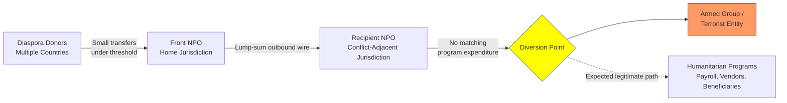

## Terrorist Financing Methods and Detection

### Overview and Conceptual Distinction from Money Laundering

Terrorist financing (TF) refers to the solicitation, collection, or provision of funds with the intention that they be used, in full or in part, to carry out terrorist acts or to support terrorist organizations. It is regulated alongside money laundering (ML) under most Anti-Money Laundering/Combating the Financing of Terrorism (AML/CFT) regimes, but the two phenomena are economically and behaviorally distinct.

**Key Points**

- **Direction of flow**: Money laundering disguises the illegal origin of funds so they can be used legitimately (dirty money → clean money). Terrorist financing may use funds of entirely legitimate origin (donations, salaries, business profits) and direct them toward an illegal purpose (clean money → illegal use). The "placement, layering, integration" model does not map neatly onto TF.
- **Transaction size**: ML often involves large sums requiring concealment; TF transactions are frequently small, incremental, and designed to stay below reporting thresholds, since operational terrorist activity (e.g., a single attack) can be inexpensive.
- **Source legitimacy**: A significant share of TF funds originate from lawful sources (charitable donations, legitimate businesses, self-funding through employment) rather than criminal proceeds, making source-of-funds analysis less diagnostic than for ML.
- **End use**: ML is agnostic about end use once funds are "cleaned." TF is defined by the intended end use (violent or organizational support), which can make funds "tainted" even without any predicate crime generating them.

### Regulatory and Standard-Setting Framework

- **Financial Action Task Force (FATF)**: The primary international standard-setter. FATF Recommendation 5 criminalizes terrorist financing (implementing the UN International Convention for the Suppression of the Financing of Terrorism, 1999), and Recommendation 6 requires targeted financial sanctions (asset freezing) related to terrorism and terrorist financing, typically implemented via UN Security Council Resolutions (UNSCR 1267, 1373, and successors).
- **UN Security Council Resolutions**: UNSCR 1267 (1999) and its successor regimes (e.g., 1989, 2253 for ISIL/Al-Qaida) establish consolidated sanctions lists; UNSCR 1373 (2001) requires states to criminalize TF domestically and freeze assets of designated persons/entities without requiring a UN listing.
- **National regimes**: e.g., USA PATRIOT Act (2001) and Bank Secrecy Act in the US; EU AML Directives (particularly 4AMLD/5AMLD, which extended scope to virtual currencies and prepaid cards partly in response to TF concerns); FATF-style regional bodies (APG, MENAFATF, Eurasian Group) conduct mutual evaluations of member jurisdictions' TF controls.
- **FATF's 40 Recommendations** treat AML and CFT jointly, but FATF issues topic-specific typology reports (e.g., on NPOs, new payment methods, trade-based TF) recognizing that detection methodologies diverge from standard ML red flags.

### Sources of Terrorist Financing

**Key Points**

1. **Legitimate sources**
   - Salaries and personal savings of members/sympathizers (self-funding, notably in "lone actor" or small-cell attacks).
   - Legitimate business revenue, including front companies operating real commercial activity.
   - Charitable donations and zakat (Islamic obligatory almsgiving) channeled through non-profit organizations (NPOs), sometimes unwittingly.
   - State sponsorship (direct or indirect funding by state actors, historically a major channel, though FATF's current typologies emphasize non-state financing more heavily).
2. **Criminal sources**
   - Kidnapping for ransom.
   - Extortion and "taxation" of populations or businesses in territory under a group's control.
   - Smuggling (narcotics, arms, cigarettes, antiquities, and natural resources such as oil in conflict zones).
   - Fraud (identity fraud, benefit/welfare fraud, credit card fraud) used to fund cells.
   - Robbery and theft.
3. **Hybrid/mixed sources**
   - Diversion of funds raised for legitimate humanitarian purposes.
   - Commercial enterprises that blend licit trade with resource extraction controlled by armed groups (conflict minerals, oil).

### Terrorist Financing Methods

#### 1. Formal Financial Sector

Funds are moved through banks and money service businesses (MSBs), often structured to avoid detection.

- **Structuring/smurfing**: Breaking transactions into amounts below currency transaction reporting (CTR) thresholds (e.g., below $10,000 in the US).
- **Use of legitimate-looking accounts**: Personal or small business accounts with transaction patterns resembling normal consumer or SME activity, deliberately blending in with legitimate financial behavior ("noise" camouflage).
- **Correspondent banking abuse**: Layering funds through correspondent relationships across multiple jurisdictions to obscure the ultimate destination.
- **Prepaid cards and stored value instruments**: Loaded with modest amounts, difficult to trace, usable across borders, and historically subject to weaker customer due diligence (CDD) than bank accounts.

#### 2. Informal Value Transfer Systems (IVTS) / Hawala

Hawala and similar systems (hundi, fei-chien) are trust-based, ledger-settled remittance networks operating outside formal banking, historically used for legitimate remittances by diaspora communities but structurally vulnerable to TF abuse.

**Key Points**

- No physical movement of money across the transaction corridor; settlement occurs later via netting, trade invoicing, or reverse transactions between hawaladars.
- Minimal or no documentation, and often no formal beneficial ownership or identity verification.
- FATF's Recommendation 14 requires licensing/registration of money or value transfer services (MVTS), explicitly targeting hawala-type systems, but enforcement varies widely by jurisdiction, especially where the system is embedded in informal economies.
- Detection challenge: absence of a traceable audit trail means suspicion typically arises from surrounding indicators (courier patterns, informant intelligence, physical cash seizures) rather than transaction monitoring.

#### 3. Cash Couriers and Physical Transportation

- Bulk cash smuggling across borders, often below customs declaration thresholds or concealed in cargo, luggage, or on persons.
- FATF Recommendation 32 requires countries to implement cross-border cash/bearer negotiable instrument declaration or disclosure systems.
- Detection relies on customs cooperation, canine units, risk-based traveler profiling, and intelligence-sharing rather than financial transaction analysis.

#### 4. Trade-Based Terrorist Financing (TBTF)

An extension of trade-based money laundering (TBML) techniques applied to TF, exploiting the complexity and volume of international trade to move value while disguising its purpose.

- **Over/under-invoicing**: Misstating the price of goods to shift value between parties.
- **Multiple invoicing**: Issuing more than one invoice for the same shipment.
- **Phantom shipments**: Invoicing for goods never shipped.
- **Misrepresentation of quantity or quality**: Declaring different goods, grades, or volumes than actually shipped.
- Detection requires cross-referencing trade documentation (bills of lading, letters of credit, customs declarations) against market pricing data and shipping records — resource-intensive and rarely automatable without specialized trade-finance transaction monitoring systems.

#### 5. Non-Profit Organizations (NPOs) and Charities

FATF identifies NPOs as particularly vulnerable to TF abuse (addressed under Recommendation 8), through three principal typologies:

1. **Diversion**: A legitimate charity's funds are siphoned off by insiders and redirected to terrorist purposes.
2. **Sham/front charities**: An NPO is established with the primary or sole purpose of channeling funds to a terrorist organization, often masking the diversion behind genuine-seeming humanitarian programming.
3. **Support for otherwise-legitimate NPO activity used by a terrorist entity**: An NPO operating legitimately in a conflict zone is exploited, sometimes without the NPO's knowledge, when local implementing partners have links to armed groups.

**Detection challenges** include the cash-intensive nature of humanitarian operations, operation in high-risk/conflict jurisdictions with weak oversight, and the reputational sensitivity of scrutinizing charitable activity, which can lead to under-regulation.

#### 6. New Payment Methods and Virtual Assets

- **Online crowdfunding and social media solicitation**: Public appeals for "humanitarian" or "martyr family support" donations via crowdfunding platforms or social media, sometimes using coded language to evade platform content moderation.
- **Virtual assets (cryptocurrencies)**: Used for cross-border transfer with pseudonymity, mixing/tumbling services to obscure transaction trails, and peer-to-peer exchanges outside regulated virtual asset service providers (VASPs). FATF's 2015 and subsequent guidance on virtual assets extended the "travel rule" (Recommendation 16) to VASPs specifically to counter this vector. [Inference: the relative scale of crypto-based TF compared to traditional channels remains contested in the literature and evolves with enforcement and platform controls, so quantitative claims about prevalence should be treated cautiously.]
- **Mobile money and e-wallets**: Particularly relevant in jurisdictions with high mobile money penetration and lower KYC (Know Your Customer) rigor.

#### 7. Self-Funding and Low-Cost Attack Financing

A distinguishing feature of contemporary TF, especially for attacks by individuals or small cells inspired by (rather than directed by) a terrorist organization:

- Funded through personal savings, consumer credit, small loans, or petty crime.
- Extremely low transaction volumes and values, frequently falling entirely outside the detection thresholds designed for larger-scale ML.
- FATF and national FIUs (Financial Intelligence Units) have noted that attacks costing only a few hundred to a few thousand dollars are essentially undetectable through transaction-value-based monitoring alone.

### Detection: Red Flags and Indicators

Unlike ML red flags (which often emphasize unusual wealth relative to profile, complex structuring, or high-value transactions), TF red flags frequently center on **behavioral and network indicators** rather than transaction size.

**Key Points — Transactional Indicators**

- Frequent small transfers to/from individuals or entities in or near conflict zones or high-risk jurisdictions, especially where the customer has no apparent business or family connection to the recipient.
- Round-trip or circular transactions with no apparent economic rationale.
- Structuring transactions just below reporting thresholds, particularly where the customer's profile does not otherwise suggest financial sophistication.
- Sudden, unexplained deposits followed by rapid withdrawal or transfer, especially via ATM withdrawals abroad.
- Accounts receiving numerous small third-party deposits (consistent with crowdfunding/collection activity) followed by a lump-sum outward transfer.
- Use of multiple accounts by connected individuals with transfers concentrated around the same counterparties.

**Key Points — Customer/Behavioral Indicators**

- Customer travel patterns to or transit through conflict zones or countries bordering conflict zones, inconsistent with stated purpose (business, tourism).
- Purchase of items with dual-use potential (e.g., certain chemicals, equipment) inconsistent with the customer's known occupation or business.
- Refusal or reluctance to provide identifying information, or use of straw account holders.
- Association (per adverse media, sanctions screening hits, or law enforcement information) with individuals or entities on terrorism watchlists, even where the specific transaction is unremarkable.
- NPOs with limited financial transparency about end-use of funds, especially those operating in or near conflict zones with poor governance oversight.

**Key Points — Network/Typology Indicators**

- Transaction patterns matching known typologies (e.g., hawala settlement patterns, crowdfunding-then-transfer patterns).
- Common beneficiaries or intermediaries linking otherwise unconnected accounts (network/link analysis).
- Use of NPO or business accounts as pass-through vehicles with no matching operational footprint (no payroll, no vendor payments consistent with claimed activity).

### Detection Methodologies and Tools

#### Sanctions and Watchlist Screening

Real-time screening of customers and counterparties against consolidated sanctions lists (UN, OFAC SDN list, EU consolidated list, national equivalents) is the first line of defense. Effectiveness depends on:

- **Fuzzy matching algorithms** to catch name variants, transliterations, and aliases.
- **False positive management**: screening systems generate high false-positive rates due to common names; institutions require tuned matching logic and investigator workflows to manage volume without missing true hits.

#### Transaction Monitoring Systems (TMS)

Rules-based and increasingly AI/machine-learning-based systems generate alerts based on defined scenarios (structuring, rapid movement of funds, high-risk jurisdiction nexus). For TF specifically:

- Scenarios must be tuned for **low-value, high-frequency** patterns rather than solely high-value thresholds used for ML.
- **Network/graph analytics** increasingly supplement traditional rules engines, since TF often manifests as a pattern across a network of related, individually unremarkable accounts rather than a single anomalous account.
- [Inference: The marginal effectiveness of pure transaction-monitoring systems for detecting self-funded, low-cost TF is limited by design, since such transactions are engineered to resemble normal consumer activity; intelligence-led and multi-source approaches are generally considered necessary complements, though the precise effectiveness trade-offs are debated in FATF and academic literature.]

#### Suspicious Activity/Transaction Reports (SARs/STRs)

Financial institutions file SARs/STRs with national Financial Intelligence Units (FIUs) when TF is suspected. FIUs analyze and disseminate intelligence to law enforcement. Effectiveness depends on:

- Quality and specificity of SAR narratives.
- FIU analytical capacity and access to law enforcement/intelligence data for cross-referencing.
- International information sharing via the Egmont Group of FIUs.

#### Enhanced Due Diligence (EDD) for High-Risk Categories

- NPOs operating in or near conflict zones.
- MSBs and hawala/IVTS operators.
- Customers with PEP (politically exposed person) or adverse media connections in high-risk jurisdictions.
- Correspondent banking relationships with institutions in jurisdictions with weak AML/CFT controls.

#### Forensic Accounting Techniques Applied to TF Investigations

- **Financial statement and bank record reconstruction**: Rebuilding cash flows for entities (including NPOs and front businesses) to identify diversion of funds or fictitious operational activity.
- **Net worth and source-and-application-of-funds analysis**: Comparing declared income/lifestyle against actual expenditure to identify unexplained funding.
- **Link/network analysis**: Mapping relationships among accounts, entities, and individuals using transaction data, corporate registries, and open-source intelligence (OSINT) to identify financing networks.
- **Digital forensics**: Analysis of financial records on seized devices, cryptocurrency wallet tracing (blockchain analytics tools tracing transaction flows through public ledgers), and social media/crowdfunding platform records.
- **Trade document analysis**: Comparing invoices, bills of lading, and shipping manifests against market benchmarks to detect TBTF.

### Illustrative Example

**Example**

A regional NPO registered as a humanitarian relief organization receives quarterly wire transfers from diaspora donors in multiple countries, each individually under $3,000. Bank account activity shows:

- High volume of small inbound transfers from unrelated individuals (consistent with crowdfunding).
- Periodic lump-sum outbound wires to a second NPO operating in a conflict-adjacent jurisdiction with weak financial oversight.
- No corresponding increase in documented humanitarian program expenditures (no vendor payments, payroll records, or procurement invoices matching claimed relief activities) in the recipient jurisdiction.
- The recipient NPO's registered address matches that of an entity previously flagged in adverse media for alleged links to an armed group.

A forensic accountant reconstructing the fund flow would compare declared program budgets to actual disbursement evidence, request underlying documentation for the outbound transfers (grant agreements, project reports, beneficiary lists), and cross-reference the recipient entity and its officers against sanctions lists and OSINT sources. The absence of verifiable programmatic activity relative to funds transferred, combined with the network connection to a flagged entity, would support a SAR/STR filing even though no individual transaction exceeded reporting thresholds. [Inference: this scenario is a composite illustration of recognized typologies rather than a specific documented case, constructed to demonstrate how red flags combine in practice.]

### Fund Flow Diagram

### Challenges Specific to TF Detection

**Key Points**

- **Low transaction values** defeat threshold-based monitoring designed for ML.
- **Legitimate source of funds** removes "unusual wealth" as a signal.
- **Charitable sector sensitivity**: over-aggressive de-risking of NPOs can cut off legitimate humanitarian aid ("financial exclusion"), a tension FATF explicitly acknowledges in its guidance on a risk-based approach to Recommendation 8.
- **Cross-border and multi-jurisdictional nature** requires international cooperation, which is uneven due to differing legal frameworks, capacity, and political will.
- **Speed**: unlike ML, which may unfold over months or years, TF for a specific operation can be assembled and disbursed within days or weeks, compressing the detection window.
- **Dual-use of legitimate financial products**: prepaid cards, crowdfunding, and mobile money are designed for financial inclusion, creating an inherent tension between access and control.

### Institutional Roles

| Institution | Role in TF Detection |
| --- | --- |
| Financial Institutions | Customer due diligence, transaction monitoring, sanctions screening, SAR/STR filing |
| Financial Intelligence Units (FIUs) | Receive/analyze SARs, disseminate intelligence, coordinate with law enforcement |
| Law Enforcement | Investigate, prosecute, execute asset seizures/freezes |
| Customs/Border Agencies | Cash courier detection, cross-border declaration enforcement |
| Regulators/Supervisors | Set CDD/EDD standards, supervise MSBs and NPOs, enforce sanctions compliance |
| FATF and FSRBs | Set international standards, conduct mutual evaluations |
| Egmont Group | Facilitates international FIU information exchange |

**Next Steps**

- Money laundering placement-layering-integration model and its contrast with TF fund flows
- FATF Recommendation 8 and the risk-based approach to non-profit organizations
- Trade-based money laundering (TBML) techniques and detection
- Virtual asset service providers (VASPs) and the FATF travel rule
- Sanctions screening methodologies and fuzzy-matching algorithms
- Suspicious Activity Report (SAR) drafting and FIU analytical workflows
- Forensic accounting techniques: net worth method and source-and-application-of-funds analysis
- Hawala and informal value transfer system (IVTS) regulation
- Case study analysis: major terrorist financing prosecutions and typology reports (e.g., FATF/Egmont joint typology publications)
- Beneficial ownership transparency and its role in disrupting front-company financing structures