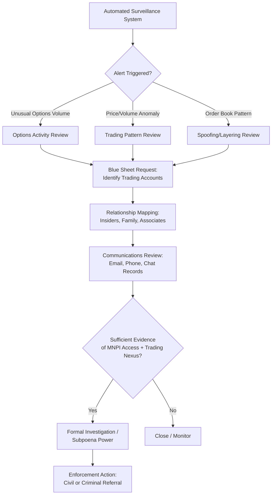

## Market Manipulation and Insider Trading Schemes

### Overview and Legal Framework

Market manipulation and insider trading are distinct but related categories of securities fraud that undermine the integrity of price formation and the principle of equal access to material information in capital markets.

**Key Points**

- **Market manipulation** involves conduct intended to artificially affect the price or trading volume of a security, creating a false or misleading appearance of market activity.
- **Insider trading** involves trading (or tipping others to trade) a security while in possession of material, non-public information (MNPI), in breach of a duty of trust or confidence.
- In the US, both are primarily addressed under the Securities Exchange Act of 1934: Section 9(a) (manipulation of security prices), Section 10(b) and Rule 10b-5 (fraud/deceptive devices, the primary basis for insider trading liability), and Section 9(a)(2) specifically prohibits manipulative trading to induce purchase or sale.
- Internationally, the EU's Market Abuse Regulation (MAR, Regulation (EU) No 596/2014) consolidates insider dealing, unlawful disclosure of inside information, and market manipulation into a single regime applicable across EU member states.
- IOSCO (International Organization of Securities Commissions) publishes principles and guidance harmonizing market abuse detection standards across jurisdictions, though enforcement mechanisms and definitions vary by country.

### Insider Trading: Legal Theories of Liability

#### Classical Theory

A corporate insider (officer, director, employee) with a fiduciary duty to shareholders trades the company's securities on the basis of material non-public information obtained through their position, breaching that duty. Established in *Chiarella v. United States* (1980), which held that a duty to disclose or abstain arises from a relationship of trust and confidence, not merely from possession of information.

#### Misappropriation Theory

A person who is not a corporate insider but who misappropriates confidential information from its source (e.g., an employer, client, or family member) for securities trading purposes, in breach of a duty owed to that source, violates Rule 10b-5. Established in *United States v. O'Hagan* (1997), extending liability to outsiders such as lawyers, consultants, or printers who learn of pending transactions (e.g., mergers) through their professional role.

#### Tipper/Tippee Liability

Liability extends to individuals who receive ("tippees") material non-public information from an insider ("tipper") and trade on it, provided:

- The tipper breached a fiduciary duty by disclosing the information.
- The tipper received a **personal benefit** from the disclosure (established in *Dirks v. SEC*, 1983).
- The tippee knew or should have known of the breach.

The scope of "personal benefit" has been litigated extensively; *Salman v. United States* (2016) confirmed that gifting inside information to a relative or friend can satisfy the personal-benefit test even absent a pecuniary exchange, while *United States v. Newman* (2014, 2nd Circuit, subsequently narrowed in application) had required proof of a meaningfully close personal relationship and a tangible benefit, creating circuit tension later addressed by *Salman*.

### Insider Trading Schemes and Typologies

**Key Points**

1. **Corporate insider trading ahead of earnings announcements**: Executives, directors, or employees trade shares before scheduled earnings releases based on advance knowledge of results materially different from market expectations.
2. **M&A-related insider trading**: Trading ahead of merger, acquisition, or tender offer announcements by insiders at the acquirer, target, or their advisors (investment banks, law firms, accounting firms, printing/financial communications firms).
3. **Expert network abuse**: Consultants or "expert network" participants (often former employees or industry insiders) provide MNPI to hedge funds or institutional investors under the guise of legitimate "industry expertise" consulting, disguising illegal tips as paid consultations.
4. **Government/regulatory leak trading**: Trading based on advance knowledge of pending regulatory decisions (e.g., FDA drug approvals, antitrust rulings), often involving leaks from government employees or consultants with regulatory access.
5. **Pillow talk/family and friend tipping**: Informal disclosure of MNPI to spouses, family members, or friends who then trade, frequently prosecuted using circumstantial evidence (timing correlation, communication records, relationship proximity).
6. **Contra-party or "shadow trading"**: Trading in the securities of an economically linked company (e.g., a close competitor) based on MNPI about a different but related company, tested in *United States v. Panuwat* (2024), which upheld liability for trading a competitor's securities based on MNPI about the insider's own employer under specific circumstances. [Inference: the precise doctrinal boundaries of shadow-trading liability remain an evolving area of case law and may be refined by subsequent rulings.]

### Market Manipulation: Techniques and Typologies

#### 1. Pump-and-Dump Schemes

Coordinated promotion of a (typically low-float, low-liquidity) security through false or misleading statements to inflate its price, followed by the promoters selling ("dumping") their previously acquired shares at the inflated price before the price collapses.

**Key Points**

- Historically executed via boiler-room cold calling, then via spam email and internet forums; increasingly conducted via social media (Twitter/X, Reddit, Telegram, Discord) and, in crypto markets, via coordinated group chats.
- Frequently targets micro-cap or penny stocks and low-liquidity crypto tokens where relatively small capital can move price significantly.
- Detection relies on correlating unusual trading volume/price spikes with promotional activity (press releases, social media posts, paid stock promotion disclosures required under Securities Act Section 17(b)).

#### 2. Spoofing and Layering

Placing orders with no intention of executing them, to create a false impression of supply or demand, then canceling before execution once the price moves favorably, and executing a genuine order on the opposite side.

- **Spoofing**: Placing a large, visible order to move the market, then canceling it once smaller genuine orders on the other side are filled at the artificially moved price.
- **Layering**: Placing multiple orders at different price levels on one side of the book to create a false depth impression, then executing on the other side.
- Prohibited explicitly in the US under the Dodd-Frank Act's amendment to the Commodity Exchange Act (Section 747, defining spoofing for derivatives); prosecuted in equities primarily under Rule 10b-5 and Exchange Act anti-manipulation provisions.
- Landmark cases: *United States v. Coscia* (2015), the first criminal spoofing conviction under Dodd-Frank; subsequent enforcement against high-frequency trading firms and individual traders.

#### 3. Wash Trading

Simultaneously or near-simultaneously buying and selling the same security (directly or through colluding counterparties) to create the appearance of trading volume and market interest without any genuine change in beneficial ownership.

- Common in illiquid markets and increasingly documented in cryptocurrency and NFT markets, where wash trading can also be used to manipulate perceived liquidity metrics on exchanges or to farm exchange trading-volume-based incentive programs.
- Detection: matching buy/sell orders from the same or related beneficial owner within short time windows, cross-referencing account linkage (IP addresses, KYC data, funding sources).

#### 4. Marking the Close / Marking the Open

Executing trades near market close (or open) specifically to influence the closing (or opening) price, which is often used as a reference price for derivatives settlement, index calculation, fund NAV (net asset value) computation, or performance benchmarking.

- Motivated by benchmark-linked payoffs: a trader with a derivative position settling at the closing price has an incentive to move that specific reference price.
- Detection: statistical analysis of trading patterns concentrated in narrow time windows around close/open, particularly when correlated with the trader's known derivative or benchmark-linked exposures.

#### 5. Painting the Tape

A form of wash trading/collusive trading among a small group of colluding parties creating a series of transactions in a security to give the impression of active trading, intended to attract other investors' genuine interest.

#### 6. Bear Raids and Short-and-Distort

Coordinated short-selling combined with spreading false or misleading negative information about an issuer to drive the price down, allowing the manipulator to cover the short position at a profit.

- Modern variants involve anonymous online publication of critical "research reports" (sometimes legitimate short-seller research, sometimes fabricated) combined with pre-established short positions, raising questions about the line between legitimate critical analysis and market manipulation — a boundary that depends heavily on factual accuracy and disclosure of the position (many jurisdictions require disclosure of short positions underlying published research, e.g., under EU MAR and certain US state/SEC guidance).

#### 7. Benchmark and Reference Rate Manipulation

Manipulation of widely-used financial benchmarks by submitting false or self-interested input data.

- **LIBOR manipulation scandal**: Panel banks submitted artificially low or high borrowing-rate estimates to benefit derivative or funding positions tied to LIBOR, resulting in billions of dollars in regulatory fines globally (multiple banks, 2012 onward) and the eventual global transition away from LIBOR to alternative reference rates (e.g., SOFR in the US).
- **FX benchmark manipulation**: Traders at major banks coordinated via chat rooms to manipulate WM/Reuters FX fixing rates around the daily fix window.

#### 8. Front-Running and Parking

- **Front-running**: A broker or trader with advance knowledge of a large pending client order trades ahead of that order for personal benefit, anticipating the price impact the client order will cause.
- **Parking**: Temporarily transferring securities to a colluding third party to disguise beneficial ownership, evade position limits, regulatory capital requirements, or reporting obligations, with an understanding the securities will be transferred back.

### Detection Methodologies

#### Market Surveillance Systems

Exchanges, regulators (e.g., SEC, FINRA in the US; FCA in the UK; ESMA-coordinated national regulators in the EU), and broker-dealers operate automated surveillance systems that generate alerts based on:

- **Pattern-based rules**: order-to-trade ratios, order cancellation rates, price/volume anomalies relative to historical baseline, clustering of trades near reference price windows.
- **Cross-market and cross-product surveillance**: correlating equity, options, and futures trading to detect manipulation strategies that exploit relationships across related instruments (e.g., manipulating an underlying to profit on options positions).
- **Statistical anomaly detection**: abnormal volume or volatility relative to peer securities or the security's own historical distribution, often using z-scores or other statistical outlier measures.
- **Machine learning/network analytics**: increasingly used to detect coordinated trading among seemingly unrelated accounts (spoofing rings, pump-and-dump promoter networks) by identifying shared infrastructure (IP addresses, device fingerprints, funding sources) or correlated timing patterns.
- **Communications surveillance (lexicon and pattern analysis)**: scanning email, chat, and voice communications (where recorded, as required for regulated entities) for coded language or explicit references to coordinated trading, MNPI, or manipulation intent — critical in cases like LIBOR and FX benchmark manipulation, which were substantially proven through chat room transcripts.

#### Insider Trading Detection Specifically

- **Trading-ahead-of-news analysis**: Systematic screening of trading activity in the days/weeks preceding material corporate announcements (earnings, M&A, regulatory decisions) for statistically unusual volume or price movement, followed by identification of the trading accounts involved.
- **Relationship mapping**: Cross-referencing traders against known insiders, their family members, known associates, and professional service providers (investment banks, law firms) involved in a deal, using data such as phone records, email metadata, and social network analysis.
- **Options activity screening**: Unusual purchases of short-dated, out-of-the-money call or put options ahead of major announcements are a classic red flag, since options offer high leverage and thus higher illicit returns relative to capital deployed, making them disproportionately attractive to insider traders relative to their small share of overall market volume.
- **SEC's Advanced Relational Trading Enforcement Metrics Investigation (ARTEMIS)** and similar systems: [Unverified — specific current system names and capabilities are not reliably documented in public sources and should be confirmed via current SEC public disclosures if cited in formal work.] Regulators generally use similar automated relationship-and-timing analytics regardless of the specific system name in use at a given time.
- **Blue Sheets data**: In the US, the SEC obtains detailed trade-level data (including beneficial owner identity) from broker-dealers via "blue sheet" requests to reconstruct trading activity around suspicious events.

### Illustrative Example

**Example**

A biotechnology company's Chief Scientific Officer learns, three weeks before public announcement, that a Phase III clinical trial has failed to meet its primary endpoint. The CSO does not trade personally but mentions the result to a close friend at a dinner. The friend purchases a large volume of short-dated put options on the company's stock over the following two trading days, then sells them for a substantial profit immediately after the public announcement of trial failure causes the stock to fall 60%.

Regulatory detection would likely proceed as follows:

- Automated options-activity surveillance flags the unusual volume and open interest increase in short-dated out-of-the-money puts relative to the stock's historical options trading pattern.
- The trade timing (concentrated purchases in the days before a material, unscheduled announcement) triggers a trading-ahead-of-news alert.
- Investigators obtain blue sheet data identifying the trading account, then examine phone records, calendar data, and known relationships to establish a connection between the trader and company insiders.
- Under the *Dirks* personal-benefit test, prosecutors would need to establish both that the CSO breached a duty by disclosing (even via casual conversation) and that some personal benefit (which, per *Salman*, can include the intangible benefit of maintaining a friendship or the expectation of reciprocal gift-giving) was present.
- [Inference: this scenario is a composite constructed to illustrate the analytical steps typically involved in such investigations, not a specific reported case.]

### Detection Workflow Diagram

### Market Manipulation Techniques Comparison

| Technique | Mechanism | Typical Market | Key Detection Signal |
| --- | --- | --- | --- |
| Pump-and-dump | False promotion + coordinated selling | Micro-cap equities, crypto | Volume/price spike correlated with promotional activity |
| Spoofing/layering | Fake orders to move price, cancel before execution | Futures, equities (electronic) | High order-to-cancel ratio, rapid cancellation |
| Wash trading | Self-dealing trades, no beneficial ownership change | Illiquid securities, crypto | Matched buy/sell from linked accounts |
| Marking the close | Trading concentrated at reference price window | Benchmark/derivative-linked securities | Volume clustering near close, correlated derivative exposure |
| Benchmark manipulation | False submission of input data | LIBOR, FX fixings, commodity benchmarks | Submission inconsistent with actual funding cost/market rate |
| Bear raid/short-and-distort | False negative information + pre-established short | Any, especially small-cap | Coordinated negative publication + short position timing |

### Sanctions and Enforcement Consequences

**Key Points**

- **Civil enforcement**: SEC civil penalties, disgorgement of profits, officer/director bars, industry bars (FINRA).
- **Criminal enforcement**: DOJ prosecution under securities fraud statutes (18 U.S.C. § 1348) and wire fraud statutes, carrying substantial prison sentences in significant cases.
- **Private civil litigation**: Securities class actions under Rule 10b-5, typically following a public enforcement action or significant price decline, seeking damages on behalf of investors who traded at manipulated or artificially informed prices.
- **Reputational and organizational consequences**: Deferred prosecution agreements (DPAs) or non-prosecution agreements (NPAs) for institutions, often accompanied by independent compliance monitorships, enhanced surveillance requirements, and clawback provisions for individual compensation.

### Forensic Accounting Role

- **Damages quantification**: Event study methodology to isolate the price impact attributable to manipulative conduct or the disclosure of previously withheld MNPI, distinguishing it from general market movement (often using a market model regression comparing the security's returns to a benchmark index over an estimation window).
- **Trading pattern reconstruction**: Rebuilding order-book-level activity from exchange data to demonstrate spoofing, layering, or wash trading patterns for litigation or regulatory proceedings.
- **Profit/loss and disgorgement calculation**: Computing illicit gains or avoided losses attributable to trading while in possession of MNPI or as a result of manipulative conduct, for civil penalty and disgorgement purposes.
- **Communications and metadata analysis**: Supporting legal teams in correlating communications records (calls, emails, messaging apps) with trading timestamps to establish knowledge and intent.

**Next Steps**

- Rule 10b-5 elements and the scienter (intent) requirement in securities fraud litigation
- Event study methodology for securities litigation damages
- FINRA and exchange-level market surveillance system architecture
- Dodd-Frank whistleblower program and its role in securities fraud detection
- Cryptocurrency market manipulation: wash trading and exchange volume inflation
- Expert network compliance controls and MNPI information barriers ("Chinese walls")
- LIBOR/benchmark manipulation case studies and the SOFR transition
- Rule 10b5-1 trading plans and their use (and abuse) as an insider trading defense
- Short-seller activist research and disclosure obligations
- Cross-border enforcement cooperation in securities fraud (IOSCO Multilateral MOU)