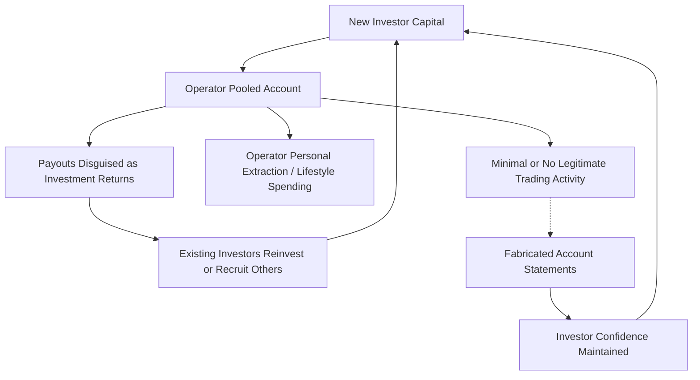

## Ponzi and Pyramid Schemes

### Definitions and Legal Foundations

**Ponzi Scheme**

A fraudulent investment operation in which purported "returns" paid to existing investors are generated not from legitimate business activity or trading profits, but from capital contributed by new investors. The scheme requires an ever-expanding pool of new capital to sustain payouts, because no underlying value-generating activity exists (or the activity that exists is grossly insufficient to produce the promised returns). Named after Charles Ponzi (1920, Boston postal reply coupon arbitrage scheme).

Core legal elements typically charged under securities fraud statutes (e.g., Securities Act of 1933 §17(a), Securities Exchange Act of 1934 §10(b) and Rule 10b-5 in the U.S.):

- Material misrepresentation or omission regarding the source of returns, the use of funds, or the existence of a legitimate underlying strategy
- Scienter (intent to deceive, or reckless disregard for the truth)
- Reliance by the investor
- Use of interstate commerce or mails (jurisdictional hook)
- Damages/economic loss

**Pyramid Scheme**

A fraudulent structure in which participants earn compensation primarily for recruiting other participants rather than from the sale of genuine goods or services to end consumers. Compensation is mathematically dependent on exponential recruitment, which is inherently unsustainable.

**Key Points**

- Ponzi schemes center on *investment returns*; pyramid schemes center on *recruitment compensation*.
- Both are structurally insolvent from inception — they are "negative-sum" once operating costs and fraudster extraction are considered.
- Both require exponential or continuous new-money inflow; collapse is a mathematical certainty, not merely a risk.
- Multi-level marketing (MLM) companies exist on a legally gray spectrum; the FTC and courts distinguish legitimate MLMs (revenue predominantly from retail sales to actual consumers) from illegal pyramids (revenue predominantly from recruitment/inventory loading) using tests such as the **Koscot Test** and the **Amway Safeguards**.

---

### Mathematical Structure of Insolvency

**Ponzi Scheme Solvency Model**

Let $N_t$ be the number of investors at time $t$, $C$ the average capital contribution per investor, $r$ the promised periodic return rate, and $W_t$ the withdrawals demanded.

Cash available to pay obligations:

$$A_t = \sum_{i=1}^{t} N_i C - \sum_{i=1}^{t} W_i - E_t$$

where $E_t$ is cumulative operator extraction (skimming, lifestyle spending).

Obligation owed at time $t$ (promised balance to all investors):

$$L_t = \sum_{i=1}^{t} N_i C (1+r)^{t-i}$$

Insolvency condition (the defining structural feature of a Ponzi scheme):

$$L_t > A_t \quad \text{for all } t \text{ beyond initial periods}$$

Because $r$ is typically fixed and disconnected from any real asset return, $L_t$ grows geometrically while $A_t$ depends linearly on new investor recruitment — recruitment cannot geometrically accelerate indefinitely, guaranteeing eventual collapse.

**Pyramid Scheme Participant Exhaustion**

If each participant must recruit $k$ new participants to profit, and the scheme survives $g$ generations:

$$\text{Total participants required} = k^g$$

Given a finite population $P$ (e.g., a country or region), the scheme mathematically exhausts its recruitment base once $k^g \geq P$. For $k=6$, exhaustion of a population of 1 billion occurs at approximately $g \approx 11.5$ generations — illustrating why collapse is rapid once local saturation occurs.

---

### Structural Diagram: Ponzi Cash Flow

---

### Structural Diagram: Pyramid Recruitment Hierarchy

The following SVG illustrates exponential downline growth against a fixed population ceiling.

<svg xmlns="http://www.w3.org/2000/svg" viewBox="0 0 720 420">
<text x="360" y="24" font-size="16" font-weight="bold" text-anchor="middle" fill="#1a1a1a">Pyramid Recruitment Structure (svg_diagram)</text>
<circle cx="360" cy="60" r="18" fill="#c0392b" />
<text x="360" y="65" font-size="10" text-anchor="middle" fill="#fff">L0</text>
<line x1="360" y1="78" x2="200" y2="130" stroke="#555" stroke-width="1.5" />
<line x1="360" y1="78" x2="360" y2="130" stroke="#555" stroke-width="1.5" />
<line x1="360" y1="78" x2="520" y2="130" stroke="#555" stroke-width="1.5" />
<circle cx="200" cy="145" r="14" fill="#d35400" />
<circle cx="360" cy="145" r="14" fill="#d35400" />
<circle cx="520" cy="145" r="14" fill="#d35400" />
<text x="360" y="170" font-size="10" text-anchor="middle" fill="#555">Level 1 (3 recruits)</text>
<g id="level2">
<line x1="200" y1="159" x2="100" y2="210" stroke="#777" stroke-width="1" />
<line x1="200" y1="159" x2="200" y2="210" stroke="#777" stroke-width="1" />
<line x1="200" y1="159" x2="300" y2="210" stroke="#777" stroke-width="1" />
<line x1="360" y1="159" x2="330" y2="210" stroke="#777" stroke-width="1" />
<line x1="360" y1="159" x2="390" y2="210" stroke="#777" stroke-width="1" />
<line x1="360" y1="159" x2="420" y2="210" stroke="#777" stroke-width="1" />
<line x1="520" y1="159" x2="490" y2="210" stroke="#777" stroke-width="1" />
<line x1="520" y1="159" x2="560" y2="210" stroke="#777" stroke-width="1" />
<line x1="520" y1="159" x2="630" y2="210" stroke="#777" stroke-width="1" />
</g>
<g fill="#f39c12">
<circle cx="100" cy="220" r="10" /><circle cx="200" cy="220" r="10" /><circle cx="300" cy="220" r="10" />
<circle cx="330" cy="220" r="10" /><circle cx="390" cy="220" r="10" /><circle cx="420" cy="220" r="10" />
<circle cx="490" cy="220" r="10" /><circle cx="560" cy="220" r="10" /><circle cx="630" cy="220" r="10" />
</g>
<text x="360" y="248" font-size="10" text-anchor="middle" fill="#555">Level 2 (9 recruits)</text>
<text x="360" y="290" font-size="11" text-anchor="middle" fill="#c0392b" font-style="italic">Level 3 requires 27, Level 4 requires 81...</text>
<rect x="60" y="320" width="600" height="70" fill="none" stroke="#c0392b" stroke-width="1.5" stroke-dasharray="4,3" />
<text x="360" y="345" font-size="12" text-anchor="middle" fill="#c0392b" font-weight="bold">Finite Population Ceiling</text>
<text x="360" y="365" font-size="10" text-anchor="middle" fill="#555">Exponential recruitment (k^g) exceeds addressable market within ~10-12 generations</text>
<text x="360" y="380" font-size="10" text-anchor="middle" fill="#555">Base of pyramid loses recruitment fees / inventory investment</text>
</svg>

---

### Common Ponzi Scheme Typologies

**Investment Fund Ponzi**

Operator claims a proprietary trading strategy (e.g., "low-risk arbitrage," "options overlay," algorithmic trading) generating consistent above-market returns. Statements are fabricated; no independent custodian verifies trades. Example archetype: Bernard Madoff (Madoff Investment Securities), which reported a "split-strike conversion" strategy for decades while custody, execution, and clearing were never independently verified — funds were held in-house rather than through an independent custodian.

**Affinity Fraud**

Exploits trust within a closely-knit community (religious congregation, ethnic community, professional association, retirement community). Social proof and in-group trust substitute for due diligence. Recruitment velocity is high because referrals come from trusted peers rather than cold solicitation.

**Real Estate / Promissory Note Ponzi**

Investors are told funds finance property acquisition, development, or "hard money" lending secured by real property. Actual liens may be nonexistent, undersized, or already pledged to multiple investors (double/triple-pledged collateral).

**Cryptocurrency / DeFi Ponzi**

Modern variant using yield-farming, staking, or "arbitrage bot" narratives. Common markers: guaranteed fixed APY regardless of market conditions, smart contracts with owner-only withdrawal functions (honeypots), opaque or non-existent audits, and reliance on new token purchases to fund existing holder payouts.

**Feeder Fund Structures**

Legitimate-appearing intermediary funds ("feeder funds") pool investor capital and funnel it into a master Ponzi fund, often unaware (or willfully blind) that the master fund is fraudulent. Creates layers of plausible deniability and complicates tracing.

---

### Common Pyramid Scheme Typologies

**Naked Pyramid ("Chain Referral")**

No product at all, or a token product with no independent market value. Compensation is overwhelmingly tied to recruitment fees ("sign-up fee," "position fee"). Legally unambiguous — per se illegal in most jurisdictions.

**Product-Based Pyramid (Disguised MLM)**

Uses a legitimate-seeming product line as cover. Red flags distinguishing it from lawful MLM:

- **Inventory loading**: distributors required to purchase large, non-returnable inventory to maintain rank/eligibility
- **No retail sales requirement**: compensation plan pays primarily on recruitment/downline purchases rather than sales to genuine end consumers outside the network
- Absence of a genuine buy-back policy for unsold inventory
- Compensation heavily weighted toward "overrides" on downline recruitment rather than personal retail margin

**Matrix / Cycler Schemes**

Participants buy into a fixed-size "matrix" or "board" and are paid out only when the matrix fills via new recruits below them; boards "cycle" and split, requiring continuous recruitment to refill.

**Gifting Circles / "Sou-Sou" Fraud Variants**

Participants are told they are simply "gifting" money to those above them for social/cultural reasons, positioned outside securities regulation, but functionally identical pyramid mathematics apply.

---

### Regulatory Frameworks and Tests

**Koscot Test (FTC v. Koscot Interplanetary, 1975)**

A pyramid scheme exists where participants pay money to the company in return for (1) the right to sell a product and (2) the right to recruit other participants, with compensation unrelated to sale of goods to ultimate users.

**Amway Safeguard Rules (In re Amway Corp., 1979)**

Established that an MLM is legitimate (not a pyramid) if it maintains safeguards such as:

- A **70% rule**: distributors must sell at least 70% of previously purchased inventory before ordering more
- A **10-customer rule**: minimum retail customers per month
- A genuine **buy-back policy** for unsold inventory upon termination (commonly 90%+ of net cost)

**Howey Test (SEC v. W.J. Howey Co., 1946)**

Determines whether a Ponzi-adjacent arrangement constitutes a "security" (and thus falls under SEC jurisdiction): (1) an investment of money, (2) in a common enterprise, (3) with an expectation of profits, (4) derived predominantly from the efforts of others.

**Key Statutory Tools (U.S.)**

- Securities Act of 1933 / Exchange Act of 1934 — antifraud provisions
- 18 U.S.C. §1341, §1343 — mail and wire fraud
- 18 U.S.C. §1956/1957 — money laundering
- FTC Act §5 — unfair/deceptive practices (used against pyramid schemes lacking "security" characteristics)
- Racketeer Influenced and Corrupt Organizations Act (RICO) — for enterprise-level, patterned fraud

Outside the U.S., comparable frameworks include the EU Unfair Commercial Practices Directive (Annex I, explicitly banning pyramid promotional schemes), UK Trading Schemes Regulations 1997, and jurisdiction-specific securities acts.

---

### Forensic Accounting Detection Methodology

**Red Flag Indicators**

| Category | Indicator |
| --- | --- |
| Returns | Consistent, smooth, above-market returns with abnormally low volatility (e.g., positive in >95% of months) |
| Custody | Self-custody or use of an affiliated/unregistered auditor rather than independent, reputable custodian |
| Documentation | Investor statements not reconcilable to independent brokerage/exchange confirmations |
| Strategy transparency | Vague, "proprietary," or unexplainable investment strategy |
| Registration | Fund or advisor not registered with applicable regulator (SEC, FCA, etc.), or using an obscure/small audit firm relative to AUM |
| Liquidity | Redemption delays, "gates," or discouragement of withdrawals despite claimed liquidity |
| Growth pattern | AUM growth driven by new subscriptions rather than reported trading gains |
| Referral incentives | Heavy reliance on investor-to-investor referral bonuses |

**Benford's Law Analysis**

Forensic accountants apply Benford's Law to test whether the first-digit distribution of reported transaction amounts in fund ledgers matches the expected logarithmic distribution:

$$P(d) = \log_{10}\left(1 + \frac{1}{d}\right), \quad d \in \{1,2,\dots,9\}$$

Fabricated statements (typically manually adjusted to hit target return figures) frequently deviate significantly from this expected distribution — a statistical, not conclusive, red flag requiring further investigation. [Inference — deviation is indicative, not dispositive, since legitimate datasets can also deviate for structural reasons.]

**Source and Use of Funds Tracing**

Standard forensic technique reconstructing:

$$\text{Sources} = \text{New investor capital} + \text{Legitimate trading gains (if any)} + \text{Loans}$$

$$\text{Uses} = \text{Investor redemptions} + \text{Operator extraction} + \text{Operating expenses} + \text{Legitimate investments (if any)}$$

If Uses (redemptions specifically) consistently and structurally exceed legitimate trading gains and instead track new Sources (new investor capital), this evidences the defining Ponzi characteristic — investors are being paid from other investors' principal, not from investment performance.

**Net Investment Method vs. Rising Tide Method (Clawback/Recovery Context)**

Used post-collapse by court-appointed receivers/trustees to determine which investors owe money back ("net winners") versus which are still owed money ("net losers"):

- **Net Investment Method** (used in Madoff case by SIPC Trustee Irving Picard): Recoverable amount = Total deposits − Total withdrawals, ignoring fictitious "paper profits." Investors who withdrew more than they deposited (net winners) may face **clawback** litigation.
- **Rising Tide Method**: Alternative distribution approach ensuring all investors recover the same percentage of their net losses relative to their claims, sometimes preferred in schemes with varying entry/exit dates to promote pro-rata equity.

**Statistical/Actuarial Reserve Testing**

Comparing the fund's claimed reserve/AUM against verifiable independent custodial statements, bank records, and counterparty confirmations — a form of substantive audit procedure analogous to **cash and investment confirmation** under auditing standards (e.g., AU-C 505 confirmations, ISA 505).

---

### Illustrative Example: Simplified Ponzi Detection Walkthrough

**Example**

A fund reports $50 million AUM and 18% annual returns for 6 consecutive years, with monthly statements showing gains in 71 of 72 months. Forensic review finds:

1. Independent custodian records show only $4 million in actual brokerage assets.
2. Trading confirmations from the claimed prime broker cannot be matched to any of the fund's reported trades.
3. New subscriptions in the trailing 12 months ($22 million) closely track total redemptions paid out ($19 million), while independently verifiable trading gains are near zero.
4. Benford's Law test on the ledger's transaction first-digits shows a chi-square statistic significantly above the critical threshold, indicating non-conforming (likely manually fabricated) figures. [Unverified — illustrative hypothetical, not an actual case citation]

**Conclusion**: The near-total absence of independently verifiable assets relative to reported AUM ($4M vs. $50M claimed), combined with redemptions being funded by contemporaneous new subscriptions rather than trading gains, satisfies the structural definition of a Ponzi scheme — this is a textbook "robbing Peter to pay Paul" cash flow pattern rather than a legitimate investment operation.

---

### Comparative Table: Ponzi vs. Pyramid vs. Legitimate MLM

| Feature | Ponzi Scheme | Pyramid Scheme | Legitimate MLM |
| --- | --- | --- | --- |
| Core promise | Investment returns | Recruitment income | Product sales income |
| Product/service | Usually none (or nominal cover) | Often nominal/overpriced | Genuine, independently marketable |
| Revenue source | New investor capital | New recruit fees/inventory purchases | Retail sales to end consumers |
| Sustainability | Mathematically impossible long-term | Mathematically impossible long-term | Can be sustainable if retail-driven |
| Regulatory test | Howey Test (security) | Koscot/Amway tests | Amway safeguards satisfied |
| Typical charge | Securities/wire fraud | FTC Act §5, wire fraud | N/A if compliant |

---

### Notable Case References (Publicly Documented)

- **Charles Ponzi (1920)** — postal reply coupon arbitrage; origin of the term.
- **Bernard Madoff (Madoff Investment Securities, exposed 2008)** — largest known Ponzi scheme, estimated $\$64.8$ billion in reported (fictitious) account balances; recovery efforts continue via SIPC-appointed trustee.
- **Allen Stanford (Stanford Financial Group, 2009)** — $7 billion CD-based Ponzi scheme using Antigua-based bank.
- **BurnLounge, Inc. (FTC v. BurnLounge, 2012)** — leading U.S. case applying pyramid analysis to an MLM-structured music retail company; court found compensation predominantly recruitment-driven.
- **Herbalife (FTC settlement, 2016)** — $200 million settlement and mandated restructuring of compensation plan without a formal "pyramid" finding, illustrating the regulatory gray zone.
- **OneCoin (2014–2017)** — cryptocurrency-themed hybrid Ponzi/pyramid; no genuine blockchain existed for the "coin."

[Figures above are widely reported in public regulatory filings, DOJ/SEC press releases, and court documents; specific dollar amounts may vary slightly across sources and are provided as commonly cited approximations.]

---

### Litigation and Recovery Mechanics

**Clawback Actions**

Trustees/receivers pursue **fraudulent transfer** claims (under the Uniform Fraudulent Transfer Act / Bankruptcy Code §548 in the U.S.) against net winners, arguing that "profit" withdrawals in excess of principal constitute transfers made without receiving reasonably equivalent value (since the underlying "returns" were fictitious).

**Good Faith Defense**

Recipients may assert a good-faith, for-value defense if they neither knew nor should have known of the fraud — a frequently litigated issue turning on the recipient's sophistication and any red flags they ignored.

**SIPC / Insurance Limits**

Investor protection schemes (e.g., Securities Investor Protection Corporation in the U.S.) typically cover the *net equity claim* (net investment method), not fictitious paper gains, and are subject to per-customer statutory caps (e.g., $500,000 under SIPC, including $250,000 cash sub-limit as of recent rules — [Unverified, confirm current statutory limit as these are subject to legislative change]).

---

**Related Topics**

- Affinity fraud and social engineering in investment fraud
- Boiler room and pump-and-dump securities schemes
- Forensic tracing techniques: source-and-application-of-funds analysis
- Benford's Law and digital analysis in fraud detection
- Bankruptcy trustee powers and fraudulent conveyance law
- Cryptocurrency and DeFi-specific fraud typologies (rug pulls, honeypots)
- SEC Rule 10b-5 litigation and enforcement actions
- Asset tracing and international recovery (offshore structures, MLATs)
- Whistleblower programs (Dodd-Frank Section 21F, SEC Office of the Whistleblower)
- Auditor liability and gatekeeper failure in Ponzi scheme enablement