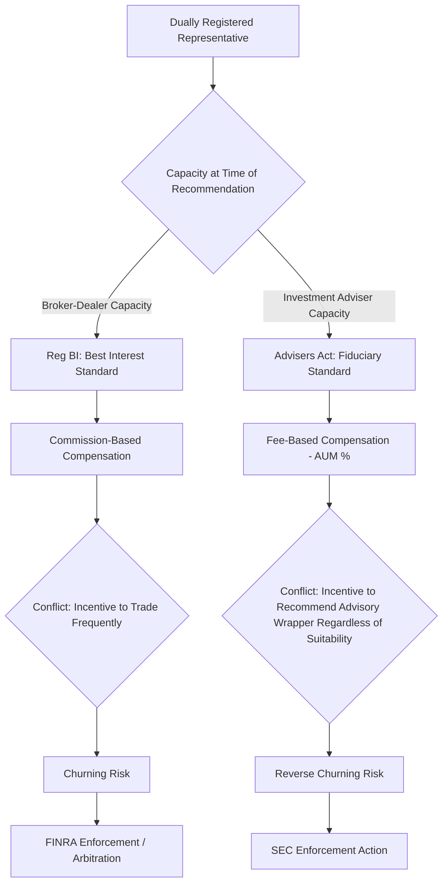

## Broker-Dealer and Investment Adviser Fraud

### Regulatory Framework and Definitional Distinctions

**Broker-Dealer**

An entity engaged in the business of effecting securities transactions for the accounts of others (broker) and/or trading securities for its own account (dealer). Regulated in the U.S. primarily under the Securities Exchange Act of 1934, registered with the SEC, and subject to oversight by FINRA (Financial Industry Regulatory Authority) as the designated self-regulatory organization (SRO).

**Investment Adviser (IA)**

A person or firm compensated for advising others on securities investments, regulated under the Investment Advisers Act of 1940. Registration threshold generally requires registration with the SEC for advisers managing $100 million+ in assets under management (AUM); smaller advisers typically register at the state level.

**Key Points**

- Broker-dealers historically operated under a **suitability standard**; investment advisers operate under a **fiduciary standard**.
- The SEC's **Regulation Best Interest (Reg BI)**, effective June 2020, elevated broker-dealer conduct obligations toward (but not fully equivalent to) a fiduciary standard when making recommendations to retail customers.
- A single individual can be **dually registered** as both a broker-dealer representative and an investment adviser representative, creating potential conflicts requiring clear capacity disclosure at time of each transaction/recommendation.
- Fraud in this domain spans misrepresentation, unauthorized trading, excessive trading for commission generation, and conflicts of interest arising from compensation structures.

---

### Standards of Conduct: Comparative Framework

| Dimension | Broker-Dealer (Reg BI) | Investment Adviser (Fiduciary) |
| --- | --- | --- |
| Governing standard | Best interest at time of recommendation | Ongoing fiduciary duty (duty of care + duty of loyalty) |
| Duration of duty | Point-in-time (each recommendation) | Continuous throughout relationship |
| Compensation model | Typically transaction-based (commissions) | Typically fee-based (AUM %, flat fee) |
| Conflict handling | Disclose, mitigate, or eliminate | Disclose and obtain informed consent; eliminate where possible |
| Primary regulator | SEC / FINRA | SEC / State securities regulators |
| Core rule | Reg BI (17 CFR 240.15l-1) | Advisers Act §206 (anti-fraud) |

$$\text{Reg BI Components} = \text{Disclosure Obligation} + \text{Care Obligation} + \text{Conflict of Interest Obligation} + \text{Compliance Obligation}$$

---

### Typologies of Broker-Dealer Fraud

**Churning**

Excessive trading in a customer account primarily to generate commissions, disproportionate to the customer's investment objectives. Forensic detection relies on the **turnover ratio** and **cost-to-equity ratio**:

$$\text{Turnover Ratio} = \frac{\text{Total Purchases in Period}}{\text{Average Monthly Account Equity}}$$

A turnover ratio exceeding approximately 6 annually is often cited by courts and arbitrators as suggestive of excessive trading, though this is a rule-of-thumb, not a statutory bright line. [Inference — thresholds vary by case law and are fact-specific to account objectives and risk tolerance.]

$$\text{Cost-to-Equity Ratio} = \frac{\text{Total Commissions} + \text{Fees} + \text{Margin Interest}}{\text{Average Monthly Account Equity}}$$

A cost-to-equity ratio exceeding roughly 20% annually is frequently used as an indicator that the account would need to generate substantial returns merely to break even after costs — a hallmark of churning.

**Elements typically required to prove churning (FINRA/case law):**

1. Control of the account by the broker (de facto or de jure, including through routine unquestioning authorization)
2. Excessive trading relative to the customer's investment objectives and financial situation
3. Scienter (intent to defraud or willful/reckless disregard for the customer's interests)

**Unauthorized Trading**

Executing transactions without the customer's prior authorization, absent a valid discretionary trading agreement on file. Distinguished from discretionary trading, which requires written authorization under FINRA Rule 3260.

**Unsuitable Recommendations**

Recommending securities or strategies inconsistent with a customer's investment profile (age, risk tolerance, time horizon, liquidity needs, investment objectives, financial situation). Governed historically by FINRA Rule 2111 (Suitability) and now largely superseded for retail customers by Reg BI's Care Obligation.

**Markup/Markdown Fraud**

Excessive undisclosed spreads charged on principal transactions (where the broker-dealer trades from its own inventory). FINRA's "5% markup policy" is a general guideline, not an absolute ceiling; excessive markups relative to prevailing market price constitute fraud, particularly when undisclosed.

**Selling Away**

A registered representative engaging in securities transactions outside the scope of their employment with the broker-dealer, without firm approval — often involving unregistered or fraudulent private placements. Firm supervisory liability may attach under **failure to supervise** theories (Exchange Act §15(b)(4)(E)).

**Ponzi-Adjacent Misappropriation**

Broker or adviser directly misappropriating client funds/securities (theft), often concealed through falsified account statements sent outside the custodian's official reporting channel.

---

### Typologies of Investment Adviser Fraud

**Breach of Fiduciary Duty**

Core violation under Advisers Act §206(1) and §206(2), prohibiting devices to defraud clients and transactions that operate as a fraud/deceit upon clients, respectively — notably, §206(2) does not require proof of scienter (negligence may suffice).

**Undisclosed Conflicts of Interest**

- **Principal trading violations**: An adviser trading with a client from its own account without prior written disclosure and consent, violating Advisers Act §206(3).
- **Undisclosed compensation**: Receiving 12b-1 fees, revenue sharing, or soft dollar arrangements without adequate disclosure, creating an incentive to recommend higher-cost products (e.g., share class selection disclosure failures — a major SEC enforcement initiative circa 2018-2019 known as the **Share Class Selection Disclosure Initiative**).

**Misrepresentation of Performance**

- **Cherry-picking**: Allocating favorable trades disproportionately to proprietary or favored accounts and unfavorable trades to disfavored client accounts.
- **Reverse churning**: In fee-based (AUM %) accounts, placing inactive or buy-and-hold clients into advisory fee arrangements when a lower-cost commission-based brokerage account would have better suited their (in)frequent trading pattern — essentially the fee-based mirror image of churning.
- **False/misleading track record marketing**: Presenting back-tested, cherry-picked, or non-GIPS-compliant (Global Investment Performance Standards) performance data as representative.

**Custody Rule Violations**

Advisers Act Rule 206(4)-2 ("Custody Rule") requires advisers with custody of client assets to maintain them with a qualified custodian and undergo a surprise examination, unless specific exceptions apply. Circumventing this (e.g., self-custody without independent verification) is a classic enabling mechanism for the misappropriation/Ponzi fraud typologies discussed in the prior chapter item.

**Wrap Fee Program Abuses**

Failing to disclose that a wrap fee (bundled advisory + trading cost) program may be more expensive than an unbundled alternative for a client's actual trading activity level.

---

### Diagram: Conflict-of-Interest Pathways in Dual Registration

---

### Forensic Accounting Detection Methodology

**Trade Blotter Reconstruction**

Forensic accountants reconstruct the complete trading history from clearing firm records (not merely the broker's internal system, which may be manipulated) to compute turnover ratio, cost-to-equity ratio, and in-and-out trading patterns (short holding periods inconsistent with stated strategy).

**Commission Concentration Analysis**

Comparing commission revenue generated per representative against firm/industry benchmarks and against the representative's assigned book of business, flagging statistical outliers for further account-level review.

**Suitability Documentation Audit**

Cross-referencing new account forms (risk tolerance, investment objectives, net worth, liquidity needs, time horizon) against actual portfolio composition and transaction history to identify material inconsistencies.

**Example**

A retired client, age 72, lists "capital preservation" and "low risk tolerance" on the new account form. Forensic review of the account reveals:

1. 85% of the portfolio allocated to speculative small-cap equities and leveraged ETFs.
2. Turnover ratio of 14.2x over the trailing 12 months.
3. Cost-to-equity ratio of 31%, meaning the account required a 31% gross return merely to break even.
4. Total commissions of $47,000 generated against average account equity of $310,000.

**Conclusion**: The mismatch between the documented risk profile and actual portfolio composition, combined with a turnover ratio and cost-to-equity ratio substantially exceeding industry rule-of-thumb thresholds, is consistent with churning and unsuitable recommendation claims, warranting referral to FINRA arbitration or regulatory examination.

**Correspondence and Communication Review**

Discovery of off-channel communications (personal email, text messaging, encrypted apps) used to conceal unauthorized trading instructions or misrepresentations — a growing focus of SEC/FINRA enforcement (the 2021–2024 "off-channel communications" sweep resulted in over $2 billion in aggregate SEC and CFTC fines against major financial institutions for recordkeeping failures under Exchange Act §17(a) and Advisers Act §204).

---

### Enforcement Mechanisms and Remedies

**FINRA Arbitration**

Most customer disputes with broker-dealers are resolved through mandatory FINRA arbitration (per the Customer Agreement's arbitration clause) rather than litigation, governed by FINRA Rule 12000 series (Customer Code).

**SEC Enforcement Actions**

Administrative proceedings or federal court actions seeking:

- Disgorgement of ill-gotten gains
- Civil monetary penalties (tiered based on culpability: Tier I for basic violations, Tier II for violations involving fraud, Tier III for violations involving fraud + substantial investor harm)
- Industry bars/suspensions
- Cease-and-desist orders

**State Securities Regulators**

Operating under state Blue Sky Laws, often coordinated through NASAA (North American Securities Administrators Association), providing an additional enforcement layer particularly for smaller state-registered advisers.

**FINRA BrokerCheck / SEC IAPD**

Public disclosure databases (BrokerCheck for broker-dealers, Investment Adviser Public Disclosure for IAs) recording customer complaints, regulatory actions, and disciplinary history — a key due diligence and forensic investigative resource for identifying patterns of misconduct across a representative's career.

---

### Notable Enforcement Patterns (Publicly Documented)

- **Share Class Selection Disclosure Initiative (SEC, 2018-2019)** — self-reporting initiative addressing widespread undisclosed 12b-1 fee conflicts, resulting in return of over $135 million to affected clients across dozens of advisers.
- **Off-Channel Communications Sweep (SEC/CFTC, 2021-2024)** — recordkeeping violations across major broker-dealers for use of unmonitored messaging apps, cumulative penalties exceeding $2.7 billion. [Figures approximate; drawn from aggregated public SEC/CFTC press releases]
- **Wells Fargo Advisors (various actions)** — including cross-selling and unsuitable product recommendation enforcement matters.
- **Robare Group v. SEC (5th Cir. 2018)** — significant appellate case clarifying scienter requirements under Advisers Act §206(2) versus §206(1).

[Note: Specific enforcement figures are subject to revision and should be verified against current SEC/FINRA press releases for precise dollar amounts and dates.]

---

### Interaction with Broader Securities Fraud Statutes

Broker-dealer and IA fraud frequently overlaps with:

$$\text{Rule 10b-5 (Exchange Act)} \cap \text{Advisers Act §206} \cap \text{State Blue Sky Anti-Fraud Provisions}$$

allowing parallel regulatory tracks (SEC civil, DOJ criminal under mail/wire fraud statutes, FINRA disciplinary, state securities regulator, and private civil litigation/arbitration) to proceed simultaneously against the same conduct.

---

**Related Topics**

- Regulation Best Interest (Reg BI) implementation and compliance testing
- Custody Rule (Advisers Act Rule 206(4)-2) compliance and surprise examinations
- FINRA arbitration procedure and forensic expert witness reporting
- Suitability vs. fiduciary standard case law evolution
- Off-channel communications recordkeeping violations
- Cherry-picking and trade allocation forensic analysis
- Whistleblower programs applicable to broker-dealer/IA misconduct (SEC Dodd-Frank whistleblower program)
- Anti-money laundering (AML) obligations of broker-dealers (Bank Secrecy Act, FINRA Rule 3310)