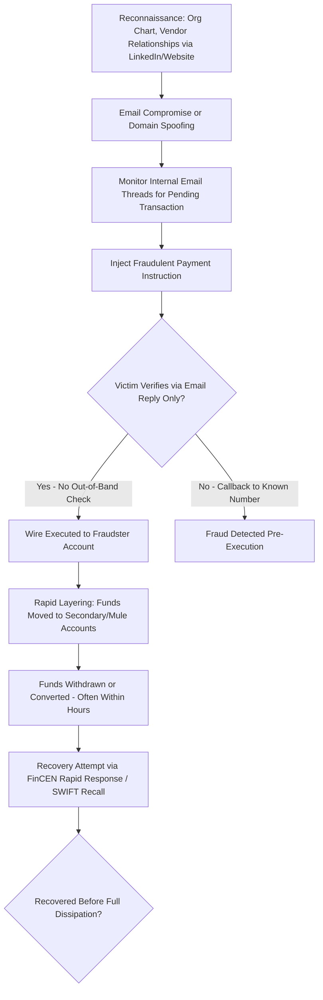

## Check, Card, and Wire Payment Fraud

### Overview and Classification Framework

Payment fraud spans three principal rails, each with distinct mechanics, regulatory frameworks, and forensic detection methodologies:

$$\text{Payment Fraud} = \text{Check Fraud} \cup \text{Card Fraud} \cup \text{Wire Fraud}$$

**Key Points**

- Each payment rail has different **finality characteristics**: checks and cards carry reversal/chargeback mechanisms; wire transfers are generally treated as final and irrevocable once executed, making wire fraud recovery substantially harder.
- Regulatory allocation of loss liability differs materially by rail and by whether the victim is a consumer or a business (commercial accounts generally receive weaker statutory protection than consumer accounts).
- Modern payment fraud increasingly combines **social engineering** (business email compromise, authorized push payment fraud) with technical exploitation, blurring the line between "fraud on the system" and "fraud through the customer."

---

### Check Fraud

**Governing Framework**

In the U.S., check transactions are governed by the **Uniform Commercial Code (UCC) Article 3** (Negotiable Instruments) and **Article 4** (Bank Deposits and Collections), with check processing infrastructure shaped by the **Check 21 Act** (2004), which enabled substitute checks (image-based processing) in place of physical check truncation.

**Typologies**

*Forged Signature*

Unauthorized signing of a check by someone without authority to draw on the account. Under UCC §3-403, a forged signature is generally ineffective, and liability typically falls on the bank that accepted the forged instrument (subject to customer's duty to examine statements and report timely under UCC §4-406).

*Forged/Altered Endorsement*

Alteration of the payee designation or endorsement chain, often used to divert a legitimately issued check to a fraudster's account.

*Check Washing*

Chemical alteration of a legitimately signed check (using solvents such as acetone to remove ink) to change the payee name and/or amount while preserving the original authorized signature.

*Counterfeit Checks*

Wholly fabricated checks using stolen account/routing numbers, often produced via desktop publishing and printed on check-stock paper, frequently distributed through **check fraud rings** using mail theft (notably "mail carrier key" or "arrow key" theft schemes targeting USPS collection boxes).

*Check Kiting*

Exploiting the **float** (delay between deposit and fund availability/clearing) by writing checks against insufficient funds across multiple accounts at different banks, continuously covering shortfalls with new deposits before prior checks clear:

$$\text{Kiting Detection Signal} = \frac{\text{Deposits via Check Drawn on Other Bank}}{\text{Total Deposits}} \; \text{consistently high, with rapid account cycling}$$

Classic kiting pattern: Account A at Bank 1 is low on funds → depositor writes a check from Account B (also low on funds) at Bank 2 into Account A → float period creates artificial available balance → repeat cycle, growing the float amount over time until the scheme collapses or is detected.

*Remotely Created Checks (Demand Drafts)*

Checks created by the payee (not the account holder) using the account holder's account/routing number without an actual signature, authorized under UCC provisions requiring payee warranty of authorization — frequently exploited in telemarketing fraud.

**Forensic Detection — Check Fraud**

- **Positive Pay** systems: bank compares presented check serial numbers, dollar amounts, and payee names against a pre-authorized issue file submitted by the account holder, flagging exceptions for manual review.
- **Payee Positive Pay**: extends matching to payee name specifically, addressing check washing schemes that alter the payee while preserving the serial number/amount.
- **Reverse Positive Pay**: bank sends presented items to the customer daily for approval, shifting detection burden to the account holder (common for smaller business accounts without full Positive Pay).
- Kiting detection via **average daily float analysis** and **peak-to-peak account balance cycling** pattern review across a customer's linked accounts.

---

### Card Fraud

**Governing Framework**

Consumer protections under the **Truth in Lending Act (TILA)** and **Regulation Z** for credit cards (limiting consumer liability to $50 for unauthorized use, with most issuers offering $0 liability by policy), and the **Electronic Fund Transfer Act (EFTA)** and **Regulation E** for debit cards (tiered liability up to $50/$500/unlimited depending on reporting timeliness after unauthorized use is discovered).

**Card Network Rules**: Visa, Mastercard, American Express, and Discover each maintain operating regulations governing chargebacks, liability shift, and merchant compliance (PCI-DSS), enforced contractually rather than by statute.

**Typologies**

*Card-Not-Present (CNP) Fraud*

Fraudulent use of card credentials in e-commerce/phone transactions where the physical card is not presented. Represents the majority of card fraud losses in markets with widespread EMV chip adoption, since chip technology substantially reduced card-present counterfeit fraud. [Inference — precise current proportions vary by market and year; directionally well-established post-EMV migration.]

*Counterfeit/Skimming Fraud*

Physical card data capture via skimming devices (ATM overlays, gas pump skimmers, point-of-sale tampering) or **shimming** (thin devices inserted into card readers to capture chip data), followed by encoding onto counterfeit magnetic stripe cards.

*Account Takeover (ATO)*

Fraudster gains control of an existing cardholder account (often via phishing, credential stuffing, or SIM-swap enabling OTP interception) and changes account details before making unauthorized charges or requesting replacement cards.

*Application/Identity Fraud (First-Party and Third-Party)*

- **Third-party fraud**: Using a stolen identity to open a new card account.
- **First-party fraud / "friendly fraud"**: Cardholder disputes legitimate charges as unauthorized to obtain a chargeback while retaining the goods/services ("chargeback fraud").
- **Synthetic identity fraud**: Combining real (often stolen SSNs, frequently of minors or deceased individuals) and fabricated identity elements to build a credit profile over time before "busting out" (maxing out credit lines with no intent to repay).

*Bust-Out Fraud*

A synthetic or stolen identity is used to establish credit gradually, building trust and credit limit increases over months, followed by rapid maximal draw-down immediately before the account is abandoned.

**EMV Liability Shift**

Since October 2015 (U.S. implementation), liability for counterfeit card-present fraud shifts to whichever party (merchant or issuer) has the lesser EMV chip technology compliance — a contractual, network-rule-based allocation mechanism rather than a statute.

**Forensic Detection — Card Fraud**

- **Velocity checks**: transaction frequency/amount thresholds within rolling time windows (e.g., more than $n$ transactions within $t$ minutes) triggering holds or step-up authentication.
- **Geolocation/IP anomaly detection**: transaction geography inconsistent with cardholder's typical pattern or impossible travel time between consecutive transactions.
- **BIN (Bank Identification Number) attack detection**: automated sequential testing of card numbers within a single BIN range (common in card-testing bot attacks against low-value merchant endpoints to validate stolen card data before high-value fraud).
- **Device fingerprinting** and **behavioral biometrics** (typing cadence, mouse movement patterns) as supplementary fraud signals in CNP transactions.

---

### Wire Fraud

**Governing Framework**

Federal wire fraud statute (18 U.S.C. §1343) criminalizes use of interstate/international wire communications to execute a scheme to defraud. Commercial wire transfers between banks are governed by **UCC Article 4A** (Funds Transfers), which allocates loss based on whether the receiving bank employed a **commercially reasonable security procedure** and whether the transfer was verified in accordance with that procedure.

$$\text{UCC 4A Loss Allocation} = f(\text{Security Procedure Commercially Reasonable?}, \text{Procedure Followed?}, \text{Customer Negligence?})$$

If a bank's security procedure is commercially reasonable and was followed in good faith, an unauthorized wire may be deemed "effective" as the customer's order, shifting loss to the customer — a materially different (and often harsher) allocation than consumer card/EFTA protections.

**Typologies**

*Business Email Compromise (BEC)*

The dominant wire fraud vector by dollar loss globally. Fraudster compromises or spoofs an executive or vendor email account and induces an employee with wire authority to initiate a fraudulent transfer, typically through:

- **CEO fraud**: Spoofed/compromised executive email instructing urgent, confidential wire transfer.
- **Vendor/supplier impersonation**: Fraudulent "updated banking details" communication redirecting legitimate accounts-payable wires to fraudster-controlled accounts.
- **Attorney impersonation**: Common in real estate closings, where fraudsters intercept or spoof escrow/title company communications to redirect closing funds.

*Authorized Push Payment (APP) Fraud*

Victim is deceived into authorizing a wire/instant payment themselves (as opposed to the fraudster gaining unauthorized account access), making it distinct from "unauthorized transaction" liability frameworks. Increasingly significant regulatory focus in the UK (Payment Systems Regulator mandatory reimbursement rules, effective October 2024) and growing attention in U.S. regulatory discussions regarding Regulation E's applicability to authorized-but-induced transfers.

*Real Estate/Escrow Wire Fraud*

Specific BEC subtype targeting title companies, escrow agents, and real estate closings — often the single largest dollar-value individual transaction a consumer will ever wire, making it a high-value target.

*Payroll Diversion Fraud*

Fraudster impersonates an employee (via compromised email or HR portal credentials) requesting a change to direct deposit banking details, redirecting payroll to a fraudster-controlled account.

**Forensic Detection — Wire Fraud**

- **Out-of-band verification protocols**: requiring voice confirmation via a previously known (not newly provided) phone number before executing any wire instruction change.
- **Dual control/segregation of duties**: requiring two authorized individuals to independently initiate and approve wire transfers above a threshold.
- **Email header and domain forensic analysis**: examining sender domain for typosquatting (e.g., "compnay.com" vs. "company.com"), SPF/DKIM/DMARC authentication failures, and reply-to address mismatches.
- **Beneficiary account age and velocity analysis**: newly opened beneficiary accounts receiving an unusually large first-time inbound wire is a recognized red flag pattern used in receiving-bank fraud monitoring.

---

### Diagram: BEC Wire Fraud Attack Chain

---

### Comparative Liability and Recovery Framework

| Rail | Governing Law (US) | Consumer Liability Cap | Reversibility | Primary Recovery Mechanism |
| --- | --- | --- | --- | --- |
| Check | UCC Art. 3/4 | Bank generally liable for forged items if reported timely | Moderate (UCC return deadlines) | Bank claim, UCC warranty claims |
| Credit Card | TILA/Reg Z | $50 (often $0 by issuer policy) | High (chargeback rights) | Chargeback dispute process |
| Debit Card | EFTA/Reg E | $50/$500/unlimited (time-tiered) | Moderate (Reg E dispute window) | Reg E error resolution claim |
| Wire Transfer | UCC Art. 4A | No statutory cap; fact-dependent allocation | Low (funds often irrecoverable) | FinCEN Financial Fraud Kill Chain, direct bank-to-bank recall request |

---

### Forensic Investigation Methodology

**Example**

A mid-size manufacturer's controller receives an email, purportedly from the CFO (whose account was compromised), instructing an urgent $340,000 wire to a "new vendor account" for a supplier the company had worked with for years. Forensic review post-incident reveals:

1. Email headers show the message originated from a domain one character different from the legitimate corporate domain (typosquatting).
2. No out-of-band verification call was made to the vendor's known accounts-payable contact.
3. The beneficiary account, per correspondent bank records, was opened only 11 days prior to receiving the wire and had no prior transaction history.
4. Funds were withdrawn via cashier's check within 6 hours of receipt, consistent with a money mule "cash-out" pattern.

**Conclusion**: The combination of domain spoofing, absence of dual-control/callback verification procedures, and rapid dissipation through a newly opened beneficiary account is a canonical BEC wire fraud pattern. Recovery prospects diminish sharply after approximately 24-72 hours as funds are layered through additional accounts or converted to cash/cryptocurrency — timely notification to the originating bank to request a **SWIFT recall** or engagement of law enforcement via the FBI's **Financial Fraud Kill Chain** (for wires reported within 72 hours, in coordination with FinCEN) represents the primary recovery avenue. [Behavior may vary by institution, jurisdiction, and interbank cooperation; recovery is not guaranteed even with prompt reporting.]

---

### Interbank Detection Infrastructure

**Positive Pay (Check)** — described above.

**3-D Secure (Card, CNP)**: Authentication protocol (e.g., Visa Secure, Mastercard Identity Check) adding a step-up authentication layer (OTP, biometric) for card-not-present e-commerce transactions, shifting liability for authenticated fraudulent transactions toward the issuer under network rules, incentivizing merchant adoption.

**FinCEN 314(b) Information Sharing**: Voluntary safe-harbor framework under the USA PATRIOT Act allowing financial institutions to share information regarding suspected fraud/money laundering with each other to trace and potentially freeze fraud proceeds across institutions.

**SWIFT gpi (Global Payments Innovation) Stop and Recall**: Mechanism allowing originating banks to request recall of an international wire transfer while in transit, with success dependent on speed of request and cooperation of the beneficiary bank.

---

### Money Laundering Interconnection

Payment fraud proceeds typically require laundering through the classic three-stage model to be usable by perpetrators:

$$\text{Placement} \rightarrow \text{Layering} \rightarrow \text{Integration}$$

Money mule networks (often themselves victims of romance scams or fake job offers, or knowing participants) provide the placement/layering function for check, card, and wire fraud proceeds alike, converting fraud proceeds into cash, cryptocurrency, or further wire transfers to obscure the audit trail before law enforcement or bank fraud teams can act.

---

**Related Topics**

- Business Email Compromise (BEC) prevention controls and incident response
- UCC Article 4A commercial reasonableness litigation standards
- PCI-DSS compliance and merchant liability frameworks
- Synthetic identity fraud detection using credit bureau data anomalies
- Money mule network identification and FinCEN SAR filing requirements
- Real-time payment systems (FedNow, RTP) fraud risk considerations
- Positive Pay and Reverse Positive Pay implementation for commercial banking clients
- Authorized Push Payment (APP) fraud reimbursement regulatory developments