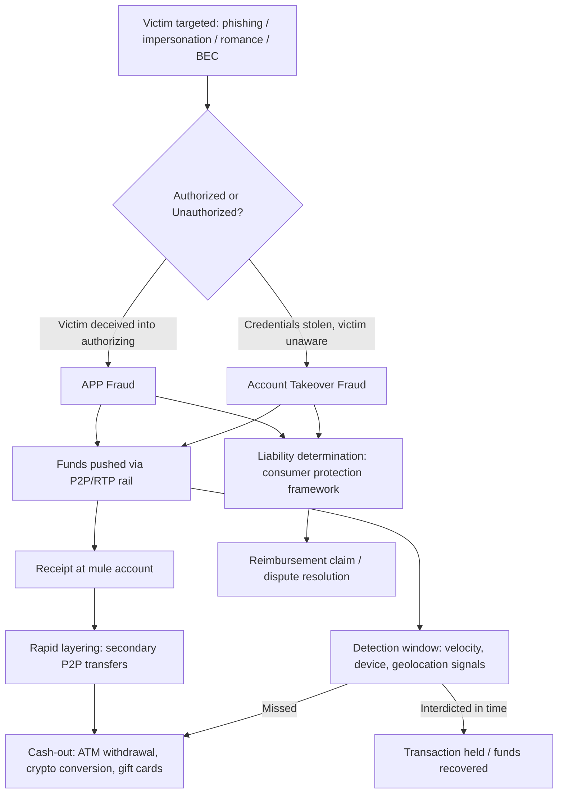

## Real-time and Peer-to-Peer Payment Fraud

### Overview

Real-time payment (RTP) and peer-to-peer (P2P) payment systems (e.g., Zelle, Venmo, Cash App, PayPal, FedNow, The Clearing House RTP network, PayNow, PromptPay, UPI) settle funds transfers within seconds and, critically, are typically irrevocable once completed. This combination of speed and finality removes the traditional fraud-control window that exists in ACH (1–2 business days) or wire transfer (same-day but recallable under certain conditions) systems, making these rails a preferred vector for fraud schemes and a distinct forensic accounting challenge.

### Structural Characteristics Driving Fraud Risk

- **Irrevocability**: Once a push payment clears, the receiving institution has no obligation to return funds absent fraud-network rules or voluntary cooperation; there is no equivalent of a wire recall or ACH reversal window in most P2P rails.
- **Push-payment model**: The payer authorizes and initiates the transfer (as opposed to a pull/debit model), which shifts liability frameworks — many jurisdictions treat authorized push payment (APP) fraud differently from unauthorized transaction fraud under consumer protection law.
- **Alias-based routing**: Transfers are addressed to a phone number, email, or handle rather than a bank account/routing number, which obscures the underlying account holder's identity from the sender and complicates traceability.
- **Minimal friction by design**: These systems are marketed on speed and convenience; multi-factor step-up authentication and transaction holds are commercially disfavored because they degrade user experience.

### Typology of Schemes

**1. Authorized Push Payment (APP) Fraud**

The account holder is deceived into voluntarily authorizing the transfer. Because the transaction is "authorized" from the bank's system perspective, standard unauthorized-transaction fraud protections (e.g., Regulation E in the U.S., to the extent applicable) often do not apply.

- *Impersonation scams*: Fraudster poses as a bank fraud department, IRS/tax agency, law enforcement, or utility company, instructing the victim to "move funds to a safe account."
- *Romance scams*: Extended relationship-building followed by requests for P2P transfers, often structured as multiple smaller payments to avoid velocity triggers.
- *Business email compromise (BEC) variants adapted to P2P*: Spoofed vendor or payroll communications redirecting routine payments to P2P handles instead of traditional ACH.
- *Purchase scams*: Fraudulent online marketplace listings where the buyer is induced to pay via P2P (which lacks purchase protection, unlike credit cards).

**2. Account Takeover (ATO) Fraud**

The fraudster gains unauthorized control of the legitimate user's account (via phishing, SIM-swapping, credential stuffing, or malware) and initiates transfers without the account holder's knowledge. This is technically "unauthorized" fraud and generally does trigger regulatory reimbursement obligations, creating a strong incentive for perpetrators to structure attacks to *appear* authorized (e.g., coercing the victim into confirming an OTP).

**3. Synthetic and Mule Account Networks**

Fraud proceeds are rapidly layered through chains of P2P transfers to mule accounts (often opened with stolen or synthetic identities) before conversion to cash, cryptocurrency, or cross-border transfer — exploiting settlement speed to outrun detection windows.

**4. First-Party ("Friendly") Fraud**

The account holder authorizes a legitimate-appearing transaction and later disputes it as unauthorized to obtain reimbursement, exploiting ambiguity in APP-versus-ATO classification.

**5. Overpayment / Refund Scams**

Fraudster sends an inflated P2P payment (often via a stolen-card-funded source) and requests the difference be returned via a separate, harder-to-trace channel; the original payment is later reversed via chargeback, leaving the victim liable for the refunded amount.

### Detection Signals (Forensic and Analytical)

| Signal Category | Specific Indicators |
| --- | --- |
| Velocity | Multiple transfers in short succession to new/unfamiliar recipients; rapid escalation in transfer amounts |
| Behavioral deviation | Transfer patterns inconsistent with account history (new device, new geolocation, new payee) |
| Network/graph | Recipient account is a hub receiving transfers from many unrelated senders (mule indicator) |
| Device/session | New device enrollment immediately followed by high-value transfer; session originating from anonymizing VPN/proxy |
| Linguistic/contextual | Payment memo fields referencing "help," "loan," "emergency," "invoice correction," or urgency language |
| Recipient account age | Newly opened receiving account with no transaction history prior to inbound fraud proceeds |

**Example — mule network graph pattern (svg_diagram):**

<svg xmlns="http://www.w3.org/2000/svg" viewBox="0 0 700 320">
<text x="350" y="24" text-anchor="middle" font-size="15" font-weight="bold" fill="#1a1a1a">Mule Account Fan-In Pattern (svg_diagram)</text>
<circle cx="100" cy="90" r="26" fill="#e8f0fe" stroke="#1a56db" stroke-width="1.5" />
<text x="100" y="94" text-anchor="middle" font-size="11" fill="#1a1a1a">Victim A</text>
<circle cx="100" cy="170" r="26" fill="#e8f0fe" stroke="#1a56db" stroke-width="1.5" />
<text x="100" y="174" text-anchor="middle" font-size="11" fill="#1a1a1a">Victim B</text>
<circle cx="100" cy="250" r="26" fill="#e8f0fe" stroke="#1a56db" stroke-width="1.5" />
<text x="100" y="254" text-anchor="middle" font-size="11" fill="#1a1a1a">Victim C</text>
<line x1="126" y1="90" x2="330" y2="160" stroke="#9aa5b1" stroke-width="1.5" />
<line x1="126" y1="170" x2="330" y2="165" stroke="#9aa5b1" stroke-width="1.5" />
<line x1="126" y1="250" x2="330" y2="170" stroke="#9aa5b1" stroke-width="1.5" />
<circle cx="360" cy="165" r="34" fill="#fde8e8" stroke="#c81e1e" stroke-width="2" />
<text x="360" y="162" text-anchor="middle" font-size="11" fill="#1a1a1a">Mule</text>
<text x="360" y="176" text-anchor="middle" font-size="11" fill="#1a1a1a">Account</text>
<line x1="394" y1="165" x2="560" y2="90" stroke="#9aa5b1" stroke-width="1.5" />
<line x1="394" y1="165" x2="560" y2="165" stroke="#9aa5b1" stroke-width="1.5" />
<line x1="394" y1="165" x2="560" y2="240" stroke="#9aa5b1" stroke-width="1.5" />
<circle cx="590" cy="90" r="24" fill="#fff4e5" stroke="#b45309" stroke-width="1.5" />
<text x="590" y="94" text-anchor="middle" font-size="10" fill="#1a1a1a">Crypto exch.</text>
<circle cx="590" cy="165" r="24" fill="#fff4e5" stroke="#b45309" stroke-width="1.5" />
<text x="590" y="169" text-anchor="middle" font-size="10" fill="#1a1a1a">2nd mule</text>
<circle cx="590" cy="240" r="24" fill="#fff4e5" stroke="#b45309" stroke-width="1.5" />
<text x="590" y="244" text-anchor="middle" font-size="10" fill="#1a1a1a">Cash-out ATM</text>
<text x="360" y="300" text-anchor="middle" font-size="11" fill="#4b5563">Fan-in from multiple victims, fan-out to layering/cash-out nodes within a compressed time window</text>
</svg>

### Regulatory and Liability Framework

- **United States**: Regulation E (EFTA) governs "unauthorized electronic fund transfers" and requires reimbursement, but APP fraud where the consumer was deceived into authorizing the transfer generally falls outside Reg E's mandatory reimbursement scope. The Consumer Financial Protection Bureau (CFPB) has issued guidance and taken enforcement action distinguishing scam-induced authorized transfers from unauthorized ATO transfers. [Unverified: the precise current scope of CFPB rulemaking on this point, given ongoing regulatory and litigation developments]
- **United Kingdom**: The Payment Systems Regulator (PSR) mandatory reimbursement rules (effective October 2024) require sending and receiving payment service providers to reimburse APP scam victims on qualifying UK Faster Payments transactions, generally split 50/50 between sending and receiving PSPs, subject to a claim limit and exceptions for consumer gross negligence.
- **India**: UPI-related fraud complaints are handled under RBI's Ombudsman Scheme and the Reserve Bank's turnaround-time (TAT) framework for customer liability in unauthorized transactions.
- **Card-network/private-scheme rules**: Zelle (operated by Early Warning Services) has separately expanded reimbursement commitments for certain impersonation-scam categories following regulatory and congressional pressure, distinct from statutory Reg E obligations.

### Forensic Accounting Response Framework

**1. Transaction Reconstruction**

- Obtain full transaction logs including device fingerprint, IP address, geolocation, session timestamps, and authentication method (password, biometric, OTP) for both sending and receiving legs.
- Reconcile the payment rail's settlement record against the originating bank's core ledger entry and the receiving institution's posting to identify any latency or intermediary hop.

**2. Authorization Analysis**

Central forensic question: was the transfer *authorized* (APP fraud, victim liability framework applies) or *unauthorized* (ATO, issuer liability framework applies)? Evidence points:

- OTP/2FA delivery and entry timing relative to call/message logs (coached-authorization indicator)
- Prior account behavior baseline versus the disputed transaction
- Presence of social-engineering artifacts (call recordings, chat logs, phishing emails)

**3. Fund Tracing (Follow-the-Money)**

- Map the receiving account's subsequent outbound flows within the shortest post-receipt window (often minutes to hours in mule schemes).
- Apply tracing doctrines analogous to those used in misappropriation cases (see related topic below) where funds commingle with the mule account's legitimate balance.
- Cross-reference receiving-account KYC data against known synthetic-identity indicators (SSN issued after account opening, mismatched address history, disposable email/phone).

**4. Quantification of Loss**

- Distinguish principal loss from consequential/incidental costs (e.g., overdraft fees triggered by fraudulent transfers, cost of credit monitoring).
- Where partial recovery occurs (interdiction before full layering completes), net the recovered amount and document the interdiction timeline for restitution/insurance claims.

### Illustrative Case Pattern

A controller receives an email purportedly from the company's CFO (spoofed domain) instructing an "urgent vendor payment correction" of $48,000 via the company's Zelle-enabled business banking portal rather than the usual ACH vendor file. The controller authorizes the transfer using valid credentials and a legitimate OTP. Within 22 minutes, the receiving account — opened six days prior — disburses the funds across four secondary transfers, two of which convert to cryptocurrency via an exchange with minimal KYC. Because the controller *did* authorize the transfer under Reg E's technical definition, the originating bank initially declines reimbursement, classifying it as APP/BEC-induced authorized fraud rather than unauthorized ATO.

**Key Points**

- P2P/RTP fraud losses are frequently non-recoverable once cash-out or crypto conversion completes, given settlement speed.
- Authorized-versus-unauthorized classification is the single most consequential legal/forensic determination, driving which liability regime and reimbursement pathway applies.
- Detection must operate on velocity and graph-based signals in near-real time, since post-hoc detection windows are measured in minutes, not days.
- Mule account networks are the structural bottleneck exploited across nearly all P2P fraud typologies; disrupting mule onboarding (KYC at account opening) is a primary control point.

### Mermaid Diagram — P2P Fraud Lifecycle

### Related Topics

- Business email compromise (BEC) and vendor payment fraud
- Anti-money laundering (AML) transaction monitoring and typology mapping
- Know Your Customer (KYC) and synthetic identity detection
- Misappropriation of assets and fund-tracing doctrines (lowest intermediate balance rule, tracing into commingled accounts)
- Card-not-present (CNP) fraud and chargeback mechanics
- Elder financial exploitation schemes
- Cryptocurrency on/off-ramp fraud and blockchain forensic tracing