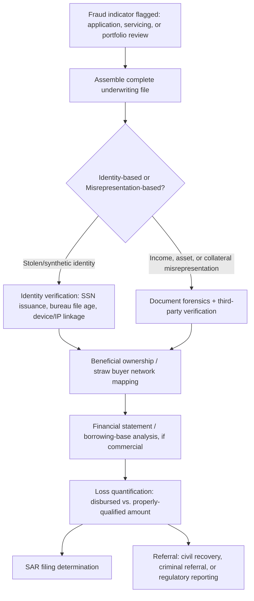

## Loan Fraud and Credit Application Fraud

### Overview

Loan fraud and credit application fraud encompass the intentional misrepresentation of information on a credit application, supporting documentation, or collateral valuation to obtain financing that would not otherwise be approved, or to obtain more favorable terms than the applicant's true risk profile warrants. This category spans consumer lending (auto, personal, credit card), mortgage lending, and commercial/business lending, and includes both first-party fraud (the applicant misrepresents their own information) and third-party/identity fraud (a fraudster impersonates or fabricates an applicant).

### Taxonomy of Schemes

**1. Income and Employment Misrepresentation**

- Fabricated pay stubs, W-2s, or tax returns overstating income.
- Fictitious employer verification (fraudster provides a phone number answered by a co-conspirator posing as HR).
- Understating existing debt obligations to improve debt-to-income (DTI) ratio calculations.

**2. Asset and Down-Payment Fraud**

- "Cash-back at closing" schemes disguised as legitimate credits.
- Gift-letter fraud: down payment funds are actually an undisclosed loan, or the "gift" is sourced from an interested party (seller, broker) in violation of arm's-length requirements.
- Asset seasoning fraud: funds deposited shortly before application to simulate the appearance of stable savings, sourced from undisclosed loans or straw parties.

**3. Occupancy Fraud (Mortgage-Specific)**

Borrower represents a property as owner-occupied (primary residence) to obtain lower interest rates and down payment requirements, while intending to use it as a rental/investment property.

**4. Straw Buyer / Nominee Borrower Schemes**

A creditworthy individual is recruited (often for a fee) to apply for and take title to financing on behalf of the true beneficial party, who cannot qualify directly. Common in both mortgage fraud rings and commercial equipment financing fraud.

**5. Identity Theft / Synthetic Identity Fraud**

- *True-name fraud*: Fraudster uses a real person's stolen identity (SSN, name, DOB) without alteration.
- *Synthetic identity fraud*: Fraudster combines real (often a child's or deceased person's SSN) and fabricated data elements to construct a new credit profile, "seasoning" it over months with authorized-user tradelines and small credit lines before "busting out" with maximum credit exposure.

**6. Collateral Misrepresentation**

- Inflated appraisals through appraiser collusion or comparable-sale manipulation.
- Double-pledging: the same collateral (e.g., inventory, equipment, accounts receivable) is pledged to multiple lenders simultaneously.
- Non-existent collateral in asset-based lending (fictitious inventory or receivables reported to a lender's borrowing-base certificate).

**7. Business/Commercial Loan Fraud**

- Financial statement fraud submitted to obtain SBA loans, lines of credit, or equipment financing (fictitious revenue, understated liabilities).
- Shell company borrowers with no genuine operations, created solely to draw down loan proceeds.
- PPP/EIDL-style emergency-program fraud: inflated payroll figures, fictitious employee counts, or ineligible business claims (a pattern that surged during COVID-era relief programs and remains a heavily litigated fraud category).

**8. Loan Stacking**

Applicant submits multiple simultaneous loan applications across different lenders (particularly in fintech/online lending) before any single lender's credit bureau inquiry or debt reporting updates, obtaining aggregate credit far exceeding true repayment capacity.

### Detection Framework

| Detection Layer | Techniques |
| --- | --- |
| Document forensics | Metadata analysis of submitted PDFs/images (creation software, edit history); font and formatting inconsistency detection; cross-referencing stated employer against third-party payroll verification services (e.g., The Work Number) |
| Data consistency | Cross-field validation (SSN issuance date vs. stated age; address history vs. utility/phone records; IP geolocation vs. stated residence) |
| Velocity/network analysis | Shared device fingerprints, IP addresses, or phone numbers across multiple applications; shared beneficial addresses across seemingly unrelated applicants (straw buyer indicator) |
| Credit bureau analytics | Rapid inquiry clustering across lenders in a short window (loan-stacking indicator); thin-file/no-file applications paired with high requested credit limits (synthetic identity indicator) |
| Collateral verification | Independent appraisal review (desk review, field review); UCC lien search to detect double-pledging of the same collateral across lenders |

**Example — synthetic identity "bust-out" lifecycle (svg_diagram):**

<svg xmlns="http://www.w3.org/2000/svg" viewBox="0 0 720 300">
<text x="360" y="24" text-anchor="middle" font-size="15" font-weight="bold" fill="#1a1a1a">Synthetic Identity Bust-Out Timeline (svg_diagram)</text>
<line x1="60" y1="150" x2="660" y2="150" stroke="#9aa5b1" stroke-width="2" />
<circle cx="90" cy="150" r="8" fill="#1a56db" />
<text x="90" y="185" text-anchor="middle" font-size="11" fill="#1a1a1a">Fabricate</text>
<text x="90" y="198" text-anchor="middle" font-size="11" fill="#1a1a1a">identity</text>
<text x="90" y="130" text-anchor="middle" font-size="10" fill="#4b5563">Month 0</text>
<circle cx="240" cy="150" r="8" fill="#1a56db" />
<text x="240" y="185" text-anchor="middle" font-size="11" fill="#1a1a1a">Open small</text>
<text x="240" y="198" text-anchor="middle" font-size="11" fill="#1a1a1a">tradeline</text>
<text x="240" y="130" text-anchor="middle" font-size="10" fill="#4b5563">Month 1–3</text>
<circle cx="390" cy="150" r="8" fill="#1a56db" />
<text x="390" y="185" text-anchor="middle" font-size="11" fill="#1a1a1a">Season with</text>
<text x="390" y="198" text-anchor="middle" font-size="11" fill="#1a1a1a">on-time payments</text>
<text x="390" y="130" text-anchor="middle" font-size="10" fill="#4b5563">Month 4–12</text>
<circle cx="540" cy="150" r="8" fill="#b45309" />
<text x="540" y="185" text-anchor="middle" font-size="11" fill="#1a1a1a">Request credit</text>
<text x="540" y="198" text-anchor="middle" font-size="11" fill="#1a1a1a">line increases</text>
<text x="540" y="130" text-anchor="middle" font-size="10" fill="#4b5563">Month 12–18</text>
<circle cx="640" cy="150" r="9" fill="#c81e1e" />
<text x="640" y="185" text-anchor="middle" font-size="11" fill="#1a1a1a">Bust-out:</text>
<text x="640" y="198" text-anchor="middle" font-size="11" fill="#1a1a1a">max draw, default</text>
<text x="640" y="130" text-anchor="middle" font-size="10" fill="#4b5563">Month 18+</text>
</svg>

### Forensic Accounting Investigative Procedures

**1. Application File Reconstruction**

- Assemble the complete underwriting file: application, supporting documents, verification records, appraisal, underwriter notes, and approval memoranda.
- Compare submitted documents against independently obtained third-party records (IRS Form 4506-C transcript requests for tax return verification, direct employer contact bypassing numbers provided on the application).

**2. Financial Statement Analysis (Commercial Loan Fraud)**

- Apply horizontal and vertical analysis to identify anomalous period-over-period changes in revenue, receivables, or inventory inconsistent with industry norms.
- Compute and benchmark key ratios (current ratio, DSCR, inventory turnover) against submitted borrowing-base certificates; reconcile to general ledger and bank statement deposits to test revenue existence.
- For asset-based lending, perform a **borrowing base audit**: independently verify a sample of reported receivables via direct account debtor confirmation and reconcile reported inventory to physical count or independent inventory audit.

**3. Beneficial Ownership and Relationship Mapping**

- Identify straw-buyer patterns by mapping shared addresses, phone numbers, employers, or bank accounts across seemingly unrelated loan files.
- Cross-reference loan officer, broker, and appraiser identities across a portfolio to detect collusive origination rings (a statistically disproportionate concentration of fraud-flagged loans tied to a single originator is a strong investigative lead).

**4. Loss Quantification**

- Compute the fraud-induced loss as the difference between amounts disbursed and amounts that would have been approved absent the misrepresentation, net of any legitimate collateral recovery (foreclosure sale proceeds, repossession value) and any payments received prior to default.
- Where fraud is embedded within a otherwise-performing loan (e.g., minor income overstatement on an ultimately-repaid loan), document the *qualifying* misrepresentation separately from the eventual repayment outcome, since regulatory and prosecutorial thresholds often turn on materiality of misrepresentation rather than realized loss.

### Regulatory and Legal Framework

- **United States**: 18 U.S.C. § 1014 (false statements to a financial institution) is the primary federal criminal statute; Bank Secrecy Act (BSA) Suspicious Activity Report (SAR) filing obligations are triggered for financial institutions upon detection of suspected loan fraud above reporting thresholds. The Home Mortgage Disclosure Act (HMDA) and Truth in Lending Act (TILA) create parallel civil compliance exposure.
- **Ability-to-Repay/Qualified Mortgage (ATR/QM) Rule**: Post-2008 mortgage originators must make a reasonable, good-faith determination of a borrower's ability to repay, creating an originator-side compliance obligation that intersects with fraud detection (failure to detect fabricated income can itself create lender liability).
- **SBA loan programs**: False statements on SBA-guaranteed loan applications additionally implicate the False Claims Act where federal guarantee/reimbursement is sought, given the federal government's exposure on the guaranteed portion.

**Key Points**

- The authorized-versus-fabricated-identity distinction (first-party misrepresentation vs. synthetic/stolen identity) drives different investigative and legal pathways, similar in structure to the APP-versus-ATO distinction in payment fraud.
- Synthetic identity fraud is designed to defeat traditional credit-bureau-based detection by building a genuine, seasoned credit history before exploitation.
- Commercial loan fraud investigations rely heavily on core forensic accounting techniques (ratio analysis, borrowing-base audits, revenue reconciliation) rather than solely identity-verification tools.
- Materiality of the misrepresentation — not just ultimate loan performance — typically governs both regulatory reporting obligations and criminal liability thresholds.

### Mermaid Diagram — Loan Fraud Investigation Workflow

### Related Topics

- Mortgage fraud and appraisal fraud
- Synthetic identity fraud and credit bureau file manipulation
- Asset-based lending and borrowing-base audit procedures
- Bank Secrecy Act (BSA) and Suspicious Activity Report (SAR) filing requirements
- Real-time and peer-to-peer payment fraud
- False Claims Act exposure in federally guaranteed lending programs
- Straw buyer and nominee ownership schemes in real estate fraud