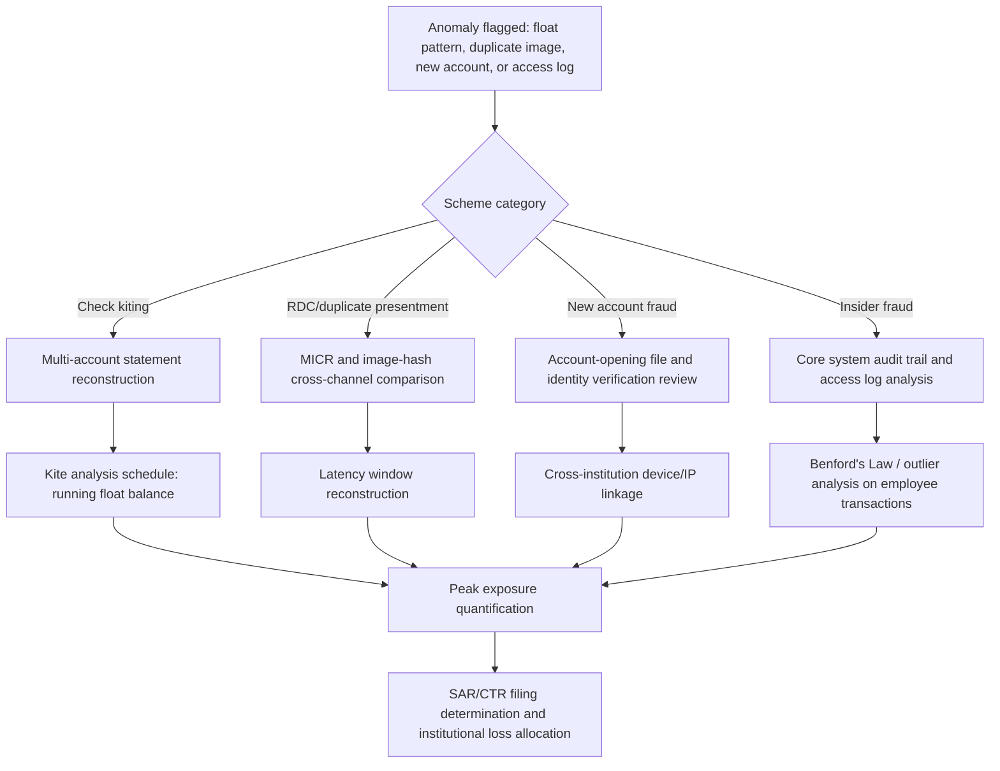

## Deposit and Account Fraud

### Overview

Deposit and account fraud encompasses schemes that exploit the deposit-account relationship between a financial institution and its customers — including check fraud, deposit float manipulation, unauthorized account access, new-account fraud, and account manipulation by insiders. Unlike lending fraud (which targets credit extension) or payment-rail fraud (which targets transfer finality), deposit and account fraud typically exploits the timing gap between provisional credit and final settlement, or exploits weaknesses in account-opening identity verification.

### Taxonomy of Schemes

**1. Check Fraud**

- *Check kiting*: Exploiting the float between two or more accounts at different institutions by depositing checks drawn on insufficient funds and withdrawing against provisional/uncollected credit before the checks clear and bounce, creating a rotating artificial balance.
- *Counterfeit and altered checks*: Forged signatures, altered payee names or amounts (chemical "washing" of ink), or entirely fabricated checks using stolen account and routing numbers.
- *Remote deposit capture (RDC) fraud*: The same physical check is deposited via mobile RDC at one institution and then deposited again (or cashed) at a second institution or ATM before the first deposit's image-clearing process flags the duplicate — exploiting the parallel-processing latency between RDC image capture and physical/electronic check clearing.
- *Check washing (mail theft)*: Physical checks are stolen from mail, chemically altered to change the payee and/or amount while preserving the original signature, then deposited or cashed.

**2. Deposit Float and Provisional Credit Exploitation**

- *Regulation CC (funds availability) manipulation*: Structuring deposits to fall within next-day availability thresholds, then withdrawing provisional credit before the depositary bank's collection process discovers the check is fraudulent or NSF (non-sufficient funds).
- *Reverse check kiting*: Variant schemes designed to specifically exploit the interval between provisional credit posting and final settlement across the Federal Reserve's check-clearing infrastructure or private clearinghouse arrangements.

**3. New Account Fraud**

- Accounts opened using stolen or synthetic identities specifically to receive and immediately withdraw fraud proceeds (functioning as the "mule account" endpoint described in P2P/RTP payment fraud schemes).
- Exploitation of expedited/digital account-opening workflows where identity verification relies on easily-spoofed data (static KYC questions, uploaded ID images vulnerable to synthetic/deepfake manipulation).

**4. Unauthorized Account Access / Account Takeover**

- Credential theft (phishing, credential stuffing, SIM swapping) enabling a fraudster to access an existing account, change contact details (to intercept OTP/alert notifications), and initiate unauthorized withdrawals or transfers.
- Social engineering of call-center or branch staff to bypass authentication controls (e.g., "forgot password" resets via manipulated security-question answers).

**5. Insider/Employee Account Fraud**

- Bank employees creating fictitious accounts, manipulating dormant account balances, or facilitating unauthorized withdrawals from customer accounts using system access privileges.
- Cross-selling fraud: fictitious account openings to meet sales quotas without customer authorization (a scheme category that produced significant regulatory enforcement in retail banking).

**6. Structuring and Layering Through Deposit Accounts**

Deposits structured just below the $10,000 Currency Transaction Report (CTR) threshold (in the U.S.) to avoid triggering mandatory reporting, often across multiple accounts or branches — a pattern relevant to both fraud proceeds laundering and independent money laundering statutes.

### Check Kiting — Detailed Mechanics

Check kiting requires at least two accounts at different (or sometimes the same) institutions and exploits the interval between deposit and final collection.

$$\text{Available Balance}_t = \text{Collected Balance}_t + \text{Uncollected/Float Credit}_t$$

**Illustrative pattern:**

1. Day 1: $50,000 check drawn on Account B (insufficient funds) is deposited into Account A. Bank grants provisional credit.
2. Day 1–2: Funds are withdrawn from Account A against the provisional credit before the check clears.
3. Day 2: A new check drawn on Account A (now also insufficient, having been drained) is deposited into Account B to cover the anticipated shortfall when the original check returns.
4. The cycle repeats with escalating amounts, since each new check must cover the growing shortfall plus new withdrawals, until the scheme collapses when a bank dishonors a check or delays provisional credit.

**Example — check kiting cycle (svg_diagram):**

<svg xmlns="http://www.w3.org/2000/svg" viewBox="0 0 700 280">
<text x="350" y="24" text-anchor="middle" font-size="15" font-weight="bold" fill="#1a1a1a">Check Kiting Cycle (svg_diagram)</text>
<rect x="70" y="90" width="140" height="70" rx="8" fill="#e8f0fe" stroke="#1a56db" stroke-width="1.5" />
<text x="140" y="120" text-anchor="middle" font-size="12" fill="#1a1a1a">Account A</text>
<text x="140" y="138" text-anchor="middle" font-size="10" fill="#4b5563">Bank 1</text>
<rect x="490" y="90" width="140" height="70" rx="8" fill="#e8f0fe" stroke="#1a56db" stroke-width="1.5" />
<text x="560" y="120" text-anchor="middle" font-size="12" fill="#1a1a1a">Account B</text>
<text x="560" y="138" text-anchor="middle" font-size="10" fill="#4b5563">Bank 2</text>
<path d="M 210 105 C 320 60, 380 60, 490 105" fill="none" stroke="#c81e1e" stroke-width="1.5" marker-end="url(#arrow1)" />
<text x="350" y="55" text-anchor="middle" font-size="10" fill="#1a1a1a">Check deposited B→A (NSF)</text>
<path d="M 490 145 C 380 190, 320 190, 210 145" fill="none" stroke="#b45309" stroke-width="1.5" marker-end="url(#arrow1)" />
<text x="350" y="210" text-anchor="middle" font-size="10" fill="#1a1a1a">Covering check deposited A→B (NSF)</text>
<text x="350" y="250" text-anchor="middle" font-size="11" fill="#1a1a1a">Withdrawals against provisional credit occur between each leg; cycle escalates until collapse</text>
</svg>

### Detection Framework

| Signal | Technique |
| --- | --- |
| Kiting detection | Bank of First Deposit (BOFD) analysis identifying frequent, cyclical inter-account check activity; float-ratio analysis (average float balance relative to account activity) |
| RDC duplicate detection | Image-matching algorithms comparing check MICR line and image hash across deposit channels and institutions (often via shared industry databases such as Early Warning Services) |
| New account fraud | Device fingerprinting, document liveness/deepfake detection on uploaded ID images, cross-institution shared-negative-file databases (e.g., ChexSystems) |
| Structuring | CTR aggregation logic across related accounts/branches within a rolling 24-hour or multi-day window; BSA/AML transaction monitoring systems flagging near-threshold deposit patterns |
| Insider fraud | Segregation-of-duties violations in core banking system audit logs; dormant-account activity alerts; employee-account linkage analysis (employees transacting on customer accounts they service) |

### Forensic Accounting Investigative Procedures

**1. Check Kiting Reconstruction**

- Obtain complete account statements for all suspected accounts across all involved institutions for the full scheme period.
- Construct a **kite analysis schedule**: chronological ledger of deposits, withdrawals, and running collected-versus-available balance, isolating the uncollected float component at each point in time.
- Compute the **peak kite exposure** — the maximum uncollected balance the scheme generated — which typically represents the loss exposure to the victim institution(s) at scheme collapse.

**2. Duplicate Presentment / RDC Fraud Analysis**

- Compare MICR line data and check images across all deposit channels and institutions to identify duplicate presentment.
- Reconcile timing of image capture (RDC timestamp) against physical/electronic clearing timestamps to establish the exploited latency window.

**3. New Account Fraud / Identity Verification Review**

- Reconstruct the account-opening file: identity documents submitted, verification method used (documentary vs. knowledge-based authentication), and any deviations from standard onboarding procedures.
- Cross-reference account-opening device/IP data against other flagged accounts to identify a common fraud ring.

**4. Insider Fraud Investigation**

- Analyze core banking system audit trails for override transactions, out-of-pattern access to dormant or high-balance accounts, and transactions occurring outside an employee's assigned customer portfolio.
- Apply Benford's Law and outlier analysis to transaction amounts processed by a given employee or teller ID to identify anomalous patterns inconsistent with routine activity.

**5. Loss and Recovery Quantification**

- Loss is generally measured as the uncollected float amount at scheme collapse, net of any recoverable assets or setoff rights against the perpetrator's other accounts at the institution.
- Where multiple institutions are victims, apportion loss based on which institution extended provisional credit against float versus which institution ultimately dishonored the covering check.

### Regulatory Framework

- **Regulation CC (12 CFR Part 229)**: Governs funds availability schedules and check collection, including the specific deposit-hold rules that check kiting and RDC fraud schemes are designed to exploit.
- **Check 21 Act (Check Clearing for the 21st Century Act)**: Enabled substitute checks and electronic check image exchange, which both accelerated legitimate clearing and created the parallel-channel duplicate-presentment exposure exploited in RDC fraud.
- **Bank Secrecy Act (BSA)**: CTR filing (transactions over $10,000) and SAR filing obligations apply to detected deposit and account fraud, particularly structuring patterns.
- **UCC Article 3 and 4**: Governs allocation of liability for forged or altered checks between the depositary bank, payor bank, and customer, including the comparative-negligence framework applied when a customer's own conduct (e.g., failure to promptly report) contributed to the loss.

**Key Points**

- Check kiting and RDC duplicate-presentment fraud both exploit timing gaps in the check-clearing infrastructure rather than identity or credit misrepresentation.
- New account fraud functions as the deposit-side counterpart to mule accounts in P2P/RTP payment fraud, frequently serving as the terminal receiving point for proceeds of other fraud schemes.
- Insider account fraud investigations rely on audit-trail and access-log forensic analysis rather than external document verification.
- Peak kite exposure — not total transaction volume — is the standard measure of loss in check kiting cases.

### Mermaid Diagram — Deposit Fraud Detection and Investigation Workflow

### Related Topics

- Real-time and peer-to-peer payment fraud
- Loan fraud and credit application fraud
- Bank Secrecy Act (BSA), CTR, and SAR filing requirements
- Structuring and anti-money laundering (AML) typologies
- Employee/insider fraud and segregation-of-duties controls
- UCC Article 3/4 liability allocation for forged instruments
- Identity theft and synthetic identity account-opening fraud