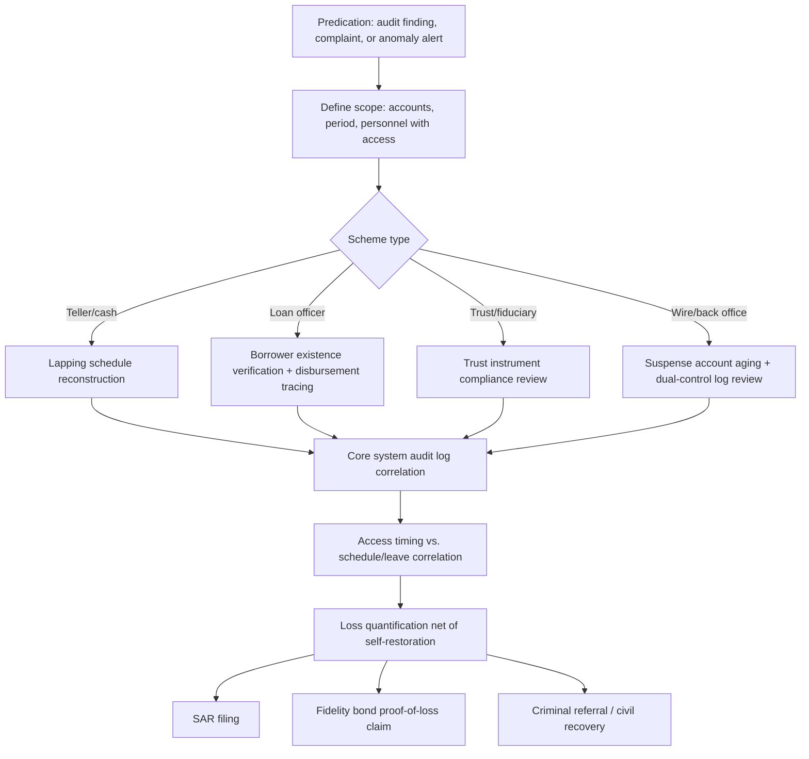

## Embezzlement Within Financial Institutions

### Overview

Embezzlement within financial institutions refers to the fraudulent appropriation of funds, assets, or property by an individual — typically an employee, officer, or trusted agent — who was lawfully entrusted with custody or control of those assets as part of their institutional role. Unlike external fraud (which targets an institution's controls from outside), embezzlement is defined by breach of a fiduciary or custodial relationship, making it a distinct legal and investigative category with its own detection challenges rooted in the perpetrator's legitimate system access.

### Legal Elements

Embezzlement is generally distinguished from theft/larceny by the element of **lawful initial possession**. The core elements typically required for prosecution:

1. A fiduciary or entrustment relationship existed between the perpetrator and the institution/asset owner.
2. The perpetrator had lawful possession or control of the property by virtue of that relationship.
3. The perpetrator fraudulently converted the property to their own use or a use inconsistent with the entrustment.
4. Intent to permanently or fraudulently deprive the rightful owner of the property.

[Inference: The specific statutory elements and terminology vary by jurisdiction; the framework above reflects common-law and general U.S. state/federal statutory patterns and should not be treated as a precise restatement of any single jurisdiction's code.]

### Taxonomy of Schemes (by Institutional Role)

**1. Teller-Level Embezzlement**

- *Unrecorded/skimmed cash*: Cash received from a customer (deposit, loan payment) is pocketed and never posted to the customer's account, or posted at a lesser amount than received.
- *Lapping*: Cash shortages are concealed by applying a subsequent customer's payment to cover an earlier customer's misappropriated funds, creating a rolling concealment that requires continuous new receipts to sustain (structurally analogous to check kiting's rotating-balance mechanic).
- *Vault/cash drawer manipulation*: Recording fictitious cash-in-transit entries or "cash short" write-offs to conceal shortages accumulated through skimming.
- *Dormant account exploitation*: Withdrawals from accounts with no active customer monitoring (dormant, deceased-holder, or long-inactive accounts).

**2. Loan Officer / Credit Function Embezzlement**

- Origination of fictitious or "phantom" loans to non-existent or complicit borrowers, with proceeds diverted to the employee.
- Loan proceeds skimming: a portion of an approved, legitimate loan disbursement is diverted before reaching the borrower.
- Manipulation of loan loss reserves or write-off authority to conceal previously embezzled amounts by reclassifying them as credit losses.

**3. Trust and Fiduciary Account Embezzlement**

- Unauthorized withdrawals or transfers from trust accounts, estate accounts, or accounts held under power of attorney where the employee has administrative access.
- Manipulation of trust accounting records to conceal principal invasion inconsistent with the trust's governing instrument.

**4. Wire Transfer and Back-Office Embezzlement**

- Fraudulent outgoing wire initiation exploiting dual-control weaknesses (self-approval, or collusion with a second authorized approver).
- Manipulation of suspense or clearing accounts (temporary holding accounts used for in-process transactions) to divert funds that are difficult to reconcile due to legitimately high transaction volume and short holding periods.

**5. Executive/Officer-Level Embezzlement**

- Expense reimbursement fraud at a scale exploiting reduced oversight of senior personnel.
- Related-party transaction abuse: directing institutional business (vendor contracts, loan approvals) to entities in which the officer holds an undisclosed interest.
- Manipulation of general ledger entries or financial reporting to conceal diverted funds within the institution's own books (often requiring override of segregation-of-duties controls available only at senior authorization levels).

### Concealment Techniques

| Technique | Mechanism |
| --- | --- |
| Lapping | Rolling misapplication of subsequent legitimate receipts to conceal prior shortages |
| Suspense account abuse | Diverted funds parked in reconciling/clearing accounts that receive less scrutiny due to expected transient balances |
| Void/reversal manipulation | Legitimate transaction recorded, then voided or reversed after cash is extracted, leaving no net balance discrepancy in summary reports |
| Fictitious adjusting entries | Journal entries coded to write-off, suspense, or miscellaneous expense accounts to absorb the shortage |
| Dormant account targeting | Selecting accounts unlikely to generate customer-initiated reconciliation complaints |
| Statement suppression | Redirecting or intercepting account statements/notices for affected accounts to delay customer discovery |

**Example — lapping scheme mechanics (svg_diagram):**

<svg xmlns="http://www.w3.org/2000/svg" viewBox="0 0 700 260">
<text x="350" y="24" text-anchor="middle" font-size="15" font-weight="bold" fill="#1a1a1a">Lapping Scheme Concealment (svg_diagram)</text>
<text x="60" y="60" font-size="11" fill="#1a1a1a">Day 1: Customer A pays $1,000 → embezzled, not posted</text>
<text x="60" y="95" font-size="11" fill="#1a1a1a">Day 5: Customer B pays $1,000 → posted to Customer A's account to cover shortage</text>
<text x="60" y="130" font-size="11" fill="#1a1a1a">Day 9: Customer C pays $1,200 → $1,000 posted to Customer B, $200 embezzled</text>
<text x="60" y="165" font-size="11" fill="#1a1a1a">Day 14: Customer D pays $1,200 → posted to Customer C to cover shortage</text>
<line x1="55" y1="185" x2="645" y2="185" stroke="#9aa5b1" stroke-width="1" />
<text x="350" y="215" text-anchor="middle" font-size="12" fill="#c81e1e" font-weight="bold">Shortage grows over time; scheme requires perpetual new receipts to sustain concealment</text>
<text x="350" y="240" text-anchor="middle" font-size="11" fill="#4b5563">Detection point: reconciling subsidiary ledger (customer accounts) to control account, or customer complaint of missing payment</text>
</svg>

### Detection Framework

**Control-based detection:**

- **Mandatory rotation and vacation policies**: Lapping and similar continuous-concealment schemes require the perpetrator's ongoing presence to maintain the rolling cover; forced absence (vacation, job rotation) frequently causes such schemes to surface, since no one is present to apply the next covering entry.
- **Dual control and segregation of duties**: Separating transaction initiation, approval, and reconciliation functions, particularly for wire transfers and general ledger adjusting entries.
- **Independent reconciliation**: Subsidiary ledger (customer account) balances must be reconciled to control account totals by personnel independent of the transaction-processing function.
- **Suspense/clearing account aging reports**: Automated flagging of suspense account items outstanding beyond an expected clearing window.

**Analytical detection:**

- Benford's Law analysis on transaction amounts processed by a given employee ID, flagging deviations from expected first-digit distribution.
- Void/reversal ratio analysis by employee — an elevated rate of voided transactions relative to peers is a recognized red flag.
- Dormant account activity monitoring — any transaction activity on accounts previously flagged inactive.
- Statistical outlier analysis on expense reimbursements, override authorizations, and after-hours system access by employee.

### Forensic Accounting Investigative Procedures

**1. Predication and Scope Assessment**

- Establish predication (the factual basis justifying investigation) via internal audit findings, whistleblower reports, customer complaints, or anomaly detection system alerts.
- Define the investigative scope: affected account(s), time period, and the employee(s) with relevant system access during that period.

**2. Reconstruction of the Scheme**

- Pull complete transaction histories for affected accounts, cross-referenced against the general ledger control account and any suspense/clearing accounts implicated.
- For lapping schemes, construct a chronological schedule matching each customer's actual payment to the account it was posted against, isolating the systematic misapplication pattern and computing the running (typically growing) concealment gap.
- For loan-related embezzlement, verify the existence of the borrower (identity verification, independent contact) and trace disbursement instructions to the actual recipient bank account.

**3. Digital Forensics and Access Log Analysis**

- Extract core banking system audit logs (user ID, transaction type, timestamp, override flags, IP/terminal ID) for the relevant accounts and time period.
- Correlate system access timing against the employee's scheduled shifts, badge access records, and any period of absence (testing whether the scheme paused or was covered by another individual during vacation/leave, which can itself be evidence of collusion).

**4. Loss Quantification**

- Total misappropriation is typically computed as the cumulative diverted amount less any amounts the perpetrator personally repaid or restored prior to discovery (some perpetrators partially self-correct to delay detection).
- Distinguish the *embezzlement loss* (funds diverted) from *concealment-related costs* (e.g., customer remediation, regulatory penalties, or reputational/compliance remediation costs), as these are typically quantified and presented separately in restitution and insurance-claim contexts.

**5. Interview and Documentary Evidence**

- Employee interviews are typically sequenced after documentary evidence has been substantially assembled, following standard fraud examination methodology (document-first approach reduces risk of evidence destruction or coordinated cover stories).
- Obtain and preserve any physical evidence of concealment (altered documents, forged approvals, personal bank records showing deposits correlating to diversion dates).

### Regulatory and Reporting Framework

- **Bank Secrecy Act (BSA) SAR filing**: Financial institutions are required to file a Suspicious Activity Report upon detection of suspected employee embezzlement above applicable thresholds, regardless of whether law enforcement referral is separately pursued.
- **Fidelity bond / financial institution bond coverage**: Most depository institutions carry blanket bond coverage specifically insuring against employee dishonesty; a formal proof-of-loss claim requires the forensic loss quantification described above, and bond carriers frequently engage independent forensic accountants to validate claimed losses.
- **18 U.S.C. § 656 / § 657 (U.S. federal)**: Criminalizes embezzlement by a bank officer or employee of a federally insured institution, and embezzlement from a federal lending, credit, or insurance institution, respectively — reflecting a specific federal statutory category distinct from generic state embezzlement statutes.
- **Regulatory examination follow-up**: Prudential regulators (e.g., OCC, FDIC, state banking departments) typically require a formal corrective action response addressing the control deficiency that allowed the embezzlement, independent of any criminal or civil proceeding against the individual.

**Key Points**

- The defining legal element of embezzlement — lawful initial possession followed by fraudulent conversion — distinguishes it from external theft and drives a different investigative starting point (internal access and authority review, not external perimeter analysis).
- Lapping-style concealment schemes are inherently unsustainable without the perpetrator's continuous presence, making forced rotation/vacation policies a uniquely effective control for this fraud category.
- Loss quantification must account for any self-restoration by the perpetrator prior to discovery, which is a recognized behavioral pattern distinguishing embezzlement from schemes with no concealment-maintenance incentive.
- Fidelity bond claims create a parallel, contractually-defined forensic accounting workstream distinct from criminal prosecution or regulatory reporting.

### Mermaid Diagram — Embezzlement Investigation Workflow

### Related Topics

- Deposit and account fraud
- Loan fraud and credit application fraud
- Fidelity bond and financial institution bond claims
- Segregation of duties and internal control design (COSO framework)
- Fraud examiner interview methodology (document-first sequencing)
- Trust and fiduciary accounting standards
- Benford's Law and digital analytical procedures in fraud detection