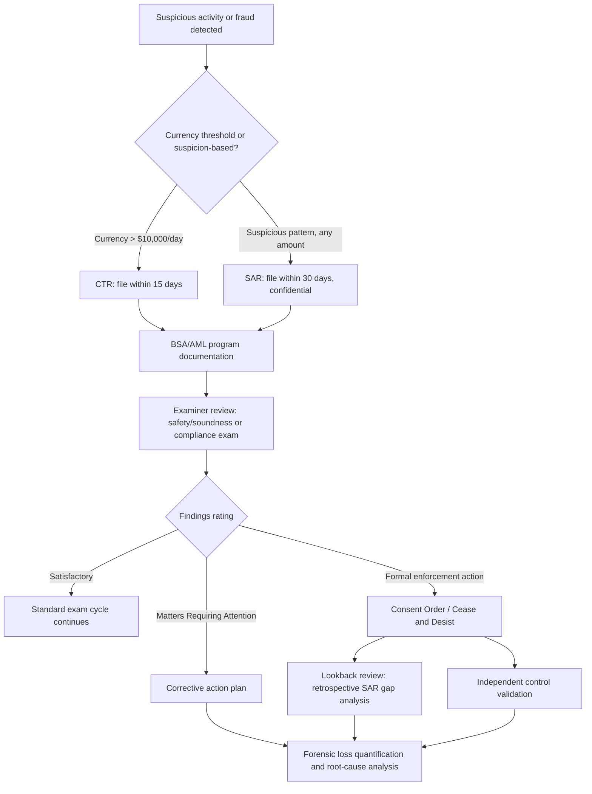

## Regulatory Examination and Reporting Obligations

### Overview

Financial institutions operate under a layered framework of prudential examination and mandatory reporting obligations designed to detect, deter, and enable law-enforcement response to fraud, money laundering, and safety-and-soundness risks. For the forensic accountant, this framework defines both the *evidentiary trail* available for investigation (examination reports, SARs, CTRs) and the *procedural obligations* that arise once fraud is detected, independent of any civil or criminal proceeding against the perpetrator.

### Prudential Examination Framework (United States)

**1. Primary Federal Regulators**

- **Office of the Comptroller of the Currency (OCC)**: Examines national banks and federal savings associations.
- **Federal Deposit Insurance Corporation (FDIC)**: Examines state-chartered non-member banks; also administers deposit insurance and resolution authority.
- **Federal Reserve System**: Examines state-chartered member banks and bank holding companies.
- **National Credit Union Administration (NCUA)**: Examines federally insured credit unions.
- **State banking departments**: Examine state-chartered institutions, often in coordination (alternating or joint examinations) with the applicable federal regulator.

**2. Examination Types**

- *Safety and soundness examinations*: Assess capital adequacy, asset quality, management, earnings, liquidity, and sensitivity to market risk (the CAMELS rating framework).
- *Compliance examinations*: Assess adherence to consumer protection law (TILA, RESPA, ECOA, Fair Lending) and BSA/AML program requirements.
- *IT/cybersecurity examinations*: Assess information security controls, often under FFIEC (Federal Financial Institutions Examination Council) guidance.
- *Trust examinations*: Assess fiduciary account administration for institutions exercising trust powers.

**3. CAMELS Rating Components**

| Component | Focus |
| --- | --- |
| Capital adequacy | Capital ratios relative to risk-weighted assets |
| Asset quality | Loan portfolio quality, classification, and reserve adequacy |
| Management | Governance, risk management, and internal control effectiveness |
| Earnings | Quality and sustainability of profitability |
| Liquidity | Ability to meet funding obligations |
| Sensitivity to market risk | Exposure to interest rate, credit spread, and other market risks |

A composite rating of 4 or 5 typically triggers formal enforcement action (Consent Order, Cease and Desist Order) and heightened examination frequency — a status that materially affects the scope and urgency of any concurrent forensic accounting engagement (e.g., a fraud loss quantification feeding into a regulator-mandated capital restoration plan).

### Bank Secrecy Act (BSA) / Anti-Money Laundering (AML) Reporting Obligations

**1. Currency Transaction Report (CTR) — FinCEN Form 104**

- Required for currency transactions exceeding $10,000 in a single business day, whether in a single transaction or aggregated multiple transactions by or on behalf of the same person.
- Filing deadline: 15 calendar days after the transaction date.
- Structuring transactions specifically to evade the CTR threshold is itself a separate federal crime (31 U.S.C. § 5324), independent of whether the underlying funds are illicit.

**2. Suspicious Activity Report (SAR) — FinCEN Form 111**

- Required when a financial institution detects a transaction (or pattern of transactions) involving $5,000 or more (for most institutions; thresholds vary by institution type) that the institution knows, suspects, or has reason to suspect involves funds from illegal activity, is designed to evade BSA requirements, has no business or apparent lawful purpose, or involves the institution being used to facilitate criminal activity.
- Filing deadline: 30 calendar days from initial detection (extendable to 60 days if no suspect is identified).
- **Confidentiality**: SAR filings and their existence are strictly confidential under 31 U.S.C. § 5318(g)(2) — an institution (and its employees) may not disclose to the subject of the SAR, or generally to any third party outside defined regulatory/law-enforcement channels, that a SAR has been filed. This has direct implications for forensic accountants: SAR content and filing status typically cannot be referenced in civil litigation work product or shared with opposing counsel absent a specific regulatory/court process.
- Continuing activity requires continuing SAR filings (typically at 90-day intervals) for as long as the suspicious pattern persists.

**3. Currency and Monetary Instrument Report (CMIR) — FinCEN Form 105**

Required for physical transport of currency or monetary instruments exceeding $10,000 into or out of the United States.

**4. Foreign Bank Account Report (FBAR) — FinCEN Form 114**

Required of U.S. persons with financial interest in or signature authority over foreign financial accounts exceeding $10,000 in aggregate at any point during the calendar year — relevant to forensic accountants tracing fraud proceeds or undisclosed assets internationally.

**5. BSA/AML Program Requirements**

Institutions must maintain a written, board-approved BSA/AML program incorporating:

- Internal controls (policies and procedures for compliance)
- Independent testing (audit function, internal or external)
- A designated BSA compliance officer
- Ongoing employee training
- (Post-2020, per the Anti-Money Laundering Act) Risk-based customer due diligence and beneficial ownership identification

**Example — SAR/CTR filing decision logic (svg_diagram):**

<svg xmlns="http://www.w3.org/2000/svg" viewBox="0 0 700 300">
<text x="350" y="24" text-anchor="middle" font-size="15" font-weight="bold" fill="#1a1a1a">CTR vs. SAR Filing Logic (svg_diagram)</text>
<rect x="270" y="45" width="160" height="45" rx="6" fill="#e8f0fe" stroke="#1a56db" stroke-width="1.5" />
<text x="350" y="72" text-anchor="middle" font-size="11" fill="#1a1a1a">Transaction detected</text>
<line x1="350" y1="90" x2="350" y2="115" stroke="#4b5563" stroke-width="1.5" />
<rect x="120" y="115" width="200" height="55" rx="6" fill="#fff4e5" stroke="#b45309" stroke-width="1.5" />
<text x="220" y="138" text-anchor="middle" font-size="11" fill="#1a1a1a">Currency &gt; $10,000</text>
<text x="220" y="153" text-anchor="middle" font-size="10" fill="#4b5563">single business day</text>
<rect x="380" y="115" width="220" height="55" rx="6" fill="#fde8e8" stroke="#c81e1e" stroke-width="1.5" />
<text x="490" y="138" text-anchor="middle" font-size="11" fill="#1a1a1a">Suspicious pattern/purpose</text>
<text x="490" y="153" text-anchor="middle" font-size="10" fill="#4b5563">≥ $5,000, no lawful purpose</text>
<line x1="220" y1="170" x2="220" y2="200" stroke="#4b5563" stroke-width="1.5" />
<line x1="490" y1="170" x2="490" y2="200" stroke="#4b5563" stroke-width="1.5" />
<rect x="120" y="200" width="200" height="45" rx="6" fill="#e8f0fe" stroke="#1a56db" stroke-width="1.5" />
<text x="220" y="227" text-anchor="middle" font-size="11" fill="#1a1a1a">File CTR within 15 days</text>
<rect x="380" y="200" width="220" height="45" rx="6" fill="#e8f0fe" stroke="#1a56db" stroke-width="1.5" />
<text x="490" y="227" text-anchor="middle" font-size="11" fill="#1a1a1a">File SAR within 30 days</text>
<text x="350" y="275" text-anchor="middle" font-size="10" fill="#4b5563">Both may apply to the same transaction; CTR is currency-threshold-driven, SAR is suspicion-driven regardless of amount</text>
</svg>

### The Forensic Accountant's Role in the Examination/Reporting Context

**1. SAR Decision Support**

Forensic accountants engaged in fraud investigations frequently support (but do not themselves make) the institution's SAR-filing determination by:

- Quantifying the transaction pattern and financial impact underlying the suspicious activity.
- Documenting the analytical basis for the "reason to suspect" standard (pattern analysis, red-flag correlation, inconsistency with stated account purpose).
- Note: the *decision* to file remains with the institution's compliance function; the forensic accountant's work product typically feeds that decision rather than constituting the filing itself.

**2. Examination Response Support**

- Assembling loss data, root-cause analysis, and corrective-action documentation in response to examiner findings (Matters Requiring Attention, Matters Requiring Immediate Attention, or formal enforcement actions).
- Independent validation of loss estimates presented to examiners, particularly where a fraud loss affects capital adequacy calculations or loan loss reserve adequacy.

**3. Regulatory Enforcement Action Remediation**

Where a Consent Order or Cease and Desist Order specifically addresses a fraud-related control failure (e.g., inadequate BSA/AML program, deficient underwriting controls), forensic accountants are frequently engaged to:

- Perform "lookback" reviews — retrospective analysis of a historical transaction population to identify previously unreported suspicious activity requiring back-filed SARs.
- Validate the design and operating effectiveness of newly implemented remediation controls.

**4. Civil Money Penalty (CMP) and Restitution Quantification**

Regulatory enforcement actions frequently require independent quantification of customer harm for restitution purposes (distinct from, and sometimes larger than, direct fraud loss to the institution itself) — for example, quantifying fee-related harm in a cross-selling or unauthorized-account scheme.

### Sarbanes-Oxley and Public Company Reporting Intersection

For publicly traded financial institutions (bank holding companies), fraud with a material financial statement impact additionally implicates:

- **SOX Section 302/404**: Management's certification of internal control effectiveness; a material fraud-related control weakness may require disclosure as a "material weakness" in internal control over financial reporting (ICFR).
- **SEC reporting**: Material fraud losses may trigger Form 8-K disclosure obligations (Item 4.02 for non-reliance on previously issued financial statements, if restatement is required).

### Regulatory Framework Summary Table

| Obligation | Trigger | Deadline | Governing Authority |
| --- | --- | --- | --- |
| CTR | Currency transaction(s) > $10,000/day | 15 calendar days | 31 U.S.C. § 5313; 31 CFR 1010.311 |
| SAR | Suspected illegal activity ≥ $5,000 (varies) | 30 calendar days (extendable to 60) | 31 U.S.C. § 5318(g); 12 CFR 21.11 (OCC) and parallel agency rules |
| CMIR | Cross-border currency/instrument transport > $10,000 | At time of transport | 31 U.S.C. § 5316 |
| FBAR | Foreign account interest/authority > $10,000 aggregate | April 15 (automatic extension to October 15) | 31 U.S.C. § 5314; 31 CFR 1010.350 |
| 8-K (Item 4.02) | Non-reliance on prior financials | 4 business days | SEC Rule; Securities Exchange Act of 1934 |

**Key Points**

- SAR confidentiality under 31 U.S.C. § 5318(g)(2) is a hard legal constraint on forensic accountants: SAR existence and content cannot be disclosed outside defined channels, which affects how findings are documented and shared in parallel civil proceedings.
- CTR and SAR obligations are independent and can both apply to the same underlying transaction — one is threshold-driven (currency amount), the other is suspicion-driven (regardless of amount).
- Forensic accountants typically support, rather than make, the institution's regulatory filing decisions, but their quantification and root-cause work product is frequently the evidentiary basis examiners and enforcement actions rely upon.
- Composite CAMELS ratings and formal enforcement actions materially shape the scope, urgency, and audience (regulator vs. board vs. law enforcement) of a forensic accounting engagement at a financial institution.

### Mermaid Diagram — Regulatory Reporting and Examination Response Workflow

### Related Topics

- Embezzlement within financial institutions
- Deposit and account fraud
- Loan fraud and credit application fraud
- Anti-Money Laundering Act of 2020 and beneficial ownership reporting
- Sarbanes-Oxley internal control over financial reporting (ICFR)
- Civil money penalty quantification and customer restitution methodology
- FFIEC cybersecurity examination guidance