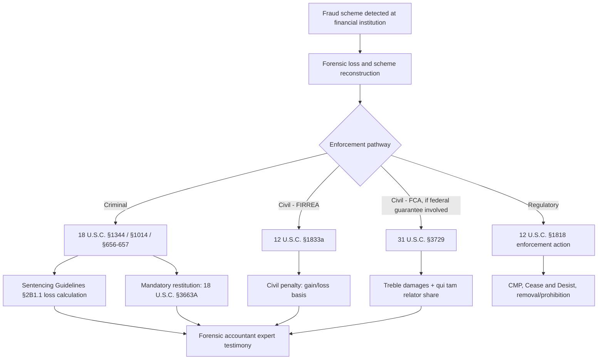

## Bank Fraud Statutes and Enforcement

### Overview

Bank fraud statutes provide the criminal and civil enforcement architecture underlying every fraud category applicable to financial institutions — deposit/account fraud, loan fraud, embezzlement, and payment fraud. This topic addresses the statutory framework itself (elements, jurisdictional scope, and enforcement mechanisms) rather than any single fraud typology, and functions as the legal foundation that determines how forensic accounting findings translate into prosecutable or civilly actionable claims.

### Primary Federal Statutes (United States)

**1. 18 U.S.C. § 1344 — Bank Fraud**

The principal federal bank fraud statute, criminalizing any scheme to:

- (a) defraud a financial institution, or
- (b) obtain money, funds, credits, assets, securities, or other property owned by, or under the custody/control of, a financial institution by means of false or fraudulent pretenses, representations, or promises.

Key doctrinal features:

- **No requirement of institutional loss**: Unlike some fraud statutes, § 1344 does not require the government to prove the financial institution actually suffered a loss — only that a scheme to defraud existed and the defendant had intent to defraud. [Unverified: this reflects the general judicial interpretation following *Loughrin v. United States* (2014) and related case law; specific circuit-level nuances may vary and should be verified against current precedent for any specific matter.]
- **Materiality requirement**: The misrepresentation must be material to the institution's decision-making (established in *Neder v. United States*, 1999, as applied to federal fraud statutes generally).
- **Federally insured/regulated institution nexus**: The statute applies to institutions whose deposits are federally insured (FDIC, NCUA) or that are otherwise federally chartered/regulated, providing the jurisdictional hook for federal prosecution.
- Maximum penalty: up to 30 years imprisonment and/or a fine of up to $1,000,000 per count.

**2. 18 U.S.C. § 1014 — False Statements to a Financial Institution**

Criminalizes knowingly making a false statement or willfully overvaluing property for the purpose of influencing the action of a federally insured financial institution (or federal lending/insurance agency) in connection with a loan, credit application, or extension of credit. This is the primary statute underlying loan fraud and credit application fraud prosecutions.

**3. 18 U.S.C. §§ 656 and 657 — Embezzlement by Bank Officer/Employee**

- § 656: Criminalizes embezzlement, abstraction, or willful misapplication of funds by an officer, director, agent, or employee of a federally insured or Federal Reserve member bank.
- § 657: Parallel provision covering embezzlement from federal lending, credit, or insurance institutions (e.g., federal credit unions, certain federal agencies).

**4. 18 U.S.C. § 1343 — Wire Fraud**

Frequently charged alongside or as an alternative to bank fraud where the scheme employs interstate wire communications (electronic funds transfers, email, telephone) — highly relevant given the interstate nature of RTP/P2P payment rails and electronic loan application processing.

**5. 18 U.S.C. § 1957 — Engaging in Monetary Transactions in Property Derived from Unlawful Activity**

Criminalizes knowingly engaging in a monetary transaction of more than $10,000 involving criminally derived property, frequently charged as a follow-on offense once fraud proceeds are deposited or transferred (relevant to money mule and layering analysis).

**6. Bank Secrecy Act Criminal Provisions**

- 31 U.S.C. § 5324 (structuring): Criminalizes structuring transactions specifically to evade CTR reporting requirements.
- 31 U.S.C. § 5322: General criminal penalty provision for willful BSA violations.

### Civil Enforcement Mechanisms

**1. Financial Institutions Reform, Recovery, and Enforcement Act (FIRREA) — 12 U.S.C. § 1833a**

Provides civil penalties for violations of enumerated predicate criminal statutes (including §§ 1344, 1014, 656/657, and mail/wire fraud "affecting a federally insured financial institution"), notably featuring:

- A **10-year statute of limitations** (substantially longer than the typical 5-year federal criminal fraud limitations period), making FIRREA a preferred civil enforcement tool for older fraud schemes.
- A **preponderance of the evidence** standard (versus the criminal "beyond a reasonable doubt" standard), lowering the evidentiary bar for government recovery actions.
- Penalties up to the greater of a fixed statutory amount or the gain to the defendant/loss to the victim, without a requirement of criminal conviction.

**2. False Claims Act (FCA) — 31 U.S.C. §§ 3729–3733**

Applicable where fraud involves a federally guaranteed loan program (SBA, FHA-insured mortgages) and the government pays out on the guarantee — treating the guarantee claim itself as a "false claim" against the federal government. Includes qui tam (whistleblower) provisions allowing private relators to file suit on the government's behalf and share in recovery.

**3. Regulatory Enforcement Actions**

Prudential regulators (OCC, FDIC, Federal Reserve, NCUA) possess independent civil enforcement authority under 12 U.S.C. § 1818, including:

- Cease and Desist Orders
- Civil Money Penalties (CMPs)
- Removal and prohibition orders against individual bank officers/directors

### Enforcement Agency Roles

| Agency | Role |
| --- | --- |
| Federal Bureau of Investigation (FBI) | Primary federal investigative agency for bank fraud; often works jointly with financial institution internal investigations |
| Department of Justice (DOJ) — U.S. Attorneys' Offices | Prosecutes criminal bank fraud; pursues FIRREA and FCA civil actions |
| Office of Inspector General (relevant agency) | Investigates fraud involving federally guaranteed programs (e.g., SBA-OIG for SBA loan fraud, HUD-OIG for FHA mortgage fraud) |
| Financial Crimes Enforcement Network (FinCEN) | Administers BSA reporting; analyzes SAR/CTR data for law enforcement referral |
| Prudential regulators (OCC/FDIC/Fed/NCUA) | Independent civil enforcement authority; examination-driven referrals to DOJ/FBI |
| Secret Service | Historically significant jurisdiction over financial fraud involving federal interests, particularly payment card and access device fraud (18 U.S.C. § 1029) |

### Statute Selection and Charging Considerations

Prosecutors and civil enforcement authorities frequently have overlapping statutory options for the same underlying conduct, with charging/pleading decisions driven by:

- **Evidentiary strength on specific elements** (e.g., § 1344 does not require proving actual institutional loss, which can be advantageous where loss quantification is contested or incomplete).
- **Limitations period** (FIRREA's 10-year civil window versus shorter criminal limitations periods).
- **Standard of proof** (civil preponderance versus criminal beyond-a-reasonable-doubt).
- **Available remedies** (criminal incarceration and criminal restitution versus civil monetary penalties and injunctive/prohibition relief).

**Example — statutory pathway selection (svg_diagram):**

<svg xmlns="http://www.w3.org/2000/svg" viewBox="0 0 720 280">
<text x="360" y="24" text-anchor="middle" font-size="15" font-weight="bold" fill="#1a1a1a">Bank Fraud Enforcement Pathway Selection (svg_diagram)</text>
<rect x="290" y="45" width="140" height="40" rx="6" fill="#e8f0fe" stroke="#1a56db" stroke-width="1.5" />
<text x="360" y="70" text-anchor="middle" font-size="11" fill="#1a1a1a">Fraud scheme identified</text>
<line x1="360" y1="85" x2="360" y2="105" stroke="#4b5563" stroke-width="1.5" />
<line x1="360" y1="105" x2="150" y2="140" stroke="#4b5563" stroke-width="1.5" />
<line x1="360" y1="105" x2="360" y2="140" stroke="#4b5563" stroke-width="1.5" />
<line x1="360" y1="105" x2="570" y2="140" stroke="#4b5563" stroke-width="1.5" />
<rect x="60" y="140" width="180" height="55" rx="6" fill="#fde8e8" stroke="#c81e1e" stroke-width="1.5" />
<text x="150" y="163" text-anchor="middle" font-size="11" fill="#1a1a1a">Criminal prosecution</text>
<text x="150" y="178" text-anchor="middle" font-size="10" fill="#4b5563">§1344/1014, BRD standard</text>
<rect x="270" y="140" width="180" height="55" rx="6" fill="#fff4e5" stroke="#b45309" stroke-width="1.5" />
<text x="360" y="163" text-anchor="middle" font-size="11" fill="#1a1a1a">FIRREA civil action</text>
<text x="360" y="178" text-anchor="middle" font-size="10" fill="#4b5563">10-yr SOL, preponderance</text>
<rect x="480" y="140" width="180" height="55" rx="6" fill="#e8f0fe" stroke="#1a56db" stroke-width="1.5" />
<text x="570" y="163" text-anchor="middle" font-size="11" fill="#1a1a1a">Regulatory CMP/order</text>
<text x="570" y="178" text-anchor="middle" font-size="10" fill="#4b5563">§1818, no conviction required</text>
<text x="360" y="235" text-anchor="middle" font-size="11" fill="#4b5563">Pathways are not mutually exclusive; parallel proceedings are common</text>
</svg>

### The Forensic Accountant's Role in Enforcement Proceedings

**1. Loss and Materiality Analysis**

Although § 1344 does not require proof of institutional loss for conviction, loss quantification remains central to:

- **Sentencing**: U.S. Sentencing Guidelines § 2B1.1 bases offense-level calculations substantially on the dollar amount of loss, making forensic loss quantification directly determinative of sentencing exposure.
- **Restitution**: Mandatory Victims Restitution Act (18 U.S.C. § 3663A) requires restitution to identified victims in bank fraud cases, necessitating a defensible loss calculation methodology.
- **Materiality support**: Even though loss itself isn't an element, demonstrating the misrepresentation's materiality to the institution's decision often depends on financial/underwriting analysis.

**2. Civil Penalty and Damages Quantification**

In FIRREA and FCA actions, forensic accountants typically quantify:

- Gain to the defendant (frequently the statutory penalty basis under FIRREA).
- Government/institutional loss (relevant to both penalty calculation and treble-damages exposure under the FCA).

**3. Expert Testimony**

Forensic accountants are frequently retained as testifying experts on loss quantification methodology, tracing analysis, and the application of accounting standards to disputed transactions — requiring adherence to applicable expert-evidence admissibility standards (e.g., *Daubert* in U.S. federal courts).

**4. Statute of Limitations Analysis**

Given FIRREA's extended 10-year civil window versus shorter criminal limitations periods, forensic accountants performing historical fraud reconstruction must be attentive to which transactions fall within which enforcement pathway's viable limitations period — directly affecting the scope of the loss period analyzed.

### Comparative Statutory Summary

| Statute | Type | Institution Nexus | Loss Element Required | Limitations Period |
| --- | --- | --- | --- | --- |
| 18 U.S.C. § 1344 | Criminal | Federally insured/regulated | No (scheme + intent sufficient) | 10 years (extended for bank fraud specifically) |
| 18 U.S.C. § 1014 | Criminal | Federally insured/regulated | No | 10 years |
| 18 U.S.C. §§ 656/657 | Criminal | Federally insured/member bank | No (misapplication/embezzlement itself is the offense) | 10 years |
| FIRREA (12 U.S.C. § 1833a) | Civil | Predicate offense "affecting" a federally insured institution | Penalty basis, not conviction element | 10 years |
| False Claims Act | Civil (qui tam available) | Federal guarantee/payment program | Damages basis (treble damages) | 6 years (or 3 years from government knowledge, up to 10-year cap) |

**Key Points**

- § 1344's lack of an actual-loss requirement is a critical distinction from generic fraud statutes, shifting prosecutorial focus to scheme existence and fraudulent intent rather than provable institutional harm.
- FIRREA's 10-year limitations period and preponderance standard make it a materially more accessible civil enforcement tool than criminal prosecution for older or evidentiarily weaker bank fraud schemes.
- Loss quantification remains forensically critical even under statutes not requiring loss as an element, because it drives sentencing guidelines calculations and mandatory restitution.
- Parallel criminal, civil (FIRREA/FCA), and regulatory (§ 1818) proceedings frequently proceed simultaneously against the same conduct, each with distinct evidentiary standards and available remedies.

### Mermaid Diagram — Bank Fraud Statutory Enforcement Architecture

### Related Topics

- Regulatory examination and reporting obligations
- Embezzlement within financial institutions
- Loan fraud and credit application fraud
- U.S. Sentencing Guidelines §2B1.1 loss calculation methodology
- Mandatory Victims Restitution Act and restitution quantification
- Expert witness testimony standards (Daubert/Frye) in financial fraud litigation
- False Claims Act qui tam actions in federally guaranteed lending