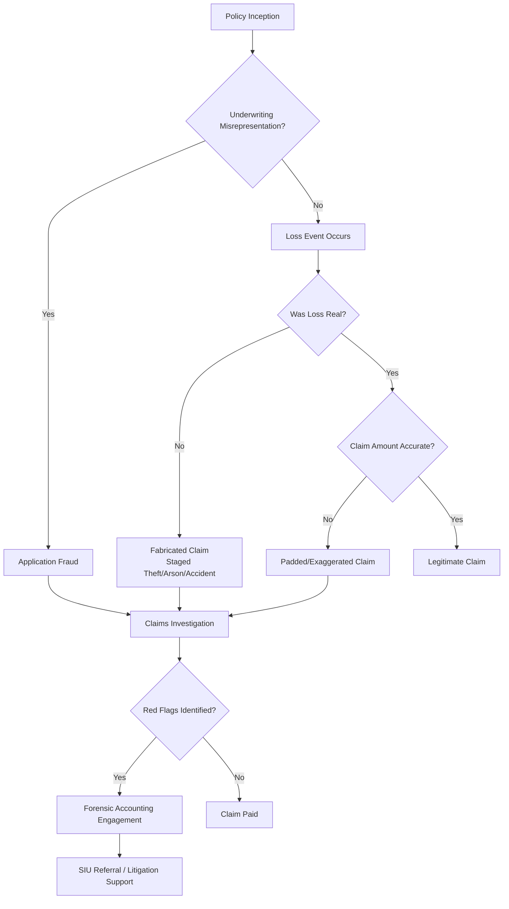

## Insurance Claims Fraud Schemes

### Overview

Insurance claims fraud involves the intentional deception of an insurer to obtain an unwarranted payout or benefit. It spans first-party fraud (policyholders defrauding their own insurer), third-party fraud (claimants defrauding another party's insurer), and internal/producer fraud (agents, brokers, or adjusters exploiting the claims process). Forensic accountants engage primarily in quantifying loss overstatement, tracing fabricated documentation, and reconstructing economic reality against reported claims.

### Classification of Schemes

**By Claim Origination**

- **First-party fraud**: Policyholder inflates or fabricates a claim against their own policy (e.g., staged theft, arson, exaggerated business interruption loss)
- **Third-party fraud**: Claimant fabricates or exaggerates injury/damage in a claim against another insured's liability policy (e.g., staged auto accidents, slip-and-fall schemes)
- **Internal/producer fraud**: Agents, brokers, or claims adjusters manipulate premiums, policies, or payouts (e.g., premium diversion, phantom policies, adjuster collusion with repair shops)

**By Method**

- **Fabrication**: The insured event never occurred (staged burglary, fictitious cargo loss)
- **Exaggeration/Padding**: A genuine loss is inflated in severity or value
- **Misrepresentation at application**: Material facts concealed to obtain coverage or a lower premium, later relevant to claim validity
- **Opportunistic fraud**: An otherwise legitimate claim is embellished after a real event (adding pre-existing damage to a genuine accident claim)
- **Planned/organized fraud**: Premeditated schemes, often involving networks (staged accident rings, fraud mills)

### Common Insurance Claims Fraud Schemes

#### 1. Staged Automobile Accidents

Organized rings arrange collisions (often low-speed rear-end impacts, "swoop and squat," or "panic stops") to generate fraudulent bodily injury and property damage claims. Frequently paired with medical mills that bill for unnecessary treatment.

**Key Points**

- Common patterns: "paper accidents" (no real crash occurs, only fabricated documentation), "caused accidents" (staged collision), and "induced accidents" (target vehicle induced to cause the crash)
- Red flags: multiple unrelated claimants in one vehicle, common addresses/attorneys/clinics across unrelated accident dates, minimal vehicle damage relative to claimed injury severity, claimants with prior claim histories

#### 2. Arson-for-Profit

Property is intentionally destroyed by or at the direction of the insured to collect insurance proceeds, typically when the property is financially distressed (over-leveraged, unsellable, obsolete inventory).

**Key Points**

- Financial red flags: declining revenues, pending foreclosure, recent increase in coverage limits, removal of valuable/personal items before the fire, inventory or equipment reported as destroyed that cannot be substantiated by purchase records

#### 3. Staged or Fictitious Theft/Burglary

Insureds report theft of property that was never stolen, was previously sold, or never existed, often inflating the value or quantity of items claimed.

**Key Points**

- Detection relies on reconciling purchase receipts, serial numbers, warranty registrations, photographs with metadata, and prior appraisals against the claimed inventory

#### 4. Property/Casualty Claim Padding

A legitimate loss event (fire, storm, flood) occurs, but the claimed damage is inflated to include pre-existing damage, unrelated items, or inflated repair estimates.

**Key Points**

- Contractors may collude with insureds to submit inflated repair invoices ("double invoicing"—one estimate for the insurer, a lower actual repair cost)

#### 5. Business Interruption (BI) Claim Fraud

Exaggeration of lost income or extended restoration periods following a covered peril, often inflating the "but-for" revenue projection or delaying reopening to extend the indemnity period.

**Key Points**

- Forensic accountants reconstruct the but-for revenue trend using pre-loss financials, seasonality, industry benchmarks, and post-loss actual performance to test reasonableness of the claimed loss period and lost profit margin

#### 6. Health Care/Medical Insurance Fraud (Claims-Side)

- **Billing for services not rendered** ("phantom billing")
- **Upcoding**: billing for a more expensive procedure/service than performed
- **Unbundling**: billing separately for procedures normally billed together at a lower combined rate
- **Medically unnecessary services**: procedures performed solely to generate billing
- **Kickback-driven referrals**: patient brokering, illegal referral fees between providers

#### 7. Premium Fraud and Producer Schemes

- **Premium diversion**: agent collects premium but does not remit it to the insurer, leaving the policyholder unknowingly uninsured
- **Fictitious/ghost policies**: agent issues a policy that is never underwritten or bound
- **Adjuster collusion**: claims adjuster approves inflated or fictitious claims in exchange for kickbacks from body shops, contractors, or claimants

#### 8. Application/Underwriting Fraud

Misrepresentation of material facts at policy inception (e.g., concealing a pre-existing condition, misstating property use or occupancy, understating mileage) that affects premium calculation or insurability, later surfacing at claim time.

### The Fraud Triangle Applied to Insurance Claims

$$\text{Fraud Risk} = f(\text{Pressure}, \text{Opportunity}, \text{Rationalization})$$

- **Pressure**: financial distress, over-leveraged property, mounting medical/legal bills
- **Opportunity**: weak claims verification, absence of independent adjusters, poor documentation controls, high claim volume enabling "needle in haystack" fraud
- **Rationalization**: "the insurance company can afford it," "I've paid premiums for years and never claimed," inflated moral licensing

### Forensic Accounting Techniques for Detection

**Key Points**

- **Financial statement analysis**: comparing pre-loss and post-loss financial position to test for distress motive (arson, staged loss)
- **Benford's Law**: applied to claims data to detect anomalous digit patterns in repeatedly submitted invoice amounts
- **Link analysis**: mapping relationships among claimants, medical providers, repair shops, and attorneys across multiple claims to detect organized rings
- **Lifestyle/net worth analysis**: for claimants alleging total disability while showing undisclosed income or asset growth
- **Chronological reconciliation**: verifying date-stamped documents (receipts, photographs, repair invoices) against the claimed loss timeline
- **Physical evidence correlation**: reconciling claimed inventory/property with third-party records (vendor invoices, delivery records, tax depreciation schedules)

**Example**

A restaurant claims $450,000 in business interruption losses following a kitchen fire, projecting continued 15% year-over-year revenue growth for a 12-month restoration period. Forensic review of three years of pre-loss financials shows flat or declining same-store sales, and industry data shows comparable restaurants restored operations within 4 months. The forensic accountant's but-for model, adjusted for actual historical trend and realistic restoration period, calculates a substantiated loss of approximately $140,000 — a $310,000 variance attributable to inflated growth assumptions and an extended, unsupported interruption period.

### Quantification Framework

$$\text{Overstated Loss} = \text{Claimed Amount} - \text{Substantiated Amount}$$

Where substantiated amount is derived from:

$$\text{Substantiated Amount} = \sum (\text{Verified Unit Cost} \times \text{Verified Quantity}) + \text{Verified Business Interruption Loss}$$

### Legal and Regulatory Framework (US-Centric)

- **State Insurance Fraud Statutes**: most US states criminalize insurance fraud specifically, often with civil immunity provisions for insurers reporting suspected fraud to regulators
- **NAIC Model Insurance Fraud Act**: template legislation adopted (with variation) by many states, establishing mandatory fraud reporting and Special Investigative Unit (SIU) requirements
- **18 U.S.C. § 1033–1034**: federal statute criminalizing fraud by persons engaged in the business of insurance affecting interstate commerce
- **False Claims Act** (for government health programs): applies where fraudulent claims are submitted to Medicare/Medicaid
- **State SIU mandates**: many states require insurers above a premium threshold to maintain a Special Investigative Unit dedicated to fraud detection

[Unverified] — specific SIU premium thresholds and reporting timelines vary by state and should be confirmed against the current statute of the relevant jurisdiction.

### Role of the Forensic Accountant in Claims Fraud Matters

- Serving as a testifying or consulting expert on loss quantification disputes
- Reconstructing "but-for" financial scenarios for business interruption and lost income claims
- Performing document authenticity and consistency review (invoice sequencing, vendor verification, digital metadata)
- Coordinating with SIUs, defense counsel, and law enforcement on data analytics for organized fraud rings
- Preparing expert reports articulating the variance between claimed and substantiated loss with supporting workpapers

### Common Red Flags Checklist

- Claim filed shortly after policy inception or a coverage increase
- Insured is unusually eager to settle quickly or pressures for expedited payment
- Missing, altered, or inconsistent supporting documentation
- Claimed inventory/assets cannot be traced to purchase or depreciation records
- Multiple claims history across different insurers for the same claimant
- Common service providers (contractors, doctors, attorneys) appearing across unrelated claims
- Financial distress indicators immediately preceding the loss event

### Related Topics

- Staged Automobile Accident Rings and Medical Mills
- Arson-for-Profit Investigation Techniques
- Business Interruption Loss Quantification Methodology
- Benford's Law and Digital Analysis in Claims Data
- Special Investigative Units (SIU) and Insurer Fraud Detection Programs
- Health Care Fraud: Upcoding, Unbundling, and Phantom Billing
- Life Insurance and Disability Claims Fraud
- Workers' Compensation Fraud Schemes
- Premium Diversion and Producer/Agent Fraud
- Fraud Triangle and Fraud Diamond Theory in Insurance Contexts