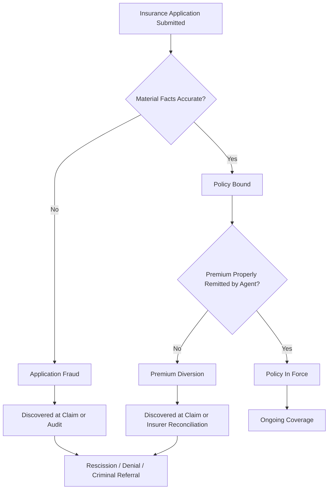

## Premium and Application Fraud

### Overview

Premium and application fraud encompasses deceptive practices occurring at policy inception and during the premium collection lifecycle, as distinct from fraud occurring at the claims stage. It includes misrepresentation by applicants to secure coverage or lower premiums, and misconduct by agents, brokers, or insurer personnel who divert or manipulate premium funds. Because these schemes distort the underwriting risk pool and can leave policyholders unknowingly uninsured, they carry both civil (rescission, denial of coverage) and criminal consequences.

### Classification

**Application Fraud (Applicant-Side)**

- Misrepresentation of material facts to obtain coverage that would otherwise be declined
- Misrepresentation to obtain a lower premium rate than the true risk warrants
- Concealment of prior claims history, prior policy cancellations, or prior fraud convictions

**Premium Fraud (Producer/Agent-Side)**

- Diversion of premium payments collected from policyholders
- Creation of fictitious or "ghost" policies
- Manipulation of policy terms after binding to reduce insurer-side premium remittance while retaining full premium from the insured

### Application Fraud Schemes

#### 1. Material Misrepresentation on Application

The applicant knowingly provides false information on a factor the insurer would have considered in underwriting decisions (accept/decline) or pricing.

**Key Points**

- **Health/Life insurance**: concealing a pre-existing medical condition, smoking status, or hazardous occupation/hobby
- **Auto insurance**: misstating garaging address (to obtain lower-risk territory rating), underreporting mileage, omitting household drivers with poor records ("rate evasion")
- **Property insurance**: misstating occupancy (claiming owner-occupied when a rental), understating property value/condition, omitting known prior damage or claims
- **Commercial/Workers' Comp insurance**: misclassifying employee job duties into lower-risk rating codes, understating payroll or headcount

#### 2. Rate Evasion

A specific and common subtype of application fraud, most prevalent in auto insurance, where the applicant deliberately provides inaccurate rating factors (address, primary driver, vehicle use) to obtain a premium below the accurate risk-based rate.

**Key Points**

- "Address fronting" — using a relative's address in a lower-premium zip code while the vehicle is actually garaged elsewhere
- "Driver exclusion abuse" — excluding a high-risk household member from the policy who is, in fact, a regular driver of the vehicle

#### 3. Identity and Eligibility Fraud

Use of a false identity, or eligibility misrepresentation, to obtain coverage — for example, enrolling in an employer group health plan while not actually employed, or misrepresenting age/dependent status to obtain family coverage terms.

#### 4. Post-Claim Underwriting Concealment Discovered at Claim Time

Although the misrepresentation occurs at application, it typically surfaces only when a claim triggers underwriting file review; insurers then evaluate rescission rights based on materiality of the misrepresented fact to the underwriting decision.

**Key Points**

- Legal materiality test generally asks: had the true fact been known, would the insurer have declined coverage, charged a higher premium, or imposed different terms?

### Premium Fraud Schemes (Producer/Agent-Side)

#### 1. Premium Diversion

An agent or broker collects premium payment from the policyholder but does not remit it to the insurer, instead misappropriating the funds. The policyholder believes they are covered, but the policy may lapse or never be bound.

**Key Points**

- Often concealed through delayed or falsified insurer confirmation documents (fabricated declarations pages, forged binder letters)
- Detected when a claim is filed and the insurer has no record of the policy or premium receipt

#### 2. Fictitious/"Ghost" Policies

An agent issues policy documents to a client without ever submitting an application to an underwriting carrier — the "coverage" does not exist at all. Common in unlicensed or unauthorized "insurance" schemes, particularly targeting immigrant communities, small businesses, or vulnerable populations.

#### 3. Premium Overstatement/Rebate Fraud

An agent charges the policyholder more than the actual premium and pockets the difference, or illegally rebates part of the premium to induce business in violation of state anti-rebating statutes.

#### 4. Sliding

Additional coverage or products (e.g., add-on riders, roadside assistance) are added to a policy without the customer's informed consent, increasing the premium collected, with the added charges concealed within the total premium quoted.

#### 5. Twisting and Churning

- **Twisting**: inducing a policyholder to lapse or surrender an existing policy and purchase a new one through misrepresentation, primarily to generate a new first-year commission for the agent, often to the client's financial detriment (loss of accumulated cash value, new contestability period, new surrender charges)
- **Churning**: repeated twisting of the same client's policies over time by the same agent to generate a stream of first-year commissions

#### 6. Fronting Arrangements (Producer/Insurer Collusion)

An unlicensed or unauthorized entity effectively underwrites risk while a licensed carrier "fronts" the paperwork for a fee, potentially used to circumvent state licensing, solvency, or rate regulation requirements.

### Fraud Triangle Applied to Premium/Application Fraud

$$\text{Fraud Risk} = f(\text{Pressure}, \text{Opportunity}, \text{Rationalization})$$

- **Applicant pressure**: desire for lower premium cost, need for coverage otherwise unobtainable due to risk profile
- **Agent pressure**: commission targets, cash flow needs, financial distress
- **Opportunity**: limited insurer verification of application data at binding, delayed premium reconciliation cycles, weak agency oversight
- **Rationalization**: "everyone underreports mileage," "I'll remit the premium next month once cash flow improves"

### Detection and Forensic Accounting Techniques

**Key Points**

- **Premium reconciliation audits**: matching agency bank deposits and remittance reports against insurer-recorded premium receipts to identify diversion gaps
- **Application data verification**: cross-referencing stated rating factors (address, mileage, occupancy) against DMV records, utility bills, tax assessor records, and telematics data
- **Commission pattern analysis**: statistical review of an agent's book of business for abnormal lapse-and-rewrite patterns indicative of twisting/churning
- **Bank record tracing**: following policyholder payment instruments (checks, ACH) from origination to determine whether funds reached the insurer's accounts or were diverted to an agency operating account or personal account
- **Loss ratio and rescission analysis**: insurers monitor blocks of business for abnormal claim-to-premium ratios that may indicate systemic rate evasion within a segment
- **Digital footprint analysis**: verifying stated garaging address or occupancy against public records, social media geolocation data, or utility account addresses

**Example**

An insurance agency shows $1.2 million in policyholder premium payments deposited into its operating trust account over a fiscal year, but only $850,000 was remitted to the underwriting carrier per the carrier's statement of account. A forensic accountant reconciles individual policyholder payment records against the carrier's bound-policy list and identifies 47 policies for which premium was collected but never submitted, evidencing a $350,000 premium diversion, with a pattern of diverted funds coinciding with dates of large agency payroll and rent disbursements — supporting the pressure element of the fraud triangle.

### Quantification Framework

$$\text{Diverted Premium} = \sum(\text{Premium Collected from Policyholders}) - \sum(\text{Premium Remitted to Carrier})$$

$$\text{Rate Evasion Loss} = (\text{Accurate Risk-Based Premium} - \text{Premium Actually Charged}) \times \text{Policy Period}$$

### Legal and Regulatory Framework (US-Centric)

- **State Insurance Codes**: license revocation, fines, and criminal penalties for producer premium diversion and application fraud facilitation
- **NAIC Model Unfair Trade Practices Act**: prohibits twisting, churning, and misrepresentation in the sale of insurance
- **State Anti-Rebating Statutes**: prohibit agents from rebating a portion of commission or premium as a sales inducement
- **18 U.S.C. § 1033–1034**: federal prohibition on insurance-related fraud affecting interstate commerce by persons in the business of insurance, applicable to producer-side schemes
- **State Guaranty Fund Implications**: when fraudulent or improperly underwritten policies collapse an insurer, state guaranty associations may bear resulting claim obligations, raising regulatory scrutiny of application-stage misrepresentation at scale

[Unverified] — specific penalty structures, licensing revocation procedures, and rescission timeframes vary materially by state and should be verified against the governing jurisdiction's insurance code.

### Role of the Forensic Accountant

- Reconstructing agency trust account activity to quantify diverted premium
- Reviewing underwriting files to assess materiality of misrepresented application facts
- Performing lapse-and-rewrite pattern analysis across an agent's client book to support twisting/churning allegations
- Supporting insurer rescission decisions and regulatory/licensing board investigations with quantified findings
- Serving as an expert witness in producer fraud litigation, quantifying policyholder harm (lost cash value, lapsed coverage, out-of-pocket loss)

### Common Red Flags Checklist

- Policyholder possesses no direct correspondence from the carrier (only agency-issued documents)
- Premium payment history shows checks made payable to the agency/agent personally rather than the carrier
- Abnormally high lapse-and-rewrite rate within a single agent's book of business
- Applicant's stated rating factors are inconsistent with independently verifiable public records
- Agency trust account shows commingling of premium funds with operating expenses
- Multiple policyholders reporting "coverage" from the same agent that the carrier has no record of

### Related Topics

- Insurance Claims Fraud Schemes
- Producer and Agent Licensing Fraud Enforcement
- Insurer Trust Account and Fiduciary Fund Reconciliation
- Twisting, Churning, and Suitability Violations in Life Insurance Sales
- Workers' Compensation Premium Fraud (Payroll and Classification Misrepresentation)
- Special Investigative Units (SIU) and Regulatory Reporting Obligations
- Fraud Triangle and Fraud Diamond Theory in Insurance Contexts
- Health Care Fraud: Enrollment and Eligibility Misrepresentation