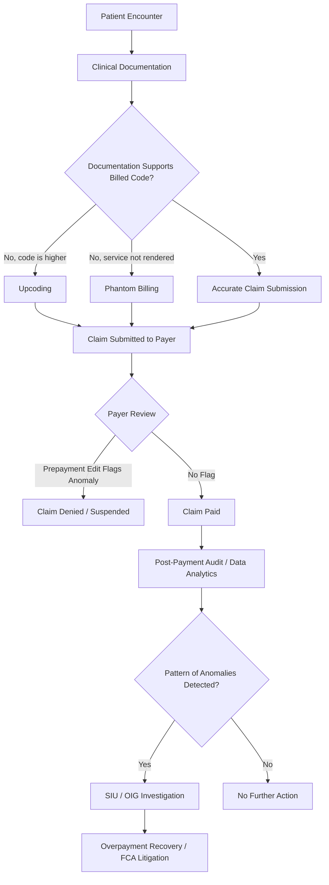

## Health Care Billing and Coding Fraud

### Overview

Health care billing and coding fraud involves the intentional submission of false or misleading claims to public or private payers (Medicare, Medicaid, commercial insurers) to obtain reimbursement to which the provider is not entitled. It is distinguished from mere billing errors by the element of intent or, under civil statutes such as the False Claims Act, "knowing" submission (which includes deliberate ignorance and reckless disregard). Forensic accountants play a central role in statistically sampling claims populations, calculating overpayment/damages exposure, and tracing the financial flow of improperly obtained reimbursement.

### Regulatory and Legal Framework (US-Centric)

- **False Claims Act (31 U.S.C. §§ 3729–3733)**: imposes civil liability (treble damages plus per-claim penalties) for knowingly submitting false claims to federal health programs; enables *qui tam* whistleblower actions
- **Anti-Kickback Statute (42 U.S.C. § 1320a-7b)**: criminalizes offering, paying, soliciting, or receiving remuneration to induce referrals for services reimbursable under federal health care programs
- **Stark Law (Physician Self-Referral Law, 42 U.S.C. § 1395nn)**: strict-liability civil statute prohibiting physician referrals for designated health services to entities with which the physician has a financial relationship, absent an exception
- **HIPAA Health Care Fraud Statute (18 U.S.C. § 1347)**: federal criminal statute for knowingly executing a scheme to defraud a health care benefit program
- **CMS billing and coding guidelines**: define correct code selection (CPT, HCPCS, ICD-10-CM/PCS) and documentation requirements underlying medical necessity and level-of-service determinations

[Unverified] — specific damages multipliers, per-claim penalty amounts (which are periodically inflation-adjusted), and Stark Law exception details should be verified against the current regulatory text at the time of application.

### Classification of Schemes

#### 1. Phantom Billing (Billing for Services Not Rendered)

Claims are submitted for procedures, tests, or supplies that were never actually provided to the patient.

**Key Points**

- Includes billing using a deceased patient's identifying information, or billing for a patient never seen on the date of service
- Detected through patient encounter verification — matching billed dates of service against appointment logs, facility access records, or patient-signed attestations

#### 2. Upcoding

Billing for a higher-complexity or higher-reimbursement procedure/service code than what was actually performed or documented.

**Key Points**

- Common in Evaluation & Management (E/M) coding, where documentation supports a lower-level visit code than billed
- Common in DRG-based hospital billing, where a higher-weighted diagnosis-related group is assigned without adequate clinical documentation support

#### 3. Unbundling ("Fragmentation")

Billing separately for individual components of a procedure that should be billed together under a single, lower-reimbursing comprehensive code, thereby inflating total reimbursement.

**Key Points**

- CMS's National Correct Coding Initiative (NCCI) edits are designed specifically to detect and prevent improper unbundling combinations

#### 4. Medically Unnecessary Services

Procedures, tests, or equipment are ordered and billed primarily to generate revenue rather than to address a legitimate clinical need.

**Key Points**

- Frequently associated with durable medical equipment (DME) fraud, diagnostic testing mills, and certain pain management/compounding pharmacy schemes

#### 5. Kickbacks and Illegal Referral Arrangements

Payments (cash, sham consulting fees, above-market lease arrangements) are exchanged for patient referrals or for ordering specific tests, drugs, or equipment, distorting clinical decision-making with a financial incentive.

**Key Points**

- Distinguished from Stark Law violations by intent requirement: Anti-Kickback is a criminal statute requiring willfulness, while Stark Law is strict liability and applies specifically to physician self-referral for designated health services

#### 6. Patient Brokering / "Rent-a-Patient" Schemes

Recruiters are paid to supply patients (often from vulnerable populations) to clinics or labs for unnecessary testing or treatment, with kickbacks flowing through the referral chain.

#### 7. Upcoding via Modifier Abuse

Improper use of billing modifiers (e.g., Modifier 25, Modifier 59) to bypass bundling edits or to bill for services as if they were separately identifiable when they were not.

#### 8. Double Billing

The same service is billed more than once — to the same payer twice, or to two different payers (e.g., both Medicare and a secondary commercial payer) without proper coordination of benefits.

#### 9. Billing for Non-Covered Services as Covered Services

A service excluded from a program's coverage (e.g., cosmetic procedures) is billed using a code and diagnosis that falsely represent it as a covered, medically necessary service.

#### 10. Credentialing and Impersonation Fraud

Services are billed under the National Provider Identifier (NPI) of a licensed physician when they were actually performed by an unlicensed or unsupervised individual, or by a provider excluded from federal health programs.

### Coding Systems Relevant to Detection

| System | Purpose |
| --- | --- |
| CPT (Current Procedural Terminology) | Codes for physician and outpatient procedures/services |
| HCPCS Level II | Codes for supplies, DME, and non-physician services |
| ICD-10-CM | Diagnosis coding supporting medical necessity |
| ICD-10-PCS | Inpatient procedure coding |
| DRG (Diagnosis-Related Group) | Hospital inpatient payment classification bundling diagnoses/procedures into a single payment weight |

### Fraud Triangle Applied to Health Care Billing Fraud

$$\text{Fraud Risk} = f(\text{Pressure}, \text{Opportunity}, \text{Rationalization})$$

- **Pressure**: declining reimbursement rates, practice overhead, revenue targets imposed by ownership (especially in private-equity-owned practices or high-volume clinics)
- **Opportunity**: complex coding rules, limited pre-payment claims review by payers, weak internal compliance auditing
- **Rationalization**: "insurers routinely underpay for the actual complexity of care provided," "everyone in the specialty codes this way"

### Detection and Forensic Accounting Techniques

**Key Points**

- **Statistical extrapolation sampling**: selecting a representative random sample of claims, auditing each for coding/documentation accuracy, and extrapolating the error rate across the full claims population to estimate total overpayment — a method commonly upheld in OIG and FCA damages calculations
- **Peer comparison / outlier analysis**: comparing a provider's coding distribution (e.g., E/M level distribution) against specialty-specific and geographic peer benchmarks to identify statistical outliers
- **NCCI edit and bundling analysis**: systematically testing claims against National Correct Coding Initiative edit pairs to detect unbundling
- **Billing pattern analytics**: identifying implausible patterns such as billing 24+ hours of services in a single day, identical service bundles across unrelated patients, or services billed on dates the provider was documented as being elsewhere (e.g., on vacation, at a conference)
- **Financial flow tracing**: following kickback payments through shell entities, sham consulting agreements, or inflated lease/equipment rental arrangements between referral sources
- **Medical record reconciliation**: matching clinical documentation (physician notes, nursing records, lab results) against the billed CPT/ICD codes to test medical necessity and service level support

**Example**

A cardiology practice bills 92% of its office visits at the two highest-complexity E/M codes (99215/99205), compared to a specialty benchmark distribution of roughly 15–20% for those codes. A forensic accountant, working with a coding expert, selects a statistically valid random sample of 100 claims from a two-year population of 40,000 claims, finds that 68 of the 100 sampled claims are unsupported at the billed level and should have been coded one level lower, and extrapolates an average per-claim overpayment across the full population using the sample's mean error, arriving at an estimated total overpayment exposure. [Inference] The exact extrapolation methodology (mean-per-unit vs. ratio estimation) and resulting confidence interval would depend on the statistician's chosen sampling design and must be defensible under applicable evidentiary standards.

### Quantification Framework

$$\text{Total Overpayment} = \frac{\sum_{i=1}^{n}(\text{Billed Amount}_i - \text{Correct Amount}_i)}{n} \times N$$

Where $n$ is the sample size, $N$ is the total claims population, and the fraction represents the mean per-claim overpayment in the sample, extrapolated to the full population under a mean-per-unit estimation approach.

$$\text{FCA Civil Penalty Exposure} = (\text{Damages} \times \text{Treble Multiplier}) + (\text{Per-Claim Statutory Penalty} \times \text{Number of False Claims})$$

### Role of the Forensic Accountant

- Designing and executing statistically valid claims sampling and extrapolation methodologies for overpayment/damages estimation
- Collaborating with certified medical coders and clinical experts to assess documentation-to-code alignment
- Tracing financial relationships underlying suspected kickback or self-referral arrangements
- Preparing expert reports and testimony in False Claims Act *qui tam* litigation, OIG administrative proceedings, and criminal health care fraud prosecutions
- Assisting compliance departments with proactive billing audit programs to mitigate future exposure

### Common Red Flags Checklist

- Coding distribution skewed heavily toward the highest-reimbursing codes relative to specialty peers
- High volume of services billed with modifiers that bypass bundling edits
- Billed hours per provider per day that exceed physical/clinical plausibility
- Consistent, identical treatment/testing patterns across dissimilar patients
- Financial relationships (leases, consulting agreements, joint ventures) between referring and referred-to providers lacking fair-market-value support
- Sudden spikes in billing volume following acquisition by a management services organization or private equity ownership change

### Related Topics

- False Claims Act *Qui Tam* Litigation and Damages Methodology
- Anti-Kickback Statute and Stark Law Compliance Analysis
- Statistical Sampling and Extrapolation in Fraud Damages Calculations
- Durable Medical Equipment (DME) and Diagnostic Testing Fraud
- Pharmacy and Compounding Fraud Schemes
- Insurance Claims Fraud Schemes
- Premium and Application Fraud
- Fraud Triangle and Fraud Diamond Theory in Health Care Contexts