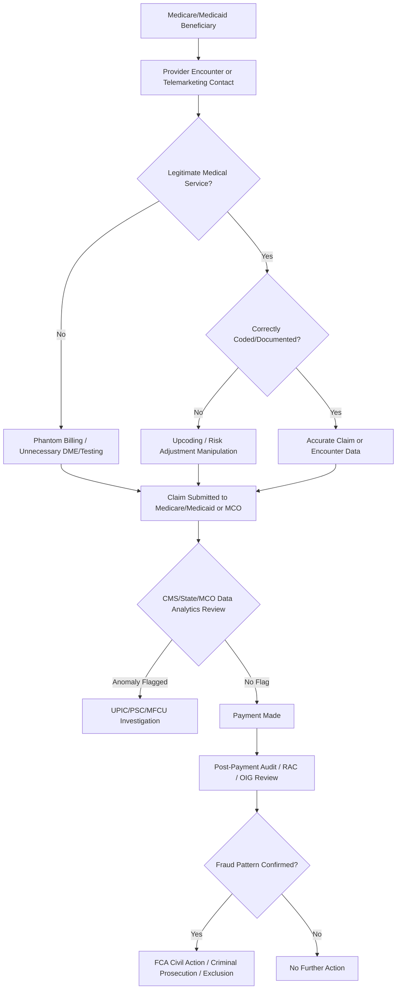

## Medicare and Medicaid Fraud Schemes

### Overview

Medicare and Medicaid fraud schemes target the two largest US government-funded health programs — Medicare (federal, primarily serving individuals 65+ and certain disabled populations) and Medicaid (joint federal-state, serving low-income populations). Because these are government health benefit programs, fraud against them implicates a distinct and heavier set of federal criminal, civil, and administrative enforcement tools than commercial insurance fraud, including the False Claims Act, the Anti-Kickback Statute, exclusion authority, and dedicated federal strike forces. Forensic accountants are engaged extensively in extrapolated damages calculations, financial tracing of kickback schemes, and expert support in both civil *qui tam* and criminal prosecutions.

### Program Structure Relevant to Fraud Analysis

- **Medicare Part A**: hospital inpatient, skilled nursing facility, hospice — paid largely via DRG-based prospective payment
- **Medicare Part B**: physician services, outpatient care, DME — paid via fee schedule (CPT/HCPCS)
- **Medicare Part C (Medicare Advantage)**: private plans paid a capitated, risk-adjusted amount per enrollee — fraud here centers on **risk adjustment/diagnosis manipulation** rather than per-claim billing
- **Medicare Part D**: prescription drug benefit, administered by private plan sponsors — fraud centers on pharmacy billing and PBM rebate manipulation
- **Medicaid**: jointly funded by federal and state governments, administered by states under federal guidelines, often via managed care organizations (MCOs) — fraud can occur at the provider level or at the MCO capitation level

### Classification of Schemes

#### 1. Traditional Fee-for-Service Billing Fraud

Applies the general health care billing fraud typologies (phantom billing, upcoding, unbundling, medically unnecessary services) specifically to Medicare Part B and Medicaid fee-for-service claims.

**Key Points**

- High-volume, low-dollar schemes (e.g., $20 improperly billed lab add-ons across tens of thousands of claims) can aggregate into large-dollar exposure and are prime candidates for statistical extrapolation

#### 2. Medicare Advantage Risk Adjustment Fraud ("Upcoding via Diagnosis Manipulation")

Medicare Advantage plans are paid a risk-adjusted capitated rate based on enrollees' Hierarchical Condition Category (HCC) diagnosis codes. Plans or providers add unsupported diagnoses (or fail to delete resolved/incorrect ones) to inflate the enrollee's risk score and, correspondingly, the capitated payment.

**Key Points**

- Distinct from fee-for-service upcoding because the fraud does not inflate a single claim payment but inflates a recurring monthly capitated payment tied to a risk score
- Detected through chart review programs comparing submitted HCC diagnosis codes against actual clinical documentation supporting the diagnosis in that payment year

#### 3. Durable Medical Equipment (DME) Fraud

Billing Medicare/Medicaid for medical equipment (wheelchairs, braces, glucose monitors, genetic testing kits) that is medically unnecessary, never delivered, or obtained through fraudulent physician orders — frequently associated with telemarketing schemes and "telefraud" genetic testing operations.

#### 4. Home Health and Hospice Fraud

- Billing for home health visits never rendered or for patients who do not meet the "homebound" eligibility requirement
- Hospice fraud: enrolling patients who are not terminally ill to bill the per-diem hospice benefit, or billing a higher level of hospice care (e.g., continuous home care) than was actually provided

#### 5. Pharmacy and Prescription Drug Fraud (Part D / Medicaid Drug Rebate)

- Billing for prescriptions never filled or picked up
- Substituting generic drugs while billing for brand-name equivalents
- Manipulating the Medicaid Drug Rebate Program by misclassifying drugs or misreporting "best price" to reduce manufacturer rebate obligations owed to states

#### 6. Kickback-Driven Referral Networks

Payments disguised as marketing fees, medical director agreements, or speaker fees are exchanged for patient referrals, prescriptions, or orders for tests/equipment reimbursed by Medicare/Medicaid — a violation of the Anti-Kickback Statute regardless of medical necessity of the underlying service.

#### 7. Patient Recruitment / Beneficiary Identity Fraud

Beneficiary Medicare/Medicaid numbers are obtained (through identity theft, "free" health screenings, or cash payments to beneficiaries) and used to bill for services never rendered — common in DME telefraud and genetic testing fraud schemes.

#### 8. Medicaid-Specific: Provider Enrollment and Eligibility Fraud

- Billing Medicaid for services provided to individuals who do not meet state Medicaid eligibility criteria
- Provider misrepresentation of credentials or licensure status during Medicaid enrollment
- Managed care organizations manipulating encounter data submitted to the state to affect capitation rate-setting

#### 9. Medicaid Managed Care Capitation Fraud

Medicaid MCOs are paid a fixed per-member-per-month capitated rate; fraud can involve submitting inflated or fabricated encounter data to justify higher future capitation rates, or conversely, MCOs denying/underpaying legitimate provider claims while retaining capitated funds ("claims suppression").

#### 10. Nursing Home and Skilled Nursing Facility (SNF) Fraud

Billing for a higher Resource Utilization Group (RUG) or Patient-Driven Payment Model (PDPM) case-mix category than the resident's actual care needs support, or billing for therapy services not medically necessary or not actually provided.

### Fraud Triangle Applied to Medicare/Medicaid Fraud

$$\text{Fraud Risk} = f(\text{Pressure}, \text{Opportunity}, \text{Rationalization})$$

- **Pressure**: revenue targets in high fixed-cost provider settings, private equity ownership return expectations, cash flow needs of small DME/telefraud operators
- **Opportunity**: high claims volume relative to CMS/state pre-payment review capacity, complexity of HCC risk adjustment methodology, limited beneficiary-level fraud awareness among vulnerable populations
- **Rationalization**: "the government pays for everything anyway," "risk adjustment is supposed to be aggressive to reflect true patient complexity"

### Enforcement Infrastructure

- **HHS Office of Inspector General (OIG)**: conducts audits, issues exclusion actions, publishes Work Plans identifying fraud risk areas
- **DOJ Medicare Fraud Strike Force / Health Care Fraud Unit**: coordinates multi-district criminal prosecutions, often via annual national takedown operations
- **Unified Program Integrity Contractors (UPICs)**: CMS contractors performing data analytics and investigations across Medicare and Medicaid
- **Recovery Audit Contractors (RACs)**: identify and recoup Medicare improper payments on a contingency-fee basis
- **State Medicaid Fraud Control Units (MFCUs)**: state-level entities investigating and prosecuting Medicaid provider fraud and patient abuse/neglect
- **CMS Center for Program Integrity (CPI)**: oversees fraud, waste, and abuse detection strategy across CMS programs

### Legal Framework (US-Centric)

- **False Claims Act (31 U.S.C. §§ 3729–3733)**: primary civil enforcement tool; treble damages plus per-claim penalties; enables *qui tam* whistleblower suits with relator share of recovery
- **Anti-Kickback Statute (42 U.S.C. § 1320a-7b)**: criminal statute; a violation can also independently establish falsity under the False Claims Act
- **Stark Law (42 U.S.C. § 1395nn)**: strict-liability physician self-referral prohibition applicable to Medicare-reimbursed designated health services
- **Health Care Fraud Statute (18 U.S.C. § 1347)**: general federal criminal health care fraud statute
- **Exclusion Authority (42 U.S.C. § 1320a-7)**: OIG authority to exclude individuals/entities from participating in federal health care programs following fraud convictions or program integrity violations
- **Civil Monetary Penalties Law (42 U.S.C. § 1320a-7a)**: administrative penalties for a range of program integrity violations, including certain kickback and false claims conduct

[Unverified] — specific penalty amounts, per-claim statutory ranges, and exclusion periods are periodically updated and should be verified against current CMS/OIG guidance at time of application.

### Detection and Forensic Accounting Techniques

**Key Points**

- **Statistical extrapolation sampling**: the dominant methodology for quantifying Medicare/Medicaid fee-for-service overpayment across large claims populations, typically using a random or stratified sample audited against medical records
- **HCC risk score reconciliation**: comparing submitted diagnosis codes supporting a Medicare Advantage enrollee's risk score against underlying medical record documentation for that payment year, to identify unsupported or "one-way" diagnosis additions
- **Peer/outlier benchmarking**: comparing a provider's billing volume, coding mix, or beneficiary referral patterns against CMS Public Use Files and specialty/geographic norms
- **Financial flow tracing of kickbacks**: following payments through management services organizations, marketing companies, and sham consulting arrangements connecting referral sources to billing entities
- **Beneficiary verification**: contacting or cross-referencing beneficiaries against billed services to confirm receipt (or non-receipt) of billed care, common in DME telefraud investigations
- **Encounter data reconciliation**: for Medicaid MCOs, comparing submitted encounter data to underlying provider claims and payment records to detect inflated or fabricated utilization reporting

**Example**

A network of DME suppliers bills Medicare $18 million over two years for orthotic braces purportedly ordered through telehealth consultations. A forensic accountant traces beneficiary identifiers across claims and finds that 40% of billed beneficiaries have no corroborating telehealth encounter record with the ordering physician, that many beneficiaries confirm (via OIG interview referral) they never requested or received the braces, and that payments from the DME suppliers flow through a marketing company to the telehealth company under a per-lead fee structure consistent with a prohibited kickback arrangement rather than a bona fide service fee. Extrapolating the confirmed non-delivery/non-order rate across the full claims population supports an estimated overpayment materially below the total billed amount, with remaining exposure independently supported by Anti-Kickback Statute-based falsity under the False Claims Act.

### Quantification Framework

$$\text{Extrapolated Overpayment} = \bar{e} \times N$$

Where $\bar{e}$ is the mean overpayment per claim/encounter in the audited sample and $N$ is the total claims/encounters in the population.

$$\text{HCC Risk Adjustment Overpayment} = \sum_{\text{unsupported HCCs}} (\text{Risk Score Impact} \times \text{Capitation Payment Rate} \times \text{Months Enrolled})$$

### Role of the Forensic Accountant

- Designing statistically defensible sampling and extrapolation methodologies acceptable to CMS, OIG, and courts
- Reconciling HCC risk adjustment submissions against underlying medical record support for Medicare Advantage matters
- Tracing kickback payment flows through layered corporate and marketing arrangements
- Quantifying relator (whistleblower) recovery shares and government damages in *qui tam* litigation
- Supporting Corporate Integrity Agreement (CIA) compliance monitoring following an OIG settlement

### Common Red Flags Checklist

- Sudden, unexplained spikes in a provider's or supplier's Medicare/Medicaid billing volume
- High rate of diagnosis codes added to Medicare Advantage risk adjustment submissions without corresponding treatment or follow-up in the medical record
- DME or genetic testing billed following telemarketing contact rather than an existing physician relationship
- Referral patterns concentrated among a small group of providers with documented financial relationships lacking fair-market-value justification
- Hospice enrollment periods substantially exceeding average length-of-stay benchmarks for stated terminal diagnoses
- Provider excluded from federal programs but billing under another individual's or entity's NPI

### Related Topics

- Health Care Billing and Coding Fraud
- False Claims Act *Qui Tam* Litigation and Damages Methodology
- Anti-Kickback Statute and Stark Law Compliance Analysis
- Medicare Advantage Risk Adjustment and HCC Coding Integrity
- Statistical Sampling and Extrapolation in Fraud Damages Calculations
- OIG Exclusion Authority and Corporate Integrity Agreements
- Insurance Claims Fraud Schemes
- Premium and Application Fraud