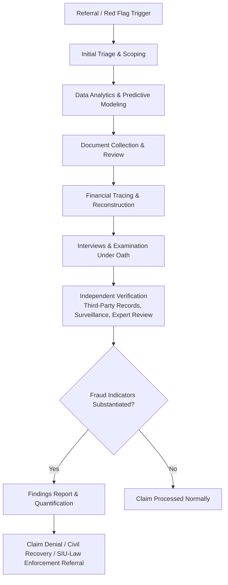

## Insurance Fraud Investigation Techniques

### Overview

Insurance fraud investigation techniques comprise the systematic methods used by Special Investigative Units (SIUs), forensic accountants, and law enforcement to detect, substantiate, and quantify suspected fraudulent insurance activity across claims, premium, and application fraud typologies. Investigations typically proceed from data-driven detection through documentary and financial analysis to interview-based corroboration, culminating in a quantified findings report suitable for claim denial, civil recovery, regulatory referral, or criminal prosecution.

### Investigative Lifecycle

### 1. Referral Sources and Initial Triage

**Key Points**

- Referrals originate from claims adjusters flagging inconsistencies, automated fraud-scoring systems, agent/underwriter tips, anonymous hotlines, or mandatory state-required SIU referral triggers
- Triage assesses claim dollar value, complexity, and specific red flags present to determine investigative resource allocation and whether a forensic accountant should be engaged at the outset

### 2. Data Analytics and Predictive Modeling

**Key Points**

- **Predictive fraud scoring models**: statistical or machine-learning models trained on historical confirmed-fraud claims to score incoming claims by fraud likelihood based on variables such as claim timing, provider/repair-shop identity, and claimant history
- **Link analysis / network analysis**: mapping relationships among claimants, medical providers, attorneys, repair shops, and addresses across the insurer's full claims database to identify organized fraud rings — a claimant appearing as a "passenger" in multiple unrelated staged-accident claims is a classic link-analysis finding
- **Benford's Law analysis**: testing the leading-digit distribution of repeatedly submitted invoice or claim amounts; deviations from the expected logarithmic distribution can indicate fabricated or rounded figures
- **Duplicate and near-duplicate detection**: identifying claims submitted with identical or highly similar supporting documentation (same invoice template, same photographs reused across different claims)
- **Geospatial and temporal clustering**: identifying unusual concentrations of claims by location, date, or time-of-day suggestive of staged events or organized activity

### 3. Document Collection and Review

**Key Points**

- Collection of the complete claim file: application, policy documents, proof-of-loss forms, repair/medical invoices, photographs, correspondence, and prior claims history
- **Document authenticity examination**: reviewing metadata (creation/modification dates) on digital photographs and PDFs, checking invoice sequential numbering for gaps or irregular patterns, and comparing formatting/letterhead consistency against known genuine documents from the same purported source
- **Chronological reconciliation**: constructing a timeline cross-referencing the claimed loss date against independently dated documents (weather records, police reports, purchase receipts, GPS/telematics data) to test internal consistency

### 4. Financial Tracing and Reconstruction

**Key Points**

- **Bank record analysis**: tracing policyholder or claimant bank and credit card records to test financial distress motive (for arson/staged theft) or to identify undisclosed income inconsistent with a disability claim
- **Net worth / lifestyle analysis**: reconstructing an individual's net worth over time using the indirect methods common to forensic accounting (asset method, expenditure method, bank deposits method) to test claimed financial hardship or total disability against actual spending and asset accumulation
- **Vendor and repair shop financial analysis**: reviewing a contractor's or medical provider's own books and bank deposits to identify patterns of inflated invoicing across multiple unrelated claims
- **Business interruption "but-for" reconstruction**: rebuilding expected revenue and expense trends absent the loss event, using historical financials, seasonality adjustments, and industry benchmarks, to test the reasonableness of a claimed lost-income figure

$$\text{Net Worth Method: } \text{Unexplained Income} = (\text{Ending Net Worth} - \text{Beginning Net Worth}) + \text{Living Expenses} - \text{Known Income Sources}$$

### 5. Interviews and Examinations Under Oath (EUO)

**Key Points**

- **Examination Under Oath (EUO)**: a contractual policy provision allowing the insurer to compel a sworn, recorded statement from the insured as a condition of claim payment; failure to cooperate can support claim denial
- **Recorded statements**: obtained from claimants, witnesses, and third parties, structured to establish a detailed factual timeline before the individual is aware of specific investigative findings that may contradict their account
- **Interview sequencing strategy**: peripheral witnesses and less-invested parties are often interviewed before the primary subject, to lock in independent corroboration or contradiction ahead of confronting inconsistencies
- **Cognitive interviewing techniques**: open-ended, non-leading questioning designed to elicit a complete and spontaneous account, reducing the risk of contaminating the subject's recollection

### 6. Independent Verification

**Key Points**

- **Surveillance**: physical or video surveillance to verify claimed physical limitations (disability/injury claims) or to observe undisclosed activity inconsistent with the claim
- **Social media and open-source intelligence (OSINT)**: reviewing publicly available social media posts, check-ins, and photographs for evidence contradicting claimed injury, occupancy status, or property loss
- **Independent Medical Examinations (IMEs)**: an insurer-selected physician examines the claimant to provide an independent assessment of injury extent, often used to contest inflated bodily injury claims
- **Site inspections and property re-inspection**: physical inspection of a damaged property or vehicle by an independent adjuster or engineer to verify damage extent and causation
- **Third-party record subpoenas/requests**: obtaining employment records, tax filings, medical records from unrelated providers, and utility records to independently verify claimed facts

### 7. Special Investigative Unit (SIU) Coordination

**Key Points**

- Most US states mandate that insurers above a premium threshold maintain an SIU and report suspected fraud to state insurance fraud bureaus
- SIU investigators typically hold specialized training (e.g., Certified Insurance Fraud Investigator credentials) and coordinate closely with in-house or retained forensic accountants for complex financial schemes
- SIU referrals to law enforcement or state fraud bureaus generally require a documented, evidence-based findings package rather than mere suspicion

[Unverified] — specific state SIU mandate thresholds, licensing/credentialing requirements for investigators, and mandatory reporting timelines vary by jurisdiction and should be confirmed against the applicable state insurance code.

### Fraud Indicator Scoring Framework (Illustrative)

**Key Points**

- Investigators often assign weighted scores to individual red flags (claim filed shortly after policy inception, inconsistent damage severity, prior claims history, common service providers across claims) and aggregate them into a composite fraud indicator score used to prioritize investigative resources
- [Inference] The specific weighting methodology varies substantially by insurer and by line of business, and is typically proprietary to each carrier's SIU analytics program

### Investigation Techniques by Fraud Type

**Key Points**

- **Staged auto accidents**: link analysis across claimants/providers, vehicle damage-versus-injury severity assessment, review of accident reconstruction/police reports
- **Arson-for-profit**: financial distress analysis, fire origin-and-cause expert coordination, inventory/asset verification against purchase records
- **Staged theft/burglary**: serial number and purchase record verification, review of alarm system/access logs, timeline reconciliation
- **Business interruption padding**: but-for financial reconstruction, industry benchmarking, review of actual post-loss operating performance
- **Health care billing fraud**: statistical claims sampling and extrapolation, medical record-to-billing code reconciliation, peer coding-pattern benchmarking
- **Premium diversion**: agency trust account reconciliation, policyholder payment tracing against insurer remittance records

### Quantification and Reporting

**Key Points**

- Findings are typically presented in a structured report distinguishing: (1) facts established through documentary evidence, (2) facts established through interview/testimony, (3) financial quantification of the loss overstatement or fraud amount, and (4) an opinion (where within the investigator's expertise) on whether findings are consistent with or contradict the claimed loss
- Forensic accountant work product must maintain a clear, reproducible audit trail (workpapers, source documents, calculation methodology) to withstand scrutiny in subsequent litigation, arbitration, or criminal proceedings
- Chain-of-custody documentation is maintained for all physical and digital evidence collected during the investigation

$$\text{Substantiated Fraud Amount} = \text{Claimed Amount} - \text{Amount Supported by Independent Verification}$$

### Legal and Ethical Considerations

**Key Points**

- Investigators must operate within applicable privacy statutes (e.g., limitations on surveillance methods, restrictions on obtaining medical records without proper authorization) and unfair claims settlement practices acts, which prohibit insurers from unreasonably delaying or denying claims without a good-faith investigation
- Examination Under Oath and recorded statement procedures must strictly follow the policy's contractual conditions to preserve their evidentiary and claim-denial effect
- Forensic accountants and SIU investigators must maintain independence and objectivity; findings should follow the evidence rather than a predetermined denial outcome, both for ethical reasons and to withstand bad-faith litigation exposure

### Related Topics

- Insurance Claims Fraud Schemes
- Premium and Application Fraud
- Health Care Billing and Coding Fraud
- Medicare and Medicaid Fraud Schemes
- Net Worth and Lifestyle Analysis Methods in Forensic Accounting
- Statistical Sampling and Extrapolation in Fraud Damages Calculations
- Examination Under Oath and Bad Faith Claims Litigation
- Link Analysis and Network Detection in Organized Fraud Rings