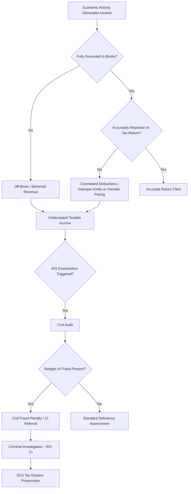

## Individual and Corporate Tax Evasion Schemes

### Overview

Tax evasion is the willful attempt to evade or defeat the assessment or payment of tax through illegal means, distinguished from lawful tax avoidance (using legal provisions to minimize tax liability). Under US federal law, tax evasion requires (1) an affirmative act constituting evasion or attempted evasion, (2) an additional tax due and owing, and (3) willfulness. Forensic accountants support both government prosecution/civil examination and defense engagements by reconstructing unreported income, tracing concealed assets, and applying indirect methods of proof where direct records are destroyed, absent, or unreliable.

### Legal Framework (US-Centric)

- **26 U.S.C. § 7201 (Attempt to Evade or Defeat Tax)**: the primary federal criminal tax evasion statute; requires an affirmative act of evasion, a tax deficiency, and willfulness
- **26 U.S.C. § 7206 (Fraud and False Statements)**: criminalizes willfully making and subscribing a false return under penalties of perjury, and aiding/assisting in preparation of a false return
- **26 U.S.C. § 7203 (Willful Failure to File)**: a lesser misdemeanor offense for willful failure to file a return, pay tax, or keep records, where the government need not prove an additional tax deficiency
- **Bank Secrecy Act / FBAR (31 U.S.C. § 5314)**: requires reporting of foreign financial accounts; willful failure to file can carry both civil and criminal penalties
- **Civil Fraud Penalty (26 U.S.C. § 6663)**: a 75% civil penalty on the portion of underpayment attributable to fraud, requiring "clear and convincing evidence" of fraudulent intent — a lower burden than criminal "beyond a reasonable doubt"

[Unverified] — specific penalty percentages, statute of limitations periods (which can be extended for substantial omissions or unfiled returns), and sentencing guideline ranges should be verified against current IRC and USSG provisions at time of application.

### Willfulness: The Central Element

**Key Points**

- Willfulness is defined by case law (*Cheek v. United States*) as the "voluntary, intentional violation of a known legal duty" — a good-faith (even if unreasonable) misunderstanding of the law can negate willfulness, whereas disagreement with the law's validity does not
- Courts and examiners infer willfulness circumstantially through "badges of fraud" (see below) because direct evidence of intent is rarely available

### Badges of Fraud (Circumstantial Indicators of Willfulness)

**Key Points**

Commonly cited badges of fraud, derived from case law and IRS guidance, include:

- Understatement of income over multiple consecutive years
- Inadequate or destroyed books and records
- Concealment of bank accounts or assets, including use of nominees
- False or altered documents provided to examiners
- Dealing extensively in cash to avoid a paper trail
- Failure to file returns despite a known filing obligation and available income
- Implausible or inconsistent explanations for discrepancies
- Attempting to influence witnesses or obstruct an examination
- A consistent pattern of underreporting relative to the taxpayer's apparent lifestyle

### Individual Tax Evasion Schemes

#### 1. Unreported Income (Skimming)

Cash-intensive businesses (restaurants, salons, car washes, laundromats) fail to record and report a portion of gross receipts, understating income on the business owner's individual or pass-through return.

#### 2. Overstated Deductions and Credits

Claiming personal expenses as business deductions, inflating charitable contribution values, fabricating dependents, or improperly claiming refundable credits (e.g., fraudulent Earned Income Tax Credit claims).

#### 3. Offshore Account Concealment

Undisclosed foreign bank accounts used to hold unreported income, often layered through foreign shell entities or nominee arrangements to obscure beneficial ownership, in violation of FBAR and FATCA reporting obligations.

#### 4. Nominee and Structuring Arrangements

Assets and income are titled in the name of relatives, trusts, or shell entities to obscure the true owner's control and tax liability, or income is structured into transactions below reporting thresholds to avoid triggering currency transaction reports.

#### 5. Employment Tax Fraud (Individual Employer Level)

Business owners withhold employee payroll taxes but fail to remit them to the IRS ("pyramiding"), or misclassify employees as independent contractors to avoid payroll tax withholding obligations entirely.

#### 6. Identity-Based Refund Fraud

Filing fraudulent returns using stolen identities to claim refunds — while often prosecuted as identity theft/wire fraud, it functions as a tax fraud scheme against the Treasury.

### Corporate Tax Evasion Schemes

#### 1. Off-Book/Unrecorded Revenue

Corporate revenue is diverted before entering the books (side sales, unrecorded cash transactions) so that neither book income nor taxable income reflects the true economic activity.

#### 2. Transfer Pricing Manipulation

Related-party transactions across international subsidiaries are priced to shift profits from high-tax to low-tax jurisdictions in a manner inconsistent with the arm's-length standard, understating taxable income in the high-tax jurisdiction.

**Key Points**

- Distinguished from legitimate transfer pricing planning by the absence of a genuine economic/functional basis for the pricing and by contemporaneous documentation inconsistent with actual business operations

#### 3. Related-Party and Shell Entity Layering

Fictitious or inflated intercompany expenses (management fees, licensing/royalty payments, "consulting" charges) are paid to related entities in low-tax or no-tax jurisdictions, artificially reducing the domestic entity's taxable income.

#### 4. Fictitious Expense Deductions

Recording fabricated or personal expenses as legitimate business deductions, often supported by fraudulent invoices from shell "vendors" that may also be used to extract cash for kickbacks or personal use.

#### 5. Improper Entity Classification and Structuring

Misclassifying a business's entity type or ownership structure to access more favorable tax treatment for which it does not legitimately qualify (e.g., improper S-corporation shareholder-employee compensation structuring to avoid payroll taxes by disguising wages as distributions).

#### 6. Inventory and Cost of Goods Sold Manipulation

Overstating cost of goods sold or understating ending inventory to reduce reported taxable income, often paired with off-book sales schemes.

#### 7. Payroll Tax Fraud at Scale

Corporate "payroll service" schemes where withheld employee taxes are collected across multiple client businesses but never remitted to the IRS, with the operator retaining the funds — a scheme that can cause significant liability exposure for the underlying client businesses as well.

### Fraud Triangle Applied to Tax Evasion

$$\text{Fraud Risk} = f(\text{Pressure}, \text{Opportunity}, \text{Rationalization})$$

- **Pressure**: cash flow strain, desire to maximize after-tax personal wealth, competitive pressure in cash-intensive industries
- **Opportunity**: cash-based revenue streams, weak internal controls over related-party transactions, limited IRS examination coverage rates for certain taxpayer segments
- **Rationalization**: "everyone underreports cash tips/receipts," "the tax system is unfair to business owners," "it's my money, not the government's"

### Indirect Methods of Proof (Used When Books/Records Are Inadequate or Unreliable)

**Key Points**

Because direct evidence of unreported income is often unavailable, examiners and forensic accountants apply established indirect methods, each reconstructing income through a different economic proxy:

- **Net Worth Method**: reconstructs income by measuring the increase in a taxpayer's net worth over a period, adding back known nondeductible living expenses, and subtracting income from known/nontaxable sources
- **Expenditure (Source and Application of Funds) Method**: totals all expenditures and asset acquisitions during the period and compares them to the taxpayer's reported and known available funds, with any excess treated as unreported income
- **Bank Deposits Method**: analyzes total deposits into all known bank accounts, adjusts for redeposits, transfers, and identified nontaxable deposits, and compares the resulting figure to reported gross income
- **Percentage/Unit Markup Method**: applies an industry-standard or observed markup percentage to a business's known cost of goods sold or unit sales to estimate expected gross receipts, useful for cash-intensive businesses with inadequate records

$$\text{Net Worth Method: } \text{Unreported Income} = (\text{NW}_{end} - \text{NW}_{begin}) + \text{Nondeductible Expenditures} - \text{Known Nontaxable Income}$$

$$\text{Bank Deposits Method: } \text{Unreported Income} = \text{Total Deposits} - \text{Identified Nontaxable Deposits} - \text{Reported Gross Income}$$

**Example**

A restaurant owner reports $180,000 in annual gross receipts. A forensic accountant applies the bank deposits method across the owner's business and personal accounts, identifying $340,000 in total deposits during the year. After adjusting for $25,000 in identified transfers between the owner's own accounts and $15,000 in a documented gift from a family member, the reconstructed gross receipts figure is $300,000 — a $120,000 variance from the reported amount. Cross-checked against the percentage markup method (applying the restaurant industry's typical food cost percentage to the owner's recorded food purchase invoices), the markup method independently supports gross receipts in a similar range, corroborating the bank deposits finding through two independent methodologies.

### Detection and Forensic Accounting Techniques

**Key Points**

- **Financial statement and tax return reconciliation**: comparing book income (per financial statements) to taxable income (per the return) via the Schedule M-1/M-3 reconciliation to identify unexplained or improperly characterized adjustments
- **Lifestyle analysis**: comparing a taxpayer's documented spending, asset acquisitions, and lifestyle against reported income to identify inconsistencies suggestive of unreported income
- **Related-party transaction mapping**: tracing intercompany flows, licensing arrangements, and management fee structures to test economic substance and arm's-length pricing
- **Digital forensics on accounting records**: identifying evidence of "second sets of books," deleted transactions, or backdated entries in accounting software audit trails
- **Cryptocurrency and digital asset tracing**: following blockchain transactions to identify unreported gains or concealed asset transfers, an increasingly significant component of modern tax evasion investigations
- **Cash flow and source-of-funds analysis**: identifying the origin of funds used for large asset purchases (real estate, vehicles, luxury goods) inconsistent with reported income

### Civil vs. Criminal Tax Fraud: Key Distinctions

| Dimension | Civil Fraud | Criminal Evasion |
| --- | --- | --- |
| Burden of proof | Clear and convincing evidence | Beyond a reasonable doubt |
| Governing statute | 26 U.S.C. § 6663 | 26 U.S.C. § 7201 / § 7206 |
| Outcome | Monetary penalty (75% of underpayment) | Imprisonment, fines, restitution |
| Investigating body | IRS Examination/Civil function | IRS Criminal Investigation (CI) |
| Prosecuting authority | N/A (administrative/Tax Court) | DOJ Tax Division / US Attorney |

### Role of the Forensic Accountant

- Applying indirect methods of proof to reconstruct unreported income where books and records are inadequate, destroyed, or deemed unreliable
- Analyzing "badges of fraud" indicators and organizing findings to support or rebut an inference of willfulness
- Reconciling book-tax differences and testing the economic substance of related-party and transfer pricing arrangements
- Tracing concealed assets, offshore accounts, and cryptocurrency holdings
- Serving as an expert witness in Tax Court civil fraud proceedings and as a summary witness or consulting expert in DOJ Tax Division criminal prosecutions
- Supporting voluntary disclosure engagements where a taxpayer seeks to correct prior noncompliance before detection

### Related Topics

- Indirect Methods of Proof: Net Worth, Expenditure, and Bank Deposits Methods
- Badges of Fraud and Proving Willfulness in Tax Cases
- Offshore Account Concealment, FBAR, and FATCA Compliance
- Transfer Pricing Manipulation and Base Erosion Schemes
- Payroll Tax Fraud and Employment Tax Enforcement
- Cryptocurrency Tracing in Financial Investigations
- Bankruptcy Fraud Schemes
- IRS Criminal Investigation (CI) Process and DOJ Tax Division Prosecution