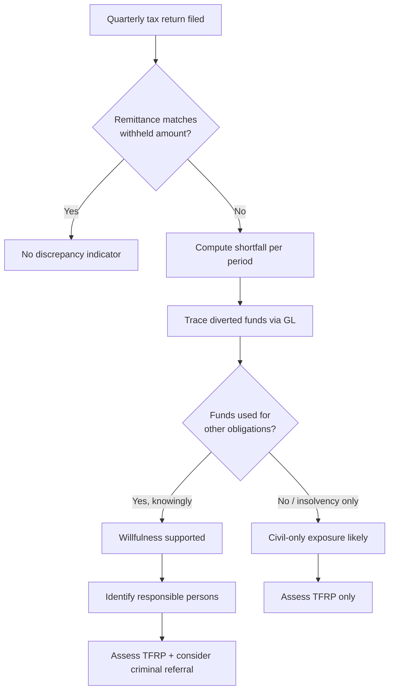

## Payroll Tax Fraud

### Overview

Payroll tax fraud occurs when an employer willfully fails to withhold, account for, or remit payroll taxes owed to tax authorities. Payroll taxes generally consist of two components: **trust fund taxes** (federal/national income tax withheld from employee wages, plus the employee's share of social security/health insurance contributions) and the **employer's matching share** of statutory contributions. Trust fund taxes are held "in trust" by the employer on behalf of the government; diverting these funds for business or personal use, rather than remitting them, is treated as a severe form of tax evasion in most jurisdictions because the employer never owned that money — it belongs to the employee and the taxing authority from the moment it is withheld.

### Key Points

- **Trust fund nature**: Because withheld amounts are deemed government property, misappropriation is often prosecuted more aggressively than ordinary income tax evasion, and civil penalties (e.g., the U.S. Trust Fund Recovery Penalty) can pierce the corporate veil to reach **responsible persons** individually — officers, directors, or anyone with authority over disbursements — regardless of the entity's corporate/limited-liability status.
- **Common schemes**:
  - **Pyramiding**: withholding taxes from employees but never remitting them, then forming a successor entity once liabilities mount, abandoning the old entity's debts.
  - **Employee misclassification**: labeling employees as independent contractors to avoid withholding obligations and employer-side contributions entirely.
  - **Ghost employees**: fictitious names on payroll to siphon funds, often paired with under-the-table cash wages to real employees to suppress the taxable payroll base.
  - **Underreporting wages**: paying part of wages "off the books" in cash while reporting only a fraction to the taxing authority.
  - **Third-party payroll processor fraud**: outsourced payroll providers collect funds for remittance but embezzle them instead, leaving the employer client on the hook.
- **Detection difficulty**: Because payroll fraud often coexists with legitimate payroll operations, it can persist for years before detection, especially in cash-intensive industries (construction, restaurants, staffing agencies).
- **Statutory basis (illustrative, U.S. context)**: Internal Revenue Code §7202 criminalizes willful failure to collect, account for, and pay over trust fund taxes; IRC §6672 imposes the civil Trust Fund Recovery Penalty (TFRP) equal to 100% of the unpaid trust fund tax on responsible persons. Other jurisdictions have analogous trust-tax and director-liability provisions (e.g., UK's PAYE/National Insurance regime with HMRC personal liability notices).

### Elements of the Offense (Criminal Standard)

For criminal prosecution, prosecutors typically must establish:

1. A legal **duty** existed to collect, truthfully account for, and pay over the tax.
2. The defendant **failed** to do so.
3. The failure was **willful** — a voluntary, intentional violation of a known legal duty (not mere negligence or inability to pay due to insolvency alone, though diverting funds to pay other creditors while known taxes are due is routinely treated as willful).

$$\text{TFRP Exposure} = \sum_{i=1}^{n} \text{Withheld}_i - \text{Remitted}_i$$

where the summation runs over each pay period $i$ in which trust fund amounts were withheld but not forwarded to the taxing authority.

### Who Qualifies as a "Responsible Person"

Liability is not limited to the nominal payroll officer. Courts/tax authorities typically apply a **facts-and-circumstances** test, looking at:

- Authority to sign checks or make disbursement decisions
- Authority to hire/fire and set financial policy
- Involvement in day-to-day financial affairs
- Knowledge that withheld taxes were unpaid, combined with power to pay them

[Inference] Because the test is functional rather than titular, a bookkeeper or CFO with check-signing authority can be assessed personally even if a more senior officer nominally held the title of "responsible party," and outcomes vary by jurisdiction and specific fact pattern.

### Forensic Accounting Indicators (Red Flags)

- Payroll tax liability (a balance sheet accrual) that grows quarter over quarter without corresponding remittance in the cash flow statement
- Frequent changes in payroll service providers or banking relationships, especially following IRS/tax authority notices
- Discrepancies between W-2/wage statement totals filed with tax authorities and total wage expense on the general ledger
- Employees reporting missing W-2s, incorrect withholding amounts, or inability to claim unemployment/social security benefits despite deductions appearing on pay stubs
- Use of shell "payroll" entities that are dissolved and re-formed cyclically (pyramiding pattern)
- Commingling of payroll tax trust funds with operating cash in a single account, with no segregated trust account
- Related-party loans or distributions to owners coinciding with periods of unpaid payroll tax liability
- Cash payments to a subset of the workforce not reflected in payroll registers

### Example

**Scenario**: A construction company withholds $18,000 in federal income tax and social security contributions from 12 employees each quarter but only remits $4,000 to the tax authority, using the remainder to cover subcontractor invoices during a cash crunch. This continues for six quarters.

**Forensic walkthrough**:

1. Reconcile Form 941 (or local equivalent quarterly payroll tax return) filings against actual bank remittances to the tax authority's collection account — a gap confirms diversion.
2. Trace the diverted $14,000/quarter (`$18,000 - $4,000`) through the general ledger to identify which accounts absorbed the funds (accounts payable to subcontractors, owner draws, etc.).
3. Interview signatories on the operating account to establish who authorized payments to subcontractors *instead of* the tax authority — this establishes willfulness.
4. Compute TFRP exposure per responsible person: $14{,}000 \times 6 = \$84{,}000$ in trust fund liability subject to 100% personal assessment.

### Civil vs. Criminal Consequences

| Dimension | Civil (TFRP / equivalent) | Criminal (§7202 / equivalent) |
| --- | --- | --- |
| Standard of proof | Preponderance of evidence | Beyond reasonable doubt |
| Target | Any "responsible person" | Individual(s) who acted willfully |
| Penalty | 100% of unpaid trust fund tax | Fines + imprisonment (up to 5 years per count in U.S. federal law) |
| Corporate shield | Pierced — personal assessment | N/A — always personal |
| Statute of limitations | Typically longer/no limit in some regimes for assessment | Generally 6 years (U.S. federal) from the due date |

**Note**: [Unverified] Specific limitation periods, penalty caps, and TFRP procedural mechanics vary by jurisdiction and are subject to legislative change; figures above reflect general U.S. federal practice as a reference framework and should be verified against current statute for any jurisdiction-specific engagement.

### Investigative Workflow (svg_diagram)

<svg xmlns="http://www.w3.org/2000/svg" viewBox="0 0 900 460" font-family="sans-serif">
<text x="450" y="30" text-anchor="middle" font-size="18" font-weight="bold">Payroll Tax Fraud Investigation Workflow (svg_diagram)</text>
<rect x="30" y="60" width="180" height="60" rx="8" fill="#e8f0fe" stroke="#3b6fd6" />
<text x="120" y="85" text-anchor="middle" font-size="13" font-weight="bold">1. Data Collection</text>
<text x="120" y="103" text-anchor="middle" font-size="11">Payroll registers, GL, bank stmts</text>
<rect x="260" y="60" width="180" height="60" rx="8" fill="#e8f0fe" stroke="#3b6fd6" />
<text x="350" y="85" text-anchor="middle" font-size="13" font-weight="bold">2. Reconciliation</text>
<text x="350" y="103" text-anchor="middle" font-size="11">Filed returns vs. actual remittance</text>
<rect x="490" y="60" width="180" height="60" rx="8" fill="#e8f0fe" stroke="#3b6fd6" />
<text x="580" y="85" text-anchor="middle" font-size="13" font-weight="bold">3. Gap Quantification</text>
<text x="580" y="103" text-anchor="middle" font-size="11">Withheld − remitted, by period</text>
<rect x="720" y="60" width="150" height="60" rx="8" fill="#e8f0fe" stroke="#3b6fd6" />
<text x="795" y="85" text-anchor="middle" font-size="13" font-weight="bold">4. Fund Tracing</text>
<text x="795" y="103" text-anchor="middle" font-size="11">Where diverted cash went</text>
<rect x="30" y="200" width="180" height="60" rx="8" fill="#fdeee0" stroke="#d67a3b" />
<text x="120" y="225" text-anchor="middle" font-size="13" font-weight="bold">5. Signatory Review</text>
<text x="120" y="243" text-anchor="middle" font-size="11">Check-signing / authority mapping</text>
<rect x="260" y="200" width="180" height="60" rx="8" fill="#fdeee0" stroke="#d67a3b" />
<text x="350" y="225" text-anchor="middle" font-size="13" font-weight="bold">6. Willfulness Analysis</text>
<text x="350" y="243" text-anchor="middle" font-size="11">Knowledge + ability to pay</text>
<rect x="490" y="200" width="180" height="60" rx="8" fill="#fdeee0" stroke="#d67a3b" />
<text x="580" y="225" text-anchor="middle" font-size="13" font-weight="bold">7. Responsible Persons</text>
<text x="580" y="243" text-anchor="middle" font-size="11">Identify TFRP-liable individuals</text>
<rect x="720" y="200" width="150" height="60" rx="8" fill="#fdeee0" stroke="#d67a3b" />
<text x="795" y="225" text-anchor="middle" font-size="13" font-weight="bold">8. Quantify Exposure</text>
<text x="795" y="243" text-anchor="middle" font-size="11">Per-person TFRP calc</text>
<rect x="260" y="340" width="380" height="70" rx="8" fill="#e6f4ea" stroke="#34a853" />
<text x="450" y="368" text-anchor="middle" font-size="13" font-weight="bold">9. Reporting</text>
<text x="450" y="388" text-anchor="middle" font-size="11">Findings memo: civil assessment and/or referral</text>
<text x="450" y="403" text-anchor="middle" font-size="11">for criminal prosecution</text>
<path d="M210 90 H260" stroke="#555" stroke-width="1.5" marker-end="url(#arrow)" />
<path d="M440 90 H490" stroke="#555" stroke-width="1.5" marker-end="url(#arrow)" />
<path d="M670 90 H720" stroke="#555" stroke-width="1.5" marker-end="url(#arrow)" />
<path d="M120 120 V200" stroke="#555" stroke-width="1.5" marker-end="url(#arrow)" />
<path d="M210 230 H260" stroke="#555" stroke-width="1.5" marker-end="url(#arrow)" />
<path d="M440 230 H490" stroke="#555" stroke-width="1.5" marker-end="url(#arrow)" />
<path d="M670 230 H720" stroke="#555" stroke-width="1.5" marker-end="url(#arrow)" />
<path d="M580 260 V340 H450" stroke="#555" stroke-width="1.5" marker-end="url(#arrow)" />
</svg>

### Detection Flow (Mermaid)

### Distinguishing Payroll Tax Fraud from Related Offenses

- **vs. general tax evasion (income tax)**: Payroll fraud specifically involves *trust fund* amounts already collected from a third party (the employee), making the "theft-like" character more pronounced than underreporting one's own income.
- **vs. wage theft**: Wage theft is failure to pay employees their gross earnings; payroll tax fraud can co-occur but is analytically distinct — an employer can pay full wages while still failing to remit the withheld tax portion.
- **vs. worker misclassification alone**: Misclassification (contractor vs. employee) is often a *mechanism* for payroll tax fraud rather than the fraud itself, since it eliminates the withholding obligation at its source.

### Conclusion

Payroll tax fraud is distinguished from ordinary tax evasion by its trust-fund character: the employer acts as a fiduciary collecting money that never belongs to the business, so diversion of those funds — whether through pyramiding, ghost employees, off-the-books wages, or misclassification — is treated with elevated severity, exposing both the entity and individually liable "responsible persons" to civil penalties equal to the full unpaid amount and, where willfulness is shown, criminal prosecution. Forensic detection hinges on reconciling filed payroll tax returns against actual remittances, tracing diverted cash flows, and mapping disbursement authority to identify who knowingly chose not to pay.

**Related Topics**

- Trust Fund Recovery Penalty (TFRP) assessment procedures
- Worker classification tests (common-law control test, ABC test)
- Cash-intensive business fraud indicators
- Successor liability and de facto merger doctrine (pyramiding schemes)
- Third-party payroll processor due diligence and fraud exposure
- Bankruptcy fraud interplay: discharge of tax debt and priority claims for payroll taxes